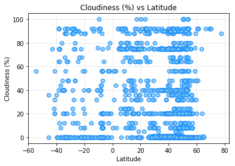

# Analysis

1. Most cities in the world exist between 25 degrees laititude and 60 degrees latitude. 
2. Currently cities between 35 and 45 degrees latitude are receiving the most intense sun.  There is a spike in Max temp at these points. Above and below those lines the temperatures beging to drop withe furthest cities only have a high of 20 degrees.
3. Globally, windspeeds do not get much above 15 mph in most cities.
4. There does not appear to be a strong correlation between cloudiness and latitude.  At each line of latitude the cities are pretty well spreadout from 0 to 100% Cloudiness.


```python
%matplotlib inline
import os
import json
import requests
import numpy as np
import pandas as pd
import matplotlib.pyplot as plt
from citipy import citipy as cp
from config import api_key
from pandas.io.json import json_normalize
import seaborn as sb

base_url='http://api.openweathermap.org/data/2.5/weather?'
params_OWM = {
    'units':'imperial',
    'APPID':api_key
}
```


```python
# Pull world data city list from JSON file on local machine.  JSON file obtained from
# OpenWeatherMap website so that ID could be used get precise response for each city

citypath = os.path.join('city.list.json')
with open(citypath, encoding='utf8') as jsonfile:
    owmJSON = json.load(jsonfile)
cities_df = pd.DataFrame.from_dict(json_normalize(owmJSON), orient='columns')
del cities_df['country']
del cities_df['name']
cities_df.head()
```


<div>
<style scoped>
    .dataframe tbody tr th:only-of-type {
        vertical-align: middle;
    }

    .dataframe tbody tr th {
        vertical-align: top;
    }

    .dataframe thead th {
        text-align: right;
    }
</style>
<table border="1" class="dataframe">
  <thead>
    <tr style="text-align: right;">
      <th></th>
      <th>coord.lat</th>
      <th>coord.lon</th>
      <th>id</th>
    </tr>
  </thead>
  <tbody>
    <tr>
      <th>0</th>
      <td>44.549999</td>
      <td>34.283333</td>
      <td>707860</td>
    </tr>
    <tr>
      <th>1</th>
      <td>55.683334</td>
      <td>37.666668</td>
      <td>519188</td>
    </tr>
    <tr>
      <th>2</th>
      <td>28.000000</td>
      <td>84.633331</td>
      <td>1283378</td>
    </tr>
    <tr>
      <th>3</th>
      <td>29.000000</td>
      <td>76.000000</td>
      <td>1270260</td>
    </tr>
    <tr>
      <th>4</th>
      <td>44.599998</td>
      <td>33.900002</td>
      <td>708546</td>
    </tr>
  </tbody>
</table>
</div>


```python
#Add columns to the dataframe to be populated later.  Rename certain fields from source pull on JSON load
cities_df['City'] = ""
cities_df['Country Code'] = ""
cities_df['Temperature (F)'] = ""
cities_df['Humidity (%)'] = ""
cities_df['Cloudiness (%)'] = ""
cities_df['Wind Speed (mph)'] = ""
cities_df.rename(columns={'coord.lat':'Latitude', 'coord.lon':'Longitude'}, inplace=True)

#Gather sample data for project, reset index
sampleSize = int(input('How large should the sample size be?  (Min. 500): '))

while sampleSize < 500:
        sampleSize = input("Sample size to small.  Please choose a number greater than or equal to 500: ")
        sampleSize = int(sampleSize)
        if sampleSize == 500:
            break
            
cities_sample = cities_df.sample(sampleSize, replace=False)
cities_sample = cities_sample.reset_index(drop=True)
cities_sample.head()
```

    How large should the sample size be?  (Min. 500): 2500
    


<div>
<style scoped>
    .dataframe tbody tr th:only-of-type {
        vertical-align: middle;
    }

    .dataframe tbody tr th {
        vertical-align: top;
    }

    .dataframe thead th {
        text-align: right;
    }
</style>
<table border="1" class="dataframe">
  <thead>
    <tr style="text-align: right;">
      <th></th>
      <th>Latitude</th>
      <th>Longitude</th>
      <th>id</th>
      <th>City</th>
      <th>Country Code</th>
      <th>Temperature (F)</th>
      <th>Humidity (%)</th>
      <th>Cloudiness (%)</th>
      <th>Wind Speed (mph)</th>
    </tr>
  </thead>
  <tbody>
    <tr>
      <th>0</th>
      <td>18.833330</td>
      <td>-98.000000</td>
      <td>3521082</td>
      <td></td>
      <td></td>
      <td></td>
      <td></td>
      <td></td>
      <td></td>
    </tr>
    <tr>
      <th>1</th>
      <td>33.195869</td>
      <td>-117.379478</td>
      <td>5378771</td>
      <td></td>
      <td></td>
      <td></td>
      <td></td>
      <td></td>
      <td></td>
    </tr>
    <tr>
      <th>2</th>
      <td>19.060049</td>
      <td>110.515373</td>
      <td>1802634</td>
      <td></td>
      <td></td>
      <td></td>
      <td></td>
      <td></td>
      <td></td>
    </tr>
    <tr>
      <th>3</th>
      <td>41.099709</td>
      <td>14.220130</td>
      <td>3180601</td>
      <td></td>
      <td></td>
      <td></td>
      <td></td>
      <td></td>
      <td></td>
    </tr>
    <tr>
      <th>4</th>
      <td>45.443581</td>
      <td>-90.298203</td>
      <td>5265566</td>
      <td></td>
      <td></td>
      <td></td>
      <td></td>
      <td></td>
      <td></td>
    </tr>
  </tbody>
</table>
</div>


```python
#Use CitiPy to find City and Country
print('Beginning Data Retrieval')
print('----------------------------')
for index, row in cities_sample.iterrows():
    #get lat and lng
    cpLat = row['Latitude']
    cpLng = row['Longitude']
    city = cp.nearest_city(cpLat,cpLng)
    cpCity = (city.city_name).title()
    cities_sample.loc[index,'City'] = cpCity
    cpCountry = city.country_code.upper()
    cities_sample.loc[index,'Country Code'] = cpCountry
    
    params_OWM['id'] = row['id']
    owmURL = requests.get(base_url, params_OWM)
    owmResponse = owmURL.json()
    #print(json.dumps(owmResponse, indent=4))
    
    try:
        cities_sample.loc[index, 'Temperature (F)'] = owmResponse['main']['temp_max']
        cities_sample.loc[index, 'Humidity (%)'] = owmResponse['main']['humidity']
        cities_sample.loc[index, 'Cloudiness (%)'] = owmResponse['clouds']['all']
        cities_sample.loc[index, 'Wind Speed (mph)'] = owmResponse['wind']['speed']
        print(f'Processing record {int(index)+1} of {cities_sample["City"].count()} | {cpCity}, {cpCountry}')
        print(f'{owmURL.url}')
    except (KeyError, IndexError):
        print(f'Error at {KeyError} for cities_sample["City"]...skipping...')
    print('------------------------------------------------------------------------')
#Remove entries with errors or NaN returned. Not doing so causes issues creating scatter plots.
cities_sample.dropna(inplace=True)
    
```

    Beginning Data Retrieval
    ----------------------------
    Processing record 1 of 2500 | Acuexcomac, MX
    http://api.openweathermap.org/data/2.5/weather?units=imperial&APPID=2178997af721c4698afb0eae9d6f056f&id=3521082
    ------------------------------------------------------------------------
    Processing record 2 of 2500 | Oceanside, US
    http://api.openweathermap.org/data/2.5/weather?units=imperial&APPID=2178997af721c4698afb0eae9d6f056f&id=5378771
    ------------------------------------------------------------------------
    Processing record 3 of 2500 | Wanning, CN
    http://api.openweathermap.org/data/2.5/weather?units=imperial&APPID=2178997af721c4698afb0eae9d6f056f&id=1802634
    ------------------------------------------------------------------------
    Processing record 4 of 2500 | Capua, IT
    http://api.openweathermap.org/data/2.5/weather?units=imperial&APPID=2178997af721c4698afb0eae9d6f056f&id=3180601
    ------------------------------------------------------------------------
    Processing record 5 of 2500 | Merrill, US
    http://api.openweathermap.org/data/2.5/weather?units=imperial&APPID=2178997af721c4698afb0eae9d6f056f&id=5265566
    ------------------------------------------------------------------------
    Processing record 6 of 2500 | Yingzhong, CN
    http://api.openweathermap.org/data/2.5/weather?units=imperial&APPID=2178997af721c4698afb0eae9d6f056f&id=1811828
    ------------------------------------------------------------------------
    Processing record 7 of 2500 | Traian, RO
    http://api.openweathermap.org/data/2.5/weather?units=imperial&APPID=2178997af721c4698afb0eae9d6f056f&id=664677
    ------------------------------------------------------------------------
    Processing record 8 of 2500 | Bad Kreuznach, DE
    http://api.openweathermap.org/data/2.5/weather?units=imperial&APPID=2178997af721c4698afb0eae9d6f056f&id=2937401
    ------------------------------------------------------------------------
    Processing record 9 of 2500 | Bunol, ES
    http://api.openweathermap.org/data/2.5/weather?units=imperial&APPID=2178997af721c4698afb0eae9d6f056f&id=2509951
    ------------------------------------------------------------------------
    Processing record 10 of 2500 | Senftenberg, DE
    http://api.openweathermap.org/data/2.5/weather?units=imperial&APPID=2178997af721c4698afb0eae9d6f056f&id=2803524
    ------------------------------------------------------------------------
    Processing record 11 of 2500 | Pamplona, ES
    http://api.openweathermap.org/data/2.5/weather?units=imperial&APPID=2178997af721c4698afb0eae9d6f056f&id=3114823
    ------------------------------------------------------------------------
    Processing record 12 of 2500 | Cerea, IT
    http://api.openweathermap.org/data/2.5/weather?units=imperial&APPID=2178997af721c4698afb0eae9d6f056f&id=6540973
    ------------------------------------------------------------------------
    Processing record 13 of 2500 | Toledo, ES
    http://api.openweathermap.org/data/2.5/weather?units=imperial&APPID=2178997af721c4698afb0eae9d6f056f&id=6361662
    ------------------------------------------------------------------------
    Processing record 14 of 2500 | Fohnsdorf, AT
    http://api.openweathermap.org/data/2.5/weather?units=imperial&APPID=2178997af721c4698afb0eae9d6f056f&id=2779450
    ------------------------------------------------------------------------
    Processing record 15 of 2500 | Kirchlinteln, DE
    http://api.openweathermap.org/data/2.5/weather?units=imperial&APPID=2178997af721c4698afb0eae9d6f056f&id=2866737
    ------------------------------------------------------------------------
    Processing record 16 of 2500 | Beauchamps, FR
    http://api.openweathermap.org/data/2.5/weather?units=imperial&APPID=2178997af721c4698afb0eae9d6f056f&id=6435453
    ------------------------------------------------------------------------
    Processing record 17 of 2500 | Royan, FR
    http://api.openweathermap.org/data/2.5/weather?units=imperial&APPID=2178997af721c4698afb0eae9d6f056f&id=6432399
    ------------------------------------------------------------------------
    Processing record 18 of 2500 | Floirac, FR
    http://api.openweathermap.org/data/2.5/weather?units=imperial&APPID=2178997af721c4698afb0eae9d6f056f&id=2980024
    ------------------------------------------------------------------------
    Processing record 19 of 2500 | Oceanside, US
    http://api.openweathermap.org/data/2.5/weather?units=imperial&APPID=2178997af721c4698afb0eae9d6f056f&id=5134203
    ------------------------------------------------------------------------
    Processing record 20 of 2500 | Fort Dix, US
    http://api.openweathermap.org/data/2.5/weather?units=imperial&APPID=2178997af721c4698afb0eae9d6f056f&id=5101760
    ------------------------------------------------------------------------
    Processing record 21 of 2500 | Wangdiphodrang, BT
    http://api.openweathermap.org/data/2.5/weather?units=imperial&APPID=2178997af721c4698afb0eae9d6f056f&id=1252495
    ------------------------------------------------------------------------
    Processing record 22 of 2500 | Catanzaro, IT
    http://api.openweathermap.org/data/2.5/weather?units=imperial&APPID=2178997af721c4698afb0eae9d6f056f&id=2524863
    ------------------------------------------------------------------------
    Processing record 23 of 2500 | Tucker, US
    http://api.openweathermap.org/data/2.5/weather?units=imperial&APPID=2178997af721c4698afb0eae9d6f056f&id=4224745
    ------------------------------------------------------------------------
    Processing record 24 of 2500 | Schwechat, AT
    http://api.openweathermap.org/data/2.5/weather?units=imperial&APPID=2178997af721c4698afb0eae9d6f056f&id=7871953
    ------------------------------------------------------------------------
    Processing record 25 of 2500 | Logrono, ES
    http://api.openweathermap.org/data/2.5/weather?units=imperial&APPID=2178997af721c4698afb0eae9d6f056f&id=6359687
    ------------------------------------------------------------------------
    Processing record 26 of 2500 | Terre Haute, US
    http://api.openweathermap.org/data/2.5/weather?units=imperial&APPID=2178997af721c4698afb0eae9d6f056f&id=4243951
    ------------------------------------------------------------------------
    Processing record 27 of 2500 | Kazaki, RU
    http://api.openweathermap.org/data/2.5/weather?units=imperial&APPID=2178997af721c4698afb0eae9d6f056f&id=551535
    ------------------------------------------------------------------------
    Processing record 28 of 2500 | Ulfborg, DK
    http://api.openweathermap.org/data/2.5/weather?units=imperial&APPID=2178997af721c4698afb0eae9d6f056f&id=2623240
    ------------------------------------------------------------------------
    Processing record 29 of 2500 | Sanming, CN
    http://api.openweathermap.org/data/2.5/weather?units=imperial&APPID=2178997af721c4698afb0eae9d6f056f&id=1922346
    ------------------------------------------------------------------------
    Processing record 30 of 2500 | Fort Payne, US
    http://api.openweathermap.org/data/2.5/weather?units=imperial&APPID=2178997af721c4698afb0eae9d6f056f&id=4054555
    ------------------------------------------------------------------------
    Processing record 31 of 2500 | Petelea, RO
    http://api.openweathermap.org/data/2.5/weather?units=imperial&APPID=2178997af721c4698afb0eae9d6f056f&id=671034
    ------------------------------------------------------------------------
    Processing record 32 of 2500 | Vicovu De Jos, RO
    http://api.openweathermap.org/data/2.5/weather?units=imperial&APPID=2178997af721c4698afb0eae9d6f056f&id=662994
    ------------------------------------------------------------------------
    Processing record 33 of 2500 | Malanday, PH
    http://api.openweathermap.org/data/2.5/weather?units=imperial&APPID=2178997af721c4698afb0eae9d6f056f&id=1703116
    ------------------------------------------------------------------------
    Processing record 34 of 2500 | Savona, IT
    http://api.openweathermap.org/data/2.5/weather?units=imperial&APPID=2178997af721c4698afb0eae9d6f056f&id=6534243
    ------------------------------------------------------------------------
    Processing record 35 of 2500 | Parchim, DE
    http://api.openweathermap.org/data/2.5/weather?units=imperial&APPID=2178997af721c4698afb0eae9d6f056f&id=2935047
    ------------------------------------------------------------------------
    Processing record 36 of 2500 | Hihya, EG
    http://api.openweathermap.org/data/2.5/weather?units=imperial&APPID=2178997af721c4698afb0eae9d6f056f&id=360016
    ------------------------------------------------------------------------
    Processing record 37 of 2500 | Sydney, AU
    http://api.openweathermap.org/data/2.5/weather?units=imperial&APPID=2178997af721c4698afb0eae9d6f056f&id=2167391
    ------------------------------------------------------------------------
    Processing record 38 of 2500 | Golden Gate, US
    http://api.openweathermap.org/data/2.5/weather?units=imperial&APPID=2178997af721c4698afb0eae9d6f056f&id=4151550
    ------------------------------------------------------------------------
    Processing record 39 of 2500 | Donauworth, DE
    http://api.openweathermap.org/data/2.5/weather?units=imperial&APPID=2178997af721c4698afb0eae9d6f056f&id=2847079
    ------------------------------------------------------------------------
    Processing record 40 of 2500 | Port Pirie, AU
    http://api.openweathermap.org/data/2.5/weather?units=imperial&APPID=2178997af721c4698afb0eae9d6f056f&id=2060589
    ------------------------------------------------------------------------
    Processing record 41 of 2500 | Nanyang, CN
    http://api.openweathermap.org/data/2.5/weather?units=imperial&APPID=2178997af721c4698afb0eae9d6f056f&id=1793419
    ------------------------------------------------------------------------
    Processing record 42 of 2500 | Ferrol, ES
    http://api.openweathermap.org/data/2.5/weather?units=imperial&APPID=2178997af721c4698afb0eae9d6f056f&id=3232510
    ------------------------------------------------------------------------
    Processing record 43 of 2500 | Florida, UY
    http://api.openweathermap.org/data/2.5/weather?units=imperial&APPID=2178997af721c4698afb0eae9d6f056f&id=3441686
    ------------------------------------------------------------------------
    Processing record 44 of 2500 | Aosta, IT
    http://api.openweathermap.org/data/2.5/weather?units=imperial&APPID=2178997af721c4698afb0eae9d6f056f&id=6535076
    ------------------------------------------------------------------------
    Processing record 45 of 2500 | Bermeo, ES
    http://api.openweathermap.org/data/2.5/weather?units=imperial&APPID=2178997af721c4698afb0eae9d6f056f&id=7910918
    ------------------------------------------------------------------------
    Processing record 46 of 2500 | Simpsonville, US
    http://api.openweathermap.org/data/2.5/weather?units=imperial&APPID=2178997af721c4698afb0eae9d6f056f&id=4578602
    ------------------------------------------------------------------------
    Processing record 47 of 2500 | Kashan, IR
    http://api.openweathermap.org/data/2.5/weather?units=imperial&APPID=2178997af721c4698afb0eae9d6f056f&id=128477
    ------------------------------------------------------------------------
    Processing record 48 of 2500 | Neftegorsk, RU
    http://api.openweathermap.org/data/2.5/weather?units=imperial&APPID=2178997af721c4698afb0eae9d6f056f&id=522945
    ------------------------------------------------------------------------
    Processing record 49 of 2500 | Sao Joaquim De Bicas, BR
    http://api.openweathermap.org/data/2.5/weather?units=imperial&APPID=2178997af721c4698afb0eae9d6f056f&id=3448824
    ------------------------------------------------------------------------
    Processing record 50 of 2500 | Croix, FR
    http://api.openweathermap.org/data/2.5/weather?units=imperial&APPID=2178997af721c4698afb0eae9d6f056f&id=3022376
    ------------------------------------------------------------------------
    Processing record 51 of 2500 | Helmstedt, DE
    http://api.openweathermap.org/data/2.5/weather?units=imperial&APPID=2178997af721c4698afb0eae9d6f056f&id=2824602
    ------------------------------------------------------------------------
    Processing record 52 of 2500 | South Patrick Shores, US
    http://api.openweathermap.org/data/2.5/weather?units=imperial&APPID=2178997af721c4698afb0eae9d6f056f&id=4173528
    ------------------------------------------------------------------------
    Processing record 53 of 2500 | Yorkton, CA
    http://api.openweathermap.org/data/2.5/weather?units=imperial&APPID=2178997af721c4698afb0eae9d6f056f&id=6071764
    ------------------------------------------------------------------------
    Processing record 54 of 2500 | Lemon Tree Passage, AU
    http://api.openweathermap.org/data/2.5/weather?units=imperial&APPID=2178997af721c4698afb0eae9d6f056f&id=2177860
    ------------------------------------------------------------------------
    Processing record 55 of 2500 | Agirish, RU
    http://api.openweathermap.org/data/2.5/weather?units=imperial&APPID=2178997af721c4698afb0eae9d6f056f&id=1503481
    ------------------------------------------------------------------------
    Processing record 56 of 2500 | Southend-On-Sea, GB
    http://api.openweathermap.org/data/2.5/weather?units=imperial&APPID=2178997af721c4698afb0eae9d6f056f&id=2639266
    ------------------------------------------------------------------------
    Processing record 57 of 2500 | Badia Polesine, IT
    http://api.openweathermap.org/data/2.5/weather?units=imperial&APPID=2178997af721c4698afb0eae9d6f056f&id=3179741
    ------------------------------------------------------------------------
    Processing record 58 of 2500 | Graz, AT
    http://api.openweathermap.org/data/2.5/weather?units=imperial&APPID=2178997af721c4698afb0eae9d6f056f&id=7873406
    ------------------------------------------------------------------------
    Processing record 59 of 2500 | Kotelniki, RU
    http://api.openweathermap.org/data/2.5/weather?units=imperial&APPID=2178997af721c4698afb0eae9d6f056f&id=526565
    ------------------------------------------------------------------------
    Processing record 60 of 2500 | Giengen, DE
    http://api.openweathermap.org/data/2.5/weather?units=imperial&APPID=2178997af721c4698afb0eae9d6f056f&id=2858880
    ------------------------------------------------------------------------
    Processing record 61 of 2500 | Tortoman, RO
    http://api.openweathermap.org/data/2.5/weather?units=imperial&APPID=2178997af721c4698afb0eae9d6f056f&id=664708
    ------------------------------------------------------------------------
    Processing record 62 of 2500 | Obzor, BG
    http://api.openweathermap.org/data/2.5/weather?units=imperial&APPID=2178997af721c4698afb0eae9d6f056f&id=728674
    ------------------------------------------------------------------------
    Processing record 63 of 2500 | Newburn, GB
    http://api.openweathermap.org/data/2.5/weather?units=imperial&APPID=2178997af721c4698afb0eae9d6f056f&id=2655369
    ------------------------------------------------------------------------
    Processing record 64 of 2500 | Rudolstadt, DE
    http://api.openweathermap.org/data/2.5/weather?units=imperial&APPID=2178997af721c4698afb0eae9d6f056f&id=2848326
    ------------------------------------------------------------------------
    Processing record 65 of 2500 | Krumbach, DE
    http://api.openweathermap.org/data/2.5/weather?units=imperial&APPID=2178997af721c4698afb0eae9d6f056f&id=2866956
    ------------------------------------------------------------------------
    Processing record 66 of 2500 | Elsmere, US
    http://api.openweathermap.org/data/2.5/weather?units=imperial&APPID=2178997af721c4698afb0eae9d6f056f&id=4142766
    ------------------------------------------------------------------------
    Processing record 67 of 2500 | Nesna, NO
    http://api.openweathermap.org/data/2.5/weather?units=imperial&APPID=2178997af721c4698afb0eae9d6f056f&id=7626395
    ------------------------------------------------------------------------
    Processing record 68 of 2500 | Castelnaudary, FR
    http://api.openweathermap.org/data/2.5/weather?units=imperial&APPID=2178997af721c4698afb0eae9d6f056f&id=3030589
    ------------------------------------------------------------------------
    Processing record 69 of 2500 | Bretigny-Sur-Orge, FR
    http://api.openweathermap.org/data/2.5/weather?units=imperial&APPID=2178997af721c4698afb0eae9d6f056f&id=3007017
    ------------------------------------------------------------------------
    Processing record 70 of 2500 | Xianyang, CN
    http://api.openweathermap.org/data/2.5/weather?units=imperial&APPID=2178997af721c4698afb0eae9d6f056f&id=1803373
    ------------------------------------------------------------------------
    Processing record 71 of 2500 | Quzhou, CN
    http://api.openweathermap.org/data/2.5/weather?units=imperial&APPID=2178997af721c4698afb0eae9d6f056f&id=1817827
    ------------------------------------------------------------------------
    Processing record 72 of 2500 | Homburg, DE
    http://api.openweathermap.org/data/2.5/weather?units=imperial&APPID=2178997af721c4698afb0eae9d6f056f&id=2943488
    ------------------------------------------------------------------------
    Processing record 73 of 2500 | Jaroslaw, PL
    http://api.openweathermap.org/data/2.5/weather?units=imperial&APPID=2178997af721c4698afb0eae9d6f056f&id=755963
    ------------------------------------------------------------------------
    Processing record 74 of 2500 | Bad Kreuznach, DE
    http://api.openweathermap.org/data/2.5/weather?units=imperial&APPID=2178997af721c4698afb0eae9d6f056f&id=2866264
    ------------------------------------------------------------------------
    Processing record 75 of 2500 | Mikhaylovskaya, RU
    http://api.openweathermap.org/data/2.5/weather?units=imperial&APPID=2178997af721c4698afb0eae9d6f056f&id=526814
    ------------------------------------------------------------------------
    Processing record 76 of 2500 | Salzhemmendorf, DE
    http://api.openweathermap.org/data/2.5/weather?units=imperial&APPID=2178997af721c4698afb0eae9d6f056f&id=2877007
    ------------------------------------------------------------------------
    Processing record 77 of 2500 | Houma, CN
    http://api.openweathermap.org/data/2.5/weather?units=imperial&APPID=2178997af721c4698afb0eae9d6f056f&id=1910975
    ------------------------------------------------------------------------
    Processing record 78 of 2500 | Turlock, US
    http://api.openweathermap.org/data/2.5/weather?units=imperial&APPID=2178997af721c4698afb0eae9d6f056f&id=5342586
    ------------------------------------------------------------------------
    Processing record 79 of 2500 | Domalandan, PH
    http://api.openweathermap.org/data/2.5/weather?units=imperial&APPID=2178997af721c4698afb0eae9d6f056f&id=1714482
    ------------------------------------------------------------------------
    Processing record 80 of 2500 | Ridge, US
    http://api.openweathermap.org/data/2.5/weather?units=imperial&APPID=2178997af721c4698afb0eae9d6f056f&id=5107670
    ------------------------------------------------------------------------
    Processing record 81 of 2500 | Arganil, PT
    http://api.openweathermap.org/data/2.5/weather?units=imperial&APPID=2178997af721c4698afb0eae9d6f056f&id=8014072
    ------------------------------------------------------------------------
    Processing record 82 of 2500 | Kety, PL
    http://api.openweathermap.org/data/2.5/weather?units=imperial&APPID=2178997af721c4698afb0eae9d6f056f&id=7533321
    ------------------------------------------------------------------------
    Processing record 83 of 2500 | Patrai, GR
    http://api.openweathermap.org/data/2.5/weather?units=imperial&APPID=2178997af721c4698afb0eae9d6f056f&id=255683
    ------------------------------------------------------------------------
    Processing record 84 of 2500 | Duderstadt, DE
    http://api.openweathermap.org/data/2.5/weather?units=imperial&APPID=2178997af721c4698afb0eae9d6f056f&id=6552340
    ------------------------------------------------------------------------
    Processing record 85 of 2500 | Canberra, AU
    http://api.openweathermap.org/data/2.5/weather?units=imperial&APPID=2178997af721c4698afb0eae9d6f056f&id=2174406
    ------------------------------------------------------------------------
    Processing record 86 of 2500 | Pergine Valsugana, IT
    http://api.openweathermap.org/data/2.5/weather?units=imperial&APPID=2178997af721c4698afb0eae9d6f056f&id=3168632
    ------------------------------------------------------------------------
    Processing record 87 of 2500 | Saalfelden, AT
    http://api.openweathermap.org/data/2.5/weather?units=imperial&APPID=2178997af721c4698afb0eae9d6f056f&id=7873331
    ------------------------------------------------------------------------
    Processing record 88 of 2500 | Berezanka, UA
    http://api.openweathermap.org/data/2.5/weather?units=imperial&APPID=2178997af721c4698afb0eae9d6f056f&id=712387
    ------------------------------------------------------------------------
    Processing record 89 of 2500 | Qabaqcol, AZ
    http://api.openweathermap.org/data/2.5/weather?units=imperial&APPID=2178997af721c4698afb0eae9d6f056f&id=587070
    ------------------------------------------------------------------------
    Processing record 90 of 2500 | Tiganesti, RO
    http://api.openweathermap.org/data/2.5/weather?units=imperial&APPID=2178997af721c4698afb0eae9d6f056f&id=665140
    ------------------------------------------------------------------------
    Processing record 91 of 2500 | El Tigre, VE
    http://api.openweathermap.org/data/2.5/weather?units=imperial&APPID=2178997af721c4698afb0eae9d6f056f&id=3647522
    ------------------------------------------------------------------------
    Processing record 92 of 2500 | Kislyakovskaya, RU
    http://api.openweathermap.org/data/2.5/weather?units=imperial&APPID=2178997af721c4698afb0eae9d6f056f&id=541484
    ------------------------------------------------------------------------
    Processing record 93 of 2500 | Bremervorde, DE
    http://api.openweathermap.org/data/2.5/weather?units=imperial&APPID=2178997af721c4698afb0eae9d6f056f&id=2918065
    ------------------------------------------------------------------------
    Processing record 94 of 2500 | Stare Mesto, CZ
    http://api.openweathermap.org/data/2.5/weather?units=imperial&APPID=2178997af721c4698afb0eae9d6f056f&id=3063321
    ------------------------------------------------------------------------
    Processing record 95 of 2500 | Prachuap Khiri Khan, TH
    http://api.openweathermap.org/data/2.5/weather?units=imperial&APPID=2178997af721c4698afb0eae9d6f056f&id=1151074
    ------------------------------------------------------------------------
    Processing record 96 of 2500 | Randazzo, IT
    http://api.openweathermap.org/data/2.5/weather?units=imperial&APPID=2178997af721c4698afb0eae9d6f056f&id=2523641
    ------------------------------------------------------------------------
    Processing record 97 of 2500 | Nidau, CH
    http://api.openweathermap.org/data/2.5/weather?units=imperial&APPID=2178997af721c4698afb0eae9d6f056f&id=2661017
    ------------------------------------------------------------------------
    Processing record 98 of 2500 | Natalio, PY
    http://api.openweathermap.org/data/2.5/weather?units=imperial&APPID=2178997af721c4698afb0eae9d6f056f&id=3437681
    ------------------------------------------------------------------------
    Processing record 99 of 2500 | Itabira, BR
    http://api.openweathermap.org/data/2.5/weather?units=imperial&APPID=2178997af721c4698afb0eae9d6f056f&id=3463399
    ------------------------------------------------------------------------
    Processing record 100 of 2500 | Guardiagrele, IT
    http://api.openweathermap.org/data/2.5/weather?units=imperial&APPID=2178997af721c4698afb0eae9d6f056f&id=3177202
    ------------------------------------------------------------------------
    Processing record 101 of 2500 | Xianshuigu, CN
    http://api.openweathermap.org/data/2.5/weather?units=imperial&APPID=2178997af721c4698afb0eae9d6f056f&id=1814691
    ------------------------------------------------------------------------
    Processing record 102 of 2500 | Fernandopolis, BR
    http://api.openweathermap.org/data/2.5/weather?units=imperial&APPID=2178997af721c4698afb0eae9d6f056f&id=3463432
    ------------------------------------------------------------------------
    Processing record 103 of 2500 | Rute, ES
    http://api.openweathermap.org/data/2.5/weather?units=imperial&APPID=2178997af721c4698afb0eae9d6f056f&id=2518993
    ------------------------------------------------------------------------
    Processing record 104 of 2500 | Agronom, RU
    http://api.openweathermap.org/data/2.5/weather?units=imperial&APPID=2178997af721c4698afb0eae9d6f056f&id=802498
    ------------------------------------------------------------------------
    Processing record 105 of 2500 | Huai Thalaeng, TH
    http://api.openweathermap.org/data/2.5/weather?units=imperial&APPID=2178997af721c4698afb0eae9d6f056f&id=1603235
    ------------------------------------------------------------------------
    Processing record 106 of 2500 | Ixmiquilpan, MX
    http://api.openweathermap.org/data/2.5/weather?units=imperial&APPID=2178997af721c4698afb0eae9d6f056f&id=3526708
    ------------------------------------------------------------------------
    Processing record 107 of 2500 | Cilegon, ID
    http://api.openweathermap.org/data/2.5/weather?units=imperial&APPID=2178997af721c4698afb0eae9d6f056f&id=7792463
    ------------------------------------------------------------------------
    Processing record 108 of 2500 | Bernay, FR
    http://api.openweathermap.org/data/2.5/weather?units=imperial&APPID=2178997af721c4698afb0eae9d6f056f&id=6439285
    ------------------------------------------------------------------------
    Processing record 109 of 2500 | Ruteng, ID
    http://api.openweathermap.org/data/2.5/weather?units=imperial&APPID=2178997af721c4698afb0eae9d6f056f&id=7414475
    ------------------------------------------------------------------------
    Processing record 110 of 2500 | Neustadt, DE
    http://api.openweathermap.org/data/2.5/weather?units=imperial&APPID=2178997af721c4698afb0eae9d6f056f&id=6559300
    ------------------------------------------------------------------------
    Processing record 111 of 2500 | Ulychne, UA
    http://api.openweathermap.org/data/2.5/weather?units=imperial&APPID=2178997af721c4698afb0eae9d6f056f&id=690745
    ------------------------------------------------------------------------
    Processing record 112 of 2500 | Mondeville, FR
    http://api.openweathermap.org/data/2.5/weather?units=imperial&APPID=2178997af721c4698afb0eae9d6f056f&id=6427517
    ------------------------------------------------------------------------
    Processing record 113 of 2500 | Cabilocaan, PH
    http://api.openweathermap.org/data/2.5/weather?units=imperial&APPID=2178997af721c4698afb0eae9d6f056f&id=1722100
    ------------------------------------------------------------------------
    Processing record 114 of 2500 | Bombay, IN
    http://api.openweathermap.org/data/2.5/weather?units=imperial&APPID=2178997af721c4698afb0eae9d6f056f&id=1275339
    ------------------------------------------------------------------------
    Processing record 115 of 2500 | Fort-De-France, MQ
    http://api.openweathermap.org/data/2.5/weather?units=imperial&APPID=2178997af721c4698afb0eae9d6f056f&id=6690660
    ------------------------------------------------------------------------
    Processing record 116 of 2500 | Bracknell, GB
    http://api.openweathermap.org/data/2.5/weather?units=imperial&APPID=2178997af721c4698afb0eae9d6f056f&id=2656992
    ------------------------------------------------------------------------
    Processing record 117 of 2500 | Ghatampur, IN
    http://api.openweathermap.org/data/2.5/weather?units=imperial&APPID=2178997af721c4698afb0eae9d6f056f&id=1266146
    ------------------------------------------------------------------------
    Processing record 118 of 2500 | Pergine Valsugana, IT
    http://api.openweathermap.org/data/2.5/weather?units=imperial&APPID=2178997af721c4698afb0eae9d6f056f&id=3164467
    ------------------------------------------------------------------------
    Processing record 119 of 2500 | Mukilteo, US
    http://api.openweathermap.org/data/2.5/weather?units=imperial&APPID=2178997af721c4698afb0eae9d6f056f&id=5800475
    ------------------------------------------------------------------------
    Processing record 120 of 2500 | Guangyuan, CN
    http://api.openweathermap.org/data/2.5/weather?units=imperial&APPID=2178997af721c4698afb0eae9d6f056f&id=7372230
    ------------------------------------------------------------------------
    Processing record 121 of 2500 | Elsterwerda, DE
    http://api.openweathermap.org/data/2.5/weather?units=imperial&APPID=2178997af721c4698afb0eae9d6f056f&id=6547582
    ------------------------------------------------------------------------
    Processing record 122 of 2500 | Innsbruck, AT
    http://api.openweathermap.org/data/2.5/weather?units=imperial&APPID=2178997af721c4698afb0eae9d6f056f&id=3181570
    ------------------------------------------------------------------------
    Processing record 123 of 2500 | Sabadell, ES
    http://api.openweathermap.org/data/2.5/weather?units=imperial&APPID=2178997af721c4698afb0eae9d6f056f&id=3109165
    ------------------------------------------------------------------------
    Processing record 124 of 2500 | Qingyuan, CN
    http://api.openweathermap.org/data/2.5/weather?units=imperial&APPID=2178997af721c4698afb0eae9d6f056f&id=1917073
    ------------------------------------------------------------------------
    Processing record 125 of 2500 | Paciran, ID
    http://api.openweathermap.org/data/2.5/weather?units=imperial&APPID=2178997af721c4698afb0eae9d6f056f&id=8140902
    ------------------------------------------------------------------------
    Processing record 126 of 2500 | Porirua, NZ
    http://api.openweathermap.org/data/2.5/weather?units=imperial&APPID=2178997af721c4698afb0eae9d6f056f&id=2184889
    ------------------------------------------------------------------------
    Processing record 127 of 2500 | Gondomar, ES
    http://api.openweathermap.org/data/2.5/weather?units=imperial&APPID=2178997af721c4698afb0eae9d6f056f&id=6360252
    ------------------------------------------------------------------------
    Processing record 128 of 2500 | Langenau, DE
    http://api.openweathermap.org/data/2.5/weather?units=imperial&APPID=2178997af721c4698afb0eae9d6f056f&id=2866487
    ------------------------------------------------------------------------
    Processing record 129 of 2500 | Cervantes, PH
    http://api.openweathermap.org/data/2.5/weather?units=imperial&APPID=2178997af721c4698afb0eae9d6f056f&id=1697549
    ------------------------------------------------------------------------
    Processing record 130 of 2500 | Elektrougli, RU
    http://api.openweathermap.org/data/2.5/weather?units=imperial&APPID=2178997af721c4698afb0eae9d6f056f&id=875319
    ------------------------------------------------------------------------
    Processing record 131 of 2500 | Zhmerynka, UA
    http://api.openweathermap.org/data/2.5/weather?units=imperial&APPID=2178997af721c4698afb0eae9d6f056f&id=711487
    ------------------------------------------------------------------------
    Processing record 132 of 2500 | Epernay, FR
    http://api.openweathermap.org/data/2.5/weather?units=imperial&APPID=2178997af721c4698afb0eae9d6f056f&id=3035594
    ------------------------------------------------------------------------
    Processing record 133 of 2500 | Torres Vedras, PT
    http://api.openweathermap.org/data/2.5/weather?units=imperial&APPID=2178997af721c4698afb0eae9d6f056f&id=2262581
    ------------------------------------------------------------------------
    Processing record 134 of 2500 | Guadalajara, ES
    http://api.openweathermap.org/data/2.5/weather?units=imperial&APPID=2178997af721c4698afb0eae9d6f056f&id=3127267
    ------------------------------------------------------------------------
    Processing record 135 of 2500 | Silopi, TR
    http://api.openweathermap.org/data/2.5/weather?units=imperial&APPID=2178997af721c4698afb0eae9d6f056f&id=392051
    ------------------------------------------------------------------------
    Processing record 136 of 2500 | Dzerzhinsk, BY
    http://api.openweathermap.org/data/2.5/weather?units=imperial&APPID=2178997af721c4698afb0eae9d6f056f&id=620483
    ------------------------------------------------------------------------
    Processing record 137 of 2500 | Coihaique, CL
    http://api.openweathermap.org/data/2.5/weather?units=imperial&APPID=2178997af721c4698afb0eae9d6f056f&id=3950166
    ------------------------------------------------------------------------
    Processing record 138 of 2500 | Villeneuve-Les-Avignon, FR
    http://api.openweathermap.org/data/2.5/weather?units=imperial&APPID=2178997af721c4698afb0eae9d6f056f&id=2975492
    ------------------------------------------------------------------------
    Processing record 139 of 2500 | Bagumbayan, PH
    http://api.openweathermap.org/data/2.5/weather?units=imperial&APPID=2178997af721c4698afb0eae9d6f056f&id=1728894
    ------------------------------------------------------------------------
    Processing record 140 of 2500 | Aracruz, BR
    http://api.openweathermap.org/data/2.5/weather?units=imperial&APPID=2178997af721c4698afb0eae9d6f056f&id=3471848
    ------------------------------------------------------------------------
    Processing record 141 of 2500 | Mutterstadt, DE
    http://api.openweathermap.org/data/2.5/weather?units=imperial&APPID=2178997af721c4698afb0eae9d6f056f&id=2923503
    ------------------------------------------------------------------------
    Processing record 142 of 2500 | Eisenberg, DE
    http://api.openweathermap.org/data/2.5/weather?units=imperial&APPID=2178997af721c4698afb0eae9d6f056f&id=2927916
    ------------------------------------------------------------------------
    Processing record 143 of 2500 | Poitiers, FR
    http://api.openweathermap.org/data/2.5/weather?units=imperial&APPID=2178997af721c4698afb0eae9d6f056f&id=6445389
    ------------------------------------------------------------------------
    Processing record 144 of 2500 | Bury, GB
    http://api.openweathermap.org/data/2.5/weather?units=imperial&APPID=2178997af721c4698afb0eae9d6f056f&id=2635604
    ------------------------------------------------------------------------
    Processing record 145 of 2500 | Murwillumbah, AU
    http://api.openweathermap.org/data/2.5/weather?units=imperial&APPID=2178997af721c4698afb0eae9d6f056f&id=2156049
    ------------------------------------------------------------------------
    Processing record 146 of 2500 | Tomino, ES
    http://api.openweathermap.org/data/2.5/weather?units=imperial&APPID=2178997af721c4698afb0eae9d6f056f&id=3129697
    ------------------------------------------------------------------------
    Processing record 147 of 2500 | Arrigorriaga, ES
    http://api.openweathermap.org/data/2.5/weather?units=imperial&APPID=2178997af721c4698afb0eae9d6f056f&id=6362361
    ------------------------------------------------------------------------
    Processing record 148 of 2500 | Kaiserslautern, DE
    http://api.openweathermap.org/data/2.5/weather?units=imperial&APPID=2178997af721c4698afb0eae9d6f056f&id=2837512
    ------------------------------------------------------------------------
    Processing record 149 of 2500 | Bansi, IN
    http://api.openweathermap.org/data/2.5/weather?units=imperial&APPID=2178997af721c4698afb0eae9d6f056f&id=1275522
    ------------------------------------------------------------------------
    Processing record 150 of 2500 | Zogno, IT
    http://api.openweathermap.org/data/2.5/weather?units=imperial&APPID=2178997af721c4698afb0eae9d6f056f&id=6535180
    ------------------------------------------------------------------------
    Processing record 151 of 2500 | Alor Setar, MY
    http://api.openweathermap.org/data/2.5/weather?units=imperial&APPID=2178997af721c4698afb0eae9d6f056f&id=1736309
    ------------------------------------------------------------------------
    Processing record 152 of 2500 | Mykolayivka, UA
    http://api.openweathermap.org/data/2.5/weather?units=imperial&APPID=2178997af721c4698afb0eae9d6f056f&id=700159
    ------------------------------------------------------------------------
    Processing record 153 of 2500 | Freital, DE
    http://api.openweathermap.org/data/2.5/weather?units=imperial&APPID=2178997af721c4698afb0eae9d6f056f&id=2910141
    ------------------------------------------------------------------------
    Processing record 154 of 2500 | Airai, PW
    http://api.openweathermap.org/data/2.5/weather?units=imperial&APPID=2178997af721c4698afb0eae9d6f056f&id=4041468
    ------------------------------------------------------------------------
    Processing record 155 of 2500 | Cerro Maggiore, IT
    http://api.openweathermap.org/data/2.5/weather?units=imperial&APPID=2178997af721c4698afb0eae9d6f056f&id=3179027
    ------------------------------------------------------------------------
    Processing record 156 of 2500 | Novobelokatay, RU
    http://api.openweathermap.org/data/2.5/weather?units=imperial&APPID=2178997af721c4698afb0eae9d6f056f&id=519027
    ------------------------------------------------------------------------
    Processing record 157 of 2500 | Durban, ZA
    http://api.openweathermap.org/data/2.5/weather?units=imperial&APPID=2178997af721c4698afb0eae9d6f056f&id=1000065
    ------------------------------------------------------------------------
    Processing record 158 of 2500 | Bagakay, PH
    http://api.openweathermap.org/data/2.5/weather?units=imperial&APPID=2178997af721c4698afb0eae9d6f056f&id=1729223
    ------------------------------------------------------------------------
    Processing record 159 of 2500 | Giddarbaha, IN
    http://api.openweathermap.org/data/2.5/weather?units=imperial&APPID=2178997af721c4698afb0eae9d6f056f&id=1276070
    ------------------------------------------------------------------------
    Processing record 160 of 2500 | Safranbolu, TR
    http://api.openweathermap.org/data/2.5/weather?units=imperial&APPID=2178997af721c4698afb0eae9d6f056f&id=740581
    ------------------------------------------------------------------------
    Processing record 161 of 2500 | Le Passage, FR
    http://api.openweathermap.org/data/2.5/weather?units=imperial&APPID=2178997af721c4698afb0eae9d6f056f&id=6433346
    ------------------------------------------------------------------------
    Processing record 162 of 2500 | Rizal, PH
    http://api.openweathermap.org/data/2.5/weather?units=imperial&APPID=2178997af721c4698afb0eae9d6f056f&id=1691654
    ------------------------------------------------------------------------
    Processing record 163 of 2500 | Sebeta, ET
    http://api.openweathermap.org/data/2.5/weather?units=imperial&APPID=2178997af721c4698afb0eae9d6f056f&id=336931
    ------------------------------------------------------------------------
    Processing record 164 of 2500 | San Bernardo, CL
    http://api.openweathermap.org/data/2.5/weather?units=imperial&APPID=2178997af721c4698afb0eae9d6f056f&id=3890485
    ------------------------------------------------------------------------
    Processing record 165 of 2500 | Marcon, IT
    http://api.openweathermap.org/data/2.5/weather?units=imperial&APPID=2178997af721c4698afb0eae9d6f056f&id=3173985
    ------------------------------------------------------------------------
    Processing record 166 of 2500 | Trojan, BG
    http://api.openweathermap.org/data/2.5/weather?units=imperial&APPID=2178997af721c4698afb0eae9d6f056f&id=6459402
    ------------------------------------------------------------------------
    Processing record 167 of 2500 | Novoaltaysk, RU
    http://api.openweathermap.org/data/2.5/weather?units=imperial&APPID=2178997af721c4698afb0eae9d6f056f&id=1493083
    ------------------------------------------------------------------------
    Processing record 168 of 2500 | Valea Crisului, RO
    http://api.openweathermap.org/data/2.5/weather?units=imperial&APPID=2178997af721c4698afb0eae9d6f056f&id=667303
    ------------------------------------------------------------------------
    Processing record 169 of 2500 | Weinan, CN
    http://api.openweathermap.org/data/2.5/weather?units=imperial&APPID=2178997af721c4698afb0eae9d6f056f&id=1803499
    ------------------------------------------------------------------------
    Processing record 170 of 2500 | Vierzon, FR
    http://api.openweathermap.org/data/2.5/weather?units=imperial&APPID=2178997af721c4698afb0eae9d6f056f&id=2968765
    ------------------------------------------------------------------------
    Processing record 171 of 2500 | Boppard, DE
    http://api.openweathermap.org/data/2.5/weather?units=imperial&APPID=2178997af721c4698afb0eae9d6f056f&id=2860597
    ------------------------------------------------------------------------
    Processing record 172 of 2500 | Virbhadra, IN
    http://api.openweathermap.org/data/2.5/weather?units=imperial&APPID=2178997af721c4698afb0eae9d6f056f&id=1275526
    ------------------------------------------------------------------------
    Processing record 173 of 2500 | Segovia, ES
    http://api.openweathermap.org/data/2.5/weather?units=imperial&APPID=2178997af721c4698afb0eae9d6f056f&id=6360860
    ------------------------------------------------------------------------
    Processing record 174 of 2500 | Coatesville, US
    http://api.openweathermap.org/data/2.5/weather?units=imperial&APPID=2178997af721c4698afb0eae9d6f056f&id=4561484
    ------------------------------------------------------------------------
    Processing record 175 of 2500 | Zrenjanin, RS
    http://api.openweathermap.org/data/2.5/weather?units=imperial&APPID=2178997af721c4698afb0eae9d6f056f&id=793112
    ------------------------------------------------------------------------
    Processing record 176 of 2500 | Feldbach, AT
    http://api.openweathermap.org/data/2.5/weather?units=imperial&APPID=2178997af721c4698afb0eae9d6f056f&id=2767977
    ------------------------------------------------------------------------
    Processing record 177 of 2500 | Monzon, ES
    http://api.openweathermap.org/data/2.5/weather?units=imperial&APPID=2178997af721c4698afb0eae9d6f056f&id=3130699
    ------------------------------------------------------------------------
    Processing record 178 of 2500 | Glen Cove, US
    http://api.openweathermap.org/data/2.5/weather?units=imperial&APPID=2178997af721c4698afb0eae9d6f056f&id=5137484
    ------------------------------------------------------------------------
    Processing record 179 of 2500 | Cramlington, GB
    http://api.openweathermap.org/data/2.5/weather?units=imperial&APPID=2178997af721c4698afb0eae9d6f056f&id=2652095
    ------------------------------------------------------------------------
    Processing record 180 of 2500 | Taitung, TW
    http://api.openweathermap.org/data/2.5/weather?units=imperial&APPID=2178997af721c4698afb0eae9d6f056f&id=1672222
    ------------------------------------------------------------------------
    Processing record 181 of 2500 | Mitry-Mory, FR
    http://api.openweathermap.org/data/2.5/weather?units=imperial&APPID=2178997af721c4698afb0eae9d6f056f&id=2991362
    ------------------------------------------------------------------------
    Processing record 182 of 2500 | Mount Vernon, US
    http://api.openweathermap.org/data/2.5/weather?units=imperial&APPID=2178997af721c4698afb0eae9d6f056f&id=4250895
    ------------------------------------------------------------------------
    Processing record 183 of 2500 | Oxnard, US
    http://api.openweathermap.org/data/2.5/weather?units=imperial&APPID=2178997af721c4698afb0eae9d6f056f&id=5405878
    ------------------------------------------------------------------------
    Processing record 184 of 2500 | Merville, FR
    http://api.openweathermap.org/data/2.5/weather?units=imperial&APPID=2178997af721c4698afb0eae9d6f056f&id=6438381
    ------------------------------------------------------------------------
    Processing record 185 of 2500 | Kostrzyn, PL
    http://api.openweathermap.org/data/2.5/weather?units=imperial&APPID=2178997af721c4698afb0eae9d6f056f&id=3085520
    ------------------------------------------------------------------------
    Processing record 186 of 2500 | Volary, CZ
    http://api.openweathermap.org/data/2.5/weather?units=imperial&APPID=2178997af721c4698afb0eae9d6f056f&id=2847258
    ------------------------------------------------------------------------
    Processing record 187 of 2500 | Orthez, FR
    http://api.openweathermap.org/data/2.5/weather?units=imperial&APPID=2178997af721c4698afb0eae9d6f056f&id=6454511
    ------------------------------------------------------------------------
    Processing record 188 of 2500 | Morbach, DE
    http://api.openweathermap.org/data/2.5/weather?units=imperial&APPID=2178997af721c4698afb0eae9d6f056f&id=2950314
    ------------------------------------------------------------------------
    Processing record 189 of 2500 | Hildburghausen, DE
    http://api.openweathermap.org/data/2.5/weather?units=imperial&APPID=2178997af721c4698afb0eae9d6f056f&id=2953532
    ------------------------------------------------------------------------
    Processing record 190 of 2500 | Bad Salzungen, DE
    http://api.openweathermap.org/data/2.5/weather?units=imperial&APPID=2178997af721c4698afb0eae9d6f056f&id=2938075
    ------------------------------------------------------------------------
    Processing record 191 of 2500 | Piltene, LV
    http://api.openweathermap.org/data/2.5/weather?units=imperial&APPID=2178997af721c4698afb0eae9d6f056f&id=461534
    ------------------------------------------------------------------------
    Processing record 192 of 2500 | Smolensk, RU
    http://api.openweathermap.org/data/2.5/weather?units=imperial&APPID=2178997af721c4698afb0eae9d6f056f&id=494157
    ------------------------------------------------------------------------
    Processing record 193 of 2500 | Podolinec, SK
    http://api.openweathermap.org/data/2.5/weather?units=imperial&APPID=2178997af721c4698afb0eae9d6f056f&id=763992
    ------------------------------------------------------------------------
    Processing record 194 of 2500 | Bad Essen, DE
    http://api.openweathermap.org/data/2.5/weather?units=imperial&APPID=2178997af721c4698afb0eae9d6f056f&id=2953464
    ------------------------------------------------------------------------
    Processing record 195 of 2500 | Brodek U Prerova, CZ
    http://api.openweathermap.org/data/2.5/weather?units=imperial&APPID=2178997af721c4698afb0eae9d6f056f&id=3073389
    ------------------------------------------------------------------------
    Processing record 196 of 2500 | Husum, DE
    http://api.openweathermap.org/data/2.5/weather?units=imperial&APPID=2178997af721c4698afb0eae9d6f056f&id=2935373
    ------------------------------------------------------------------------
    Processing record 197 of 2500 | Sawtell, AU
    http://api.openweathermap.org/data/2.5/weather?units=imperial&APPID=2178997af721c4698afb0eae9d6f056f&id=2155946
    ------------------------------------------------------------------------
    Processing record 198 of 2500 | Ganzhou, CN
    http://api.openweathermap.org/data/2.5/weather?units=imperial&APPID=2178997af721c4698afb0eae9d6f056f&id=1801240
    ------------------------------------------------------------------------
    Processing record 199 of 2500 | Pultusk, PL
    http://api.openweathermap.org/data/2.5/weather?units=imperial&APPID=2178997af721c4698afb0eae9d6f056f&id=771168
    ------------------------------------------------------------------------
    Processing record 200 of 2500 | Melbourne, AU
    http://api.openweathermap.org/data/2.5/weather?units=imperial&APPID=2178997af721c4698afb0eae9d6f056f&id=2151718
    ------------------------------------------------------------------------
    Processing record 201 of 2500 | Itzehoe, DE
    http://api.openweathermap.org/data/2.5/weather?units=imperial&APPID=2178997af721c4698afb0eae9d6f056f&id=6552167
    ------------------------------------------------------------------------
    Processing record 202 of 2500 | Panzhihua, CN
    http://api.openweathermap.org/data/2.5/weather?units=imperial&APPID=2178997af721c4698afb0eae9d6f056f&id=1786382
    ------------------------------------------------------------------------
    Processing record 203 of 2500 | Mayaposi, PH
    http://api.openweathermap.org/data/2.5/weather?units=imperial&APPID=2178997af721c4698afb0eae9d6f056f&id=1700056
    ------------------------------------------------------------------------
    Processing record 204 of 2500 | Senftenberg, DE
    http://api.openweathermap.org/data/2.5/weather?units=imperial&APPID=2178997af721c4698afb0eae9d6f056f&id=2848013
    ------------------------------------------------------------------------
    Processing record 205 of 2500 | Las Cruces, US
    http://api.openweathermap.org/data/2.5/weather?units=imperial&APPID=2178997af721c4698afb0eae9d6f056f&id=5475352
    ------------------------------------------------------------------------
    Processing record 206 of 2500 | Luneburg, DE
    http://api.openweathermap.org/data/2.5/weather?units=imperial&APPID=2178997af721c4698afb0eae9d6f056f&id=2952458
    ------------------------------------------------------------------------
    Processing record 207 of 2500 | Varia, GR
    http://api.openweathermap.org/data/2.5/weather?units=imperial&APPID=2178997af721c4698afb0eae9d6f056f&id=254955
    ------------------------------------------------------------------------
    Processing record 208 of 2500 | Rembang, ID
    http://api.openweathermap.org/data/2.5/weather?units=imperial&APPID=2178997af721c4698afb0eae9d6f056f&id=8060710
    ------------------------------------------------------------------------
    Processing record 209 of 2500 | Desna, CZ
    http://api.openweathermap.org/data/2.5/weather?units=imperial&APPID=2178997af721c4698afb0eae9d6f056f&id=3064358
    ------------------------------------------------------------------------
    Processing record 210 of 2500 | Plougastel-Daoulas, FR
    http://api.openweathermap.org/data/2.5/weather?units=imperial&APPID=2178997af721c4698afb0eae9d6f056f&id=2997897
    ------------------------------------------------------------------------
    Processing record 211 of 2500 | Vancouver, CA
    http://api.openweathermap.org/data/2.5/weather?units=imperial&APPID=2178997af721c4698afb0eae9d6f056f&id=6054578
    ------------------------------------------------------------------------
    Processing record 212 of 2500 | Maria La Baja, CO
    http://api.openweathermap.org/data/2.5/weather?units=imperial&APPID=2178997af721c4698afb0eae9d6f056f&id=3675287
    ------------------------------------------------------------------------
    Processing record 213 of 2500 | Nova Gradiska, HR
    http://api.openweathermap.org/data/2.5/weather?units=imperial&APPID=2178997af721c4698afb0eae9d6f056f&id=3190835
    ------------------------------------------------------------------------
    Processing record 214 of 2500 | Cheremkhovo, RU
    http://api.openweathermap.org/data/2.5/weather?units=imperial&APPID=2178997af721c4698afb0eae9d6f056f&id=2050863
    ------------------------------------------------------------------------
    Processing record 215 of 2500 | Lingao, CN
    http://api.openweathermap.org/data/2.5/weather?units=imperial&APPID=2178997af721c4698afb0eae9d6f056f&id=1817543
    ------------------------------------------------------------------------
    Processing record 216 of 2500 | Moca, US
    http://api.openweathermap.org/data/2.5/weather?units=imperial&APPID=2178997af721c4698afb0eae9d6f056f&id=4566270
    ------------------------------------------------------------------------
    Processing record 217 of 2500 | Garwolin, PL
    http://api.openweathermap.org/data/2.5/weather?units=imperial&APPID=2178997af721c4698afb0eae9d6f056f&id=7532094
    ------------------------------------------------------------------------
    Processing record 218 of 2500 | Huntington, US
    http://api.openweathermap.org/data/2.5/weather?units=imperial&APPID=2178997af721c4698afb0eae9d6f056f&id=4291960
    ------------------------------------------------------------------------
    Processing record 219 of 2500 | Les Clayes-Sous-Bois, FR
    http://api.openweathermap.org/data/2.5/weather?units=imperial&APPID=2178997af721c4698afb0eae9d6f056f&id=6444100
    ------------------------------------------------------------------------
    Processing record 220 of 2500 | Yarmouth, CA
    http://api.openweathermap.org/data/2.5/weather?units=imperial&APPID=2178997af721c4698afb0eae9d6f056f&id=6139605
    ------------------------------------------------------------------------
    Processing record 221 of 2500 | Digras, IN
    http://api.openweathermap.org/data/2.5/weather?units=imperial&APPID=2178997af721c4698afb0eae9d6f056f&id=1273440
    ------------------------------------------------------------------------
    Processing record 222 of 2500 | Gurabo, US
    http://api.openweathermap.org/data/2.5/weather?units=imperial&APPID=2178997af721c4698afb0eae9d6f056f&id=4563382
    ------------------------------------------------------------------------
    Processing record 223 of 2500 | Bergen, DE
    http://api.openweathermap.org/data/2.5/weather?units=imperial&APPID=2178997af721c4698afb0eae9d6f056f&id=2876215
    ------------------------------------------------------------------------
    Processing record 224 of 2500 | Great Bend, US
    http://api.openweathermap.org/data/2.5/weather?units=imperial&APPID=2178997af721c4698afb0eae9d6f056f&id=4273134
    ------------------------------------------------------------------------
    Processing record 225 of 2500 | Carlton, GB
    http://api.openweathermap.org/data/2.5/weather?units=imperial&APPID=2178997af721c4698afb0eae9d6f056f&id=2654209
    ------------------------------------------------------------------------
    Processing record 226 of 2500 | Babat, ID
    http://api.openweathermap.org/data/2.5/weather?units=imperial&APPID=2178997af721c4698afb0eae9d6f056f&id=8080538
    ------------------------------------------------------------------------
    Processing record 227 of 2500 | Zhoucheng, CN
    http://api.openweathermap.org/data/2.5/weather?units=imperial&APPID=2178997af721c4698afb0eae9d6f056f&id=6824328
    ------------------------------------------------------------------------
    Processing record 228 of 2500 | Chenove, FR
    http://api.openweathermap.org/data/2.5/weather?units=imperial&APPID=2178997af721c4698afb0eae9d6f056f&id=3025496
    ------------------------------------------------------------------------
    Processing record 229 of 2500 | Torbay, CA
    http://api.openweathermap.org/data/2.5/weather?units=imperial&APPID=2178997af721c4698afb0eae9d6f056f&id=5956016
    ------------------------------------------------------------------------
    Processing record 230 of 2500 | Araguaina, BR
    http://api.openweathermap.org/data/2.5/weather?units=imperial&APPID=2178997af721c4698afb0eae9d6f056f&id=3407357
    ------------------------------------------------------------------------
    Processing record 231 of 2500 | Salamanca, ES
    http://api.openweathermap.org/data/2.5/weather?units=imperial&APPID=2178997af721c4698afb0eae9d6f056f&id=3119705
    ------------------------------------------------------------------------
    Processing record 232 of 2500 | Aveiras De Cima, PT
    http://api.openweathermap.org/data/2.5/weather?units=imperial&APPID=2178997af721c4698afb0eae9d6f056f&id=2262029
    ------------------------------------------------------------------------
    Processing record 233 of 2500 | Bhavani, IN
    http://api.openweathermap.org/data/2.5/weather?units=imperial&APPID=2178997af721c4698afb0eae9d6f056f&id=1278622
    ------------------------------------------------------------------------
    Processing record 234 of 2500 | Tandur, IN
    http://api.openweathermap.org/data/2.5/weather?units=imperial&APPID=2178997af721c4698afb0eae9d6f056f&id=1255004
    ------------------------------------------------------------------------
    Processing record 235 of 2500 | Le Havre, FR
    http://api.openweathermap.org/data/2.5/weather?units=imperial&APPID=2178997af721c4698afb0eae9d6f056f&id=6427563
    ------------------------------------------------------------------------
    Processing record 236 of 2500 | Kleck, BY
    http://api.openweathermap.org/data/2.5/weather?units=imperial&APPID=2178997af721c4698afb0eae9d6f056f&id=621266
    ------------------------------------------------------------------------
    Processing record 237 of 2500 | Ostercappeln, DE
    http://api.openweathermap.org/data/2.5/weather?units=imperial&APPID=2178997af721c4698afb0eae9d6f056f&id=2856629
    ------------------------------------------------------------------------
    Processing record 238 of 2500 | Beloeil, CA
    http://api.openweathermap.org/data/2.5/weather?units=imperial&APPID=2178997af721c4698afb0eae9d6f056f&id=6137540
    ------------------------------------------------------------------------
    Processing record 239 of 2500 | Campo Do Brito, BR
    http://api.openweathermap.org/data/2.5/weather?units=imperial&APPID=2178997af721c4698afb0eae9d6f056f&id=3467780
    ------------------------------------------------------------------------
    Processing record 240 of 2500 | Suffolk, US
    http://api.openweathermap.org/data/2.5/weather?units=imperial&APPID=2178997af721c4698afb0eae9d6f056f&id=4452256
    ------------------------------------------------------------------------
    Processing record 241 of 2500 | Montlucon, FR
    http://api.openweathermap.org/data/2.5/weather?units=imperial&APPID=2178997af721c4698afb0eae9d6f056f&id=3017214
    ------------------------------------------------------------------------
    Processing record 242 of 2500 | Jeronimo Monteiro, BR
    http://api.openweathermap.org/data/2.5/weather?units=imperial&APPID=2178997af721c4698afb0eae9d6f056f&id=3459909
    ------------------------------------------------------------------------
    Processing record 243 of 2500 | Clonmel, IE
    http://api.openweathermap.org/data/2.5/weather?units=imperial&APPID=2178997af721c4698afb0eae9d6f056f&id=2964675
    ------------------------------------------------------------------------
    Processing record 244 of 2500 | Teror, ES
    http://api.openweathermap.org/data/2.5/weather?units=imperial&APPID=2178997af721c4698afb0eae9d6f056f&id=2521521
    ------------------------------------------------------------------------
    Processing record 245 of 2500 | Uhlirske Janovice, CZ
    http://api.openweathermap.org/data/2.5/weather?units=imperial&APPID=2178997af721c4698afb0eae9d6f056f&id=3063727
    ------------------------------------------------------------------------
    Processing record 246 of 2500 | Grunstadt, DE
    http://api.openweathermap.org/data/2.5/weather?units=imperial&APPID=2178997af721c4698afb0eae9d6f056f&id=2909969
    ------------------------------------------------------------------------
    Processing record 247 of 2500 | Hangu, CN
    http://api.openweathermap.org/data/2.5/weather?units=imperial&APPID=2178997af721c4698afb0eae9d6f056f&id=1799895
    ------------------------------------------------------------------------
    Processing record 248 of 2500 | Fohnsdorf, AT
    http://api.openweathermap.org/data/2.5/weather?units=imperial&APPID=2178997af721c4698afb0eae9d6f056f&id=7872378
    ------------------------------------------------------------------------
    Processing record 249 of 2500 | Eitorf, DE
    http://api.openweathermap.org/data/2.5/weather?units=imperial&APPID=2178997af721c4698afb0eae9d6f056f&id=2854626
    ------------------------------------------------------------------------
    Processing record 250 of 2500 | Sankt Margrethen, CH
    http://api.openweathermap.org/data/2.5/weather?units=imperial&APPID=2178997af721c4698afb0eae9d6f056f&id=2658816
    ------------------------------------------------------------------------
    Processing record 251 of 2500 | Nimes, FR
    http://api.openweathermap.org/data/2.5/weather?units=imperial&APPID=2178997af721c4698afb0eae9d6f056f&id=2985778
    ------------------------------------------------------------------------
    Processing record 252 of 2500 | Wismar, DE
    http://api.openweathermap.org/data/2.5/weather?units=imperial&APPID=2178997af721c4698afb0eae9d6f056f&id=2817620
    ------------------------------------------------------------------------
    Processing record 253 of 2500 | Lotoshino, RU
    http://api.openweathermap.org/data/2.5/weather?units=imperial&APPID=2178997af721c4698afb0eae9d6f056f&id=857301
    ------------------------------------------------------------------------
    Processing record 254 of 2500 | Gawler, AU
    http://api.openweathermap.org/data/2.5/weather?units=imperial&APPID=2178997af721c4698afb0eae9d6f056f&id=2070698
    ------------------------------------------------------------------------
    Processing record 255 of 2500 | Elmshorn, DE
    http://api.openweathermap.org/data/2.5/weather?units=imperial&APPID=2178997af721c4698afb0eae9d6f056f&id=6551695
    ------------------------------------------------------------------------
    Processing record 256 of 2500 | Grajewo, PL
    http://api.openweathermap.org/data/2.5/weather?units=imperial&APPID=2178997af721c4698afb0eae9d6f056f&id=757386
    ------------------------------------------------------------------------
    Processing record 257 of 2500 | Overtown, GB
    http://api.openweathermap.org/data/2.5/weather?units=imperial&APPID=2178997af721c4698afb0eae9d6f056f&id=2640762
    ------------------------------------------------------------------------
    Processing record 258 of 2500 | Tripoli, LY
    http://api.openweathermap.org/data/2.5/weather?units=imperial&APPID=2178997af721c4698afb0eae9d6f056f&id=2218587
    ------------------------------------------------------------------------
    Processing record 259 of 2500 | Maturin, VE
    http://api.openweathermap.org/data/2.5/weather?units=imperial&APPID=2178997af721c4698afb0eae9d6f056f&id=3649333
    ------------------------------------------------------------------------
    Processing record 260 of 2500 | Bad Segeberg, DE
    http://api.openweathermap.org/data/2.5/weather?units=imperial&APPID=2178997af721c4698afb0eae9d6f056f&id=6552110
    ------------------------------------------------------------------------
    Processing record 261 of 2500 | Dayong, CN
    http://api.openweathermap.org/data/2.5/weather?units=imperial&APPID=2178997af721c4698afb0eae9d6f056f&id=1804500
    ------------------------------------------------------------------------
    Processing record 262 of 2500 | Waverly, US
    http://api.openweathermap.org/data/2.5/weather?units=imperial&APPID=2178997af721c4698afb0eae9d6f056f&id=4879018
    ------------------------------------------------------------------------
    Processing record 263 of 2500 | Ganzhou, CN
    http://api.openweathermap.org/data/2.5/weather?units=imperial&APPID=2178997af721c4698afb0eae9d6f056f&id=7466661
    ------------------------------------------------------------------------
    Processing record 264 of 2500 | Frankfurt, DE
    http://api.openweathermap.org/data/2.5/weather?units=imperial&APPID=2178997af721c4698afb0eae9d6f056f&id=2936417
    ------------------------------------------------------------------------
    Processing record 265 of 2500 | Poughkeepsie, US
    http://api.openweathermap.org/data/2.5/weather?units=imperial&APPID=2178997af721c4698afb0eae9d6f056f&id=5120741
    ------------------------------------------------------------------------
    Processing record 266 of 2500 | Argentan, FR
    http://api.openweathermap.org/data/2.5/weather?units=imperial&APPID=2178997af721c4698afb0eae9d6f056f&id=2973411
    ------------------------------------------------------------------------
    Processing record 267 of 2500 | Vercelli, IT
    http://api.openweathermap.org/data/2.5/weather?units=imperial&APPID=2178997af721c4698afb0eae9d6f056f&id=3182924
    ------------------------------------------------------------------------
    Processing record 268 of 2500 | Anthisnes, BE
    http://api.openweathermap.org/data/2.5/weather?units=imperial&APPID=2178997af721c4698afb0eae9d6f056f&id=2803148
    ------------------------------------------------------------------------
    Processing record 269 of 2500 | Ocotepec, MX
    http://api.openweathermap.org/data/2.5/weather?units=imperial&APPID=2178997af721c4698afb0eae9d6f056f&id=3527573
    ------------------------------------------------------------------------
    Processing record 270 of 2500 | Boyolangu, ID
    http://api.openweathermap.org/data/2.5/weather?units=imperial&APPID=2178997af721c4698afb0eae9d6f056f&id=1632568
    ------------------------------------------------------------------------
    Processing record 271 of 2500 | Sant Just Desvern, ES
    http://api.openweathermap.org/data/2.5/weather?units=imperial&APPID=2178997af721c4698afb0eae9d6f056f&id=3122826
    ------------------------------------------------------------------------
    Processing record 272 of 2500 | Cessnock, AU
    http://api.openweathermap.org/data/2.5/weather?units=imperial&APPID=2178997af721c4698afb0eae9d6f056f&id=2158576
    ------------------------------------------------------------------------
    Processing record 273 of 2500 | Hillerod, DK
    http://api.openweathermap.org/data/2.5/weather?units=imperial&APPID=2178997af721c4698afb0eae9d6f056f&id=2620321
    ------------------------------------------------------------------------
    Processing record 274 of 2500 | Samokov, BG
    http://api.openweathermap.org/data/2.5/weather?units=imperial&APPID=2178997af721c4698afb0eae9d6f056f&id=732088
    ------------------------------------------------------------------------
    Processing record 275 of 2500 | Gulbene, LV
    http://api.openweathermap.org/data/2.5/weather?units=imperial&APPID=2178997af721c4698afb0eae9d6f056f&id=459668
    ------------------------------------------------------------------------
    Processing record 276 of 2500 | Spreitenbach, CH
    http://api.openweathermap.org/data/2.5/weather?units=imperial&APPID=2178997af721c4698afb0eae9d6f056f&id=6291642
    ------------------------------------------------------------------------
    Processing record 277 of 2500 | Fatsa, TR
    http://api.openweathermap.org/data/2.5/weather?units=imperial&APPID=2178997af721c4698afb0eae9d6f056f&id=747155
    ------------------------------------------------------------------------
    Processing record 278 of 2500 | Villers-Le-Bouillet, BE
    http://api.openweathermap.org/data/2.5/weather?units=imperial&APPID=2178997af721c4698afb0eae9d6f056f&id=2784640
    ------------------------------------------------------------------------
    Processing record 279 of 2500 | Warrnambool, AU
    http://api.openweathermap.org/data/2.5/weather?units=imperial&APPID=2178997af721c4698afb0eae9d6f056f&id=2147070
    ------------------------------------------------------------------------
    Processing record 280 of 2500 | Dusti, TJ
    http://api.openweathermap.org/data/2.5/weather?units=imperial&APPID=2178997af721c4698afb0eae9d6f056f&id=1129648
    ------------------------------------------------------------------------
    Processing record 281 of 2500 | Foix, FR
    http://api.openweathermap.org/data/2.5/weather?units=imperial&APPID=2178997af721c4698afb0eae9d6f056f&id=3016687
    ------------------------------------------------------------------------
    Processing record 282 of 2500 | Sydney, AU
    http://api.openweathermap.org/data/2.5/weather?units=imperial&APPID=2178997af721c4698afb0eae9d6f056f&id=2207841
    ------------------------------------------------------------------------
    Processing record 283 of 2500 | Monopoli, IT
    http://api.openweathermap.org/data/2.5/weather?units=imperial&APPID=2178997af721c4698afb0eae9d6f056f&id=3173131
    ------------------------------------------------------------------------
    Processing record 284 of 2500 | Bulach, CH
    http://api.openweathermap.org/data/2.5/weather?units=imperial&APPID=2178997af721c4698afb0eae9d6f056f&id=7286171
    ------------------------------------------------------------------------
    Processing record 285 of 2500 | Chukhloma, RU
    http://api.openweathermap.org/data/2.5/weather?units=imperial&APPID=2178997af721c4698afb0eae9d6f056f&id=535738
    ------------------------------------------------------------------------
    Processing record 286 of 2500 | Gravesend, GB
    http://api.openweathermap.org/data/2.5/weather?units=imperial&APPID=2178997af721c4698afb0eae9d6f056f&id=2642733
    ------------------------------------------------------------------------
    Processing record 287 of 2500 | Amarillo, US
    http://api.openweathermap.org/data/2.5/weather?units=imperial&APPID=2178997af721c4698afb0eae9d6f056f&id=5516233
    ------------------------------------------------------------------------
    Processing record 288 of 2500 | Limoux, FR
    http://api.openweathermap.org/data/2.5/weather?units=imperial&APPID=2178997af721c4698afb0eae9d6f056f&id=2998264
    ------------------------------------------------------------------------
    Processing record 289 of 2500 | Neckarsulm, DE
    http://api.openweathermap.org/data/2.5/weather?units=imperial&APPID=2178997af721c4698afb0eae9d6f056f&id=2895311
    ------------------------------------------------------------------------
    Processing record 290 of 2500 | Komyshuvakha, UA
    http://api.openweathermap.org/data/2.5/weather?units=imperial&APPID=2178997af721c4698afb0eae9d6f056f&id=690367
    ------------------------------------------------------------------------
    Processing record 291 of 2500 | Preston, US
    http://api.openweathermap.org/data/2.5/weather?units=imperial&APPID=2178997af721c4698afb0eae9d6f056f&id=5604473
    ------------------------------------------------------------------------
    Processing record 292 of 2500 | Navahrudak, BY
    http://api.openweathermap.org/data/2.5/weather?units=imperial&APPID=2178997af721c4698afb0eae9d6f056f&id=627106
    ------------------------------------------------------------------------
    Processing record 293 of 2500 | San Carlos, PH
    http://api.openweathermap.org/data/2.5/weather?units=imperial&APPID=2178997af721c4698afb0eae9d6f056f&id=1690214
    ------------------------------------------------------------------------
    Processing record 294 of 2500 | Amriswil, CH
    http://api.openweathermap.org/data/2.5/weather?units=imperial&APPID=2178997af721c4698afb0eae9d6f056f&id=7286595
    ------------------------------------------------------------------------
    Processing record 295 of 2500 | Grevesmuhlen, DE
    http://api.openweathermap.org/data/2.5/weather?units=imperial&APPID=2178997af721c4698afb0eae9d6f056f&id=6548176
    ------------------------------------------------------------------------
    Processing record 296 of 2500 | Sertolovo, RU
    http://api.openweathermap.org/data/2.5/weather?units=imperial&APPID=2178997af721c4698afb0eae9d6f056f&id=496519
    ------------------------------------------------------------------------
    Processing record 297 of 2500 | Chateau-Gontier, FR
    http://api.openweathermap.org/data/2.5/weather?units=imperial&APPID=2178997af721c4698afb0eae9d6f056f&id=2989820
    ------------------------------------------------------------------------
    Processing record 298 of 2500 | Bressuire, FR
    http://api.openweathermap.org/data/2.5/weather?units=imperial&APPID=2178997af721c4698afb0eae9d6f056f&id=2989852
    ------------------------------------------------------------------------
    Processing record 299 of 2500 | Dearborn Heights, US
    http://api.openweathermap.org/data/2.5/weather?units=imperial&APPID=2178997af721c4698afb0eae9d6f056f&id=4990512
    ------------------------------------------------------------------------
    Processing record 300 of 2500 | Kumo, NG
    http://api.openweathermap.org/data/2.5/weather?units=imperial&APPID=2178997af721c4698afb0eae9d6f056f&id=2347155
    ------------------------------------------------------------------------
    Processing record 301 of 2500 | Ribeirao, PT
    http://api.openweathermap.org/data/2.5/weather?units=imperial&APPID=2178997af721c4698afb0eae9d6f056f&id=8011309
    ------------------------------------------------------------------------
    Processing record 302 of 2500 | Aranjuez, ES
    http://api.openweathermap.org/data/2.5/weather?units=imperial&APPID=2178997af721c4698afb0eae9d6f056f&id=6361710
    ------------------------------------------------------------------------
    Processing record 303 of 2500 | Nanzhang, CN
    http://api.openweathermap.org/data/2.5/weather?units=imperial&APPID=2178997af721c4698afb0eae9d6f056f&id=1805182
    ------------------------------------------------------------------------
    Processing record 304 of 2500 | Coimbra, PT
    http://api.openweathermap.org/data/2.5/weather?units=imperial&APPID=2178997af721c4698afb0eae9d6f056f&id=2742841
    ------------------------------------------------------------------------
    Processing record 305 of 2500 | Corning, US
    http://api.openweathermap.org/data/2.5/weather?units=imperial&APPID=2178997af721c4698afb0eae9d6f056f&id=5138811
    ------------------------------------------------------------------------
    Processing record 306 of 2500 | Panjab, AF
    http://api.openweathermap.org/data/2.5/weather?units=imperial&APPID=2178997af721c4698afb0eae9d6f056f&id=1132034
    ------------------------------------------------------------------------
    Processing record 307 of 2500 | Getafe, ES
    http://api.openweathermap.org/data/2.5/weather?units=imperial&APPID=2178997af721c4698afb0eae9d6f056f&id=3113803
    ------------------------------------------------------------------------
    Processing record 308 of 2500 | Limoeiro De Anadia, BR
    http://api.openweathermap.org/data/2.5/weather?units=imperial&APPID=2178997af721c4698afb0eae9d6f056f&id=3396270
    ------------------------------------------------------------------------
    Processing record 309 of 2500 | Helmstedt, DE
    http://api.openweathermap.org/data/2.5/weather?units=imperial&APPID=2178997af721c4698afb0eae9d6f056f&id=2892379
    ------------------------------------------------------------------------
    Processing record 310 of 2500 | Ilmenau, DE
    http://api.openweathermap.org/data/2.5/weather?units=imperial&APPID=2178997af721c4698afb0eae9d6f056f&id=6550213
    ------------------------------------------------------------------------
    Processing record 311 of 2500 | Miranda De Ebro, ES
    http://api.openweathermap.org/data/2.5/weather?units=imperial&APPID=2178997af721c4698afb0eae9d6f056f&id=6356540
    ------------------------------------------------------------------------
    Processing record 312 of 2500 | Pielesti, RO
    http://api.openweathermap.org/data/2.5/weather?units=imperial&APPID=2178997af721c4698afb0eae9d6f056f&id=677443
    ------------------------------------------------------------------------
    Processing record 313 of 2500 | Burrel, AL
    http://api.openweathermap.org/data/2.5/weather?units=imperial&APPID=2178997af721c4698afb0eae9d6f056f&id=783493
    ------------------------------------------------------------------------
    Processing record 314 of 2500 | Tornyospalca, HU
    http://api.openweathermap.org/data/2.5/weather?units=imperial&APPID=2178997af721c4698afb0eae9d6f056f&id=714593
    ------------------------------------------------------------------------
    Processing record 315 of 2500 | Croydon, US
    http://api.openweathermap.org/data/2.5/weather?units=imperial&APPID=2178997af721c4698afb0eae9d6f056f&id=5186053
    ------------------------------------------------------------------------
    Processing record 316 of 2500 | Tarnos, FR
    http://api.openweathermap.org/data/2.5/weather?units=imperial&APPID=2178997af721c4698afb0eae9d6f056f&id=6433966
    ------------------------------------------------------------------------
    Processing record 317 of 2500 | Beaver Falls, US
    http://api.openweathermap.org/data/2.5/weather?units=imperial&APPID=2178997af721c4698afb0eae9d6f056f&id=5186451
    ------------------------------------------------------------------------
    Processing record 318 of 2500 | Plovdiv, BG
    http://api.openweathermap.org/data/2.5/weather?units=imperial&APPID=2178997af721c4698afb0eae9d6f056f&id=6459962
    ------------------------------------------------------------------------
    Processing record 319 of 2500 | Silla, ES
    http://api.openweathermap.org/data/2.5/weather?units=imperial&APPID=2178997af721c4698afb0eae9d6f056f&id=2521055
    ------------------------------------------------------------------------
    Processing record 320 of 2500 | Pati, ID
    http://api.openweathermap.org/data/2.5/weather?units=imperial&APPID=2178997af721c4698afb0eae9d6f056f&id=8058396
    ------------------------------------------------------------------------
    Processing record 321 of 2500 | Lasem, ID
    http://api.openweathermap.org/data/2.5/weather?units=imperial&APPID=2178997af721c4698afb0eae9d6f056f&id=8074728
    ------------------------------------------------------------------------
    Processing record 322 of 2500 | Gratkorn, AT
    http://api.openweathermap.org/data/2.5/weather?units=imperial&APPID=2178997af721c4698afb0eae9d6f056f&id=2778085
    ------------------------------------------------------------------------
    Processing record 323 of 2500 | Markham, US
    http://api.openweathermap.org/data/2.5/weather?units=imperial&APPID=2178997af721c4698afb0eae9d6f056f&id=4914514
    ------------------------------------------------------------------------
    Processing record 324 of 2500 | Bullingen, BE
    http://api.openweathermap.org/data/2.5/weather?units=imperial&APPID=2178997af721c4698afb0eae9d6f056f&id=6554525
    ------------------------------------------------------------------------
    Processing record 325 of 2500 | Hatfield, GB
    http://api.openweathermap.org/data/2.5/weather?units=imperial&APPID=2178997af721c4698afb0eae9d6f056f&id=2638546
    ------------------------------------------------------------------------
    Processing record 326 of 2500 | Kunming, CN
    http://api.openweathermap.org/data/2.5/weather?units=imperial&APPID=2178997af721c4698afb0eae9d6f056f&id=6824964
    ------------------------------------------------------------------------
    Processing record 327 of 2500 | Kecskemet, HU
    http://api.openweathermap.org/data/2.5/weather?units=imperial&APPID=2178997af721c4698afb0eae9d6f056f&id=3050022
    ------------------------------------------------------------------------
    Processing record 328 of 2500 | Valverde Del Camino, ES
    http://api.openweathermap.org/data/2.5/weather?units=imperial&APPID=2178997af721c4698afb0eae9d6f056f&id=2521585
    ------------------------------------------------------------------------
    Processing record 329 of 2500 | Shaowu, CN
    http://api.openweathermap.org/data/2.5/weather?units=imperial&APPID=2178997af721c4698afb0eae9d6f056f&id=1794434
    ------------------------------------------------------------------------
    Processing record 330 of 2500 | Sainte-Martine, CA
    http://api.openweathermap.org/data/2.5/weather?units=imperial&APPID=2178997af721c4698afb0eae9d6f056f&id=6137603
    ------------------------------------------------------------------------
    Processing record 331 of 2500 | Rostock, DE
    http://api.openweathermap.org/data/2.5/weather?units=imperial&APPID=2178997af721c4698afb0eae9d6f056f&id=2832104
    ------------------------------------------------------------------------
    Processing record 332 of 2500 | Las Conchas, HN
    http://api.openweathermap.org/data/2.5/weather?units=imperial&APPID=2178997af721c4698afb0eae9d6f056f&id=3606901
    ------------------------------------------------------------------------
    Processing record 333 of 2500 | Forst, DE
    http://api.openweathermap.org/data/2.5/weather?units=imperial&APPID=2178997af721c4698afb0eae9d6f056f&id=2916840
    ------------------------------------------------------------------------
    Processing record 334 of 2500 | Bujumbura, BI
    http://api.openweathermap.org/data/2.5/weather?units=imperial&APPID=2178997af721c4698afb0eae9d6f056f&id=425374
    ------------------------------------------------------------------------
    Processing record 335 of 2500 | Cordenons, IT
    http://api.openweathermap.org/data/2.5/weather?units=imperial&APPID=2178997af721c4698afb0eae9d6f056f&id=3164018
    ------------------------------------------------------------------------
    Processing record 336 of 2500 | Portaria, GR
    http://api.openweathermap.org/data/2.5/weather?units=imperial&APPID=2178997af721c4698afb0eae9d6f056f&id=734499
    ------------------------------------------------------------------------
    Processing record 337 of 2500 | Abyek, IR
    http://api.openweathermap.org/data/2.5/weather?units=imperial&APPID=2178997af721c4698afb0eae9d6f056f&id=144795
    ------------------------------------------------------------------------
    Processing record 338 of 2500 | Vocklamarkt, AT
    http://api.openweathermap.org/data/2.5/weather?units=imperial&APPID=2178997af721c4698afb0eae9d6f056f&id=2779378
    ------------------------------------------------------------------------
    Processing record 339 of 2500 | Geel, BE
    http://api.openweathermap.org/data/2.5/weather?units=imperial&APPID=2178997af721c4698afb0eae9d6f056f&id=2797779
    ------------------------------------------------------------------------
    Processing record 340 of 2500 | Aurillac, FR
    http://api.openweathermap.org/data/2.5/weather?units=imperial&APPID=2178997af721c4698afb0eae9d6f056f&id=2990889
    ------------------------------------------------------------------------
    Processing record 341 of 2500 | Listvyagi, RU
    http://api.openweathermap.org/data/2.5/weather?units=imperial&APPID=2178997af721c4698afb0eae9d6f056f&id=1500305
    ------------------------------------------------------------------------
    Processing record 342 of 2500 | Durango, ES
    http://api.openweathermap.org/data/2.5/weather?units=imperial&APPID=2178997af721c4698afb0eae9d6f056f&id=6362372
    ------------------------------------------------------------------------
    Processing record 343 of 2500 | Dosso, NE
    http://api.openweathermap.org/data/2.5/weather?units=imperial&APPID=2178997af721c4698afb0eae9d6f056f&id=2445486
    ------------------------------------------------------------------------
    Processing record 344 of 2500 | Lindenwold, US
    http://api.openweathermap.org/data/2.5/weather?units=imperial&APPID=2178997af721c4698afb0eae9d6f056f&id=4502687
    ------------------------------------------------------------------------
    Processing record 345 of 2500 | Blacklick Estates, US
    http://api.openweathermap.org/data/2.5/weather?units=imperial&APPID=2178997af721c4698afb0eae9d6f056f&id=4520177
    ------------------------------------------------------------------------
    Processing record 346 of 2500 | Kuybysheve, UA
    http://api.openweathermap.org/data/2.5/weather?units=imperial&APPID=2178997af721c4698afb0eae9d6f056f&id=708546
    ------------------------------------------------------------------------
    Processing record 347 of 2500 | Ostfildern, DE
    http://api.openweathermap.org/data/2.5/weather?units=imperial&APPID=2178997af721c4698afb0eae9d6f056f&id=2879735
    ------------------------------------------------------------------------
    Processing record 348 of 2500 | Policka, CZ
    http://api.openweathermap.org/data/2.5/weather?units=imperial&APPID=2178997af721c4698afb0eae9d6f056f&id=3067882
    ------------------------------------------------------------------------
    Processing record 349 of 2500 | Villabate, IT
    http://api.openweathermap.org/data/2.5/weather?units=imperial&APPID=2178997af721c4698afb0eae9d6f056f&id=6540826
    ------------------------------------------------------------------------
    Processing record 350 of 2500 | Ajaccio, FR
    http://api.openweathermap.org/data/2.5/weather?units=imperial&APPID=2178997af721c4698afb0eae9d6f056f&id=6431141
    ------------------------------------------------------------------------
    Processing record 351 of 2500 | Rayevskiy, RU
    http://api.openweathermap.org/data/2.5/weather?units=imperial&APPID=2178997af721c4698afb0eae9d6f056f&id=582385
    ------------------------------------------------------------------------
    Processing record 352 of 2500 | Porvoo, FI
    http://api.openweathermap.org/data/2.5/weather?units=imperial&APPID=2178997af721c4698afb0eae9d6f056f&id=660927
    ------------------------------------------------------------------------
    Processing record 353 of 2500 | Quimper, FR
    http://api.openweathermap.org/data/2.5/weather?units=imperial&APPID=2178997af721c4698afb0eae9d6f056f&id=2986710
    ------------------------------------------------------------------------
    Processing record 354 of 2500 | Neudorfl, AT
    http://api.openweathermap.org/data/2.5/weather?units=imperial&APPID=2178997af721c4698afb0eae9d6f056f&id=7871936
    ------------------------------------------------------------------------
    Processing record 355 of 2500 | Hailar, CN
    http://api.openweathermap.org/data/2.5/weather?units=imperial&APPID=2178997af721c4698afb0eae9d6f056f&id=2037078
    ------------------------------------------------------------------------
    Processing record 356 of 2500 | Gunzenhausen, DE
    http://api.openweathermap.org/data/2.5/weather?units=imperial&APPID=2178997af721c4698afb0eae9d6f056f&id=2852809
    ------------------------------------------------------------------------
    Processing record 357 of 2500 | Hennebont, FR
    http://api.openweathermap.org/data/2.5/weather?units=imperial&APPID=2178997af721c4698afb0eae9d6f056f&id=3013521
    ------------------------------------------------------------------------
    Processing record 358 of 2500 | Storsteinnes, NO
    http://api.openweathermap.org/data/2.5/weather?units=imperial&APPID=2178997af721c4698afb0eae9d6f056f&id=3133897
    ------------------------------------------------------------------------
    Processing record 359 of 2500 | Xinyu, CN
    http://api.openweathermap.org/data/2.5/weather?units=imperial&APPID=2178997af721c4698afb0eae9d6f056f&id=1806605
    ------------------------------------------------------------------------
    Processing record 360 of 2500 | Altoona, US
    http://api.openweathermap.org/data/2.5/weather?units=imperial&APPID=2178997af721c4698afb0eae9d6f056f&id=5208552
    ------------------------------------------------------------------------
    Processing record 361 of 2500 | Krasnoyarka, RU
    http://api.openweathermap.org/data/2.5/weather?units=imperial&APPID=2178997af721c4698afb0eae9d6f056f&id=1502041
    ------------------------------------------------------------------------
    Processing record 362 of 2500 | Dublin, IE
    http://api.openweathermap.org/data/2.5/weather?units=imperial&APPID=2178997af721c4698afb0eae9d6f056f&id=3315311
    ------------------------------------------------------------------------
    Processing record 363 of 2500 | Verovice, CZ
    http://api.openweathermap.org/data/2.5/weather?units=imperial&APPID=2178997af721c4698afb0eae9d6f056f&id=3063082
    ------------------------------------------------------------------------
    Processing record 364 of 2500 | Alzey, DE
    http://api.openweathermap.org/data/2.5/weather?units=imperial&APPID=2178997af721c4698afb0eae9d6f056f&id=2896599
    ------------------------------------------------------------------------
    Processing record 365 of 2500 | Amapa, BR
    http://api.openweathermap.org/data/2.5/weather?units=imperial&APPID=2178997af721c4698afb0eae9d6f056f&id=3395501
    ------------------------------------------------------------------------
    Processing record 366 of 2500 | Newburgh, GB
    http://api.openweathermap.org/data/2.5/weather?units=imperial&APPID=2178997af721c4698afb0eae9d6f056f&id=2641692
    ------------------------------------------------------------------------
    Processing record 367 of 2500 | Kleck, BY
    http://api.openweathermap.org/data/2.5/weather?units=imperial&APPID=2178997af721c4698afb0eae9d6f056f&id=627773
    ------------------------------------------------------------------------
    Processing record 368 of 2500 | Contrecoeur, CA
    http://api.openweathermap.org/data/2.5/weather?units=imperial&APPID=2178997af721c4698afb0eae9d6f056f&id=6138847
    ------------------------------------------------------------------------
    Processing record 369 of 2500 | Idar-Oberstein, DE
    http://api.openweathermap.org/data/2.5/weather?units=imperial&APPID=2178997af721c4698afb0eae9d6f056f&id=2903926
    ------------------------------------------------------------------------
    Processing record 370 of 2500 | Paducah, US
    http://api.openweathermap.org/data/2.5/weather?units=imperial&APPID=2178997af721c4698afb0eae9d6f056f&id=4248509
    ------------------------------------------------------------------------
    Processing record 371 of 2500 | Kelheim, DE
    http://api.openweathermap.org/data/2.5/weather?units=imperial&APPID=2178997af721c4698afb0eae9d6f056f&id=2928764
    ------------------------------------------------------------------------
    Processing record 372 of 2500 | Karvina, CZ
    http://api.openweathermap.org/data/2.5/weather?units=imperial&APPID=2178997af721c4698afb0eae9d6f056f&id=3089114
    ------------------------------------------------------------------------
    Processing record 373 of 2500 | North Battleford, CA
    http://api.openweathermap.org/data/2.5/weather?units=imperial&APPID=2178997af721c4698afb0eae9d6f056f&id=5914843
    ------------------------------------------------------------------------
    Processing record 374 of 2500 | Launceston, AU
    http://api.openweathermap.org/data/2.5/weather?units=imperial&APPID=2178997af721c4698afb0eae9d6f056f&id=2151040
    ------------------------------------------------------------------------
    Processing record 375 of 2500 | Sahuayo, MX
    http://api.openweathermap.org/data/2.5/weather?units=imperial&APPID=2178997af721c4698afb0eae9d6f056f&id=3988258
    ------------------------------------------------------------------------
    Processing record 376 of 2500 | Macomer, IT
    http://api.openweathermap.org/data/2.5/weather?units=imperial&APPID=2178997af721c4698afb0eae9d6f056f&id=3165057
    ------------------------------------------------------------------------
    Processing record 377 of 2500 | North Battleford, CA
    http://api.openweathermap.org/data/2.5/weather?units=imperial&APPID=2178997af721c4698afb0eae9d6f056f&id=6084089
    ------------------------------------------------------------------------
    Processing record 378 of 2500 | San Lorenzo, AR
    http://api.openweathermap.org/data/2.5/weather?units=imperial&APPID=2178997af721c4698afb0eae9d6f056f&id=3430064
    ------------------------------------------------------------------------
    Processing record 379 of 2500 | Cafelandia, BR
    http://api.openweathermap.org/data/2.5/weather?units=imperial&APPID=2178997af721c4698afb0eae9d6f056f&id=3468296
    ------------------------------------------------------------------------
    Processing record 380 of 2500 | Annemasse, FR
    http://api.openweathermap.org/data/2.5/weather?units=imperial&APPID=2178997af721c4698afb0eae9d6f056f&id=6691634
    ------------------------------------------------------------------------
    Processing record 381 of 2500 | Tsentralnyy, RU
    http://api.openweathermap.org/data/2.5/weather?units=imperial&APPID=2178997af721c4698afb0eae9d6f056f&id=480985
    ------------------------------------------------------------------------
    Processing record 382 of 2500 | Deception Bay, AU
    http://api.openweathermap.org/data/2.5/weather?units=imperial&APPID=2178997af721c4698afb0eae9d6f056f&id=2153359
    ------------------------------------------------------------------------
    Processing record 383 of 2500 | Beruni, UZ
    http://api.openweathermap.org/data/2.5/weather?units=imperial&APPID=2178997af721c4698afb0eae9d6f056f&id=1484843
    ------------------------------------------------------------------------
    Processing record 384 of 2500 | Riom, FR
    http://api.openweathermap.org/data/2.5/weather?units=imperial&APPID=2178997af721c4698afb0eae9d6f056f&id=6440152
    ------------------------------------------------------------------------
    Processing record 385 of 2500 | Senno, BY
    http://api.openweathermap.org/data/2.5/weather?units=imperial&APPID=2178997af721c4698afb0eae9d6f056f&id=630070
    ------------------------------------------------------------------------
    Processing record 386 of 2500 | Cooma, AU
    http://api.openweathermap.org/data/2.5/weather?units=imperial&APPID=2178997af721c4698afb0eae9d6f056f&id=7839772
    ------------------------------------------------------------------------
    Processing record 387 of 2500 | Roding, DE
    http://api.openweathermap.org/data/2.5/weather?units=imperial&APPID=2178997af721c4698afb0eae9d6f056f&id=2864468
    ------------------------------------------------------------------------
    Processing record 388 of 2500 | Mairena Del Aljarafe, ES
    http://api.openweathermap.org/data/2.5/weather?units=imperial&APPID=2178997af721c4698afb0eae9d6f056f&id=2520870
    ------------------------------------------------------------------------
    Processing record 389 of 2500 | Tortona, IT
    http://api.openweathermap.org/data/2.5/weather?units=imperial&APPID=2178997af721c4698afb0eae9d6f056f&id=6535068
    ------------------------------------------------------------------------
    Processing record 390 of 2500 | Gamut, PH
    http://api.openweathermap.org/data/2.5/weather?units=imperial&APPID=2178997af721c4698afb0eae9d6f056f&id=1708954
    ------------------------------------------------------------------------
    Processing record 391 of 2500 | Guatemala, GT
    http://api.openweathermap.org/data/2.5/weather?units=imperial&APPID=2178997af721c4698afb0eae9d6f056f&id=3598132
    ------------------------------------------------------------------------
    Processing record 392 of 2500 | York, GB
    http://api.openweathermap.org/data/2.5/weather?units=imperial&APPID=2178997af721c4698afb0eae9d6f056f&id=2652396
    ------------------------------------------------------------------------
    Processing record 393 of 2500 | Mayen, DE
    http://api.openweathermap.org/data/2.5/weather?units=imperial&APPID=2178997af721c4698afb0eae9d6f056f&id=2813259
    ------------------------------------------------------------------------
    Processing record 394 of 2500 | Panji, ID
    http://api.openweathermap.org/data/2.5/weather?units=imperial&APPID=2178997af721c4698afb0eae9d6f056f&id=1627826
    ------------------------------------------------------------------------
    Processing record 395 of 2500 | Andernach, DE
    http://api.openweathermap.org/data/2.5/weather?units=imperial&APPID=2178997af721c4698afb0eae9d6f056f&id=2884312
    ------------------------------------------------------------------------
    Processing record 396 of 2500 | Seoul, KR
    http://api.openweathermap.org/data/2.5/weather?units=imperial&APPID=2178997af721c4698afb0eae9d6f056f&id=1832257
    ------------------------------------------------------------------------
    Processing record 397 of 2500 | Ranapur, IN
    http://api.openweathermap.org/data/2.5/weather?units=imperial&APPID=2178997af721c4698afb0eae9d6f056f&id=1258537
    ------------------------------------------------------------------------
    Processing record 398 of 2500 | Falavarjan, IR
    http://api.openweathermap.org/data/2.5/weather?units=imperial&APPID=2178997af721c4698afb0eae9d6f056f&id=418606
    ------------------------------------------------------------------------
    Processing record 399 of 2500 | Voitsberg, AT
    http://api.openweathermap.org/data/2.5/weather?units=imperial&APPID=2178997af721c4698afb0eae9d6f056f&id=7873415
    ------------------------------------------------------------------------
    Processing record 400 of 2500 | Leon, ES
    http://api.openweathermap.org/data/2.5/weather?units=imperial&APPID=2178997af721c4698afb0eae9d6f056f&id=6358746
    ------------------------------------------------------------------------
    Processing record 401 of 2500 | Canedo, PT
    http://api.openweathermap.org/data/2.5/weather?units=imperial&APPID=2178997af721c4698afb0eae9d6f056f&id=8010809
    ------------------------------------------------------------------------
    Processing record 402 of 2500 | North Aurora, US
    http://api.openweathermap.org/data/2.5/weather?units=imperial&APPID=2178997af721c4698afb0eae9d6f056f&id=4903818
    ------------------------------------------------------------------------
    Processing record 403 of 2500 | Brugelette, BE
    http://api.openweathermap.org/data/2.5/weather?units=imperial&APPID=2178997af721c4698afb0eae9d6f056f&id=2790793
    ------------------------------------------------------------------------
    Processing record 404 of 2500 | Arnprior, CA
    http://api.openweathermap.org/data/2.5/weather?units=imperial&APPID=2178997af721c4698afb0eae9d6f056f&id=5907294
    ------------------------------------------------------------------------
    Processing record 405 of 2500 | Bajil, YE
    http://api.openweathermap.org/data/2.5/weather?units=imperial&APPID=2178997af721c4698afb0eae9d6f056f&id=78742
    ------------------------------------------------------------------------
    Processing record 406 of 2500 | Farafenni, GM
    http://api.openweathermap.org/data/2.5/weather?units=imperial&APPID=2178997af721c4698afb0eae9d6f056f&id=2412158
    ------------------------------------------------------------------------
    Processing record 407 of 2500 | Boblingen, DE
    http://api.openweathermap.org/data/2.5/weather?units=imperial&APPID=2178997af721c4698afb0eae9d6f056f&id=2947444
    ------------------------------------------------------------------------
    Processing record 408 of 2500 | Jurmala, LV
    http://api.openweathermap.org/data/2.5/weather?units=imperial&APPID=2178997af721c4698afb0eae9d6f056f&id=459201
    ------------------------------------------------------------------------
    Processing record 409 of 2500 | Haverhill, US
    http://api.openweathermap.org/data/2.5/weather?units=imperial&APPID=2178997af721c4698afb0eae9d6f056f&id=5236027
    ------------------------------------------------------------------------
    Processing record 410 of 2500 | Alunitdag, AZ
    http://api.openweathermap.org/data/2.5/weather?units=imperial&APPID=2178997af721c4698afb0eae9d6f056f&id=586573
    ------------------------------------------------------------------------
    Processing record 411 of 2500 | Nyuksenitsa, RU
    http://api.openweathermap.org/data/2.5/weather?units=imperial&APPID=2178997af721c4698afb0eae9d6f056f&id=515646
    ------------------------------------------------------------------------
    Processing record 412 of 2500 | Wlingi, ID
    http://api.openweathermap.org/data/2.5/weather?units=imperial&APPID=2178997af721c4698afb0eae9d6f056f&id=7035391
    ------------------------------------------------------------------------
    Processing record 413 of 2500 | Grafenau, DE
    http://api.openweathermap.org/data/2.5/weather?units=imperial&APPID=2178997af721c4698afb0eae9d6f056f&id=2835164
    ------------------------------------------------------------------------
    Processing record 414 of 2500 | Husum, DE
    http://api.openweathermap.org/data/2.5/weather?units=imperial&APPID=2178997af721c4698afb0eae9d6f056f&id=2834249
    ------------------------------------------------------------------------
    Processing record 415 of 2500 | Neumunster, DE
    http://api.openweathermap.org/data/2.5/weather?units=imperial&APPID=2178997af721c4698afb0eae9d6f056f&id=6551771
    ------------------------------------------------------------------------
    Processing record 416 of 2500 | Tulungagung, ID
    http://api.openweathermap.org/data/2.5/weather?units=imperial&APPID=2178997af721c4698afb0eae9d6f056f&id=1633986
    ------------------------------------------------------------------------
    Processing record 417 of 2500 | Catanzaro, IT
    http://api.openweathermap.org/data/2.5/weather?units=imperial&APPID=2178997af721c4698afb0eae9d6f056f&id=6534232
    ------------------------------------------------------------------------
    Processing record 418 of 2500 | Adrar, DZ
    http://api.openweathermap.org/data/2.5/weather?units=imperial&APPID=2178997af721c4698afb0eae9d6f056f&id=2505525
    ------------------------------------------------------------------------
    Processing record 419 of 2500 | Blora, ID
    http://api.openweathermap.org/data/2.5/weather?units=imperial&APPID=2178997af721c4698afb0eae9d6f056f&id=8073162
    ------------------------------------------------------------------------
    Processing record 420 of 2500 | Merate, IT
    http://api.openweathermap.org/data/2.5/weather?units=imperial&APPID=2178997af721c4698afb0eae9d6f056f&id=3169213
    ------------------------------------------------------------------------
    Processing record 421 of 2500 | Clermont, FR
    http://api.openweathermap.org/data/2.5/weather?units=imperial&APPID=2178997af721c4698afb0eae9d6f056f&id=2989663
    ------------------------------------------------------------------------
    Processing record 422 of 2500 | Beira, MZ
    http://api.openweathermap.org/data/2.5/weather?units=imperial&APPID=2178997af721c4698afb0eae9d6f056f&id=1026804
    ------------------------------------------------------------------------
    Processing record 423 of 2500 | Ljaskovec, BG
    http://api.openweathermap.org/data/2.5/weather?units=imperial&APPID=2178997af721c4698afb0eae9d6f056f&id=864561
    ------------------------------------------------------------------------
    Processing record 424 of 2500 | Alta Gracia, AR
    http://api.openweathermap.org/data/2.5/weather?units=imperial&APPID=2178997af721c4698afb0eae9d6f056f&id=3844229
    ------------------------------------------------------------------------
    Processing record 425 of 2500 | Siderno, IT
    http://api.openweathermap.org/data/2.5/weather?units=imperial&APPID=2178997af721c4698afb0eae9d6f056f&id=6540819
    ------------------------------------------------------------------------
    Processing record 426 of 2500 | Muswellbrook, AU
    http://api.openweathermap.org/data/2.5/weather?units=imperial&APPID=2178997af721c4698afb0eae9d6f056f&id=2161802
    ------------------------------------------------------------------------
    Processing record 427 of 2500 | Chosica, PE
    http://api.openweathermap.org/data/2.5/weather?units=imperial&APPID=2178997af721c4698afb0eae9d6f056f&id=3943423
    ------------------------------------------------------------------------
    Processing record 428 of 2500 | Bergerac, FR
    http://api.openweathermap.org/data/2.5/weather?units=imperial&APPID=2178997af721c4698afb0eae9d6f056f&id=6429342
    ------------------------------------------------------------------------
    Processing record 429 of 2500 | Bibiclat, PH
    http://api.openweathermap.org/data/2.5/weather?units=imperial&APPID=2178997af721c4698afb0eae9d6f056f&id=1725435
    ------------------------------------------------------------------------
    Processing record 430 of 2500 | Chatelet, BE
    http://api.openweathermap.org/data/2.5/weather?units=imperial&APPID=2178997af721c4698afb0eae9d6f056f&id=2800449
    ------------------------------------------------------------------------
    Processing record 431 of 2500 | Treviglio, IT
    http://api.openweathermap.org/data/2.5/weather?units=imperial&APPID=2178997af721c4698afb0eae9d6f056f&id=6535156
    ------------------------------------------------------------------------
    Processing record 432 of 2500 | Losheim, DE
    http://api.openweathermap.org/data/2.5/weather?units=imperial&APPID=2178997af721c4698afb0eae9d6f056f&id=6554789
    ------------------------------------------------------------------------
    Processing record 433 of 2500 | Highland, US
    http://api.openweathermap.org/data/2.5/weather?units=imperial&APPID=2178997af721c4698afb0eae9d6f056f&id=5770732
    ------------------------------------------------------------------------
    Processing record 434 of 2500 | Guadix, ES
    http://api.openweathermap.org/data/2.5/weather?units=imperial&APPID=2178997af721c4698afb0eae9d6f056f&id=6357700
    ------------------------------------------------------------------------
    Processing record 435 of 2500 | Tynaarlo, NL
    http://api.openweathermap.org/data/2.5/weather?units=imperial&APPID=2178997af721c4698afb0eae9d6f056f&id=6544282
    ------------------------------------------------------------------------
    Processing record 436 of 2500 | Ardmore, US
    http://api.openweathermap.org/data/2.5/weather?units=imperial&APPID=2178997af721c4698afb0eae9d6f056f&id=4549253
    ------------------------------------------------------------------------
    Processing record 437 of 2500 | Kasukabe, JP
    http://api.openweathermap.org/data/2.5/weather?units=imperial&APPID=2178997af721c4698afb0eae9d6f056f&id=1859884
    ------------------------------------------------------------------------
    Processing record 438 of 2500 | Montlucon, FR
    http://api.openweathermap.org/data/2.5/weather?units=imperial&APPID=2178997af721c4698afb0eae9d6f056f&id=6456335
    ------------------------------------------------------------------------
    Processing record 439 of 2500 | Garanhuns, BR
    http://api.openweathermap.org/data/2.5/weather?units=imperial&APPID=2178997af721c4698afb0eae9d6f056f&id=3394816
    ------------------------------------------------------------------------
    Processing record 440 of 2500 | Ales, FR
    http://api.openweathermap.org/data/2.5/weather?units=imperial&APPID=2178997af721c4698afb0eae9d6f056f&id=6431366
    ------------------------------------------------------------------------
    Processing record 441 of 2500 | Healesville, AU
    http://api.openweathermap.org/data/2.5/weather?units=imperial&APPID=2178997af721c4698afb0eae9d6f056f&id=2142507
    ------------------------------------------------------------------------
    Processing record 442 of 2500 | Bad Segeberg, DE
    http://api.openweathermap.org/data/2.5/weather?units=imperial&APPID=2178997af721c4698afb0eae9d6f056f&id=2834157
    ------------------------------------------------------------------------
    Processing record 443 of 2500 | Elat, IL
    http://api.openweathermap.org/data/2.5/weather?units=imperial&APPID=2178997af721c4698afb0eae9d6f056f&id=355182
    ------------------------------------------------------------------------
    Processing record 444 of 2500 | Calatayud, ES
    http://api.openweathermap.org/data/2.5/weather?units=imperial&APPID=2178997af721c4698afb0eae9d6f056f&id=3108272
    ------------------------------------------------------------------------
    Processing record 445 of 2500 | Meiningen, DE
    http://api.openweathermap.org/data/2.5/weather?units=imperial&APPID=2178997af721c4698afb0eae9d6f056f&id=6550028
    ------------------------------------------------------------------------
    Processing record 446 of 2500 | Wagga Wagga, AU
    http://api.openweathermap.org/data/2.5/weather?units=imperial&APPID=2178997af721c4698afb0eae9d6f056f&id=7839749
    ------------------------------------------------------------------------
    Processing record 447 of 2500 | Ciamis, ID
    http://api.openweathermap.org/data/2.5/weather?units=imperial&APPID=2178997af721c4698afb0eae9d6f056f&id=8046129
    ------------------------------------------------------------------------
    Processing record 448 of 2500 | Tobe, JP
    http://api.openweathermap.org/data/2.5/weather?units=imperial&APPID=2178997af721c4698afb0eae9d6f056f&id=1926016
    ------------------------------------------------------------------------
    Processing record 449 of 2500 | Eitorf, DE
    http://api.openweathermap.org/data/2.5/weather?units=imperial&APPID=2178997af721c4698afb0eae9d6f056f&id=2827278
    ------------------------------------------------------------------------
    Processing record 450 of 2500 | Yverdon, CH
    http://api.openweathermap.org/data/2.5/weather?units=imperial&APPID=2178997af721c4698afb0eae9d6f056f&id=7287621
    ------------------------------------------------------------------------
    Processing record 451 of 2500 | Meadow Lake, CA
    http://api.openweathermap.org/data/2.5/weather?units=imperial&APPID=2178997af721c4698afb0eae9d6f056f&id=6071421
    ------------------------------------------------------------------------
    Processing record 452 of 2500 | Krieglach, AT
    http://api.openweathermap.org/data/2.5/weather?units=imperial&APPID=2178997af721c4698afb0eae9d6f056f&id=2770995
    ------------------------------------------------------------------------
    Processing record 453 of 2500 | Noisy-Le-Grand, FR
    http://api.openweathermap.org/data/2.5/weather?units=imperial&APPID=2178997af721c4698afb0eae9d6f056f&id=2990189
    ------------------------------------------------------------------------
    Processing record 454 of 2500 | Krian, ID
    http://api.openweathermap.org/data/2.5/weather?units=imperial&APPID=2178997af721c4698afb0eae9d6f056f&id=7036505
    ------------------------------------------------------------------------
    Processing record 455 of 2500 | Gaoyou, CN
    http://api.openweathermap.org/data/2.5/weather?units=imperial&APPID=2178997af721c4698afb0eae9d6f056f&id=1548884
    ------------------------------------------------------------------------
    Processing record 456 of 2500 | Sumbawa, ID
    http://api.openweathermap.org/data/2.5/weather?units=imperial&APPID=2178997af721c4698afb0eae9d6f056f&id=7351967
    ------------------------------------------------------------------------
    Processing record 457 of 2500 | Alcala De Henares, ES
    http://api.openweathermap.org/data/2.5/weather?units=imperial&APPID=2178997af721c4698afb0eae9d6f056f&id=6359237
    ------------------------------------------------------------------------
    Processing record 458 of 2500 | Nagold, DE
    http://api.openweathermap.org/data/2.5/weather?units=imperial&APPID=2178997af721c4698afb0eae9d6f056f&id=2933857
    ------------------------------------------------------------------------
    Processing record 459 of 2500 | Rantepao, ID
    http://api.openweathermap.org/data/2.5/weather?units=imperial&APPID=2178997af721c4698afb0eae9d6f056f&id=1969335
    ------------------------------------------------------------------------
    Processing record 460 of 2500 | Langenthal, CH
    http://api.openweathermap.org/data/2.5/weather?units=imperial&APPID=2178997af721c4698afb0eae9d6f056f&id=7670411
    ------------------------------------------------------------------------
    Processing record 461 of 2500 | Baia De Cris, RO
    http://api.openweathermap.org/data/2.5/weather?units=imperial&APPID=2178997af721c4698afb0eae9d6f056f&id=685832
    ------------------------------------------------------------------------
    Processing record 462 of 2500 | Nogent-Sur-Oise, FR
    http://api.openweathermap.org/data/2.5/weather?units=imperial&APPID=2178997af721c4698afb0eae9d6f056f&id=6424394
    ------------------------------------------------------------------------
    Processing record 463 of 2500 | Carbonear, CA
    http://api.openweathermap.org/data/2.5/weather?units=imperial&APPID=2178997af721c4698afb0eae9d6f056f&id=6160377
    ------------------------------------------------------------------------
    Processing record 464 of 2500 | Premia De Mar, ES
    http://api.openweathermap.org/data/2.5/weather?units=imperial&APPID=2178997af721c4698afb0eae9d6f056f&id=3127161
    ------------------------------------------------------------------------
    Processing record 465 of 2500 | Manosque, FR
    http://api.openweathermap.org/data/2.5/weather?units=imperial&APPID=2178997af721c4698afb0eae9d6f056f&id=6425545
    ------------------------------------------------------------------------
    Processing record 466 of 2500 | Poitiers, FR
    http://api.openweathermap.org/data/2.5/weather?units=imperial&APPID=2178997af721c4698afb0eae9d6f056f&id=6445342
    ------------------------------------------------------------------------
    Processing record 467 of 2500 | Durango, ES
    http://api.openweathermap.org/data/2.5/weather?units=imperial&APPID=2178997af721c4698afb0eae9d6f056f&id=3131137
    ------------------------------------------------------------------------
    Processing record 468 of 2500 | Bisho, ZA
    http://api.openweathermap.org/data/2.5/weather?units=imperial&APPID=2178997af721c4698afb0eae9d6f056f&id=1014884
    ------------------------------------------------------------------------
    Processing record 469 of 2500 | Fairview, US
    http://api.openweathermap.org/data/2.5/weather?units=imperial&APPID=2178997af721c4698afb0eae9d6f056f&id=5097801
    ------------------------------------------------------------------------
    Processing record 470 of 2500 | Kirn, DE
    http://api.openweathermap.org/data/2.5/weather?units=imperial&APPID=2178997af721c4698afb0eae9d6f056f&id=6553927
    ------------------------------------------------------------------------
    Processing record 471 of 2500 | Montelimar, FR
    http://api.openweathermap.org/data/2.5/weather?units=imperial&APPID=2178997af721c4698afb0eae9d6f056f&id=3038173
    ------------------------------------------------------------------------
    Processing record 472 of 2500 | Bautzen, DE
    http://api.openweathermap.org/data/2.5/weather?units=imperial&APPID=2178997af721c4698afb0eae9d6f056f&id=2851478
    ------------------------------------------------------------------------
    Processing record 473 of 2500 | Leeton, AU
    http://api.openweathermap.org/data/2.5/weather?units=imperial&APPID=2178997af721c4698afb0eae9d6f056f&id=2147554
    ------------------------------------------------------------------------
    Processing record 474 of 2500 | Hainburg, AT
    http://api.openweathermap.org/data/2.5/weather?units=imperial&APPID=2178997af721c4698afb0eae9d6f056f&id=2780448
    ------------------------------------------------------------------------
    Processing record 475 of 2500 | Kingaroy, AU
    http://api.openweathermap.org/data/2.5/weather?units=imperial&APPID=2178997af721c4698afb0eae9d6f056f&id=2165032
    ------------------------------------------------------------------------
    Processing record 476 of 2500 | Rancho Santa Margarita, US
    http://api.openweathermap.org/data/2.5/weather?units=imperial&APPID=2178997af721c4698afb0eae9d6f056f&id=5403172
    ------------------------------------------------------------------------
    Processing record 477 of 2500 | Araruna, BR
    http://api.openweathermap.org/data/2.5/weather?units=imperial&APPID=2178997af721c4698afb0eae9d6f056f&id=3406339
    ------------------------------------------------------------------------
    Processing record 478 of 2500 | Brenes, ES
    http://api.openweathermap.org/data/2.5/weather?units=imperial&APPID=2178997af721c4698afb0eae9d6f056f&id=6360982
    ------------------------------------------------------------------------
    Processing record 479 of 2500 | Blyznyuky, UA
    http://api.openweathermap.org/data/2.5/weather?units=imperial&APPID=2178997af721c4698afb0eae9d6f056f&id=712041
    ------------------------------------------------------------------------
    Processing record 480 of 2500 | Wurzburg, DE
    http://api.openweathermap.org/data/2.5/weather?units=imperial&APPID=2178997af721c4698afb0eae9d6f056f&id=2873701
    ------------------------------------------------------------------------
    Processing record 481 of 2500 | Suhl, DE
    http://api.openweathermap.org/data/2.5/weather?units=imperial&APPID=2178997af721c4698afb0eae9d6f056f&id=2929558
    ------------------------------------------------------------------------
    Processing record 482 of 2500 | Sao Miguel Dos Campos, BR
    http://api.openweathermap.org/data/2.5/weather?units=imperial&APPID=2178997af721c4698afb0eae9d6f056f&id=3388269
    ------------------------------------------------------------------------
    Processing record 483 of 2500 | Iacobeni, RO
    http://api.openweathermap.org/data/2.5/weather?units=imperial&APPID=2178997af721c4698afb0eae9d6f056f&id=679089
    ------------------------------------------------------------------------
    Processing record 484 of 2500 | Bishop Auckland, GB
    http://api.openweathermap.org/data/2.5/weather?units=imperial&APPID=2178997af721c4698afb0eae9d6f056f&id=2646963
    ------------------------------------------------------------------------
    Processing record 485 of 2500 | Rodental, DE
    http://api.openweathermap.org/data/2.5/weather?units=imperial&APPID=2178997af721c4698afb0eae9d6f056f&id=2840590
    ------------------------------------------------------------------------
    Processing record 486 of 2500 | Aboisso, CI
    http://api.openweathermap.org/data/2.5/weather?units=imperial&APPID=2178997af721c4698afb0eae9d6f056f&id=2284744
    ------------------------------------------------------------------------
    Processing record 487 of 2500 | Jonkoping, SE
    http://api.openweathermap.org/data/2.5/weather?units=imperial&APPID=2178997af721c4698afb0eae9d6f056f&id=2711174
    ------------------------------------------------------------------------
    Processing record 488 of 2500 | Hanumangarh, IN
    http://api.openweathermap.org/data/2.5/weather?units=imperial&APPID=2178997af721c4698afb0eae9d6f056f&id=1270407
    ------------------------------------------------------------------------
    Processing record 489 of 2500 | Senica, SK
    http://api.openweathermap.org/data/2.5/weather?units=imperial&APPID=2178997af721c4698afb0eae9d6f056f&id=3057691
    ------------------------------------------------------------------------
    Processing record 490 of 2500 | Amboise, FR
    http://api.openweathermap.org/data/2.5/weather?units=imperial&APPID=2178997af721c4698afb0eae9d6f056f&id=3036471
    ------------------------------------------------------------------------
    Processing record 491 of 2500 | Saint-Paul-Les-Dax, FR
    http://api.openweathermap.org/data/2.5/weather?units=imperial&APPID=2178997af721c4698afb0eae9d6f056f&id=3007866
    ------------------------------------------------------------------------
    Processing record 492 of 2500 | Petropolis, BR
    http://api.openweathermap.org/data/2.5/weather?units=imperial&APPID=2178997af721c4698afb0eae9d6f056f&id=3454031
    ------------------------------------------------------------------------
    Processing record 493 of 2500 | Vianden, LU
    http://api.openweathermap.org/data/2.5/weather?units=imperial&APPID=2178997af721c4698afb0eae9d6f056f&id=2955363
    ------------------------------------------------------------------------
    Processing record 494 of 2500 | Quilali, NI
    http://api.openweathermap.org/data/2.5/weather?units=imperial&APPID=2178997af721c4698afb0eae9d6f056f&id=3617109
    ------------------------------------------------------------------------
    Processing record 495 of 2500 | Seguin, US
    http://api.openweathermap.org/data/2.5/weather?units=imperial&APPID=2178997af721c4698afb0eae9d6f056f&id=4727756
    ------------------------------------------------------------------------
    Processing record 496 of 2500 | Dodola, ET
    http://api.openweathermap.org/data/2.5/weather?units=imperial&APPID=2178997af721c4698afb0eae9d6f056f&id=338726
    ------------------------------------------------------------------------
    Processing record 497 of 2500 | Runkel, DE
    http://api.openweathermap.org/data/2.5/weather?units=imperial&APPID=2178997af721c4698afb0eae9d6f056f&id=2861219
    ------------------------------------------------------------------------
    Processing record 498 of 2500 | Aarschot, BE
    http://api.openweathermap.org/data/2.5/weather?units=imperial&APPID=2178997af721c4698afb0eae9d6f056f&id=2801958
    ------------------------------------------------------------------------
    Processing record 499 of 2500 | Chernoye, RU
    http://api.openweathermap.org/data/2.5/weather?units=imperial&APPID=2178997af721c4698afb0eae9d6f056f&id=562960
    ------------------------------------------------------------------------
    Processing record 500 of 2500 | Orono, US
    http://api.openweathermap.org/data/2.5/weather?units=imperial&APPID=2178997af721c4698afb0eae9d6f056f&id=4974313
    ------------------------------------------------------------------------
    Processing record 501 of 2500 | Saint-Gaudens, FR
    http://api.openweathermap.org/data/2.5/weather?units=imperial&APPID=2178997af721c4698afb0eae9d6f056f&id=3123070
    ------------------------------------------------------------------------
    Processing record 502 of 2500 | Haren, DE
    http://api.openweathermap.org/data/2.5/weather?units=imperial&APPID=2178997af721c4698afb0eae9d6f056f&id=2949907
    ------------------------------------------------------------------------
    Processing record 503 of 2500 | Longview, US
    http://api.openweathermap.org/data/2.5/weather?units=imperial&APPID=2178997af721c4698afb0eae9d6f056f&id=5719397
    ------------------------------------------------------------------------
    Processing record 504 of 2500 | Danville, US
    http://api.openweathermap.org/data/2.5/weather?units=imperial&APPID=2178997af721c4698afb0eae9d6f056f&id=5085244
    ------------------------------------------------------------------------
    Processing record 505 of 2500 | Turbat, PK
    http://api.openweathermap.org/data/2.5/weather?units=imperial&APPID=2178997af721c4698afb0eae9d6f056f&id=1342787
    ------------------------------------------------------------------------
    Processing record 506 of 2500 | Schwerin, DE
    http://api.openweathermap.org/data/2.5/weather?units=imperial&APPID=2178997af721c4698afb0eae9d6f056f&id=2843310
    ------------------------------------------------------------------------
    Processing record 507 of 2500 | Bad Ems, DE
    http://api.openweathermap.org/data/2.5/weather?units=imperial&APPID=2178997af721c4698afb0eae9d6f056f&id=6554049
    ------------------------------------------------------------------------
    Processing record 508 of 2500 | Rathdrum, IE
    http://api.openweathermap.org/data/2.5/weather?units=imperial&APPID=2178997af721c4698afb0eae9d6f056f&id=3315013
    ------------------------------------------------------------------------
    Processing record 509 of 2500 | Waingapu, ID
    http://api.openweathermap.org/data/2.5/weather?units=imperial&APPID=2178997af721c4698afb0eae9d6f056f&id=7087314
    ------------------------------------------------------------------------
    Processing record 510 of 2500 | Lokachi, UA
    http://api.openweathermap.org/data/2.5/weather?units=imperial&APPID=2178997af721c4698afb0eae9d6f056f&id=702878
    ------------------------------------------------------------------------
    Processing record 511 of 2500 | Fundao, PT
    http://api.openweathermap.org/data/2.5/weather?units=imperial&APPID=2178997af721c4698afb0eae9d6f056f&id=8014791
    ------------------------------------------------------------------------
    Processing record 512 of 2500 | Guskhara, IN
    http://api.openweathermap.org/data/2.5/weather?units=imperial&APPID=2178997af721c4698afb0eae9d6f056f&id=1270598
    ------------------------------------------------------------------------
    Processing record 513 of 2500 | Libourne, FR
    http://api.openweathermap.org/data/2.5/weather?units=imperial&APPID=2178997af721c4698afb0eae9d6f056f&id=6432324
    ------------------------------------------------------------------------
    Processing record 514 of 2500 | Kencong, ID
    http://api.openweathermap.org/data/2.5/weather?units=imperial&APPID=2178997af721c4698afb0eae9d6f056f&id=8185094
    ------------------------------------------------------------------------
    Processing record 515 of 2500 | Blantyre, GB
    http://api.openweathermap.org/data/2.5/weather?units=imperial&APPID=2178997af721c4698afb0eae9d6f056f&id=2646979
    ------------------------------------------------------------------------
    Processing record 516 of 2500 | Jaragua Do Sul, BR
    http://api.openweathermap.org/data/2.5/weather?units=imperial&APPID=2178997af721c4698afb0eae9d6f056f&id=3457561
    ------------------------------------------------------------------------
    Processing record 517 of 2500 | Miranda De Ebro, ES
    http://api.openweathermap.org/data/2.5/weather?units=imperial&APPID=2178997af721c4698afb0eae9d6f056f&id=6359126
    ------------------------------------------------------------------------
    Processing record 518 of 2500 | Almargem Do Bispo, PT
    http://api.openweathermap.org/data/2.5/weather?units=imperial&APPID=2178997af721c4698afb0eae9d6f056f&id=2271894
    ------------------------------------------------------------------------
    Processing record 519 of 2500 | Frutigen, CH
    http://api.openweathermap.org/data/2.5/weather?units=imperial&APPID=2178997af721c4698afb0eae9d6f056f&id=2660191
    ------------------------------------------------------------------------
    Processing record 520 of 2500 | Arazede, PT
    http://api.openweathermap.org/data/2.5/weather?units=imperial&APPID=2178997af721c4698afb0eae9d6f056f&id=8011859
    ------------------------------------------------------------------------
    Processing record 521 of 2500 | Gloucester, GB
    http://api.openweathermap.org/data/2.5/weather?units=imperial&APPID=2178997af721c4698afb0eae9d6f056f&id=6695204
    ------------------------------------------------------------------------
    Processing record 522 of 2500 | Buraydah, SA
    http://api.openweathermap.org/data/2.5/weather?units=imperial&APPID=2178997af721c4698afb0eae9d6f056f&id=107304
    ------------------------------------------------------------------------
    Processing record 523 of 2500 | Nettetal, DE
    http://api.openweathermap.org/data/2.5/weather?units=imperial&APPID=2178997af721c4698afb0eae9d6f056f&id=2857536
    ------------------------------------------------------------------------
    Processing record 524 of 2500 | Sydney, AU
    http://api.openweathermap.org/data/2.5/weather?units=imperial&APPID=2178997af721c4698afb0eae9d6f056f&id=2143984
    ------------------------------------------------------------------------
    Processing record 525 of 2500 | Burglengenfeld, DE
    http://api.openweathermap.org/data/2.5/weather?units=imperial&APPID=2178997af721c4698afb0eae9d6f056f&id=6556697
    ------------------------------------------------------------------------
    Processing record 526 of 2500 | Rockford, US
    http://api.openweathermap.org/data/2.5/weather?units=imperial&APPID=2178997af721c4698afb0eae9d6f056f&id=4916845
    ------------------------------------------------------------------------
    Processing record 527 of 2500 | Kumanovo, MK
    http://api.openweathermap.org/data/2.5/weather?units=imperial&APPID=2178997af721c4698afb0eae9d6f056f&id=788886
    ------------------------------------------------------------------------
    Processing record 528 of 2500 | Chateaurenard, FR
    http://api.openweathermap.org/data/2.5/weather?units=imperial&APPID=2178997af721c4698afb0eae9d6f056f&id=3028185
    ------------------------------------------------------------------------
    Processing record 529 of 2500 | Ansbach, DE
    http://api.openweathermap.org/data/2.5/weather?units=imperial&APPID=2178997af721c4698afb0eae9d6f056f&id=2905706
    ------------------------------------------------------------------------
    Processing record 530 of 2500 | Alunis, RO
    http://api.openweathermap.org/data/2.5/weather?units=imperial&APPID=2178997af721c4698afb0eae9d6f056f&id=680617
    ------------------------------------------------------------------------
    Processing record 531 of 2500 | Lemnia, RO
    http://api.openweathermap.org/data/2.5/weather?units=imperial&APPID=2178997af721c4698afb0eae9d6f056f&id=674898
    ------------------------------------------------------------------------
    Processing record 532 of 2500 | Panacan, PH
    http://api.openweathermap.org/data/2.5/weather?units=imperial&APPID=2178997af721c4698afb0eae9d6f056f&id=1698103
    ------------------------------------------------------------------------
    Processing record 533 of 2500 | Zhovti Vody, UA
    http://api.openweathermap.org/data/2.5/weather?units=imperial&APPID=2178997af721c4698afb0eae9d6f056f&id=687196
    ------------------------------------------------------------------------
    Processing record 534 of 2500 | Ripoll, ES
    http://api.openweathermap.org/data/2.5/weather?units=imperial&APPID=2178997af721c4698afb0eae9d6f056f&id=6440992
    ------------------------------------------------------------------------
    Processing record 535 of 2500 | Langenthal, CH
    http://api.openweathermap.org/data/2.5/weather?units=imperial&APPID=2178997af721c4698afb0eae9d6f056f&id=2660034
    ------------------------------------------------------------------------
    Processing record 536 of 2500 | Saint-Imier, CH
    http://api.openweathermap.org/data/2.5/weather?units=imperial&APPID=2178997af721c4698afb0eae9d6f056f&id=2658882
    ------------------------------------------------------------------------
    Processing record 537 of 2500 | La Carlota, PH
    http://api.openweathermap.org/data/2.5/weather?units=imperial&APPID=2178997af721c4698afb0eae9d6f056f&id=1708224
    ------------------------------------------------------------------------
    Processing record 538 of 2500 | Hegra, NO
    http://api.openweathermap.org/data/2.5/weather?units=imperial&APPID=2178997af721c4698afb0eae9d6f056f&id=3136768
    ------------------------------------------------------------------------
    Processing record 539 of 2500 | Jesi, IT
    http://api.openweathermap.org/data/2.5/weather?units=imperial&APPID=2178997af721c4698afb0eae9d6f056f&id=3173007
    ------------------------------------------------------------------------
    Processing record 540 of 2500 | Manbij, SY
    http://api.openweathermap.org/data/2.5/weather?units=imperial&APPID=2178997af721c4698afb0eae9d6f056f&id=167080
    ------------------------------------------------------------------------
    Processing record 541 of 2500 | Henin-Beaumont, FR
    http://api.openweathermap.org/data/2.5/weather?units=imperial&APPID=2178997af721c4698afb0eae9d6f056f&id=3032815
    ------------------------------------------------------------------------
    Processing record 542 of 2500 | Punalur, IN
    http://api.openweathermap.org/data/2.5/weather?units=imperial&APPID=2178997af721c4698afb0eae9d6f056f&id=1259243
    ------------------------------------------------------------------------
    Processing record 543 of 2500 | Sodegaura, JP
    http://api.openweathermap.org/data/2.5/weather?units=imperial&APPID=2178997af721c4698afb0eae9d6f056f&id=6419747
    ------------------------------------------------------------------------
    Processing record 544 of 2500 | Plochingen, DE
    http://api.openweathermap.org/data/2.5/weather?units=imperial&APPID=2178997af721c4698afb0eae9d6f056f&id=2849118
    ------------------------------------------------------------------------
    Processing record 545 of 2500 | Savonlinna, FI
    http://api.openweathermap.org/data/2.5/weather?units=imperial&APPID=2178997af721c4698afb0eae9d6f056f&id=637288
    ------------------------------------------------------------------------
    Processing record 546 of 2500 | Zhanjiang, CN
    http://api.openweathermap.org/data/2.5/weather?units=imperial&APPID=2178997af721c4698afb0eae9d6f056f&id=1784990
    ------------------------------------------------------------------------
    Processing record 547 of 2500 | Mianwali, PK
    http://api.openweathermap.org/data/2.5/weather?units=imperial&APPID=2178997af721c4698afb0eae9d6f056f&id=1333497
    ------------------------------------------------------------------------
    Processing record 548 of 2500 | Trelaze, FR
    http://api.openweathermap.org/data/2.5/weather?units=imperial&APPID=2178997af721c4698afb0eae9d6f056f&id=6458640
    ------------------------------------------------------------------------
    Processing record 549 of 2500 | Nauen, DE
    http://api.openweathermap.org/data/2.5/weather?units=imperial&APPID=2178997af721c4698afb0eae9d6f056f&id=2805086
    ------------------------------------------------------------------------
    Processing record 550 of 2500 | Vaerlose, DK
    http://api.openweathermap.org/data/2.5/weather?units=imperial&APPID=2178997af721c4698afb0eae9d6f056f&id=2623340
    ------------------------------------------------------------------------
    Processing record 551 of 2500 | Alginet, ES
    http://api.openweathermap.org/data/2.5/weather?units=imperial&APPID=2178997af721c4698afb0eae9d6f056f&id=6361900
    ------------------------------------------------------------------------
    Processing record 552 of 2500 | Cuenca, ES
    http://api.openweathermap.org/data/2.5/weather?units=imperial&APPID=2178997af721c4698afb0eae9d6f056f&id=6357476
    ------------------------------------------------------------------------
    Processing record 553 of 2500 | Tamsweg, AT
    http://api.openweathermap.org/data/2.5/weather?units=imperial&APPID=2178997af721c4698afb0eae9d6f056f&id=7873323
    ------------------------------------------------------------------------
    Processing record 554 of 2500 | Starkville, US
    http://api.openweathermap.org/data/2.5/weather?units=imperial&APPID=2178997af721c4698afb0eae9d6f056f&id=4415878
    ------------------------------------------------------------------------
    Processing record 555 of 2500 | Damme, BE
    http://api.openweathermap.org/data/2.5/weather?units=imperial&APPID=2178997af721c4698afb0eae9d6f056f&id=2799885
    ------------------------------------------------------------------------
    Processing record 556 of 2500 | Inverness, CA
    http://api.openweathermap.org/data/2.5/weather?units=imperial&APPID=2178997af721c4698afb0eae9d6f056f&id=6056728
    ------------------------------------------------------------------------
    Processing record 557 of 2500 | Xinyu, CN
    http://api.openweathermap.org/data/2.5/weather?units=imperial&APPID=2178997af721c4698afb0eae9d6f056f&id=7685349
    ------------------------------------------------------------------------
    Processing record 558 of 2500 | Perrelos, PH
    http://api.openweathermap.org/data/2.5/weather?units=imperial&APPID=2178997af721c4698afb0eae9d6f056f&id=1694028
    ------------------------------------------------------------------------
    Processing record 559 of 2500 | Coria, ES
    http://api.openweathermap.org/data/2.5/weather?units=imperial&APPID=2178997af721c4698afb0eae9d6f056f&id=2512596
    ------------------------------------------------------------------------
    Processing record 560 of 2500 | Dax, FR
    http://api.openweathermap.org/data/2.5/weather?units=imperial&APPID=2178997af721c4698afb0eae9d6f056f&id=3029021
    ------------------------------------------------------------------------
    Processing record 561 of 2500 | Taperoa, BR
    http://api.openweathermap.org/data/2.5/weather?units=imperial&APPID=2178997af721c4698afb0eae9d6f056f&id=3386693
    ------------------------------------------------------------------------
    Processing record 562 of 2500 | Stefanovikion, GR
    http://api.openweathermap.org/data/2.5/weather?units=imperial&APPID=2178997af721c4698afb0eae9d6f056f&id=253218
    ------------------------------------------------------------------------
    Processing record 563 of 2500 | Villanueva De La Serena, ES
    http://api.openweathermap.org/data/2.5/weather?units=imperial&APPID=2178997af721c4698afb0eae9d6f056f&id=2509365
    ------------------------------------------------------------------------
    Processing record 564 of 2500 | Jiujiang, CN
    http://api.openweathermap.org/data/2.5/weather?units=imperial&APPID=2178997af721c4698afb0eae9d6f056f&id=7643645
    ------------------------------------------------------------------------
    Processing record 565 of 2500 | Saint-Paul-Les-Dax, FR
    http://api.openweathermap.org/data/2.5/weather?units=imperial&APPID=2178997af721c4698afb0eae9d6f056f&id=3015665
    ------------------------------------------------------------------------
    Processing record 566 of 2500 | Erzin, RU
    http://api.openweathermap.org/data/2.5/weather?units=imperial&APPID=2178997af721c4698afb0eae9d6f056f&id=1515996
    ------------------------------------------------------------------------
    Processing record 567 of 2500 | Ulaangom, MN
    http://api.openweathermap.org/data/2.5/weather?units=imperial&APPID=2178997af721c4698afb0eae9d6f056f&id=1515506
    ------------------------------------------------------------------------
    Processing record 568 of 2500 | Coswig, DE
    http://api.openweathermap.org/data/2.5/weather?units=imperial&APPID=2178997af721c4698afb0eae9d6f056f&id=2852054
    ------------------------------------------------------------------------
    Processing record 569 of 2500 | Steinhausen, CH
    http://api.openweathermap.org/data/2.5/weather?units=imperial&APPID=2178997af721c4698afb0eae9d6f056f&id=7286211
    ------------------------------------------------------------------------
    Processing record 570 of 2500 | Concepcion Del Uruguay, AR
    http://api.openweathermap.org/data/2.5/weather?units=imperial&APPID=2178997af721c4698afb0eae9d6f056f&id=3436099
    ------------------------------------------------------------------------
    Processing record 571 of 2500 | Troyes, FR
    http://api.openweathermap.org/data/2.5/weather?units=imperial&APPID=2178997af721c4698afb0eae9d6f056f&id=2977718
    ------------------------------------------------------------------------
    Processing record 572 of 2500 | Dodge City, US
    http://api.openweathermap.org/data/2.5/weather?units=imperial&APPID=2178997af721c4698afb0eae9d6f056f&id=4273993
    ------------------------------------------------------------------------
    Processing record 573 of 2500 | Lumajang, ID
    http://api.openweathermap.org/data/2.5/weather?units=imperial&APPID=2178997af721c4698afb0eae9d6f056f&id=7037401
    ------------------------------------------------------------------------
    Processing record 574 of 2500 | Bajitpur, BD
    http://api.openweathermap.org/data/2.5/weather?units=imperial&APPID=2178997af721c4698afb0eae9d6f056f&id=1185276
    ------------------------------------------------------------------------
    Processing record 575 of 2500 | Uetze, DE
    http://api.openweathermap.org/data/2.5/weather?units=imperial&APPID=2178997af721c4698afb0eae9d6f056f&id=2813660
    ------------------------------------------------------------------------
    Processing record 576 of 2500 | Weida, DE
    http://api.openweathermap.org/data/2.5/weather?units=imperial&APPID=2178997af721c4698afb0eae9d6f056f&id=6550502
    ------------------------------------------------------------------------
    Processing record 577 of 2500 | Elektrogorsk, RU
    http://api.openweathermap.org/data/2.5/weather?units=imperial&APPID=2178997af721c4698afb0eae9d6f056f&id=551976
    ------------------------------------------------------------------------
    Processing record 578 of 2500 | Rembang, ID
    http://api.openweathermap.org/data/2.5/weather?units=imperial&APPID=2178997af721c4698afb0eae9d6f056f&id=8070821
    ------------------------------------------------------------------------
    Processing record 579 of 2500 | Oloron-Sainte-Marie, FR
    http://api.openweathermap.org/data/2.5/weather?units=imperial&APPID=2178997af721c4698afb0eae9d6f056f&id=2989410
    ------------------------------------------------------------------------
    Processing record 580 of 2500 | Fukue, JP
    http://api.openweathermap.org/data/2.5/weather?units=imperial&APPID=2178997af721c4698afb0eae9d6f056f&id=1839011
    ------------------------------------------------------------------------
    Processing record 581 of 2500 | Ecublens, CH
    http://api.openweathermap.org/data/2.5/weather?units=imperial&APPID=2178997af721c4698afb0eae9d6f056f&id=2659283
    ------------------------------------------------------------------------
    Processing record 582 of 2500 | Tarbes, FR
    http://api.openweathermap.org/data/2.5/weather?units=imperial&APPID=2178997af721c4698afb0eae9d6f056f&id=3034664
    ------------------------------------------------------------------------
    Processing record 583 of 2500 | Baar, CH
    http://api.openweathermap.org/data/2.5/weather?units=imperial&APPID=2178997af721c4698afb0eae9d6f056f&id=2661653
    ------------------------------------------------------------------------
    Processing record 584 of 2500 | Santa Fe, AR
    http://api.openweathermap.org/data/2.5/weather?units=imperial&APPID=2178997af721c4698afb0eae9d6f056f&id=3846719
    ------------------------------------------------------------------------
    Processing record 585 of 2500 | Ihlow, DE
    http://api.openweathermap.org/data/2.5/weather?units=imperial&APPID=2178997af721c4698afb0eae9d6f056f&id=2877758
    ------------------------------------------------------------------------
    Processing record 586 of 2500 | Cottbus, DE
    http://api.openweathermap.org/data/2.5/weather?units=imperial&APPID=2178997af721c4698afb0eae9d6f056f&id=2939811
    ------------------------------------------------------------------------
    Processing record 587 of 2500 | Novi Ligure, IT
    http://api.openweathermap.org/data/2.5/weather?units=imperial&APPID=2178997af721c4698afb0eae9d6f056f&id=6536440
    ------------------------------------------------------------------------
    Processing record 588 of 2500 | Corbeil-Essonnes, FR
    http://api.openweathermap.org/data/2.5/weather?units=imperial&APPID=2178997af721c4698afb0eae9d6f056f&id=6446213
    ------------------------------------------------------------------------
    Processing record 589 of 2500 | Maricao, US
    http://api.openweathermap.org/data/2.5/weather?units=imperial&APPID=2178997af721c4698afb0eae9d6f056f&id=4565314
    ------------------------------------------------------------------------
    Processing record 590 of 2500 | Valence, FR
    http://api.openweathermap.org/data/2.5/weather?units=imperial&APPID=2178997af721c4698afb0eae9d6f056f&id=6453882
    ------------------------------------------------------------------------
    Processing record 591 of 2500 | Mazamet, FR
    http://api.openweathermap.org/data/2.5/weather?units=imperial&APPID=2178997af721c4698afb0eae9d6f056f&id=3010566
    ------------------------------------------------------------------------
    Processing record 592 of 2500 | Uyaan, PH
    http://api.openweathermap.org/data/2.5/weather?units=imperial&APPID=2178997af721c4698afb0eae9d6f056f&id=1680139
    ------------------------------------------------------------------------
    Processing record 593 of 2500 | Delbruck, DE
    http://api.openweathermap.org/data/2.5/weather?units=imperial&APPID=2178997af721c4698afb0eae9d6f056f&id=2822601
    ------------------------------------------------------------------------
    Processing record 594 of 2500 | Lamesa, US
    http://api.openweathermap.org/data/2.5/weather?units=imperial&APPID=2178997af721c4698afb0eae9d6f056f&id=5525466
    ------------------------------------------------------------------------
    Processing record 595 of 2500 | Decines-Charpieu, FR
    http://api.openweathermap.org/data/2.5/weather?units=imperial&APPID=2178997af721c4698afb0eae9d6f056f&id=6424682
    ------------------------------------------------------------------------
    Processing record 596 of 2500 | Issoire, FR
    http://api.openweathermap.org/data/2.5/weather?units=imperial&APPID=2178997af721c4698afb0eae9d6f056f&id=2970248
    ------------------------------------------------------------------------
    Processing record 597 of 2500 | Concepcion Chiquirichapa, GT
    http://api.openweathermap.org/data/2.5/weather?units=imperial&APPID=2178997af721c4698afb0eae9d6f056f&id=3597993
    ------------------------------------------------------------------------
    Processing record 598 of 2500 | Avdiyivka, UA
    http://api.openweathermap.org/data/2.5/weather?units=imperial&APPID=2178997af721c4698afb0eae9d6f056f&id=713122
    ------------------------------------------------------------------------
    Processing record 599 of 2500 | Bagamer, HU
    http://api.openweathermap.org/data/2.5/weather?units=imperial&APPID=2178997af721c4698afb0eae9d6f056f&id=722738
    ------------------------------------------------------------------------
    Processing record 600 of 2500 | Leinefelde, DE
    http://api.openweathermap.org/data/2.5/weather?units=imperial&APPID=2178997af721c4698afb0eae9d6f056f&id=6559287
    ------------------------------------------------------------------------
    Processing record 601 of 2500 | Riom, FR
    http://api.openweathermap.org/data/2.5/weather?units=imperial&APPID=2178997af721c4698afb0eae9d6f056f&id=6440248
    ------------------------------------------------------------------------
    Processing record 602 of 2500 | Bari Sadri, IN
    http://api.openweathermap.org/data/2.5/weather?units=imperial&APPID=2178997af721c4698afb0eae9d6f056f&id=1276939
    ------------------------------------------------------------------------
    Processing record 603 of 2500 | Pandegelang, ID
    http://api.openweathermap.org/data/2.5/weather?units=imperial&APPID=2178997af721c4698afb0eae9d6f056f&id=7780375
    ------------------------------------------------------------------------
    Processing record 604 of 2500 | Boizenburg, DE
    http://api.openweathermap.org/data/2.5/weather?units=imperial&APPID=2178997af721c4698afb0eae9d6f056f&id=2848247
    ------------------------------------------------------------------------
    Processing record 605 of 2500 | Vilsbiburg, DE
    http://api.openweathermap.org/data/2.5/weather?units=imperial&APPID=2178997af721c4698afb0eae9d6f056f&id=2933025
    ------------------------------------------------------------------------
    Processing record 606 of 2500 | Crema, IT
    http://api.openweathermap.org/data/2.5/weather?units=imperial&APPID=2178997af721c4698afb0eae9d6f056f&id=6534609
    ------------------------------------------------------------------------
    Processing record 607 of 2500 | Canita, PA
    http://api.openweathermap.org/data/2.5/weather?units=imperial&APPID=2178997af721c4698afb0eae9d6f056f&id=3713131
    ------------------------------------------------------------------------
    Processing record 608 of 2500 | Lauria, IT
    http://api.openweathermap.org/data/2.5/weather?units=imperial&APPID=2178997af721c4698afb0eae9d6f056f&id=3164429
    ------------------------------------------------------------------------
    Processing record 609 of 2500 | Beecher, US
    http://api.openweathermap.org/data/2.5/weather?units=imperial&APPID=2178997af721c4698afb0eae9d6f056f&id=4985521
    ------------------------------------------------------------------------
    Processing record 610 of 2500 | Oberwart, AT
    http://api.openweathermap.org/data/2.5/weather?units=imperial&APPID=2178997af721c4698afb0eae9d6f056f&id=2769738
    ------------------------------------------------------------------------
    Processing record 611 of 2500 | La Baneza, ES
    http://api.openweathermap.org/data/2.5/weather?units=imperial&APPID=2178997af721c4698afb0eae9d6f056f&id=3106586
    ------------------------------------------------------------------------
    Processing record 612 of 2500 | Konolfingen, CH
    http://api.openweathermap.org/data/2.5/weather?units=imperial&APPID=2178997af721c4698afb0eae9d6f056f&id=7285244
    ------------------------------------------------------------------------
    Processing record 613 of 2500 | Saint-Medard-En-Jalles, FR
    http://api.openweathermap.org/data/2.5/weather?units=imperial&APPID=2178997af721c4698afb0eae9d6f056f&id=6448381
    ------------------------------------------------------------------------
    Processing record 614 of 2500 | Vicenza, IT
    http://api.openweathermap.org/data/2.5/weather?units=imperial&APPID=2178997af721c4698afb0eae9d6f056f&id=3168047
    ------------------------------------------------------------------------
    Processing record 615 of 2500 | Jinsha, CN
    http://api.openweathermap.org/data/2.5/weather?units=imperial&APPID=2178997af721c4698afb0eae9d6f056f&id=1805408
    ------------------------------------------------------------------------
    Processing record 616 of 2500 | Kulashi, GE
    http://api.openweathermap.org/data/2.5/weather?units=imperial&APPID=2178997af721c4698afb0eae9d6f056f&id=613641
    ------------------------------------------------------------------------
    Processing record 617 of 2500 | Hamadan, IR
    http://api.openweathermap.org/data/2.5/weather?units=imperial&APPID=2178997af721c4698afb0eae9d6f056f&id=14256
    ------------------------------------------------------------------------
    Processing record 618 of 2500 | Argentan, FR
    http://api.openweathermap.org/data/2.5/weather?units=imperial&APPID=2178997af721c4698afb0eae9d6f056f&id=6427559
    ------------------------------------------------------------------------
    Processing record 619 of 2500 | Nogent-Sur-Oise, FR
    http://api.openweathermap.org/data/2.5/weather?units=imperial&APPID=2178997af721c4698afb0eae9d6f056f&id=2998532
    ------------------------------------------------------------------------
    Processing record 620 of 2500 | Allonnes, FR
    http://api.openweathermap.org/data/2.5/weather?units=imperial&APPID=2178997af721c4698afb0eae9d6f056f&id=6442765
    ------------------------------------------------------------------------
    Processing record 621 of 2500 | Skovby, DK
    http://api.openweathermap.org/data/2.5/weather?units=imperial&APPID=2178997af721c4698afb0eae9d6f056f&id=2621710
    ------------------------------------------------------------------------
    Processing record 622 of 2500 | Kainantu, PG
    http://api.openweathermap.org/data/2.5/weather?units=imperial&APPID=2178997af721c4698afb0eae9d6f056f&id=2095038
    ------------------------------------------------------------------------
    Processing record 623 of 2500 | Khvatovka, RU
    http://api.openweathermap.org/data/2.5/weather?units=imperial&APPID=2178997af721c4698afb0eae9d6f056f&id=548964
    ------------------------------------------------------------------------
    Processing record 624 of 2500 | Usmajac, MX
    http://api.openweathermap.org/data/2.5/weather?units=imperial&APPID=2178997af721c4698afb0eae9d6f056f&id=4005780
    ------------------------------------------------------------------------
    Processing record 625 of 2500 | Castelnau-Le-Lez, FR
    http://api.openweathermap.org/data/2.5/weather?units=imperial&APPID=2178997af721c4698afb0eae9d6f056f&id=3035687
    ------------------------------------------------------------------------
    Processing record 626 of 2500 | Wageningen, NL
    http://api.openweathermap.org/data/2.5/weather?units=imperial&APPID=2178997af721c4698afb0eae9d6f056f&id=2745087
    ------------------------------------------------------------------------
    Processing record 627 of 2500 | Steffisburg, CH
    http://api.openweathermap.org/data/2.5/weather?units=imperial&APPID=2178997af721c4698afb0eae9d6f056f&id=2661352
    ------------------------------------------------------------------------
    Processing record 628 of 2500 | Cimarron Hills, US
    http://api.openweathermap.org/data/2.5/weather?units=imperial&APPID=2178997af721c4698afb0eae9d6f056f&id=5420926
    ------------------------------------------------------------------------
    Processing record 629 of 2500 | Los Banos, PH
    http://api.openweathermap.org/data/2.5/weather?units=imperial&APPID=2178997af721c4698afb0eae9d6f056f&id=1705536
    ------------------------------------------------------------------------
    Processing record 630 of 2500 | Castel Goffredo, IT
    http://api.openweathermap.org/data/2.5/weather?units=imperial&APPID=2178997af721c4698afb0eae9d6f056f&id=3173657
    ------------------------------------------------------------------------
    Processing record 631 of 2500 | Castrillon, ES
    http://api.openweathermap.org/data/2.5/weather?units=imperial&APPID=2178997af721c4698afb0eae9d6f056f&id=3105277
    ------------------------------------------------------------------------
    Processing record 632 of 2500 | Beasain, ES
    http://api.openweathermap.org/data/2.5/weather?units=imperial&APPID=2178997af721c4698afb0eae9d6f056f&id=3120453
    ------------------------------------------------------------------------
    Processing record 633 of 2500 | Bendorf, DE
    http://api.openweathermap.org/data/2.5/weather?units=imperial&APPID=2178997af721c4698afb0eae9d6f056f&id=6553832
    ------------------------------------------------------------------------
    Processing record 634 of 2500 | Orahovac, RS
    http://api.openweathermap.org/data/2.5/weather?units=imperial&APPID=2178997af721c4698afb0eae9d6f056f&id=787268
    ------------------------------------------------------------------------
    Processing record 635 of 2500 | Cururupu, BR
    http://api.openweathermap.org/data/2.5/weather?units=imperial&APPID=2178997af721c4698afb0eae9d6f056f&id=3397355
    ------------------------------------------------------------------------
    Processing record 636 of 2500 | Tirau, NZ
    http://api.openweathermap.org/data/2.5/weather?units=imperial&APPID=2178997af721c4698afb0eae9d6f056f&id=2193849
    ------------------------------------------------------------------------
    Processing record 637 of 2500 | Palafrugell, ES
    http://api.openweathermap.org/data/2.5/weather?units=imperial&APPID=2178997af721c4698afb0eae9d6f056f&id=3105917
    ------------------------------------------------------------------------
    Processing record 638 of 2500 | Natori, JP
    http://api.openweathermap.org/data/2.5/weather?units=imperial&APPID=2178997af721c4698afb0eae9d6f056f&id=2111106
    ------------------------------------------------------------------------
    Processing record 639 of 2500 | Villa Bruzual, VE
    http://api.openweathermap.org/data/2.5/weather?units=imperial&APPID=2178997af721c4698afb0eae9d6f056f&id=3631208
    ------------------------------------------------------------------------
    Processing record 640 of 2500 | Jackson, US
    http://api.openweathermap.org/data/2.5/weather?units=imperial&APPID=2178997af721c4698afb0eae9d6f056f&id=5003224
    ------------------------------------------------------------------------
    Processing record 641 of 2500 | Vocklabruck, AT
    http://api.openweathermap.org/data/2.5/weather?units=imperial&APPID=2178997af721c4698afb0eae9d6f056f&id=7873260
    ------------------------------------------------------------------------
    Processing record 642 of 2500 | Pincher Creek, CA
    http://api.openweathermap.org/data/2.5/weather?units=imperial&APPID=2178997af721c4698afb0eae9d6f056f&id=5931201
    ------------------------------------------------------------------------
    Processing record 643 of 2500 | San Juan De Planes, HN
    http://api.openweathermap.org/data/2.5/weather?units=imperial&APPID=2178997af721c4698afb0eae9d6f056f&id=3601992
    ------------------------------------------------------------------------
    Processing record 644 of 2500 | Appiano, IT
    http://api.openweathermap.org/data/2.5/weather?units=imperial&APPID=2178997af721c4698afb0eae9d6f056f&id=6534781
    ------------------------------------------------------------------------
    Processing record 645 of 2500 | Mandello Del Lario, IT
    http://api.openweathermap.org/data/2.5/weather?units=imperial&APPID=2178997af721c4698afb0eae9d6f056f&id=6535746
    ------------------------------------------------------------------------
    Processing record 646 of 2500 | Sharonville, US
    http://api.openweathermap.org/data/2.5/weather?units=imperial&APPID=2178997af721c4698afb0eae9d6f056f&id=4511196
    ------------------------------------------------------------------------
    Processing record 647 of 2500 | Corozal, BZ
    http://api.openweathermap.org/data/2.5/weather?units=imperial&APPID=2178997af721c4698afb0eae9d6f056f&id=3581367
    ------------------------------------------------------------------------
    Processing record 648 of 2500 | Brive-La-Gaillarde, FR
    http://api.openweathermap.org/data/2.5/weather?units=imperial&APPID=2178997af721c4698afb0eae9d6f056f&id=6614467
    ------------------------------------------------------------------------
    Processing record 649 of 2500 | Qaanaaq, GL
    http://api.openweathermap.org/data/2.5/weather?units=imperial&APPID=2178997af721c4698afb0eae9d6f056f&id=3831208
    ------------------------------------------------------------------------
    Processing record 650 of 2500 | Tanggul, ID
    http://api.openweathermap.org/data/2.5/weather?units=imperial&APPID=2178997af721c4698afb0eae9d6f056f&id=7375980
    ------------------------------------------------------------------------
    Processing record 651 of 2500 | Bailleul, FR
    http://api.openweathermap.org/data/2.5/weather?units=imperial&APPID=2178997af721c4698afb0eae9d6f056f&id=2994168
    ------------------------------------------------------------------------
    Processing record 652 of 2500 | Erfurt, DE
    http://api.openweathermap.org/data/2.5/weather?units=imperial&APPID=2178997af721c4698afb0eae9d6f056f&id=2856298
    ------------------------------------------------------------------------
    Processing record 653 of 2500 | Laurel, US
    http://api.openweathermap.org/data/2.5/weather?units=imperial&APPID=2178997af721c4698afb0eae9d6f056f&id=4450441
    ------------------------------------------------------------------------
    Processing record 654 of 2500 | Pregradnaya, RU
    http://api.openweathermap.org/data/2.5/weather?units=imperial&APPID=2178997af721c4698afb0eae9d6f056f&id=505539
    ------------------------------------------------------------------------
    Processing record 655 of 2500 | Saint-Jean-De-Maurienne, FR
    http://api.openweathermap.org/data/2.5/weather?units=imperial&APPID=2178997af721c4698afb0eae9d6f056f&id=3023065
    ------------------------------------------------------------------------
    Processing record 656 of 2500 | Barbate, ES
    http://api.openweathermap.org/data/2.5/weather?units=imperial&APPID=2178997af721c4698afb0eae9d6f056f&id=6544409
    ------------------------------------------------------------------------
    Processing record 657 of 2500 | Crailsheim, DE
    http://api.openweathermap.org/data/2.5/weather?units=imperial&APPID=2178997af721c4698afb0eae9d6f056f&id=2895997
    ------------------------------------------------------------------------
    Processing record 658 of 2500 | Mashivka, UA
    http://api.openweathermap.org/data/2.5/weather?units=imperial&APPID=2178997af721c4698afb0eae9d6f056f&id=701637
    ------------------------------------------------------------------------
    Processing record 659 of 2500 | Orillia, CA
    http://api.openweathermap.org/data/2.5/weather?units=imperial&APPID=2178997af721c4698afb0eae9d6f056f&id=7603268
    ------------------------------------------------------------------------
    Processing record 660 of 2500 | Schmalkalden, DE
    http://api.openweathermap.org/data/2.5/weather?units=imperial&APPID=2178997af721c4698afb0eae9d6f056f&id=2835352
    ------------------------------------------------------------------------
    Processing record 661 of 2500 | Strasshof, AT
    http://api.openweathermap.org/data/2.5/weather?units=imperial&APPID=2178997af721c4698afb0eae9d6f056f&id=2771994
    ------------------------------------------------------------------------
    Processing record 662 of 2500 | Kondapalle, IN
    http://api.openweathermap.org/data/2.5/weather?units=imperial&APPID=2178997af721c4698afb0eae9d6f056f&id=1266209
    ------------------------------------------------------------------------
    Processing record 663 of 2500 | Evans, US
    http://api.openweathermap.org/data/2.5/weather?units=imperial&APPID=2178997af721c4698afb0eae9d6f056f&id=4188957
    ------------------------------------------------------------------------
    Processing record 664 of 2500 | Stara Zagora, BG
    http://api.openweathermap.org/data/2.5/weather?units=imperial&APPID=2178997af721c4698afb0eae9d6f056f&id=728196
    ------------------------------------------------------------------------
    Processing record 665 of 2500 | Baloc, PH
    http://api.openweathermap.org/data/2.5/weather?units=imperial&APPID=2178997af721c4698afb0eae9d6f056f&id=1687564
    ------------------------------------------------------------------------
    Processing record 666 of 2500 | Malchin, DE
    http://api.openweathermap.org/data/2.5/weather?units=imperial&APPID=2178997af721c4698afb0eae9d6f056f&id=6548094
    ------------------------------------------------------------------------
    Processing record 667 of 2500 | Cavarzere, IT
    http://api.openweathermap.org/data/2.5/weather?units=imperial&APPID=2178997af721c4698afb0eae9d6f056f&id=3171076
    ------------------------------------------------------------------------
    Processing record 668 of 2500 | Nakhon Thai, TH
    http://api.openweathermap.org/data/2.5/weather?units=imperial&APPID=2178997af721c4698afb0eae9d6f056f&id=1610958
    ------------------------------------------------------------------------
    Processing record 669 of 2500 | Babu, CN
    http://api.openweathermap.org/data/2.5/weather?units=imperial&APPID=2178997af721c4698afb0eae9d6f056f&id=6422903
    ------------------------------------------------------------------------
    Processing record 670 of 2500 | Hongjiang, CN
    http://api.openweathermap.org/data/2.5/weather?units=imperial&APPID=2178997af721c4698afb0eae9d6f056f&id=1786854
    ------------------------------------------------------------------------
    Processing record 671 of 2500 | Sydney, AU
    http://api.openweathermap.org/data/2.5/weather?units=imperial&APPID=2178997af721c4698afb0eae9d6f056f&id=2208304
    ------------------------------------------------------------------------
    Processing record 672 of 2500 | Vista Alegre, PH
    http://api.openweathermap.org/data/2.5/weather?units=imperial&APPID=2178997af721c4698afb0eae9d6f056f&id=1679782
    ------------------------------------------------------------------------
    Processing record 673 of 2500 | Ciro Marina, IT
    http://api.openweathermap.org/data/2.5/weather?units=imperial&APPID=2178997af721c4698afb0eae9d6f056f&id=2523408
    ------------------------------------------------------------------------
    Processing record 674 of 2500 | Mount Pleasant, US
    http://api.openweathermap.org/data/2.5/weather?units=imperial&APPID=2178997af721c4698afb0eae9d6f056f&id=5013285
    ------------------------------------------------------------------------
    Processing record 675 of 2500 | Weilburg, DE
    http://api.openweathermap.org/data/2.5/weather?units=imperial&APPID=2178997af721c4698afb0eae9d6f056f&id=6553226
    ------------------------------------------------------------------------
    Processing record 676 of 2500 | Aurillac, FR
    http://api.openweathermap.org/data/2.5/weather?units=imperial&APPID=2178997af721c4698afb0eae9d6f056f&id=6447243
    ------------------------------------------------------------------------
    Processing record 677 of 2500 | Novara, IT
    http://api.openweathermap.org/data/2.5/weather?units=imperial&APPID=2178997af721c4698afb0eae9d6f056f&id=3175890
    ------------------------------------------------------------------------
    Processing record 678 of 2500 | Webster Groves, US
    http://api.openweathermap.org/data/2.5/weather?units=imperial&APPID=2178997af721c4698afb0eae9d6f056f&id=4413602
    ------------------------------------------------------------------------
    Processing record 679 of 2500 | Kempten, DE
    http://api.openweathermap.org/data/2.5/weather?units=imperial&APPID=2178997af721c4698afb0eae9d6f056f&id=2911580
    ------------------------------------------------------------------------
    Processing record 680 of 2500 | Krems, AT
    http://api.openweathermap.org/data/2.5/weather?units=imperial&APPID=2178997af721c4698afb0eae9d6f056f&id=7872915
    ------------------------------------------------------------------------
    Processing record 681 of 2500 | Launceston, AU
    http://api.openweathermap.org/data/2.5/weather?units=imperial&APPID=2178997af721c4698afb0eae9d6f056f&id=2155392
    ------------------------------------------------------------------------
    Processing record 682 of 2500 | Lorengau, PG
    http://api.openweathermap.org/data/2.5/weather?units=imperial&APPID=2178997af721c4698afb0eae9d6f056f&id=7628277
    ------------------------------------------------------------------------
    Processing record 683 of 2500 | Iskenderun, TR
    http://api.openweathermap.org/data/2.5/weather?units=imperial&APPID=2178997af721c4698afb0eae9d6f056f&id=438399
    ------------------------------------------------------------------------
    Processing record 684 of 2500 | Teruel, ES
    http://api.openweathermap.org/data/2.5/weather?units=imperial&APPID=2178997af721c4698afb0eae9d6f056f&id=6361514
    ------------------------------------------------------------------------
    Processing record 685 of 2500 | Sirfa, JO
    http://api.openweathermap.org/data/2.5/weather?units=imperial&APPID=2178997af721c4698afb0eae9d6f056f&id=295224
    ------------------------------------------------------------------------
    Processing record 686 of 2500 | Navalmoral De La Mata, ES
    http://api.openweathermap.org/data/2.5/weather?units=imperial&APPID=2178997af721c4698afb0eae9d6f056f&id=3124810
    ------------------------------------------------------------------------
    Processing record 687 of 2500 | Vagharshapat, AM
    http://api.openweathermap.org/data/2.5/weather?units=imperial&APPID=2178997af721c4698afb0eae9d6f056f&id=616062
    ------------------------------------------------------------------------
    Processing record 688 of 2500 | Storsteinnes, NO
    http://api.openweathermap.org/data/2.5/weather?units=imperial&APPID=2178997af721c4698afb0eae9d6f056f&id=3136023
    ------------------------------------------------------------------------
    Processing record 689 of 2500 | Non Sung, TH
    http://api.openweathermap.org/data/2.5/weather?units=imperial&APPID=2178997af721c4698afb0eae9d6f056f&id=1611394
    ------------------------------------------------------------------------
    Processing record 690 of 2500 | Epinal, FR
    http://api.openweathermap.org/data/2.5/weather?units=imperial&APPID=2178997af721c4698afb0eae9d6f056f&id=3021713
    ------------------------------------------------------------------------
    Processing record 691 of 2500 | Fairborn, US
    http://api.openweathermap.org/data/2.5/weather?units=imperial&APPID=2178997af721c4698afb0eae9d6f056f&id=4513216
    ------------------------------------------------------------------------
    Processing record 692 of 2500 | Labuhan, ID
    http://api.openweathermap.org/data/2.5/weather?units=imperial&APPID=2178997af721c4698afb0eae9d6f056f&id=7766082
    ------------------------------------------------------------------------
    Processing record 693 of 2500 | Capaccio, IT
    http://api.openweathermap.org/data/2.5/weather?units=imperial&APPID=2178997af721c4698afb0eae9d6f056f&id=3175032
    ------------------------------------------------------------------------
    Processing record 694 of 2500 | Vicar, ES
    http://api.openweathermap.org/data/2.5/weather?units=imperial&APPID=2178997af721c4698afb0eae9d6f056f&id=6355543
    ------------------------------------------------------------------------
    Processing record 695 of 2500 | Barao De Cocais, BR
    http://api.openweathermap.org/data/2.5/weather?units=imperial&APPID=2178997af721c4698afb0eae9d6f056f&id=3469430
    ------------------------------------------------------------------------
    Processing record 696 of 2500 | Ponferrada, ES
    http://api.openweathermap.org/data/2.5/weather?units=imperial&APPID=2178997af721c4698afb0eae9d6f056f&id=6358580
    ------------------------------------------------------------------------
    Processing record 697 of 2500 | Hettstedt, DE
    http://api.openweathermap.org/data/2.5/weather?units=imperial&APPID=2178997af721c4698afb0eae9d6f056f&id=3302155
    ------------------------------------------------------------------------
    Processing record 698 of 2500 | Skawina, PL
    http://api.openweathermap.org/data/2.5/weather?units=imperial&APPID=2178997af721c4698afb0eae9d6f056f&id=3094543
    ------------------------------------------------------------------------
    Processing record 699 of 2500 | Longuenesse, FR
    http://api.openweathermap.org/data/2.5/weather?units=imperial&APPID=2178997af721c4698afb0eae9d6f056f&id=2997670
    ------------------------------------------------------------------------
    Processing record 700 of 2500 | Boscotrecase, IT
    http://api.openweathermap.org/data/2.5/weather?units=imperial&APPID=2178997af721c4698afb0eae9d6f056f&id=6539578
    ------------------------------------------------------------------------
    Processing record 701 of 2500 | San Marcos De Tarrazu, CR
    http://api.openweathermap.org/data/2.5/weather?units=imperial&APPID=2178997af721c4698afb0eae9d6f056f&id=3621762
    ------------------------------------------------------------------------
    Processing record 702 of 2500 | Moskovskiy, RU
    http://api.openweathermap.org/data/2.5/weather?units=imperial&APPID=2178997af721c4698afb0eae9d6f056f&id=511510
    ------------------------------------------------------------------------
    Processing record 703 of 2500 | Pregassona, CH
    http://api.openweathermap.org/data/2.5/weather?units=imperial&APPID=2178997af721c4698afb0eae9d6f056f&id=3180500
    ------------------------------------------------------------------------
    Processing record 704 of 2500 | Cairns, AU
    http://api.openweathermap.org/data/2.5/weather?units=imperial&APPID=2178997af721c4698afb0eae9d6f056f&id=2158075
    ------------------------------------------------------------------------
    Processing record 705 of 2500 | Manaring, PH
    http://api.openweathermap.org/data/2.5/weather?units=imperial&APPID=2178997af721c4698afb0eae9d6f056f&id=1702066
    ------------------------------------------------------------------------
    Processing record 706 of 2500 | Vitre, FR
    http://api.openweathermap.org/data/2.5/weather?units=imperial&APPID=2178997af721c4698afb0eae9d6f056f&id=6435268
    ------------------------------------------------------------------------
    Processing record 707 of 2500 | Bad Sackingen, DE
    http://api.openweathermap.org/data/2.5/weather?units=imperial&APPID=2178997af721c4698afb0eae9d6f056f&id=6555919
    ------------------------------------------------------------------------
    Processing record 708 of 2500 | Landau, DE
    http://api.openweathermap.org/data/2.5/weather?units=imperial&APPID=2178997af721c4698afb0eae9d6f056f&id=2928392
    ------------------------------------------------------------------------
    Processing record 709 of 2500 | Patabog, PH
    http://api.openweathermap.org/data/2.5/weather?units=imperial&APPID=2178997af721c4698afb0eae9d6f056f&id=1694475
    ------------------------------------------------------------------------
    Processing record 710 of 2500 | Stromness, GB
    http://api.openweathermap.org/data/2.5/weather?units=imperial&APPID=2178997af721c4698afb0eae9d6f056f&id=2636638
    ------------------------------------------------------------------------
    Processing record 711 of 2500 | Ajuy, PH
    http://api.openweathermap.org/data/2.5/weather?units=imperial&APPID=2178997af721c4698afb0eae9d6f056f&id=1731765
    ------------------------------------------------------------------------
    Processing record 712 of 2500 | Budelsdorf, DE
    http://api.openweathermap.org/data/2.5/weather?units=imperial&APPID=2178997af721c4698afb0eae9d6f056f&id=2840936
    ------------------------------------------------------------------------
    Processing record 713 of 2500 | San Lucas, PH
    http://api.openweathermap.org/data/2.5/weather?units=imperial&APPID=2178997af721c4698afb0eae9d6f056f&id=1689154
    ------------------------------------------------------------------------
    Processing record 714 of 2500 | Nowa Ruda, PL
    http://api.openweathermap.org/data/2.5/weather?units=imperial&APPID=2178997af721c4698afb0eae9d6f056f&id=3090768
    ------------------------------------------------------------------------
    Processing record 715 of 2500 | Agadir, MA
    http://api.openweathermap.org/data/2.5/weather?units=imperial&APPID=2178997af721c4698afb0eae9d6f056f&id=2531994
    ------------------------------------------------------------------------
    Processing record 716 of 2500 | Sidi Ali, DZ
    http://api.openweathermap.org/data/2.5/weather?units=imperial&APPID=2178997af721c4698afb0eae9d6f056f&id=2481207
    ------------------------------------------------------------------------
    Processing record 717 of 2500 | Lusaka, ZM
    http://api.openweathermap.org/data/2.5/weather?units=imperial&APPID=2178997af721c4698afb0eae9d6f056f&id=920928
    ------------------------------------------------------------------------
    Processing record 718 of 2500 | Poshtove, UA
    http://api.openweathermap.org/data/2.5/weather?units=imperial&APPID=2178997af721c4698afb0eae9d6f056f&id=709602
    ------------------------------------------------------------------------
    Processing record 719 of 2500 | Aberdeen, US
    http://api.openweathermap.org/data/2.5/weather?units=imperial&APPID=2178997af721c4698afb0eae9d6f056f&id=5789668
    ------------------------------------------------------------------------
    Processing record 720 of 2500 | Leopold, AU
    http://api.openweathermap.org/data/2.5/weather?units=imperial&APPID=2178997af721c4698afb0eae9d6f056f&id=2160336
    ------------------------------------------------------------------------
    Processing record 721 of 2500 | Logrono, ES
    http://api.openweathermap.org/data/2.5/weather?units=imperial&APPID=2178997af721c4698afb0eae9d6f056f&id=6358995
    ------------------------------------------------------------------------
    Processing record 722 of 2500 | Kecskemet, HU
    http://api.openweathermap.org/data/2.5/weather?units=imperial&APPID=2178997af721c4698afb0eae9d6f056f&id=3050434
    ------------------------------------------------------------------------
    Processing record 723 of 2500 | Boppard, DE
    http://api.openweathermap.org/data/2.5/weather?units=imperial&APPID=2178997af721c4698afb0eae9d6f056f&id=2877774
    ------------------------------------------------------------------------
    Processing record 724 of 2500 | Waimes, BE
    http://api.openweathermap.org/data/2.5/weather?units=imperial&APPID=2178997af721c4698afb0eae9d6f056f&id=2784200
    ------------------------------------------------------------------------
    Processing record 725 of 2500 | Yaroslavl, RU
    http://api.openweathermap.org/data/2.5/weather?units=imperial&APPID=2178997af721c4698afb0eae9d6f056f&id=468902
    ------------------------------------------------------------------------
    Processing record 726 of 2500 | Grevesmuhlen, DE
    http://api.openweathermap.org/data/2.5/weather?units=imperial&APPID=2178997af721c4698afb0eae9d6f056f&id=2949941
    ------------------------------------------------------------------------
    Processing record 727 of 2500 | Jesi, IT
    http://api.openweathermap.org/data/2.5/weather?units=imperial&APPID=2178997af721c4698afb0eae9d6f056f&id=3172780
    ------------------------------------------------------------------------
    Processing record 728 of 2500 | Myszkow, PL
    http://api.openweathermap.org/data/2.5/weather?units=imperial&APPID=2178997af721c4698afb0eae9d6f056f&id=3087257
    ------------------------------------------------------------------------
    Processing record 729 of 2500 | Clichy-Sous-Bois, FR
    http://api.openweathermap.org/data/2.5/weather?units=imperial&APPID=2178997af721c4698afb0eae9d6f056f&id=3024596
    ------------------------------------------------------------------------
    Processing record 730 of 2500 | Hagenow, DE
    http://api.openweathermap.org/data/2.5/weather?units=imperial&APPID=2178997af721c4698afb0eae9d6f056f&id=2878325
    ------------------------------------------------------------------------
    Processing record 731 of 2500 | Veurne, BE
    http://api.openweathermap.org/data/2.5/weather?units=imperial&APPID=2178997af721c4698afb0eae9d6f056f&id=2784804
    ------------------------------------------------------------------------
    Processing record 732 of 2500 | Novomoskovsk, RU
    http://api.openweathermap.org/data/2.5/weather?units=imperial&APPID=2178997af721c4698afb0eae9d6f056f&id=518557
    ------------------------------------------------------------------------
    Processing record 733 of 2500 | Innsbruck, AT
    http://api.openweathermap.org/data/2.5/weather?units=imperial&APPID=2178997af721c4698afb0eae9d6f056f&id=2762373
    ------------------------------------------------------------------------
    Processing record 734 of 2500 | Nerja, ES
    http://api.openweathermap.org/data/2.5/weather?units=imperial&APPID=2178997af721c4698afb0eae9d6f056f&id=6357655
    ------------------------------------------------------------------------
    Processing record 735 of 2500 | Bad Liebenwerda, DE
    http://api.openweathermap.org/data/2.5/weather?units=imperial&APPID=2178997af721c4698afb0eae9d6f056f&id=2953408
    ------------------------------------------------------------------------
    Processing record 736 of 2500 | La Solana, ES
    http://api.openweathermap.org/data/2.5/weather?units=imperial&APPID=2178997af721c4698afb0eae9d6f056f&id=2515284
    ------------------------------------------------------------------------
    Processing record 737 of 2500 | Lamego, PT
    http://api.openweathermap.org/data/2.5/weather?units=imperial&APPID=2178997af721c4698afb0eae9d6f056f&id=2738319
    ------------------------------------------------------------------------
    Processing record 738 of 2500 | Gawler, AU
    http://api.openweathermap.org/data/2.5/weather?units=imperial&APPID=2178997af721c4698afb0eae9d6f056f&id=2058921
    ------------------------------------------------------------------------
    Processing record 739 of 2500 | Wahran, DZ
    http://api.openweathermap.org/data/2.5/weather?units=imperial&APPID=2178997af721c4698afb0eae9d6f056f&id=2499248
    ------------------------------------------------------------------------
    Processing record 740 of 2500 | Issoire, FR
    http://api.openweathermap.org/data/2.5/weather?units=imperial&APPID=2178997af721c4698afb0eae9d6f056f&id=6440267
    ------------------------------------------------------------------------
    Processing record 741 of 2500 | Firminy, FR
    http://api.openweathermap.org/data/2.5/weather?units=imperial&APPID=2178997af721c4698afb0eae9d6f056f&id=2983878
    ------------------------------------------------------------------------
    Processing record 742 of 2500 | Dandong, CN
    http://api.openweathermap.org/data/2.5/weather?units=imperial&APPID=2178997af721c4698afb0eae9d6f056f&id=1866587
    ------------------------------------------------------------------------
    Processing record 743 of 2500 | Campina Verde, BR
    http://api.openweathermap.org/data/2.5/weather?units=imperial&APPID=2178997af721c4698afb0eae9d6f056f&id=3467860
    ------------------------------------------------------------------------
    Processing record 744 of 2500 | Balzers, LI
    http://api.openweathermap.org/data/2.5/weather?units=imperial&APPID=2178997af721c4698afb0eae9d6f056f&id=2658049
    ------------------------------------------------------------------------
    Processing record 745 of 2500 | Topoloveni, RO
    http://api.openweathermap.org/data/2.5/weather?units=imperial&APPID=2178997af721c4698afb0eae9d6f056f&id=664729
    ------------------------------------------------------------------------
    Processing record 746 of 2500 | Somerset, US
    http://api.openweathermap.org/data/2.5/weather?units=imperial&APPID=2178997af721c4698afb0eae9d6f056f&id=4313358
    ------------------------------------------------------------------------
    Processing record 747 of 2500 | Monforte De Lemos, ES
    http://api.openweathermap.org/data/2.5/weather?units=imperial&APPID=2178997af721c4698afb0eae9d6f056f&id=3113663
    ------------------------------------------------------------------------
    Processing record 748 of 2500 | Keighley, GB
    http://api.openweathermap.org/data/2.5/weather?units=imperial&APPID=2178997af721c4698afb0eae9d6f056f&id=2645889
    ------------------------------------------------------------------------
    Processing record 749 of 2500 | Campina, RO
    http://api.openweathermap.org/data/2.5/weather?units=imperial&APPID=2178997af721c4698afb0eae9d6f056f&id=681862
    ------------------------------------------------------------------------
    Processing record 750 of 2500 | Pergine Valsugana, IT
    http://api.openweathermap.org/data/2.5/weather?units=imperial&APPID=2178997af721c4698afb0eae9d6f056f&id=6535568
    ------------------------------------------------------------------------
    Processing record 751 of 2500 | Balaguer, ES
    http://api.openweathermap.org/data/2.5/weather?units=imperial&APPID=2178997af721c4698afb0eae9d6f056f&id=3121344
    ------------------------------------------------------------------------
    Processing record 752 of 2500 | Albox, ES
    http://api.openweathermap.org/data/2.5/weather?units=imperial&APPID=2178997af721c4698afb0eae9d6f056f&id=2514139
    ------------------------------------------------------------------------
    Processing record 753 of 2500 | Loxstedt, DE
    http://api.openweathermap.org/data/2.5/weather?units=imperial&APPID=2178997af721c4698afb0eae9d6f056f&id=2926722
    ------------------------------------------------------------------------
    Processing record 754 of 2500 | Cumberland, US
    http://api.openweathermap.org/data/2.5/weather?units=imperial&APPID=2178997af721c4698afb0eae9d6f056f&id=4360113
    ------------------------------------------------------------------------
    Processing record 755 of 2500 | Kuraymah, JO
    http://api.openweathermap.org/data/2.5/weather?units=imperial&APPID=2178997af721c4698afb0eae9d6f056f&id=284922
    ------------------------------------------------------------------------
    Processing record 756 of 2500 | Aizkraukle, LV
    http://api.openweathermap.org/data/2.5/weather?units=imperial&APPID=2178997af721c4698afb0eae9d6f056f&id=458687
    ------------------------------------------------------------------------
    Processing record 757 of 2500 | Abensberg, DE
    http://api.openweathermap.org/data/2.5/weather?units=imperial&APPID=2178997af721c4698afb0eae9d6f056f&id=2959431
    ------------------------------------------------------------------------
    Processing record 758 of 2500 | Gland, CH
    http://api.openweathermap.org/data/2.5/weather?units=imperial&APPID=2178997af721c4698afb0eae9d6f056f&id=2660854
    ------------------------------------------------------------------------
    Processing record 759 of 2500 | Zlatica, BG
    http://api.openweathermap.org/data/2.5/weather?units=imperial&APPID=2178997af721c4698afb0eae9d6f056f&id=732655
    ------------------------------------------------------------------------
    Processing record 760 of 2500 | Gland, CH
    http://api.openweathermap.org/data/2.5/weather?units=imperial&APPID=2178997af721c4698afb0eae9d6f056f&id=7287484
    ------------------------------------------------------------------------
    Processing record 761 of 2500 | Granada, ES
    http://api.openweathermap.org/data/2.5/weather?units=imperial&APPID=2178997af721c4698afb0eae9d6f056f&id=6357709
    ------------------------------------------------------------------------
    Processing record 762 of 2500 | Saint-Martin-Boulogne, FR
    http://api.openweathermap.org/data/2.5/weather?units=imperial&APPID=2178997af721c4698afb0eae9d6f056f&id=6439982
    ------------------------------------------------------------------------
    Processing record 763 of 2500 | Khodz, RU
    http://api.openweathermap.org/data/2.5/weather?units=imperial&APPID=2178997af721c4698afb0eae9d6f056f&id=549891
    ------------------------------------------------------------------------
    Processing record 764 of 2500 | Vilsbiburg, DE
    http://api.openweathermap.org/data/2.5/weather?units=imperial&APPID=2178997af721c4698afb0eae9d6f056f&id=2898238
    ------------------------------------------------------------------------
    Processing record 765 of 2500 | Sondershausen, DE
    http://api.openweathermap.org/data/2.5/weather?units=imperial&APPID=2178997af721c4698afb0eae9d6f056f&id=2913679
    ------------------------------------------------------------------------
    Processing record 766 of 2500 | Fort Washington, US
    http://api.openweathermap.org/data/2.5/weather?units=imperial&APPID=2178997af721c4698afb0eae9d6f056f&id=4355355
    ------------------------------------------------------------------------
    Processing record 767 of 2500 | Paarl, ZA
    http://api.openweathermap.org/data/2.5/weather?units=imperial&APPID=2178997af721c4698afb0eae9d6f056f&id=3363094
    ------------------------------------------------------------------------
    Processing record 768 of 2500 | Muriti, TZ
    http://api.openweathermap.org/data/2.5/weather?units=imperial&APPID=2178997af721c4698afb0eae9d6f056f&id=160950
    ------------------------------------------------------------------------
    Processing record 769 of 2500 | Barbastro, ES
    http://api.openweathermap.org/data/2.5/weather?units=imperial&APPID=2178997af721c4698afb0eae9d6f056f&id=3124749
    ------------------------------------------------------------------------
    Processing record 770 of 2500 | Kasamatsu, JP
    http://api.openweathermap.org/data/2.5/weather?units=imperial&APPID=2178997af721c4698afb0eae9d6f056f&id=1863641
    ------------------------------------------------------------------------
    Processing record 771 of 2500 | Vetralla, IT
    http://api.openweathermap.org/data/2.5/weather?units=imperial&APPID=2178997af721c4698afb0eae9d6f056f&id=6535621
    ------------------------------------------------------------------------
    Processing record 772 of 2500 | Gandia, ES
    http://api.openweathermap.org/data/2.5/weather?units=imperial&APPID=2178997af721c4698afb0eae9d6f056f&id=2512072
    ------------------------------------------------------------------------
    Processing record 773 of 2500 | Tricase, IT
    http://api.openweathermap.org/data/2.5/weather?units=imperial&APPID=2178997af721c4698afb0eae9d6f056f&id=3171896
    ------------------------------------------------------------------------
    Processing record 774 of 2500 | Orthez, FR
    http://api.openweathermap.org/data/2.5/weather?units=imperial&APPID=2178997af721c4698afb0eae9d6f056f&id=3007619
    ------------------------------------------------------------------------
    Processing record 775 of 2500 | Seekirchen, AT
    http://api.openweathermap.org/data/2.5/weather?units=imperial&APPID=2178997af721c4698afb0eae9d6f056f&id=2773680
    ------------------------------------------------------------------------
    Processing record 776 of 2500 | Wahlstedt, DE
    http://api.openweathermap.org/data/2.5/weather?units=imperial&APPID=2178997af721c4698afb0eae9d6f056f&id=3249076
    ------------------------------------------------------------------------
    Processing record 777 of 2500 | Savigny-Le-Temple, FR
    http://api.openweathermap.org/data/2.5/weather?units=imperial&APPID=2178997af721c4698afb0eae9d6f056f&id=3027768
    ------------------------------------------------------------------------
    Processing record 778 of 2500 | Immenstadt, DE
    http://api.openweathermap.org/data/2.5/weather?units=imperial&APPID=2178997af721c4698afb0eae9d6f056f&id=2950828
    ------------------------------------------------------------------------
    Processing record 779 of 2500 | Wrexham, GB
    http://api.openweathermap.org/data/2.5/weather?units=imperial&APPID=2178997af721c4698afb0eae9d6f056f&id=7296240
    ------------------------------------------------------------------------
    Processing record 780 of 2500 | Pontecorvo, IT
    http://api.openweathermap.org/data/2.5/weather?units=imperial&APPID=2178997af721c4698afb0eae9d6f056f&id=3177342
    ------------------------------------------------------------------------
    Processing record 781 of 2500 | Schwandorf, DE
    http://api.openweathermap.org/data/2.5/weather?units=imperial&APPID=2178997af721c4698afb0eae9d6f056f&id=2863095
    ------------------------------------------------------------------------
    Processing record 782 of 2500 | Pirmasens, DE
    http://api.openweathermap.org/data/2.5/weather?units=imperial&APPID=2178997af721c4698afb0eae9d6f056f&id=6555346
    ------------------------------------------------------------------------
    Processing record 783 of 2500 | Orebro, SE
    http://api.openweathermap.org/data/2.5/weather?units=imperial&APPID=2178997af721c4698afb0eae9d6f056f&id=2713516
    ------------------------------------------------------------------------
    Processing record 784 of 2500 | White Oak, US
    http://api.openweathermap.org/data/2.5/weather?units=imperial&APPID=2178997af721c4698afb0eae9d6f056f&id=4528259
    ------------------------------------------------------------------------
    Processing record 785 of 2500 | Pansoy, PH
    http://api.openweathermap.org/data/2.5/weather?units=imperial&APPID=2178997af721c4698afb0eae9d6f056f&id=1694992
    ------------------------------------------------------------------------
    Processing record 786 of 2500 | Melbourne, AU
    http://api.openweathermap.org/data/2.5/weather?units=imperial&APPID=2178997af721c4698afb0eae9d6f056f&id=2171948
    ------------------------------------------------------------------------
    Processing record 787 of 2500 | Losheim, DE
    http://api.openweathermap.org/data/2.5/weather?units=imperial&APPID=2178997af721c4698afb0eae9d6f056f&id=2862701
    ------------------------------------------------------------------------
    Processing record 788 of 2500 | Arras, FR
    http://api.openweathermap.org/data/2.5/weather?units=imperial&APPID=2178997af721c4698afb0eae9d6f056f&id=3018586
    ------------------------------------------------------------------------
    Processing record 789 of 2500 | Ratzeburg, DE
    http://api.openweathermap.org/data/2.5/weather?units=imperial&APPID=2178997af721c4698afb0eae9d6f056f&id=6548214
    ------------------------------------------------------------------------
    Processing record 790 of 2500 | Santona, ES
    http://api.openweathermap.org/data/2.5/weather?units=imperial&APPID=2178997af721c4698afb0eae9d6f056f&id=3107499
    ------------------------------------------------------------------------
    Processing record 791 of 2500 | Karangasem, ID
    http://api.openweathermap.org/data/2.5/weather?units=imperial&APPID=2178997af721c4698afb0eae9d6f056f&id=7582364
    ------------------------------------------------------------------------
    Processing record 792 of 2500 | Weru, ID
    http://api.openweathermap.org/data/2.5/weather?units=imperial&APPID=2178997af721c4698afb0eae9d6f056f&id=1630997
    ------------------------------------------------------------------------
    Processing record 793 of 2500 | Winnenden, DE
    http://api.openweathermap.org/data/2.5/weather?units=imperial&APPID=2178997af721c4698afb0eae9d6f056f&id=2878313
    ------------------------------------------------------------------------
    Processing record 794 of 2500 | Kall, DE
    http://api.openweathermap.org/data/2.5/weather?units=imperial&APPID=2178997af721c4698afb0eae9d6f056f&id=2893762
    ------------------------------------------------------------------------
    Processing record 795 of 2500 | Cooma, AU
    http://api.openweathermap.org/data/2.5/weather?units=imperial&APPID=2178997af721c4698afb0eae9d6f056f&id=2173079
    ------------------------------------------------------------------------
    Processing record 796 of 2500 | Piekary Slaskie, PL
    http://api.openweathermap.org/data/2.5/weather?units=imperial&APPID=2178997af721c4698afb0eae9d6f056f&id=3089125
    ------------------------------------------------------------------------
    Processing record 797 of 2500 | Kazalinsk, KZ
    http://api.openweathermap.org/data/2.5/weather?units=imperial&APPID=2178997af721c4698afb0eae9d6f056f&id=1517529
    ------------------------------------------------------------------------
    Processing record 798 of 2500 | Andover, GB
    http://api.openweathermap.org/data/2.5/weather?units=imperial&APPID=2178997af721c4698afb0eae9d6f056f&id=2638740
    ------------------------------------------------------------------------
    Processing record 799 of 2500 | Greifswald, DE
    http://api.openweathermap.org/data/2.5/weather?units=imperial&APPID=2178997af721c4698afb0eae9d6f056f&id=2816531
    ------------------------------------------------------------------------
    Processing record 800 of 2500 | Klecany, CZ
    http://api.openweathermap.org/data/2.5/weather?units=imperial&APPID=2178997af721c4698afb0eae9d6f056f&id=3073652
    ------------------------------------------------------------------------
    Processing record 801 of 2500 | Porto De Mos, PT
    http://api.openweathermap.org/data/2.5/weather?units=imperial&APPID=2178997af721c4698afb0eae9d6f056f&id=2271860
    ------------------------------------------------------------------------
    Processing record 802 of 2500 | Alzey, DE
    http://api.openweathermap.org/data/2.5/weather?units=imperial&APPID=2178997af721c4698afb0eae9d6f056f&id=6554868
    ------------------------------------------------------------------------
    Processing record 803 of 2500 | Buhovo, BG
    http://api.openweathermap.org/data/2.5/weather?units=imperial&APPID=2178997af721c4698afb0eae9d6f056f&id=732107
    ------------------------------------------------------------------------
    Processing record 804 of 2500 | Haan, DE
    http://api.openweathermap.org/data/2.5/weather?units=imperial&APPID=2178997af721c4698afb0eae9d6f056f&id=2930817
    ------------------------------------------------------------------------
    Processing record 805 of 2500 | Seoul, KR
    http://api.openweathermap.org/data/2.5/weather?units=imperial&APPID=2178997af721c4698afb0eae9d6f056f&id=1932058
    ------------------------------------------------------------------------
    Processing record 806 of 2500 | Tvardica, BG
    http://api.openweathermap.org/data/2.5/weather?units=imperial&APPID=2178997af721c4698afb0eae9d6f056f&id=726128
    ------------------------------------------------------------------------
    Processing record 807 of 2500 | Aix-Les-Bains, FR
    http://api.openweathermap.org/data/2.5/weather?units=imperial&APPID=2178997af721c4698afb0eae9d6f056f&id=2976912
    ------------------------------------------------------------------------
    Processing record 808 of 2500 | Sugito, JP
    http://api.openweathermap.org/data/2.5/weather?units=imperial&APPID=2178997af721c4698afb0eae9d6f056f&id=1851504
    ------------------------------------------------------------------------
    Processing record 809 of 2500 | Kallosemjen, HU
    http://api.openweathermap.org/data/2.5/weather?units=imperial&APPID=2178997af721c4698afb0eae9d6f056f&id=716686
    ------------------------------------------------------------------------
    Processing record 810 of 2500 | Otradinskiy, RU
    http://api.openweathermap.org/data/2.5/weather?units=imperial&APPID=2178997af721c4698afb0eae9d6f056f&id=493422
    ------------------------------------------------------------------------
    Processing record 811 of 2500 | Toledo, US
    http://api.openweathermap.org/data/2.5/weather?units=imperial&APPID=2178997af721c4698afb0eae9d6f056f&id=5168673
    ------------------------------------------------------------------------
    Processing record 812 of 2500 | Wittlich, DE
    http://api.openweathermap.org/data/2.5/weather?units=imperial&APPID=2178997af721c4698afb0eae9d6f056f&id=6554618
    ------------------------------------------------------------------------
    Processing record 813 of 2500 | Cap-Aux-Meules, CA
    http://api.openweathermap.org/data/2.5/weather?units=imperial&APPID=2178997af721c4698afb0eae9d6f056f&id=6052861
    ------------------------------------------------------------------------
    Processing record 814 of 2500 | Plymouth, US
    http://api.openweathermap.org/data/2.5/weather?units=imperial&APPID=2178997af721c4698afb0eae9d6f056f&id=5086767
    ------------------------------------------------------------------------
    Processing record 815 of 2500 | Orthez, FR
    http://api.openweathermap.org/data/2.5/weather?units=imperial&APPID=2178997af721c4698afb0eae9d6f056f&id=2986444
    ------------------------------------------------------------------------
    Processing record 816 of 2500 | Blyth, GB
    http://api.openweathermap.org/data/2.5/weather?units=imperial&APPID=2178997af721c4698afb0eae9d6f056f&id=2638273
    ------------------------------------------------------------------------
    Processing record 817 of 2500 | Medina Del Campo, ES
    http://api.openweathermap.org/data/2.5/weather?units=imperial&APPID=2178997af721c4698afb0eae9d6f056f&id=6362262
    ------------------------------------------------------------------------
    Processing record 818 of 2500 | Gandhidham, IN
    http://api.openweathermap.org/data/2.5/weather?units=imperial&APPID=2178997af721c4698afb0eae9d6f056f&id=1271717
    ------------------------------------------------------------------------
    Processing record 819 of 2500 | Berck, FR
    http://api.openweathermap.org/data/2.5/weather?units=imperial&APPID=2178997af721c4698afb0eae9d6f056f&id=2982261
    ------------------------------------------------------------------------
    Processing record 820 of 2500 | Ashington, GB
    http://api.openweathermap.org/data/2.5/weather?units=imperial&APPID=2178997af721c4698afb0eae9d6f056f&id=2643688
    ------------------------------------------------------------------------
    Processing record 821 of 2500 | Francheville, FR
    http://api.openweathermap.org/data/2.5/weather?units=imperial&APPID=2178997af721c4698afb0eae9d6f056f&id=3022683
    ------------------------------------------------------------------------
    Processing record 822 of 2500 | Itzig, LU
    http://api.openweathermap.org/data/2.5/weather?units=imperial&APPID=2178997af721c4698afb0eae9d6f056f&id=2960314
    ------------------------------------------------------------------------
    Processing record 823 of 2500 | Mozelos, PT
    http://api.openweathermap.org/data/2.5/weather?units=imperial&APPID=2178997af721c4698afb0eae9d6f056f&id=2737268
    ------------------------------------------------------------------------
    Processing record 824 of 2500 | Peski, RU
    http://api.openweathermap.org/data/2.5/weather?units=imperial&APPID=2178997af721c4698afb0eae9d6f056f&id=508179
    ------------------------------------------------------------------------
    Processing record 825 of 2500 | Schrems, AT
    http://api.openweathermap.org/data/2.5/weather?units=imperial&APPID=2178997af721c4698afb0eae9d6f056f&id=2774406
    ------------------------------------------------------------------------
    Processing record 826 of 2500 | Pavlovskiy Posad, RU
    http://api.openweathermap.org/data/2.5/weather?units=imperial&APPID=2178997af721c4698afb0eae9d6f056f&id=569820
    ------------------------------------------------------------------------
    Processing record 827 of 2500 | Sacel, RO
    http://api.openweathermap.org/data/2.5/weather?units=imperial&APPID=2178997af721c4698afb0eae9d6f056f&id=668320
    ------------------------------------------------------------------------
    Processing record 828 of 2500 | Braganca, PT
    http://api.openweathermap.org/data/2.5/weather?units=imperial&APPID=2178997af721c4698afb0eae9d6f056f&id=2737096
    ------------------------------------------------------------------------
    Processing record 829 of 2500 | Pinocawan, PH
    http://api.openweathermap.org/data/2.5/weather?units=imperial&APPID=2178997af721c4698afb0eae9d6f056f&id=1693440
    ------------------------------------------------------------------------
    Processing record 830 of 2500 | Guozhen, CN
    http://api.openweathermap.org/data/2.5/weather?units=imperial&APPID=2178997af721c4698afb0eae9d6f056f&id=7367778
    ------------------------------------------------------------------------
    Processing record 831 of 2500 | Novi Di Modena, IT
    http://api.openweathermap.org/data/2.5/weather?units=imperial&APPID=2178997af721c4698afb0eae9d6f056f&id=3169656
    ------------------------------------------------------------------------
    Processing record 832 of 2500 | Freistadt, AT
    http://api.openweathermap.org/data/2.5/weather?units=imperial&APPID=2178997af721c4698afb0eae9d6f056f&id=2769344
    ------------------------------------------------------------------------
    Processing record 833 of 2500 | Casino, AU
    http://api.openweathermap.org/data/2.5/weather?units=imperial&APPID=2178997af721c4698afb0eae9d6f056f&id=2160880
    ------------------------------------------------------------------------
    Processing record 834 of 2500 | Saint Michael, US
    http://api.openweathermap.org/data/2.5/weather?units=imperial&APPID=2178997af721c4698afb0eae9d6f056f&id=5045258
    ------------------------------------------------------------------------
    Processing record 835 of 2500 | Chiesanuova, SM
    http://api.openweathermap.org/data/2.5/weather?units=imperial&APPID=2178997af721c4698afb0eae9d6f056f&id=3170472
    ------------------------------------------------------------------------
    Processing record 836 of 2500 | Ulaanbaatar, MN
    http://api.openweathermap.org/data/2.5/weather?units=imperial&APPID=2178997af721c4698afb0eae9d6f056f&id=7648817
    ------------------------------------------------------------------------
    Processing record 837 of 2500 | Hlinsko, CZ
    http://api.openweathermap.org/data/2.5/weather?units=imperial&APPID=2178997af721c4698afb0eae9d6f056f&id=3075877
    ------------------------------------------------------------------------
    Processing record 838 of 2500 | Brive-La-Gaillarde, FR
    http://api.openweathermap.org/data/2.5/weather?units=imperial&APPID=2178997af721c4698afb0eae9d6f056f&id=2967620
    ------------------------------------------------------------------------
    Processing record 839 of 2500 | Arras, FR
    http://api.openweathermap.org/data/2.5/weather?units=imperial&APPID=2178997af721c4698afb0eae9d6f056f&id=3034210
    ------------------------------------------------------------------------
    Processing record 840 of 2500 | Baker City, US
    http://api.openweathermap.org/data/2.5/weather?units=imperial&APPID=2178997af721c4698afb0eae9d6f056f&id=5717822
    ------------------------------------------------------------------------
    Processing record 841 of 2500 | Iquique, CL
    http://api.openweathermap.org/data/2.5/weather?units=imperial&APPID=2178997af721c4698afb0eae9d6f056f&id=3870116
    ------------------------------------------------------------------------
    Processing record 842 of 2500 | Shenzhen, CN
    http://api.openweathermap.org/data/2.5/weather?units=imperial&APPID=2178997af721c4698afb0eae9d6f056f&id=8223932
    ------------------------------------------------------------------------
    Processing record 843 of 2500 | Flers, FR
    http://api.openweathermap.org/data/2.5/weather?units=imperial&APPID=2178997af721c4698afb0eae9d6f056f&id=6612691
    ------------------------------------------------------------------------
    Processing record 844 of 2500 | Nuziders, AT
    http://api.openweathermap.org/data/2.5/weather?units=imperial&APPID=2178997af721c4698afb0eae9d6f056f&id=6949508
    ------------------------------------------------------------------------
    Processing record 845 of 2500 | Dongon, PH
    http://api.openweathermap.org/data/2.5/weather?units=imperial&APPID=2178997af721c4698afb0eae9d6f056f&id=1697434
    ------------------------------------------------------------------------
    Processing record 846 of 2500 | Timmendorfer Strand, DE
    http://api.openweathermap.org/data/2.5/weather?units=imperial&APPID=2178997af721c4698afb0eae9d6f056f&id=2821480
    ------------------------------------------------------------------------
    Processing record 847 of 2500 | Alcaniz, ES
    http://api.openweathermap.org/data/2.5/weather?units=imperial&APPID=2178997af721c4698afb0eae9d6f056f&id=3126552
    ------------------------------------------------------------------------
    Processing record 848 of 2500 | Majenang, ID
    http://api.openweathermap.org/data/2.5/weather?units=imperial&APPID=2178997af721c4698afb0eae9d6f056f&id=8057405
    ------------------------------------------------------------------------
    Processing record 849 of 2500 | Ptuj, SI
    http://api.openweathermap.org/data/2.5/weather?units=imperial&APPID=2178997af721c4698afb0eae9d6f056f&id=3195460
    ------------------------------------------------------------------------
    Processing record 850 of 2500 | Zalegoshch, RU
    http://api.openweathermap.org/data/2.5/weather?units=imperial&APPID=2178997af721c4698afb0eae9d6f056f&id=465291
    ------------------------------------------------------------------------
    Processing record 851 of 2500 | Montevideo, UY
    http://api.openweathermap.org/data/2.5/weather?units=imperial&APPID=2178997af721c4698afb0eae9d6f056f&id=3442926
    ------------------------------------------------------------------------
    Processing record 852 of 2500 | Hanzhong, CN
    http://api.openweathermap.org/data/2.5/weather?units=imperial&APPID=2178997af721c4698afb0eae9d6f056f&id=7020019
    ------------------------------------------------------------------------
    Processing record 853 of 2500 | La Rochelle, FR
    http://api.openweathermap.org/data/2.5/weather?units=imperial&APPID=2178997af721c4698afb0eae9d6f056f&id=6428099
    ------------------------------------------------------------------------
    Processing record 854 of 2500 | Veliki Crljeni, RS
    http://api.openweathermap.org/data/2.5/weather?units=imperial&APPID=2178997af721c4698afb0eae9d6f056f&id=785489
    ------------------------------------------------------------------------
    Processing record 855 of 2500 | Ulladulla, AU
    http://api.openweathermap.org/data/2.5/weather?units=imperial&APPID=2178997af721c4698afb0eae9d6f056f&id=2147056
    ------------------------------------------------------------------------
    Processing record 856 of 2500 | Valladolid, ES
    http://api.openweathermap.org/data/2.5/weather?units=imperial&APPID=2178997af721c4698afb0eae9d6f056f&id=6362138
    ------------------------------------------------------------------------
    Processing record 857 of 2500 | San Marcos, MX
    http://api.openweathermap.org/data/2.5/weather?units=imperial&APPID=2178997af721c4698afb0eae9d6f056f&id=3827537
    ------------------------------------------------------------------------
    Processing record 858 of 2500 | Silly, BE
    http://api.openweathermap.org/data/2.5/weather?units=imperial&APPID=2178997af721c4698afb0eae9d6f056f&id=2786769
    ------------------------------------------------------------------------
    Processing record 859 of 2500 | Wittingen, DE
    http://api.openweathermap.org/data/2.5/weather?units=imperial&APPID=2178997af721c4698afb0eae9d6f056f&id=2881942
    ------------------------------------------------------------------------
    Processing record 860 of 2500 | Nideggen, DE
    http://api.openweathermap.org/data/2.5/weather?units=imperial&APPID=2178997af721c4698afb0eae9d6f056f&id=2863711
    ------------------------------------------------------------------------
    Processing record 861 of 2500 | Opopeo, MX
    http://api.openweathermap.org/data/2.5/weather?units=imperial&APPID=2178997af721c4698afb0eae9d6f056f&id=3980184
    ------------------------------------------------------------------------
    Processing record 862 of 2500 | Vire, FR
    http://api.openweathermap.org/data/2.5/weather?units=imperial&APPID=2178997af721c4698afb0eae9d6f056f&id=2999251
    ------------------------------------------------------------------------
    Processing record 863 of 2500 | Nagari, IN
    http://api.openweathermap.org/data/2.5/weather?units=imperial&APPID=2178997af721c4698afb0eae9d6f056f&id=1262240
    ------------------------------------------------------------------------
    Processing record 864 of 2500 | Laakirchen, AT
    http://api.openweathermap.org/data/2.5/weather?units=imperial&APPID=2178997af721c4698afb0eae9d6f056f&id=7873265
    ------------------------------------------------------------------------
    Processing record 865 of 2500 | Sernovodskoye, RU
    http://api.openweathermap.org/data/2.5/weather?units=imperial&APPID=2178997af721c4698afb0eae9d6f056f&id=496564
    ------------------------------------------------------------------------
    Processing record 866 of 2500 | Nakusp, CA
    http://api.openweathermap.org/data/2.5/weather?units=imperial&APPID=2178997af721c4698afb0eae9d6f056f&id=5946666
    ------------------------------------------------------------------------
    Processing record 867 of 2500 | Orguz, BA
    http://api.openweathermap.org/data/2.5/weather?units=imperial&APPID=2178997af721c4698afb0eae9d6f056f&id=3194013
    ------------------------------------------------------------------------
    Processing record 868 of 2500 | Pingliang, CN
    http://api.openweathermap.org/data/2.5/weather?units=imperial&APPID=2178997af721c4698afb0eae9d6f056f&id=7518353
    ------------------------------------------------------------------------
    Processing record 869 of 2500 | Ylivieska, FI
    http://api.openweathermap.org/data/2.5/weather?units=imperial&APPID=2178997af721c4698afb0eae9d6f056f&id=634324
    ------------------------------------------------------------------------
    Processing record 870 of 2500 | Tezonapa, MX
    http://api.openweathermap.org/data/2.5/weather?units=imperial&APPID=2178997af721c4698afb0eae9d6f056f&id=3801225
    ------------------------------------------------------------------------
    Processing record 871 of 2500 | Norfolk, US
    http://api.openweathermap.org/data/2.5/weather?units=imperial&APPID=2178997af721c4698afb0eae9d6f056f&id=5081365
    ------------------------------------------------------------------------
    Processing record 872 of 2500 | Duderstadt, DE
    http://api.openweathermap.org/data/2.5/weather?units=imperial&APPID=2178997af721c4698afb0eae9d6f056f&id=6552351
    ------------------------------------------------------------------------
    Processing record 873 of 2500 | East Liverpool, US
    http://api.openweathermap.org/data/2.5/weather?units=imperial&APPID=2178997af721c4698afb0eae9d6f056f&id=5179454
    ------------------------------------------------------------------------
    Processing record 874 of 2500 | Sitniki, RU
    http://api.openweathermap.org/data/2.5/weather?units=imperial&APPID=2178997af721c4698afb0eae9d6f056f&id=492633
    ------------------------------------------------------------------------
    Processing record 875 of 2500 | Port Pirie, AU
    http://api.openweathermap.org/data/2.5/weather?units=imperial&APPID=2178997af721c4698afb0eae9d6f056f&id=2061234
    ------------------------------------------------------------------------
    Processing record 876 of 2500 | Cuajinicuilapa, MX
    http://api.openweathermap.org/data/2.5/weather?units=imperial&APPID=2178997af721c4698afb0eae9d6f056f&id=3800368
    ------------------------------------------------------------------------
    Processing record 877 of 2500 | Tampakan, PH
    http://api.openweathermap.org/data/2.5/weather?units=imperial&APPID=2178997af721c4698afb0eae9d6f056f&id=1724088
    ------------------------------------------------------------------------
    Processing record 878 of 2500 | Surgut, RU
    http://api.openweathermap.org/data/2.5/weather?units=imperial&APPID=2178997af721c4698afb0eae9d6f056f&id=1508074
    ------------------------------------------------------------------------
    Processing record 879 of 2500 | Coutances, FR
    http://api.openweathermap.org/data/2.5/weather?units=imperial&APPID=2178997af721c4698afb0eae9d6f056f&id=6424386
    ------------------------------------------------------------------------
    Processing record 880 of 2500 | Arona, IT
    http://api.openweathermap.org/data/2.5/weather?units=imperial&APPID=2178997af721c4698afb0eae9d6f056f&id=3169612
    ------------------------------------------------------------------------
    Processing record 881 of 2500 | Horgen, CH
    http://api.openweathermap.org/data/2.5/weather?units=imperial&APPID=2178997af721c4698afb0eae9d6f056f&id=6458847
    ------------------------------------------------------------------------
    Processing record 882 of 2500 | Juprelle, BE
    http://api.openweathermap.org/data/2.5/weather?units=imperial&APPID=2178997af721c4698afb0eae9d6f056f&id=2784615
    ------------------------------------------------------------------------
    Processing record 883 of 2500 | Sychevka, RU
    http://api.openweathermap.org/data/2.5/weather?units=imperial&APPID=2178997af721c4698afb0eae9d6f056f&id=485280
    ------------------------------------------------------------------------
    Processing record 884 of 2500 | Xiongshi, CN
    http://api.openweathermap.org/data/2.5/weather?units=imperial&APPID=2178997af721c4698afb0eae9d6f056f&id=1815956
    ------------------------------------------------------------------------
    Processing record 885 of 2500 | Duverge, DO
    http://api.openweathermap.org/data/2.5/weather?units=imperial&APPID=2178997af721c4698afb0eae9d6f056f&id=3496446
    ------------------------------------------------------------------------
    Processing record 886 of 2500 | Bad Bramstedt, DE
    http://api.openweathermap.org/data/2.5/weather?units=imperial&APPID=2178997af721c4698afb0eae9d6f056f&id=6552240
    ------------------------------------------------------------------------
    Processing record 887 of 2500 | Tinglev, DK
    http://api.openweathermap.org/data/2.5/weather?units=imperial&APPID=2178997af721c4698afb0eae9d6f056f&id=2861996
    ------------------------------------------------------------------------
    Processing record 888 of 2500 | Marostica, IT
    http://api.openweathermap.org/data/2.5/weather?units=imperial&APPID=2178997af721c4698afb0eae9d6f056f&id=3176367
    ------------------------------------------------------------------------
    Processing record 889 of 2500 | Garrel, DE
    http://api.openweathermap.org/data/2.5/weather?units=imperial&APPID=2178997af721c4698afb0eae9d6f056f&id=2956560
    ------------------------------------------------------------------------
    Processing record 890 of 2500 | Jalingo, NG
    http://api.openweathermap.org/data/2.5/weather?units=imperial&APPID=2178997af721c4698afb0eae9d6f056f&id=2332197
    ------------------------------------------------------------------------
    Processing record 891 of 2500 | Furstenwalde, DE
    http://api.openweathermap.org/data/2.5/weather?units=imperial&APPID=2178997af721c4698afb0eae9d6f056f&id=2895283
    ------------------------------------------------------------------------
    Processing record 892 of 2500 | Tortosa, ES
    http://api.openweathermap.org/data/2.5/weather?units=imperial&APPID=2178997af721c4698afb0eae9d6f056f&id=6361299
    ------------------------------------------------------------------------
    Processing record 893 of 2500 | Drimmelen, NL
    http://api.openweathermap.org/data/2.5/weather?units=imperial&APPID=2178997af721c4698afb0eae9d6f056f&id=2751271
    ------------------------------------------------------------------------
    Processing record 894 of 2500 | Consuegra, ES
    http://api.openweathermap.org/data/2.5/weather?units=imperial&APPID=2178997af721c4698afb0eae9d6f056f&id=6361750
    ------------------------------------------------------------------------
    Processing record 895 of 2500 | Cienaga De Flores, MX
    http://api.openweathermap.org/data/2.5/weather?units=imperial&APPID=2178997af721c4698afb0eae9d6f056f&id=3988163
    ------------------------------------------------------------------------
    Processing record 896 of 2500 | Batouri, CM
    http://api.openweathermap.org/data/2.5/weather?units=imperial&APPID=2178997af721c4698afb0eae9d6f056f&id=2231835
    ------------------------------------------------------------------------
    Processing record 897 of 2500 | Gorokhovets, RU
    http://api.openweathermap.org/data/2.5/weather?units=imperial&APPID=2178997af721c4698afb0eae9d6f056f&id=6610076
    ------------------------------------------------------------------------
    Processing record 898 of 2500 | Kurovskoye, RU
    http://api.openweathermap.org/data/2.5/weather?units=imperial&APPID=2178997af721c4698afb0eae9d6f056f&id=491951
    ------------------------------------------------------------------------
    Processing record 899 of 2500 | Prague, CZ
    http://api.openweathermap.org/data/2.5/weather?units=imperial&APPID=2178997af721c4698afb0eae9d6f056f&id=3064894
    ------------------------------------------------------------------------
    Processing record 900 of 2500 | Las Piedras, US
    http://api.openweathermap.org/data/2.5/weather?units=imperial&APPID=2178997af721c4698afb0eae9d6f056f&id=4562905
    ------------------------------------------------------------------------
    Processing record 901 of 2500 | Pasewalk, DE
    http://api.openweathermap.org/data/2.5/weather?units=imperial&APPID=2178997af721c4698afb0eae9d6f056f&id=2947552
    ------------------------------------------------------------------------
    Processing record 902 of 2500 | Bastia, FR
    http://api.openweathermap.org/data/2.5/weather?units=imperial&APPID=2178997af721c4698afb0eae9d6f056f&id=3032668
    ------------------------------------------------------------------------
    Processing record 903 of 2500 | Pucioasa, RO
    http://api.openweathermap.org/data/2.5/weather?units=imperial&APPID=2178997af721c4698afb0eae9d6f056f&id=669517
    ------------------------------------------------------------------------
    Processing record 904 of 2500 | Tonneins, FR
    http://api.openweathermap.org/data/2.5/weather?units=imperial&APPID=2178997af721c4698afb0eae9d6f056f&id=6435022
    ------------------------------------------------------------------------
    Processing record 905 of 2500 | Bitburg, DE
    http://api.openweathermap.org/data/2.5/weather?units=imperial&APPID=2178997af721c4698afb0eae9d6f056f&id=2953895
    ------------------------------------------------------------------------
    Processing record 906 of 2500 | Krasnyy Oktyabr, UA
    http://api.openweathermap.org/data/2.5/weather?units=imperial&APPID=2178997af721c4698afb0eae9d6f056f&id=710229
    ------------------------------------------------------------------------
    Processing record 907 of 2500 | Manalongon, PH
    http://api.openweathermap.org/data/2.5/weather?units=imperial&APPID=2178997af721c4698afb0eae9d6f056f&id=1702145
    ------------------------------------------------------------------------
    Processing record 908 of 2500 | Fountain, US
    http://api.openweathermap.org/data/2.5/weather?units=imperial&APPID=2178997af721c4698afb0eae9d6f056f&id=5442076
    ------------------------------------------------------------------------
    Processing record 909 of 2500 | Weiden, DE
    http://api.openweathermap.org/data/2.5/weather?units=imperial&APPID=2178997af721c4698afb0eae9d6f056f&id=2957465
    ------------------------------------------------------------------------
    Processing record 910 of 2500 | Arnoldstein, AT
    http://api.openweathermap.org/data/2.5/weather?units=imperial&APPID=2178997af721c4698afb0eae9d6f056f&id=2769739
    ------------------------------------------------------------------------
    Processing record 911 of 2500 | Williamsport, US
    http://api.openweathermap.org/data/2.5/weather?units=imperial&APPID=2178997af721c4698afb0eae9d6f056f&id=5201752
    ------------------------------------------------------------------------
    Processing record 912 of 2500 | Saint-Etienne, FR
    http://api.openweathermap.org/data/2.5/weather?units=imperial&APPID=2178997af721c4698afb0eae9d6f056f&id=3025668
    ------------------------------------------------------------------------
    Processing record 913 of 2500 | Acqui Terme, IT
    http://api.openweathermap.org/data/2.5/weather?units=imperial&APPID=2178997af721c4698afb0eae9d6f056f&id=6535067
    ------------------------------------------------------------------------
    Processing record 914 of 2500 | Eberndorf, AT
    http://api.openweathermap.org/data/2.5/weather?units=imperial&APPID=2178997af721c4698afb0eae9d6f056f&id=7871674
    ------------------------------------------------------------------------
    Processing record 915 of 2500 | Olawa, PL
    http://api.openweathermap.org/data/2.5/weather?units=imperial&APPID=2178997af721c4698afb0eae9d6f056f&id=7532997
    ------------------------------------------------------------------------
    Processing record 916 of 2500 | Cochrane, CA
    http://api.openweathermap.org/data/2.5/weather?units=imperial&APPID=2178997af721c4698afb0eae9d6f056f&id=6105610
    ------------------------------------------------------------------------
    Processing record 917 of 2500 | Santa Marta De Tormes, ES
    http://api.openweathermap.org/data/2.5/weather?units=imperial&APPID=2178997af721c4698afb0eae9d6f056f&id=3110231
    ------------------------------------------------------------------------
    Processing record 918 of 2500 | Boppard, DE
    http://api.openweathermap.org/data/2.5/weather?units=imperial&APPID=2178997af721c4698afb0eae9d6f056f&id=2921277
    ------------------------------------------------------------------------
    Processing record 919 of 2500 | Caernarfon, GB
    http://api.openweathermap.org/data/2.5/weather?units=imperial&APPID=2178997af721c4698afb0eae9d6f056f&id=2644116
    ------------------------------------------------------------------------
    Processing record 920 of 2500 | Betzdorf, DE
    http://api.openweathermap.org/data/2.5/weather?units=imperial&APPID=2178997af721c4698afb0eae9d6f056f&id=6554245
    ------------------------------------------------------------------------
    Processing record 921 of 2500 | Presidente Prudente, BR
    http://api.openweathermap.org/data/2.5/weather?units=imperial&APPID=2178997af721c4698afb0eae9d6f056f&id=3452324
    ------------------------------------------------------------------------
    Processing record 922 of 2500 | Caernarfon, GB
    http://api.openweathermap.org/data/2.5/weather?units=imperial&APPID=2178997af721c4698afb0eae9d6f056f&id=7300649
    ------------------------------------------------------------------------
    Processing record 923 of 2500 | Gustrow, DE
    http://api.openweathermap.org/data/2.5/weather?units=imperial&APPID=2178997af721c4698afb0eae9d6f056f&id=2864357
    ------------------------------------------------------------------------
    Processing record 924 of 2500 | Gondanglegi, ID
    http://api.openweathermap.org/data/2.5/weather?units=imperial&APPID=2178997af721c4698afb0eae9d6f056f&id=1965588
    ------------------------------------------------------------------------
    Processing record 925 of 2500 | Lumajang, ID
    http://api.openweathermap.org/data/2.5/weather?units=imperial&APPID=2178997af721c4698afb0eae9d6f056f&id=1626273
    ------------------------------------------------------------------------
    Processing record 926 of 2500 | Lexington Park, US
    http://api.openweathermap.org/data/2.5/weather?units=imperial&APPID=2178997af721c4698afb0eae9d6f056f&id=4353667
    ------------------------------------------------------------------------
    Processing record 927 of 2500 | Greenwood, US
    http://api.openweathermap.org/data/2.5/weather?units=imperial&APPID=2178997af721c4698afb0eae9d6f056f&id=4266960
    ------------------------------------------------------------------------
    Processing record 928 of 2500 | Ust-Omchug, RU
    http://api.openweathermap.org/data/2.5/weather?units=imperial&APPID=2178997af721c4698afb0eae9d6f056f&id=2120047
    ------------------------------------------------------------------------
    Processing record 929 of 2500 | Ramos Arizpe, MX
    http://api.openweathermap.org/data/2.5/weather?units=imperial&APPID=2178997af721c4698afb0eae9d6f056f&id=4008901
    ------------------------------------------------------------------------
    Processing record 930 of 2500 | Berja, ES
    http://api.openweathermap.org/data/2.5/weather?units=imperial&APPID=2178997af721c4698afb0eae9d6f056f&id=2521190
    ------------------------------------------------------------------------
    Processing record 931 of 2500 | Olhao, PT
    http://api.openweathermap.org/data/2.5/weather?units=imperial&APPID=2178997af721c4698afb0eae9d6f056f&id=8012019
    ------------------------------------------------------------------------
    Processing record 932 of 2500 | Lumajang, ID
    http://api.openweathermap.org/data/2.5/weather?units=imperial&APPID=2178997af721c4698afb0eae9d6f056f&id=7375724
    ------------------------------------------------------------------------
    Processing record 933 of 2500 | Algemesi, ES
    http://api.openweathermap.org/data/2.5/weather?units=imperial&APPID=2178997af721c4698afb0eae9d6f056f&id=6362087
    ------------------------------------------------------------------------
    Processing record 934 of 2500 | Baksanenok, RU
    http://api.openweathermap.org/data/2.5/weather?units=imperial&APPID=2178997af721c4698afb0eae9d6f056f&id=579571
    ------------------------------------------------------------------------
    Processing record 935 of 2500 | Hickory, US
    http://api.openweathermap.org/data/2.5/weather?units=imperial&APPID=2178997af721c4698afb0eae9d6f056f&id=4470778
    ------------------------------------------------------------------------
    Processing record 936 of 2500 | Linfen, CN
    http://api.openweathermap.org/data/2.5/weather?units=imperial&APPID=2178997af721c4698afb0eae9d6f056f&id=1798427
    ------------------------------------------------------------------------
    Processing record 937 of 2500 | Arnissa, GR
    http://api.openweathermap.org/data/2.5/weather?units=imperial&APPID=2178997af721c4698afb0eae9d6f056f&id=736732
    ------------------------------------------------------------------------
    Processing record 938 of 2500 | Ocuituco, MX
    http://api.openweathermap.org/data/2.5/weather?units=imperial&APPID=2178997af721c4698afb0eae9d6f056f&id=3526347
    ------------------------------------------------------------------------
    Processing record 939 of 2500 | Elko, US
    http://api.openweathermap.org/data/2.5/weather?units=imperial&APPID=2178997af721c4698afb0eae9d6f056f&id=5702984
    ------------------------------------------------------------------------
    Processing record 940 of 2500 | Eitorf, DE
    http://api.openweathermap.org/data/2.5/weather?units=imperial&APPID=2178997af721c4698afb0eae9d6f056f&id=2886851
    ------------------------------------------------------------------------
    Processing record 941 of 2500 | Urbana, US
    http://api.openweathermap.org/data/2.5/weather?units=imperial&APPID=2178997af721c4698afb0eae9d6f056f&id=4905866
    ------------------------------------------------------------------------
    Processing record 942 of 2500 | Atuona, PF
    http://api.openweathermap.org/data/2.5/weather?units=imperial&APPID=2178997af721c4698afb0eae9d6f056f&id=4030656
    ------------------------------------------------------------------------
    Processing record 943 of 2500 | Navahrudak, BY
    http://api.openweathermap.org/data/2.5/weather?units=imperial&APPID=2178997af721c4698afb0eae9d6f056f&id=625495
    ------------------------------------------------------------------------
    Processing record 944 of 2500 | Krasnoshchekovo, RU
    http://api.openweathermap.org/data/2.5/weather?units=imperial&APPID=2178997af721c4698afb0eae9d6f056f&id=1502066
    ------------------------------------------------------------------------
    Processing record 945 of 2500 | Rantepao, ID
    http://api.openweathermap.org/data/2.5/weather?units=imperial&APPID=2178997af721c4698afb0eae9d6f056f&id=1996550
    ------------------------------------------------------------------------
    Processing record 946 of 2500 | Morganton, US
    http://api.openweathermap.org/data/2.5/weather?units=imperial&APPID=2178997af721c4698afb0eae9d6f056f&id=4458194
    ------------------------------------------------------------------------
    Processing record 947 of 2500 | Bernburg, DE
    http://api.openweathermap.org/data/2.5/weather?units=imperial&APPID=2178997af721c4698afb0eae9d6f056f&id=2882232
    ------------------------------------------------------------------------
    Processing record 948 of 2500 | Cacahuatepec, MX
    http://api.openweathermap.org/data/2.5/weather?units=imperial&APPID=2178997af721c4698afb0eae9d6f056f&id=3518720
    ------------------------------------------------------------------------
    Processing record 949 of 2500 | Mulchen, CL
    http://api.openweathermap.org/data/2.5/weather?units=imperial&APPID=2178997af721c4698afb0eae9d6f056f&id=3874141
    ------------------------------------------------------------------------
    Processing record 950 of 2500 | Pasir Mas, MY
    http://api.openweathermap.org/data/2.5/weather?units=imperial&APPID=2178997af721c4698afb0eae9d6f056f&id=1769157
    ------------------------------------------------------------------------
    Processing record 951 of 2500 | Gobabis, NA
    http://api.openweathermap.org/data/2.5/weather?units=imperial&APPID=2178997af721c4698afb0eae9d6f056f&id=3352083
    ------------------------------------------------------------------------
    Processing record 952 of 2500 | Jeluko, ID
    http://api.openweathermap.org/data/2.5/weather?units=imperial&APPID=2178997af721c4698afb0eae9d6f056f&id=8058250
    ------------------------------------------------------------------------
    Processing record 953 of 2500 | Elsterwerda, DE
    http://api.openweathermap.org/data/2.5/weather?units=imperial&APPID=2178997af721c4698afb0eae9d6f056f&id=2857181
    ------------------------------------------------------------------------
    Processing record 954 of 2500 | Rembang, ID
    http://api.openweathermap.org/data/2.5/weather?units=imperial&APPID=2178997af721c4698afb0eae9d6f056f&id=8060771
    ------------------------------------------------------------------------
    Processing record 955 of 2500 | Les Herbiers, FR
    http://api.openweathermap.org/data/2.5/weather?units=imperial&APPID=2178997af721c4698afb0eae9d6f056f&id=2978337
    ------------------------------------------------------------------------
    Processing record 956 of 2500 | Neutraubling, DE
    http://api.openweathermap.org/data/2.5/weather?units=imperial&APPID=2178997af721c4698afb0eae9d6f056f&id=6556690
    ------------------------------------------------------------------------
    Processing record 957 of 2500 | Munster, DE
    http://api.openweathermap.org/data/2.5/weather?units=imperial&APPID=2178997af721c4698afb0eae9d6f056f&id=2904598
    ------------------------------------------------------------------------
    Processing record 958 of 2500 | Forbach, FR
    http://api.openweathermap.org/data/2.5/weather?units=imperial&APPID=2178997af721c4698afb0eae9d6f056f&id=3019044
    ------------------------------------------------------------------------
    Processing record 959 of 2500 | Jiblah, YE
    http://api.openweathermap.org/data/2.5/weather?units=imperial&APPID=2178997af721c4698afb0eae9d6f056f&id=7355357
    ------------------------------------------------------------------------
    Processing record 960 of 2500 | Salamanca, ES
    http://api.openweathermap.org/data/2.5/weather?units=imperial&APPID=2178997af721c4698afb0eae9d6f056f&id=3106897
    ------------------------------------------------------------------------
    Processing record 961 of 2500 | Bila, BA
    http://api.openweathermap.org/data/2.5/weather?units=imperial&APPID=2178997af721c4698afb0eae9d6f056f&id=3204168
    ------------------------------------------------------------------------
    Processing record 962 of 2500 | Huckelhoven, DE
    http://api.openweathermap.org/data/2.5/weather?units=imperial&APPID=2178997af721c4698afb0eae9d6f056f&id=2850524
    ------------------------------------------------------------------------
    Processing record 963 of 2500 | Antas, PT
    http://api.openweathermap.org/data/2.5/weather?units=imperial&APPID=2178997af721c4698afb0eae9d6f056f&id=6359859
    ------------------------------------------------------------------------
    Processing record 964 of 2500 | Samandag, TR
    http://api.openweathermap.org/data/2.5/weather?units=imperial&APPID=2178997af721c4698afb0eae9d6f056f&id=167863
    ------------------------------------------------------------------------
    Processing record 965 of 2500 | Linxia, CN
    http://api.openweathermap.org/data/2.5/weather?units=imperial&APPID=2178997af721c4698afb0eae9d6f056f&id=1804264
    ------------------------------------------------------------------------
    Processing record 966 of 2500 | Tirau, NZ
    http://api.openweathermap.org/data/2.5/weather?units=imperial&APPID=2178997af721c4698afb0eae9d6f056f&id=2182560
    ------------------------------------------------------------------------
    Processing record 967 of 2500 | Santa Maria, PH
    http://api.openweathermap.org/data/2.5/weather?units=imperial&APPID=2178997af721c4698afb0eae9d6f056f&id=1688058
    ------------------------------------------------------------------------
    Processing record 968 of 2500 | Husum, DE
    http://api.openweathermap.org/data/2.5/weather?units=imperial&APPID=2178997af721c4698afb0eae9d6f056f&id=2909220
    ------------------------------------------------------------------------
    Processing record 969 of 2500 | Utiel, ES
    http://api.openweathermap.org/data/2.5/weather?units=imperial&APPID=2178997af721c4698afb0eae9d6f056f&id=6357445
    ------------------------------------------------------------------------
    Processing record 970 of 2500 | Mar Del Plata, AR
    http://api.openweathermap.org/data/2.5/weather?units=imperial&APPID=2178997af721c4698afb0eae9d6f056f&id=3426466
    ------------------------------------------------------------------------
    Processing record 971 of 2500 | Aberystwyth, GB
    http://api.openweathermap.org/data/2.5/weather?units=imperial&APPID=2178997af721c4698afb0eae9d6f056f&id=2644092
    ------------------------------------------------------------------------
    Processing record 972 of 2500 | Backnang, DE
    http://api.openweathermap.org/data/2.5/weather?units=imperial&APPID=2178997af721c4698afb0eae9d6f056f&id=6555510
    ------------------------------------------------------------------------
    Processing record 973 of 2500 | Suruc, TR
    http://api.openweathermap.org/data/2.5/weather?units=imperial&APPID=2178997af721c4698afb0eae9d6f056f&id=172955
    ------------------------------------------------------------------------
    Processing record 974 of 2500 | Nordlingen, DE
    http://api.openweathermap.org/data/2.5/weather?units=imperial&APPID=2178997af721c4698afb0eae9d6f056f&id=2888190
    ------------------------------------------------------------------------
    Processing record 975 of 2500 | Khoy, IR
    http://api.openweathermap.org/data/2.5/weather?units=imperial&APPID=2178997af721c4698afb0eae9d6f056f&id=3245
    ------------------------------------------------------------------------
    Processing record 976 of 2500 | Presidencia Roque Saenz Pena, AR
    http://api.openweathermap.org/data/2.5/weather?units=imperial&APPID=2178997af721c4698afb0eae9d6f056f&id=3429866
    ------------------------------------------------------------------------
    Processing record 977 of 2500 | Bad Gandersheim, DE
    http://api.openweathermap.org/data/2.5/weather?units=imperial&APPID=2178997af721c4698afb0eae9d6f056f&id=2928252
    ------------------------------------------------------------------------
    Processing record 978 of 2500 | Sana, PE
    http://api.openweathermap.org/data/2.5/weather?units=imperial&APPID=2178997af721c4698afb0eae9d6f056f&id=3692667
    ------------------------------------------------------------------------
    Processing record 979 of 2500 | Pabrade, LT
    http://api.openweathermap.org/data/2.5/weather?units=imperial&APPID=2178997af721c4698afb0eae9d6f056f&id=623941
    ------------------------------------------------------------------------
    Processing record 980 of 2500 | Safranbolu, TR
    http://api.openweathermap.org/data/2.5/weather?units=imperial&APPID=2178997af721c4698afb0eae9d6f056f&id=749183
    ------------------------------------------------------------------------
    Processing record 981 of 2500 | Spencer, US
    http://api.openweathermap.org/data/2.5/weather?units=imperial&APPID=2178997af721c4698afb0eae9d6f056f&id=4855709
    ------------------------------------------------------------------------
    Processing record 982 of 2500 | Guarda, PT
    http://api.openweathermap.org/data/2.5/weather?units=imperial&APPID=2178997af721c4698afb0eae9d6f056f&id=8012277
    ------------------------------------------------------------------------
    Processing record 983 of 2500 | Kielce, PL
    http://api.openweathermap.org/data/2.5/weather?units=imperial&APPID=2178997af721c4698afb0eae9d6f056f&id=764494
    ------------------------------------------------------------------------
    Processing record 984 of 2500 | Liebenburg, DE
    http://api.openweathermap.org/data/2.5/weather?units=imperial&APPID=2178997af721c4698afb0eae9d6f056f&id=2813235
    ------------------------------------------------------------------------
    Processing record 985 of 2500 | Gaogou, CN
    http://api.openweathermap.org/data/2.5/weather?units=imperial&APPID=2178997af721c4698afb0eae9d6f056f&id=1549939
    ------------------------------------------------------------------------
    Processing record 986 of 2500 | Kuva, UZ
    http://api.openweathermap.org/data/2.5/weather?units=imperial&APPID=2178997af721c4698afb0eae9d6f056f&id=1513331
    ------------------------------------------------------------------------
    Processing record 987 of 2500 | Houma, US
    http://api.openweathermap.org/data/2.5/weather?units=imperial&APPID=2178997af721c4698afb0eae9d6f056f&id=4338040
    ------------------------------------------------------------------------
    Processing record 988 of 2500 | Bernalillo, US
    http://api.openweathermap.org/data/2.5/weather?units=imperial&APPID=2178997af721c4698afb0eae9d6f056f&id=7839240
    ------------------------------------------------------------------------
    Processing record 989 of 2500 | Lyon, FR
    http://api.openweathermap.org/data/2.5/weather?units=imperial&APPID=2178997af721c4698afb0eae9d6f056f&id=8015556
    ------------------------------------------------------------------------
    Processing record 990 of 2500 | Voghera, IT
    http://api.openweathermap.org/data/2.5/weather?units=imperial&APPID=2178997af721c4698afb0eae9d6f056f&id=3163995
    ------------------------------------------------------------------------
    Processing record 991 of 2500 | Labuhan, ID
    http://api.openweathermap.org/data/2.5/weather?units=imperial&APPID=2178997af721c4698afb0eae9d6f056f&id=7763463
    ------------------------------------------------------------------------
    Processing record 992 of 2500 | Fairborn, US
    http://api.openweathermap.org/data/2.5/weather?units=imperial&APPID=2178997af721c4698afb0eae9d6f056f&id=4527023
    ------------------------------------------------------------------------
    Processing record 993 of 2500 | Probistip, MK
    http://api.openweathermap.org/data/2.5/weather?units=imperial&APPID=2178997af721c4698afb0eae9d6f056f&id=786700
    ------------------------------------------------------------------------
    Processing record 994 of 2500 | Split, HR
    http://api.openweathermap.org/data/2.5/weather?units=imperial&APPID=2178997af721c4698afb0eae9d6f056f&id=3190261
    ------------------------------------------------------------------------
    Processing record 995 of 2500 | Lyuban, BY
    http://api.openweathermap.org/data/2.5/weather?units=imperial&APPID=2178997af721c4698afb0eae9d6f056f&id=620558
    ------------------------------------------------------------------------
    Processing record 996 of 2500 | Nidderau, DE
    http://api.openweathermap.org/data/2.5/weather?units=imperial&APPID=2178997af721c4698afb0eae9d6f056f&id=3208053
    ------------------------------------------------------------------------
    Processing record 997 of 2500 | Limoges, FR
    http://api.openweathermap.org/data/2.5/weather?units=imperial&APPID=2178997af721c4698afb0eae9d6f056f&id=6451740
    ------------------------------------------------------------------------
    Processing record 998 of 2500 | Manlleu, ES
    http://api.openweathermap.org/data/2.5/weather?units=imperial&APPID=2178997af721c4698afb0eae9d6f056f&id=6356320
    ------------------------------------------------------------------------
    Processing record 999 of 2500 | Vozhd Proletariata, RU
    http://api.openweathermap.org/data/2.5/weather?units=imperial&APPID=2178997af721c4698afb0eae9d6f056f&id=482864
    ------------------------------------------------------------------------
    Processing record 1000 of 2500 | Zabkowice Slaskie, PL
    http://api.openweathermap.org/data/2.5/weather?units=imperial&APPID=2178997af721c4698afb0eae9d6f056f&id=7533200
    ------------------------------------------------------------------------
    Processing record 1001 of 2500 | Guaira, BR
    http://api.openweathermap.org/data/2.5/weather?units=imperial&APPID=2178997af721c4698afb0eae9d6f056f&id=3461995
    ------------------------------------------------------------------------
    Processing record 1002 of 2500 | Reims, FR
    http://api.openweathermap.org/data/2.5/weather?units=imperial&APPID=2178997af721c4698afb0eae9d6f056f&id=6426104
    ------------------------------------------------------------------------
    Processing record 1003 of 2500 | Udon Thani, TH
    http://api.openweathermap.org/data/2.5/weather?units=imperial&APPID=2178997af721c4698afb0eae9d6f056f&id=1605239
    ------------------------------------------------------------------------
    Processing record 1004 of 2500 | Seclin, FR
    http://api.openweathermap.org/data/2.5/weather?units=imperial&APPID=2178997af721c4698afb0eae9d6f056f&id=2975361
    ------------------------------------------------------------------------
    Processing record 1005 of 2500 | Andernach, DE
    http://api.openweathermap.org/data/2.5/weather?units=imperial&APPID=2178997af721c4698afb0eae9d6f056f&id=6553777
    ------------------------------------------------------------------------
    Processing record 1006 of 2500 | Singleton, AU
    http://api.openweathermap.org/data/2.5/weather?units=imperial&APPID=2178997af721c4698afb0eae9d6f056f&id=2149920
    ------------------------------------------------------------------------
    Processing record 1007 of 2500 | Kut Chap, TH
    http://api.openweathermap.org/data/2.5/weather?units=imperial&APPID=2178997af721c4698afb0eae9d6f056f&id=1599641
    ------------------------------------------------------------------------
    Processing record 1008 of 2500 | Haysville, US
    http://api.openweathermap.org/data/2.5/weather?units=imperial&APPID=2178997af721c4698afb0eae9d6f056f&id=4269887
    ------------------------------------------------------------------------
    Processing record 1009 of 2500 | Panzhihua, CN
    http://api.openweathermap.org/data/2.5/weather?units=imperial&APPID=2178997af721c4698afb0eae9d6f056f&id=2038577
    ------------------------------------------------------------------------
    Processing record 1010 of 2500 | Borgomanero, IT
    http://api.openweathermap.org/data/2.5/weather?units=imperial&APPID=2178997af721c4698afb0eae9d6f056f&id=3181790
    ------------------------------------------------------------------------
    Processing record 1011 of 2500 | Storm Lake, US
    http://api.openweathermap.org/data/2.5/weather?units=imperial&APPID=2178997af721c4698afb0eae9d6f056f&id=4864265
    ------------------------------------------------------------------------
    Processing record 1012 of 2500 | Ahtopol, BG
    http://api.openweathermap.org/data/2.5/weather?units=imperial&APPID=2178997af721c4698afb0eae9d6f056f&id=733722
    ------------------------------------------------------------------------
    Processing record 1013 of 2500 | Trenton, US
    http://api.openweathermap.org/data/2.5/weather?units=imperial&APPID=2178997af721c4698afb0eae9d6f056f&id=4528722
    ------------------------------------------------------------------------
    Processing record 1014 of 2500 | Tarbes, FR
    http://api.openweathermap.org/data/2.5/weather?units=imperial&APPID=2178997af721c4698afb0eae9d6f056f&id=2989742
    ------------------------------------------------------------------------
    Processing record 1015 of 2500 | Ferreira Do Alentejo, PT
    http://api.openweathermap.org/data/2.5/weather?units=imperial&APPID=2178997af721c4698afb0eae9d6f056f&id=8010887
    ------------------------------------------------------------------------
    Processing record 1016 of 2500 | Cegrane, MK
    http://api.openweathermap.org/data/2.5/weather?units=imperial&APPID=2178997af721c4698afb0eae9d6f056f&id=863835
    ------------------------------------------------------------------------
    Processing record 1017 of 2500 | Ningbo, CN
    http://api.openweathermap.org/data/2.5/weather?units=imperial&APPID=2178997af721c4698afb0eae9d6f056f&id=1897460
    ------------------------------------------------------------------------
    Processing record 1018 of 2500 | Lisieux, FR
    http://api.openweathermap.org/data/2.5/weather?units=imperial&APPID=2178997af721c4698afb0eae9d6f056f&id=6427290
    ------------------------------------------------------------------------
    Processing record 1019 of 2500 | Vajszlo, HU
    http://api.openweathermap.org/data/2.5/weather?units=imperial&APPID=2178997af721c4698afb0eae9d6f056f&id=3187750
    ------------------------------------------------------------------------
    Processing record 1020 of 2500 | Worthington, US
    http://api.openweathermap.org/data/2.5/weather?units=imperial&APPID=2178997af721c4698afb0eae9d6f056f&id=5049229
    ------------------------------------------------------------------------
    Processing record 1021 of 2500 | Duderstadt, DE
    http://api.openweathermap.org/data/2.5/weather?units=imperial&APPID=2178997af721c4698afb0eae9d6f056f&id=2920645
    ------------------------------------------------------------------------
    Processing record 1022 of 2500 | Bischheim, FR
    http://api.openweathermap.org/data/2.5/weather?units=imperial&APPID=2178997af721c4698afb0eae9d6f056f&id=3020488
    ------------------------------------------------------------------------
    Processing record 1023 of 2500 | Manching, DE
    http://api.openweathermap.org/data/2.5/weather?units=imperial&APPID=2178997af721c4698afb0eae9d6f056f&id=2840506
    ------------------------------------------------------------------------
    Processing record 1024 of 2500 | Kawalu, ID
    http://api.openweathermap.org/data/2.5/weather?units=imperial&APPID=2178997af721c4698afb0eae9d6f056f&id=8046208
    ------------------------------------------------------------------------
    Processing record 1025 of 2500 | Villefranche-Sur-Saone, FR
    http://api.openweathermap.org/data/2.5/weather?units=imperial&APPID=2178997af721c4698afb0eae9d6f056f&id=2979733
    ------------------------------------------------------------------------
    Processing record 1026 of 2500 | Miajadas, ES
    http://api.openweathermap.org/data/2.5/weather?units=imperial&APPID=2178997af721c4698afb0eae9d6f056f&id=2509311
    ------------------------------------------------------------------------
    Processing record 1027 of 2500 | Blora, ID
    http://api.openweathermap.org/data/2.5/weather?units=imperial&APPID=2178997af721c4698afb0eae9d6f056f&id=8067907
    ------------------------------------------------------------------------
    Processing record 1028 of 2500 | Datong, CN
    http://api.openweathermap.org/data/2.5/weather?units=imperial&APPID=2178997af721c4698afb0eae9d6f056f&id=1784960
    ------------------------------------------------------------------------
    Processing record 1029 of 2500 | Meligalas, GR
    http://api.openweathermap.org/data/2.5/weather?units=imperial&APPID=2178997af721c4698afb0eae9d6f056f&id=257149
    ------------------------------------------------------------------------
    Processing record 1030 of 2500 | Landau, DE
    http://api.openweathermap.org/data/2.5/weather?units=imperial&APPID=2178997af721c4698afb0eae9d6f056f&id=6555189
    ------------------------------------------------------------------------
    Processing record 1031 of 2500 | Recco, IT
    http://api.openweathermap.org/data/2.5/weather?units=imperial&APPID=2178997af721c4698afb0eae9d6f056f&id=3170739
    ------------------------------------------------------------------------
    Processing record 1032 of 2500 | Pinehurst, US
    http://api.openweathermap.org/data/2.5/weather?units=imperial&APPID=2178997af721c4698afb0eae9d6f056f&id=4488289
    ------------------------------------------------------------------------
    Processing record 1033 of 2500 | Digoin, FR
    http://api.openweathermap.org/data/2.5/weather?units=imperial&APPID=2178997af721c4698afb0eae9d6f056f&id=2976429
    ------------------------------------------------------------------------
    Processing record 1034 of 2500 | Hellange, LU
    http://api.openweathermap.org/data/2.5/weather?units=imperial&APPID=2178997af721c4698afb0eae9d6f056f&id=2960470
    ------------------------------------------------------------------------
    Processing record 1035 of 2500 | Meylan, FR
    http://api.openweathermap.org/data/2.5/weather?units=imperial&APPID=2178997af721c4698afb0eae9d6f056f&id=6433428
    ------------------------------------------------------------------------
    Processing record 1036 of 2500 | Annonay, FR
    http://api.openweathermap.org/data/2.5/weather?units=imperial&APPID=2178997af721c4698afb0eae9d6f056f&id=2977535
    ------------------------------------------------------------------------
    Processing record 1037 of 2500 | Moshi, TZ
    http://api.openweathermap.org/data/2.5/weather?units=imperial&APPID=2178997af721c4698afb0eae9d6f056f&id=154733
    ------------------------------------------------------------------------
    Processing record 1038 of 2500 | Rosarno, IT
    http://api.openweathermap.org/data/2.5/weather?units=imperial&APPID=2178997af721c4698afb0eae9d6f056f&id=6535725
    ------------------------------------------------------------------------
    Processing record 1039 of 2500 | Benavente, ES
    http://api.openweathermap.org/data/2.5/weather?units=imperial&APPID=2178997af721c4698afb0eae9d6f056f&id=3105567
    ------------------------------------------------------------------------
    Processing record 1040 of 2500 | Datong, CN
    http://api.openweathermap.org/data/2.5/weather?units=imperial&APPID=2178997af721c4698afb0eae9d6f056f&id=1807460
    ------------------------------------------------------------------------
    Processing record 1041 of 2500 | Zahesi, GE
    http://api.openweathermap.org/data/2.5/weather?units=imperial&APPID=2178997af721c4698afb0eae9d6f056f&id=612890
    ------------------------------------------------------------------------
    Processing record 1042 of 2500 | Fox Lake, US
    http://api.openweathermap.org/data/2.5/weather?units=imperial&APPID=2178997af721c4698afb0eae9d6f056f&id=4914934
    ------------------------------------------------------------------------
    Processing record 1043 of 2500 | Indian Trail, US
    http://api.openweathermap.org/data/2.5/weather?units=imperial&APPID=2178997af721c4698afb0eae9d6f056f&id=4493186
    ------------------------------------------------------------------------
    Processing record 1044 of 2500 | Leon, ES
    http://api.openweathermap.org/data/2.5/weather?units=imperial&APPID=2178997af721c4698afb0eae9d6f056f&id=3116957
    ------------------------------------------------------------------------
    Processing record 1045 of 2500 | Sommerda, DE
    http://api.openweathermap.org/data/2.5/weather?units=imperial&APPID=2178997af721c4698afb0eae9d6f056f&id=2839263
    ------------------------------------------------------------------------
    Processing record 1046 of 2500 | Camargo, BO
    http://api.openweathermap.org/data/2.5/weather?units=imperial&APPID=2178997af721c4698afb0eae9d6f056f&id=6621294
    ------------------------------------------------------------------------
    Processing record 1047 of 2500 | Rieti, IT
    http://api.openweathermap.org/data/2.5/weather?units=imperial&APPID=2178997af721c4698afb0eae9d6f056f&id=3170379
    ------------------------------------------------------------------------
    Processing record 1048 of 2500 | Ostrowiec Swietokrzyski, PL
    http://api.openweathermap.org/data/2.5/weather?units=imperial&APPID=2178997af721c4698afb0eae9d6f056f&id=766193
    ------------------------------------------------------------------------
    Processing record 1049 of 2500 | Rus, RO
    http://api.openweathermap.org/data/2.5/weather?units=imperial&APPID=2178997af721c4698afb0eae9d6f056f&id=668435
    ------------------------------------------------------------------------
    Processing record 1050 of 2500 | Kugesi, RU
    http://api.openweathermap.org/data/2.5/weather?units=imperial&APPID=2178997af721c4698afb0eae9d6f056f&id=492723
    ------------------------------------------------------------------------
    Processing record 1051 of 2500 | Limanowa, PL
    http://api.openweathermap.org/data/2.5/weather?units=imperial&APPID=2178997af721c4698afb0eae9d6f056f&id=766734
    ------------------------------------------------------------------------
    Processing record 1052 of 2500 | Parchim, DE
    http://api.openweathermap.org/data/2.5/weather?units=imperial&APPID=2178997af721c4698afb0eae9d6f056f&id=2918072
    ------------------------------------------------------------------------
    Processing record 1053 of 2500 | Yamoto, JP
    http://api.openweathermap.org/data/2.5/weather?units=imperial&APPID=2178997af721c4698afb0eae9d6f056f&id=2110541
    ------------------------------------------------------------------------
    Processing record 1054 of 2500 | Colac, AU
    http://api.openweathermap.org/data/2.5/weather?units=imperial&APPID=2178997af721c4698afb0eae9d6f056f&id=2177981
    ------------------------------------------------------------------------
    Processing record 1055 of 2500 | Weiswampach, LU
    http://api.openweathermap.org/data/2.5/weather?units=imperial&APPID=2178997af721c4698afb0eae9d6f056f&id=6693302
    ------------------------------------------------------------------------
    Processing record 1056 of 2500 | Vizimyary, RU
    http://api.openweathermap.org/data/2.5/weather?units=imperial&APPID=2178997af721c4698afb0eae9d6f056f&id=6198428
    ------------------------------------------------------------------------
    Processing record 1057 of 2500 | Eau Claire, US
    http://api.openweathermap.org/data/2.5/weather?units=imperial&APPID=2178997af721c4698afb0eae9d6f056f&id=5267180
    ------------------------------------------------------------------------
    Processing record 1058 of 2500 | Huainan, CN
    http://api.openweathermap.org/data/2.5/weather?units=imperial&APPID=2178997af721c4698afb0eae9d6f056f&id=1811229
    ------------------------------------------------------------------------
    Processing record 1059 of 2500 | Klungkung, ID
    http://api.openweathermap.org/data/2.5/weather?units=imperial&APPID=2178997af721c4698afb0eae9d6f056f&id=7376182
    ------------------------------------------------------------------------
    Processing record 1060 of 2500 | Perpignan, FR
    http://api.openweathermap.org/data/2.5/weather?units=imperial&APPID=2178997af721c4698afb0eae9d6f056f&id=2972908
    ------------------------------------------------------------------------
    Processing record 1061 of 2500 | Zollikon, CH
    http://api.openweathermap.org/data/2.5/weather?units=imperial&APPID=2178997af721c4698afb0eae9d6f056f&id=6295511
    ------------------------------------------------------------------------
    Processing record 1062 of 2500 | Overath, DE
    http://api.openweathermap.org/data/2.5/weather?units=imperial&APPID=2178997af721c4698afb0eae9d6f056f&id=2939989
    ------------------------------------------------------------------------
    Processing record 1063 of 2500 | Avila, ES
    http://api.openweathermap.org/data/2.5/weather?units=imperial&APPID=2178997af721c4698afb0eae9d6f056f&id=3117360
    ------------------------------------------------------------------------
    Processing record 1064 of 2500 | Lebrija, CO
    http://api.openweathermap.org/data/2.5/weather?units=imperial&APPID=2178997af721c4698afb0eae9d6f056f&id=3676674
    ------------------------------------------------------------------------
    Processing record 1065 of 2500 | Sumbawa, ID
    http://api.openweathermap.org/data/2.5/weather?units=imperial&APPID=2178997af721c4698afb0eae9d6f056f&id=7377907
    ------------------------------------------------------------------------
    Processing record 1066 of 2500 | Xinzhou, CN
    http://api.openweathermap.org/data/2.5/weather?units=imperial&APPID=2178997af721c4698afb0eae9d6f056f&id=1783657
    ------------------------------------------------------------------------
    Processing record 1067 of 2500 | Porecatu, BR
    http://api.openweathermap.org/data/2.5/weather?units=imperial&APPID=2178997af721c4698afb0eae9d6f056f&id=3472397
    ------------------------------------------------------------------------
    Processing record 1068 of 2500 | Neustadt, DE
    http://api.openweathermap.org/data/2.5/weather?units=imperial&APPID=2178997af721c4698afb0eae9d6f056f&id=2881978
    ------------------------------------------------------------------------
    Processing record 1069 of 2500 | Oloron-Sainte-Marie, FR
    http://api.openweathermap.org/data/2.5/weather?units=imperial&APPID=2178997af721c4698afb0eae9d6f056f&id=6440396
    ------------------------------------------------------------------------
    Processing record 1070 of 2500 | Pedra, BR
    http://api.openweathermap.org/data/2.5/weather?units=imperial&APPID=2178997af721c4698afb0eae9d6f056f&id=3392657
    ------------------------------------------------------------------------
    Processing record 1071 of 2500 | Little Chute, US
    http://api.openweathermap.org/data/2.5/weather?units=imperial&APPID=2178997af721c4698afb0eae9d6f056f&id=5272776
    ------------------------------------------------------------------------
    Processing record 1072 of 2500 | Morbach, DE
    http://api.openweathermap.org/data/2.5/weather?units=imperial&APPID=2178997af721c4698afb0eae9d6f056f&id=6554319
    ------------------------------------------------------------------------
    Processing record 1073 of 2500 | Mezibori, CZ
    http://api.openweathermap.org/data/2.5/weather?units=imperial&APPID=2178997af721c4698afb0eae9d6f056f&id=2849727
    ------------------------------------------------------------------------
    Processing record 1074 of 2500 | Windisch, CH
    http://api.openweathermap.org/data/2.5/weather?units=imperial&APPID=2178997af721c4698afb0eae9d6f056f&id=2661493
    ------------------------------------------------------------------------
    Processing record 1075 of 2500 | Tarancon, ES
    http://api.openweathermap.org/data/2.5/weather?units=imperial&APPID=2178997af721c4698afb0eae9d6f056f&id=2516641
    ------------------------------------------------------------------------
    Processing record 1076 of 2500 | Beauchamps, FR
    http://api.openweathermap.org/data/2.5/weather?units=imperial&APPID=2178997af721c4698afb0eae9d6f056f&id=6435365
    ------------------------------------------------------------------------
    Processing record 1077 of 2500 | Soria, ES
    http://api.openweathermap.org/data/2.5/weather?units=imperial&APPID=2178997af721c4698afb0eae9d6f056f&id=3111393
    ------------------------------------------------------------------------
    Processing record 1078 of 2500 | Longyan, CN
    http://api.openweathermap.org/data/2.5/weather?units=imperial&APPID=2178997af721c4698afb0eae9d6f056f&id=1808258
    ------------------------------------------------------------------------
    Processing record 1079 of 2500 | Sukabumi, ID
    http://api.openweathermap.org/data/2.5/weather?units=imperial&APPID=2178997af721c4698afb0eae9d6f056f&id=7858273
    ------------------------------------------------------------------------
    Processing record 1080 of 2500 | Corona, US
    http://api.openweathermap.org/data/2.5/weather?units=imperial&APPID=2178997af721c4698afb0eae9d6f056f&id=5357731
    ------------------------------------------------------------------------
    Processing record 1081 of 2500 | Torrijos, ES
    http://api.openweathermap.org/data/2.5/weather?units=imperial&APPID=2178997af721c4698afb0eae9d6f056f&id=6361721
    ------------------------------------------------------------------------
    Processing record 1082 of 2500 | Albany, US
    http://api.openweathermap.org/data/2.5/weather?units=imperial&APPID=2178997af721c4698afb0eae9d6f056f&id=5125295
    ------------------------------------------------------------------------
    Processing record 1083 of 2500 | Gland, CH
    http://api.openweathermap.org/data/2.5/weather?units=imperial&APPID=2178997af721c4698afb0eae9d6f056f&id=2660600
    ------------------------------------------------------------------------
    Processing record 1084 of 2500 | Patea, NZ
    http://api.openweathermap.org/data/2.5/weather?units=imperial&APPID=2178997af721c4698afb0eae9d6f056f&id=2206361
    ------------------------------------------------------------------------
    Processing record 1085 of 2500 | Termoli, IT
    http://api.openweathermap.org/data/2.5/weather?units=imperial&APPID=2178997af721c4698afb0eae9d6f056f&id=3172865
    ------------------------------------------------------------------------
    Processing record 1086 of 2500 | Cappelle-La-Grande, FR
    http://api.openweathermap.org/data/2.5/weather?units=imperial&APPID=2178997af721c4698afb0eae9d6f056f&id=6617211
    ------------------------------------------------------------------------
    Processing record 1087 of 2500 | Heishan, CN
    http://api.openweathermap.org/data/2.5/weather?units=imperial&APPID=2178997af721c4698afb0eae9d6f056f&id=2035911
    ------------------------------------------------------------------------
    Processing record 1088 of 2500 | Neustadt, DE
    http://api.openweathermap.org/data/2.5/weather?units=imperial&APPID=2178997af721c4698afb0eae9d6f056f&id=6550381
    ------------------------------------------------------------------------
    Processing record 1089 of 2500 | Eisenberg, DE
    http://api.openweathermap.org/data/2.5/weather?units=imperial&APPID=2178997af721c4698afb0eae9d6f056f&id=2850067
    ------------------------------------------------------------------------
    Processing record 1090 of 2500 | Elek, HU
    http://api.openweathermap.org/data/2.5/weather?units=imperial&APPID=2178997af721c4698afb0eae9d6f056f&id=721189
    ------------------------------------------------------------------------
    Processing record 1091 of 2500 | Tirano, IT
    http://api.openweathermap.org/data/2.5/weather?units=imperial&APPID=2178997af721c4698afb0eae9d6f056f&id=2659165
    ------------------------------------------------------------------------
    Processing record 1092 of 2500 | Ilmenau, DE
    http://api.openweathermap.org/data/2.5/weather?units=imperial&APPID=2178997af721c4698afb0eae9d6f056f&id=2924724
    ------------------------------------------------------------------------
    Processing record 1093 of 2500 | Rathdrum, IE
    http://api.openweathermap.org/data/2.5/weather?units=imperial&APPID=2178997af721c4698afb0eae9d6f056f&id=2967049
    ------------------------------------------------------------------------
    Processing record 1094 of 2500 | Pihani, IN
    http://api.openweathermap.org/data/2.5/weather?units=imperial&APPID=2178997af721c4698afb0eae9d6f056f&id=1276588
    ------------------------------------------------------------------------
    Processing record 1095 of 2500 | Harnes, FR
    http://api.openweathermap.org/data/2.5/weather?units=imperial&APPID=2178997af721c4698afb0eae9d6f056f&id=2970113
    ------------------------------------------------------------------------
    Processing record 1096 of 2500 | Bamberg, DE
    http://api.openweathermap.org/data/2.5/weather?units=imperial&APPID=2178997af721c4698afb0eae9d6f056f&id=2805228
    ------------------------------------------------------------------------
    Processing record 1097 of 2500 | Dachau, DE
    http://api.openweathermap.org/data/2.5/weather?units=imperial&APPID=2178997af721c4698afb0eae9d6f056f&id=2832227
    ------------------------------------------------------------------------
    Processing record 1098 of 2500 | Rembang, ID
    http://api.openweathermap.org/data/2.5/weather?units=imperial&APPID=2178997af721c4698afb0eae9d6f056f&id=8060707
    ------------------------------------------------------------------------
    Processing record 1099 of 2500 | Pottendorf, AT
    http://api.openweathermap.org/data/2.5/weather?units=imperial&APPID=2178997af721c4698afb0eae9d6f056f&id=2770788
    ------------------------------------------------------------------------
    Processing record 1100 of 2500 | Itabaianinha, BR
    http://api.openweathermap.org/data/2.5/weather?units=imperial&APPID=2178997af721c4698afb0eae9d6f056f&id=3460971
    ------------------------------------------------------------------------
    Processing record 1101 of 2500 | Ljungby, SE
    http://api.openweathermap.org/data/2.5/weather?units=imperial&APPID=2178997af721c4698afb0eae9d6f056f&id=2671230
    ------------------------------------------------------------------------
    Processing record 1102 of 2500 | Ploufragan, FR
    http://api.openweathermap.org/data/2.5/weather?units=imperial&APPID=2178997af721c4698afb0eae9d6f056f&id=3004224
    ------------------------------------------------------------------------
    Processing record 1103 of 2500 | Erezee, BE
    http://api.openweathermap.org/data/2.5/weather?units=imperial&APPID=2178997af721c4698afb0eae9d6f056f&id=2798698
    ------------------------------------------------------------------------
    Processing record 1104 of 2500 | Insuratei, RO
    http://api.openweathermap.org/data/2.5/weather?units=imperial&APPID=2178997af721c4698afb0eae9d6f056f&id=675590
    ------------------------------------------------------------------------
    Processing record 1105 of 2500 | Segarcea Vale, RO
    http://api.openweathermap.org/data/2.5/weather?units=imperial&APPID=2178997af721c4698afb0eae9d6f056f&id=667449
    ------------------------------------------------------------------------
    Processing record 1106 of 2500 | Teterow, DE
    http://api.openweathermap.org/data/2.5/weather?units=imperial&APPID=2178997af721c4698afb0eae9d6f056f&id=2823433
    ------------------------------------------------------------------------
    Processing record 1107 of 2500 | Ridgecrest, US
    http://api.openweathermap.org/data/2.5/weather?units=imperial&APPID=2178997af721c4698afb0eae9d6f056f&id=5336457
    ------------------------------------------------------------------------
    Processing record 1108 of 2500 | Narsipatnam, IN
    http://api.openweathermap.org/data/2.5/weather?units=imperial&APPID=2178997af721c4698afb0eae9d6f056f&id=1261748
    ------------------------------------------------------------------------
    Processing record 1109 of 2500 | Langen, DE
    http://api.openweathermap.org/data/2.5/weather?units=imperial&APPID=2178997af721c4698afb0eae9d6f056f&id=2879549
    ------------------------------------------------------------------------
    Processing record 1110 of 2500 | Hinwil, CH
    http://api.openweathermap.org/data/2.5/weather?units=imperial&APPID=2178997af721c4698afb0eae9d6f056f&id=7285155
    ------------------------------------------------------------------------
    Processing record 1111 of 2500 | Wexford, IE
    http://api.openweathermap.org/data/2.5/weather?units=imperial&APPID=2178997af721c4698afb0eae9d6f056f&id=2961288
    ------------------------------------------------------------------------
    Processing record 1112 of 2500 | Diez, DE
    http://api.openweathermap.org/data/2.5/weather?units=imperial&APPID=2178997af721c4698afb0eae9d6f056f&id=6554183
    ------------------------------------------------------------------------
    Processing record 1113 of 2500 | Zaporizhzhya, UA
    http://api.openweathermap.org/data/2.5/weather?units=imperial&APPID=2178997af721c4698afb0eae9d6f056f&id=701216
    ------------------------------------------------------------------------
    Processing record 1114 of 2500 | Lons-Le-Saunier, FR
    http://api.openweathermap.org/data/2.5/weather?units=imperial&APPID=2178997af721c4698afb0eae9d6f056f&id=2981975
    ------------------------------------------------------------------------
    Processing record 1115 of 2500 | Shatsk, RU
    http://api.openweathermap.org/data/2.5/weather?units=imperial&APPID=2178997af721c4698afb0eae9d6f056f&id=558285
    ------------------------------------------------------------------------
    Processing record 1116 of 2500 | Elkton, US
    http://api.openweathermap.org/data/2.5/weather?units=imperial&APPID=2178997af721c4698afb0eae9d6f056f&id=4350685
    ------------------------------------------------------------------------
    Processing record 1117 of 2500 | Grafenau, DE
    http://api.openweathermap.org/data/2.5/weather?units=imperial&APPID=2178997af721c4698afb0eae9d6f056f&id=2875196
    ------------------------------------------------------------------------
    Processing record 1118 of 2500 | Moussoro, TD
    http://api.openweathermap.org/data/2.5/weather?units=imperial&APPID=2178997af721c4698afb0eae9d6f056f&id=2427336
    ------------------------------------------------------------------------
    Processing record 1119 of 2500 | Cervo, ES
    http://api.openweathermap.org/data/2.5/weather?units=imperial&APPID=2178997af721c4698afb0eae9d6f056f&id=6359186
    ------------------------------------------------------------------------
    Processing record 1120 of 2500 | Shiyan, CN
    http://api.openweathermap.org/data/2.5/weather?units=imperial&APPID=2178997af721c4698afb0eae9d6f056f&id=1783825
    ------------------------------------------------------------------------
    Processing record 1121 of 2500 | Lumajang, ID
    http://api.openweathermap.org/data/2.5/weather?units=imperial&APPID=2178997af721c4698afb0eae9d6f056f&id=7347323
    ------------------------------------------------------------------------
    Processing record 1122 of 2500 | Coxcatlan, MX
    http://api.openweathermap.org/data/2.5/weather?units=imperial&APPID=2178997af721c4698afb0eae9d6f056f&id=3530150
    ------------------------------------------------------------------------
    Processing record 1123 of 2500 | Eichstatt, DE
    http://api.openweathermap.org/data/2.5/weather?units=imperial&APPID=2178997af721c4698afb0eae9d6f056f&id=2839646
    ------------------------------------------------------------------------
    Processing record 1124 of 2500 | Reinheim, DE
    http://api.openweathermap.org/data/2.5/weather?units=imperial&APPID=2178997af721c4698afb0eae9d6f056f&id=2897587
    ------------------------------------------------------------------------
    Processing record 1125 of 2500 | Carlyle, CA
    http://api.openweathermap.org/data/2.5/weather?units=imperial&APPID=2178997af721c4698afb0eae9d6f056f&id=5917262
    ------------------------------------------------------------------------
    Processing record 1126 of 2500 | Schluchtern, DE
    http://api.openweathermap.org/data/2.5/weather?units=imperial&APPID=2178997af721c4698afb0eae9d6f056f&id=6553249
    ------------------------------------------------------------------------
    Processing record 1127 of 2500 | Otse, BW
    http://api.openweathermap.org/data/2.5/weather?units=imperial&APPID=2178997af721c4698afb0eae9d6f056f&id=933044
    ------------------------------------------------------------------------
    Processing record 1128 of 2500 | Mardin, TR
    http://api.openweathermap.org/data/2.5/weather?units=imperial&APPID=2178997af721c4698afb0eae9d6f056f&id=318396
    ------------------------------------------------------------------------
    Processing record 1129 of 2500 | Frederick, US
    http://api.openweathermap.org/data/2.5/weather?units=imperial&APPID=2178997af721c4698afb0eae9d6f056f&id=4362372
    ------------------------------------------------------------------------
    Processing record 1130 of 2500 | Aranda De Duero, ES
    http://api.openweathermap.org/data/2.5/weather?units=imperial&APPID=2178997af721c4698afb0eae9d6f056f&id=6360846
    ------------------------------------------------------------------------
    Processing record 1131 of 2500 | Morbach, DE
    http://api.openweathermap.org/data/2.5/weather?units=imperial&APPID=2178997af721c4698afb0eae9d6f056f&id=3225056
    ------------------------------------------------------------------------
    Processing record 1132 of 2500 | Grafenau, DE
    http://api.openweathermap.org/data/2.5/weather?units=imperial&APPID=2178997af721c4698afb0eae9d6f056f&id=2904755
    ------------------------------------------------------------------------
    Processing record 1133 of 2500 | Untersiggenthal, CH
    http://api.openweathermap.org/data/2.5/weather?units=imperial&APPID=2178997af721c4698afb0eae9d6f056f&id=6697288
    ------------------------------------------------------------------------
    Processing record 1134 of 2500 | Frydlant Nad Ostravici, CZ
    http://api.openweathermap.org/data/2.5/weather?units=imperial&APPID=2178997af721c4698afb0eae9d6f056f&id=3070800
    ------------------------------------------------------------------------
    Processing record 1135 of 2500 | Regenstauf, DE
    http://api.openweathermap.org/data/2.5/weather?units=imperial&APPID=2178997af721c4698afb0eae9d6f056f&id=6556675
    ------------------------------------------------------------------------
    Processing record 1136 of 2500 | Buraydah, SA
    http://api.openweathermap.org/data/2.5/weather?units=imperial&APPID=2178997af721c4698afb0eae9d6f056f&id=108210
    ------------------------------------------------------------------------
    Processing record 1137 of 2500 | Bad Hersfeld, DE
    http://api.openweathermap.org/data/2.5/weather?units=imperial&APPID=2178997af721c4698afb0eae9d6f056f&id=2920546
    ------------------------------------------------------------------------
    Processing record 1138 of 2500 | Bose, CN
    http://api.openweathermap.org/data/2.5/weather?units=imperial&APPID=2178997af721c4698afb0eae9d6f056f&id=1816269
    ------------------------------------------------------------------------
    Processing record 1139 of 2500 | Lana, IT
    http://api.openweathermap.org/data/2.5/weather?units=imperial&APPID=2178997af721c4698afb0eae9d6f056f&id=3174186
    ------------------------------------------------------------------------
    Processing record 1140 of 2500 | Butzow, DE
    http://api.openweathermap.org/data/2.5/weather?units=imperial&APPID=2178997af721c4698afb0eae9d6f056f&id=2953748
    ------------------------------------------------------------------------
    Processing record 1141 of 2500 | Leon, ES
    http://api.openweathermap.org/data/2.5/weather?units=imperial&APPID=2178997af721c4698afb0eae9d6f056f&id=3106718
    ------------------------------------------------------------------------
    Processing record 1142 of 2500 | Jena, DE
    http://api.openweathermap.org/data/2.5/weather?units=imperial&APPID=2178997af721c4698afb0eae9d6f056f&id=6550350
    ------------------------------------------------------------------------
    Processing record 1143 of 2500 | Motril, ES
    http://api.openweathermap.org/data/2.5/weather?units=imperial&APPID=2178997af721c4698afb0eae9d6f056f&id=2511666
    ------------------------------------------------------------------------
    Processing record 1144 of 2500 | Kelvington, CA
    http://api.openweathermap.org/data/2.5/weather?units=imperial&APPID=2178997af721c4698afb0eae9d6f056f&id=6075447
    ------------------------------------------------------------------------
    Processing record 1145 of 2500 | Gibon, PH
    http://api.openweathermap.org/data/2.5/weather?units=imperial&APPID=2178997af721c4698afb0eae9d6f056f&id=1712986
    ------------------------------------------------------------------------
    Processing record 1146 of 2500 | Sarkand, KZ
    http://api.openweathermap.org/data/2.5/weather?units=imperial&APPID=2178997af721c4698afb0eae9d6f056f&id=1526229
    ------------------------------------------------------------------------
    Processing record 1147 of 2500 | Melbourne, AU
    http://api.openweathermap.org/data/2.5/weather?units=imperial&APPID=2178997af721c4698afb0eae9d6f056f&id=7932634
    ------------------------------------------------------------------------
    Processing record 1148 of 2500 | Roccastrada, IT
    http://api.openweathermap.org/data/2.5/weather?units=imperial&APPID=2178997af721c4698afb0eae9d6f056f&id=6541105
    ------------------------------------------------------------------------
    Processing record 1149 of 2500 | Seoul, KR
    http://api.openweathermap.org/data/2.5/weather?units=imperial&APPID=2178997af721c4698afb0eae9d6f056f&id=1897007
    ------------------------------------------------------------------------
    Processing record 1150 of 2500 | Avila, ES
    http://api.openweathermap.org/data/2.5/weather?units=imperial&APPID=2178997af721c4698afb0eae9d6f056f&id=3115667
    ------------------------------------------------------------------------
    Processing record 1151 of 2500 | Murzzuschlag, AT
    http://api.openweathermap.org/data/2.5/weather?units=imperial&APPID=2178997af721c4698afb0eae9d6f056f&id=7872457
    ------------------------------------------------------------------------
    Processing record 1152 of 2500 | Excelsior Springs, US
    http://api.openweathermap.org/data/2.5/weather?units=imperial&APPID=2178997af721c4698afb0eae9d6f056f&id=4395035
    ------------------------------------------------------------------------
    Processing record 1153 of 2500 | North Babylon, US
    http://api.openweathermap.org/data/2.5/weather?units=imperial&APPID=2178997af721c4698afb0eae9d6f056f&id=5128886
    ------------------------------------------------------------------------
    Processing record 1154 of 2500 | Cuenca, ES
    http://api.openweathermap.org/data/2.5/weather?units=imperial&APPID=2178997af721c4698afb0eae9d6f056f&id=6361530
    ------------------------------------------------------------------------
    Processing record 1155 of 2500 | Itinga, BR
    http://api.openweathermap.org/data/2.5/weather?units=imperial&APPID=2178997af721c4698afb0eae9d6f056f&id=3452931
    ------------------------------------------------------------------------
    Processing record 1156 of 2500 | Biala Podlaska, PL
    http://api.openweathermap.org/data/2.5/weather?units=imperial&APPID=2178997af721c4698afb0eae9d6f056f&id=766044
    ------------------------------------------------------------------------
    Processing record 1157 of 2500 | Dinkelsbuhl, DE
    http://api.openweathermap.org/data/2.5/weather?units=imperial&APPID=2178997af721c4698afb0eae9d6f056f&id=2936082
    ------------------------------------------------------------------------
    Processing record 1158 of 2500 | Naumburg, DE
    http://api.openweathermap.org/data/2.5/weather?units=imperial&APPID=2178997af721c4698afb0eae9d6f056f&id=6549001
    ------------------------------------------------------------------------
    Processing record 1159 of 2500 | Veisiejai, LT
    http://api.openweathermap.org/data/2.5/weather?units=imperial&APPID=2178997af721c4698afb0eae9d6f056f&id=593338
    ------------------------------------------------------------------------
    Processing record 1160 of 2500 | Tonder, DK
    http://api.openweathermap.org/data/2.5/weather?units=imperial&APPID=2178997af721c4698afb0eae9d6f056f&id=6551564
    ------------------------------------------------------------------------
    Processing record 1161 of 2500 | Fafe, PT
    http://api.openweathermap.org/data/2.5/weather?units=imperial&APPID=2178997af721c4698afb0eae9d6f056f&id=8011160
    ------------------------------------------------------------------------
    Processing record 1162 of 2500 | Pszczyna, PL
    http://api.openweathermap.org/data/2.5/weather?units=imperial&APPID=2178997af721c4698afb0eae9d6f056f&id=3080984
    ------------------------------------------------------------------------
    Processing record 1163 of 2500 | La Grange, US
    http://api.openweathermap.org/data/2.5/weather?units=imperial&APPID=2178997af721c4698afb0eae9d6f056f&id=4898846
    ------------------------------------------------------------------------
    Processing record 1164 of 2500 | Upata, VE
    http://api.openweathermap.org/data/2.5/weather?units=imperial&APPID=2178997af721c4698afb0eae9d6f056f&id=3632497
    ------------------------------------------------------------------------
    Processing record 1165 of 2500 | Moralillo, MX
    http://api.openweathermap.org/data/2.5/weather?units=imperial&APPID=2178997af721c4698afb0eae9d6f056f&id=3516371
    ------------------------------------------------------------------------
    Processing record 1166 of 2500 | Oloron-Sainte-Marie, FR
    http://api.openweathermap.org/data/2.5/weather?units=imperial&APPID=2178997af721c4698afb0eae9d6f056f&id=2992192
    ------------------------------------------------------------------------
    Processing record 1167 of 2500 | Guilin, CN
    http://api.openweathermap.org/data/2.5/weather?units=imperial&APPID=2178997af721c4698afb0eae9d6f056f&id=1786351
    ------------------------------------------------------------------------
    Processing record 1168 of 2500 | Tholen, NL
    http://api.openweathermap.org/data/2.5/weather?units=imperial&APPID=2178997af721c4698afb0eae9d6f056f&id=2746351
    ------------------------------------------------------------------------
    Processing record 1169 of 2500 | Sawankhalok, TH
    http://api.openweathermap.org/data/2.5/weather?units=imperial&APPID=2178997af721c4698afb0eae9d6f056f&id=1150089
    ------------------------------------------------------------------------
    Processing record 1170 of 2500 | Mayen, DE
    http://api.openweathermap.org/data/2.5/weather?units=imperial&APPID=2178997af721c4698afb0eae9d6f056f&id=6553731
    ------------------------------------------------------------------------
    Processing record 1171 of 2500 | Corciano, IT
    http://api.openweathermap.org/data/2.5/weather?units=imperial&APPID=2178997af721c4698afb0eae9d6f056f&id=6536870
    ------------------------------------------------------------------------
    Processing record 1172 of 2500 | Laguna De Duero, ES
    http://api.openweathermap.org/data/2.5/weather?units=imperial&APPID=2178997af721c4698afb0eae9d6f056f&id=3115734
    ------------------------------------------------------------------------
    Processing record 1173 of 2500 | Wooster, US
    http://api.openweathermap.org/data/2.5/weather?units=imperial&APPID=2178997af721c4698afb0eae9d6f056f&id=5145894
    ------------------------------------------------------------------------
    Processing record 1174 of 2500 | Blegny, BE
    http://api.openweathermap.org/data/2.5/weather?units=imperial&APPID=2178997af721c4698afb0eae9d6f056f&id=2801820
    ------------------------------------------------------------------------
    Processing record 1175 of 2500 | Illescas, ES
    http://api.openweathermap.org/data/2.5/weather?units=imperial&APPID=2178997af721c4698afb0eae9d6f056f&id=2509479
    ------------------------------------------------------------------------
    Processing record 1176 of 2500 | Seoul, KR
    http://api.openweathermap.org/data/2.5/weather?units=imperial&APPID=2178997af721c4698afb0eae9d6f056f&id=1875588
    ------------------------------------------------------------------------
    Processing record 1177 of 2500 | Mezibori, CZ
    http://api.openweathermap.org/data/2.5/weather?units=imperial&APPID=2178997af721c4698afb0eae9d6f056f&id=2939998
    ------------------------------------------------------------------------
    Processing record 1178 of 2500 | Goffstown, US
    http://api.openweathermap.org/data/2.5/weather?units=imperial&APPID=2178997af721c4698afb0eae9d6f056f&id=5086628
    ------------------------------------------------------------------------
    Processing record 1179 of 2500 | Germersheim, DE
    http://api.openweathermap.org/data/2.5/weather?units=imperial&APPID=2178997af721c4698afb0eae9d6f056f&id=2899058
    ------------------------------------------------------------------------
    Processing record 1180 of 2500 | Mashpee, US
    http://api.openweathermap.org/data/2.5/weather?units=imperial&APPID=2178997af721c4698afb0eae9d6f056f&id=4943297
    ------------------------------------------------------------------------
    Processing record 1181 of 2500 | Yuzhnouralsk, RU
    http://api.openweathermap.org/data/2.5/weather?units=imperial&APPID=2178997af721c4698afb0eae9d6f056f&id=1485634
    ------------------------------------------------------------------------
    Processing record 1182 of 2500 | Piossasco, IT
    http://api.openweathermap.org/data/2.5/weather?units=imperial&APPID=2178997af721c4698afb0eae9d6f056f&id=6535266
    ------------------------------------------------------------------------
    Processing record 1183 of 2500 | Cavalcante, BR
    http://api.openweathermap.org/data/2.5/weather?units=imperial&APPID=2178997af721c4698afb0eae9d6f056f&id=3466594
    ------------------------------------------------------------------------
    Processing record 1184 of 2500 | Ketrzyn, PL
    http://api.openweathermap.org/data/2.5/weather?units=imperial&APPID=2178997af721c4698afb0eae9d6f056f&id=768116
    ------------------------------------------------------------------------
    Processing record 1185 of 2500 | Feldbach, AT
    http://api.openweathermap.org/data/2.5/weather?units=imperial&APPID=2178997af721c4698afb0eae9d6f056f&id=2782027
    ------------------------------------------------------------------------
    Processing record 1186 of 2500 | Argentan, FR
    http://api.openweathermap.org/data/2.5/weather?units=imperial&APPID=2178997af721c4698afb0eae9d6f056f&id=6455563
    ------------------------------------------------------------------------
    Processing record 1187 of 2500 | Dreux, FR
    http://api.openweathermap.org/data/2.5/weather?units=imperial&APPID=2178997af721c4698afb0eae9d6f056f&id=3019170
    ------------------------------------------------------------------------
    Processing record 1188 of 2500 | Ratlam, IN
    http://api.openweathermap.org/data/2.5/weather?units=imperial&APPID=2178997af721c4698afb0eae9d6f056f&id=1258342
    ------------------------------------------------------------------------
    Processing record 1189 of 2500 | Covasna, RO
    http://api.openweathermap.org/data/2.5/weather?units=imperial&APPID=2178997af721c4698afb0eae9d6f056f&id=680430
    ------------------------------------------------------------------------
    Processing record 1190 of 2500 | Le Havre, FR
    http://api.openweathermap.org/data/2.5/weather?units=imperial&APPID=2178997af721c4698afb0eae9d6f056f&id=3013327
    ------------------------------------------------------------------------
    Processing record 1191 of 2500 | Coria, ES
    http://api.openweathermap.org/data/2.5/weather?units=imperial&APPID=2178997af721c4698afb0eae9d6f056f&id=3121921
    ------------------------------------------------------------------------
    Processing record 1192 of 2500 | Dreux, FR
    http://api.openweathermap.org/data/2.5/weather?units=imperial&APPID=2178997af721c4698afb0eae9d6f056f&id=6615063
    ------------------------------------------------------------------------
    Processing record 1193 of 2500 | Liberia, CR
    http://api.openweathermap.org/data/2.5/weather?units=imperial&APPID=2178997af721c4698afb0eae9d6f056f&id=3623076
    ------------------------------------------------------------------------
    Processing record 1194 of 2500 | Plaisir, FR
    http://api.openweathermap.org/data/2.5/weather?units=imperial&APPID=2178997af721c4698afb0eae9d6f056f&id=2979832
    ------------------------------------------------------------------------
    Processing record 1195 of 2500 | Loncoche, CL
    http://api.openweathermap.org/data/2.5/weather?units=imperial&APPID=2178997af721c4698afb0eae9d6f056f&id=3885251
    ------------------------------------------------------------------------
    Processing record 1196 of 2500 | Arauli, HN
    http://api.openweathermap.org/data/2.5/weather?units=imperial&APPID=2178997af721c4698afb0eae9d6f056f&id=3615108
    ------------------------------------------------------------------------
    Processing record 1197 of 2500 | Uvalde, US
    http://api.openweathermap.org/data/2.5/weather?units=imperial&APPID=2178997af721c4698afb0eae9d6f056f&id=4671461
    ------------------------------------------------------------------------
    Processing record 1198 of 2500 | Itzehoe, DE
    http://api.openweathermap.org/data/2.5/weather?units=imperial&APPID=2178997af721c4698afb0eae9d6f056f&id=2894384
    ------------------------------------------------------------------------
    Processing record 1199 of 2500 | Homburg, DE
    http://api.openweathermap.org/data/2.5/weather?units=imperial&APPID=2178997af721c4698afb0eae9d6f056f&id=2892549
    ------------------------------------------------------------------------
    Processing record 1200 of 2500 | Monterey, US
    http://api.openweathermap.org/data/2.5/weather?units=imperial&APPID=2178997af721c4698afb0eae9d6f056f&id=5374361
    ------------------------------------------------------------------------
    Processing record 1201 of 2500 | Lauenburg, DE
    http://api.openweathermap.org/data/2.5/weather?units=imperial&APPID=2178997af721c4698afb0eae9d6f056f&id=2807194
    ------------------------------------------------------------------------
    Processing record 1202 of 2500 | Rascani, MD
    http://api.openweathermap.org/data/2.5/weather?units=imperial&APPID=2178997af721c4698afb0eae9d6f056f&id=617482
    ------------------------------------------------------------------------
    Processing record 1203 of 2500 | Maryville, US
    http://api.openweathermap.org/data/2.5/weather?units=imperial&APPID=2178997af721c4698afb0eae9d6f056f&id=5055199
    ------------------------------------------------------------------------
    Processing record 1204 of 2500 | Borova, UA
    http://api.openweathermap.org/data/2.5/weather?units=imperial&APPID=2178997af721c4698afb0eae9d6f056f&id=711621
    ------------------------------------------------------------------------
    Processing record 1205 of 2500 | Walla Walla, US
    http://api.openweathermap.org/data/2.5/weather?units=imperial&APPID=2178997af721c4698afb0eae9d6f056f&id=5806341
    ------------------------------------------------------------------------
    Processing record 1206 of 2500 | Callosa De Segura, ES
    http://api.openweathermap.org/data/2.5/weather?units=imperial&APPID=2178997af721c4698afb0eae9d6f056f&id=2512075
    ------------------------------------------------------------------------
    Processing record 1207 of 2500 | Altagracia De Orituco, VE
    http://api.openweathermap.org/data/2.5/weather?units=imperial&APPID=2178997af721c4698afb0eae9d6f056f&id=3643345
    ------------------------------------------------------------------------
    Processing record 1208 of 2500 | Youghal, IE
    http://api.openweathermap.org/data/2.5/weather?units=imperial&APPID=2178997af721c4698afb0eae9d6f056f&id=3300361
    ------------------------------------------------------------------------
    Processing record 1209 of 2500 | Pao De Acucar, BR
    http://api.openweathermap.org/data/2.5/weather?units=imperial&APPID=2178997af721c4698afb0eae9d6f056f&id=3393174
    ------------------------------------------------------------------------
    Processing record 1210 of 2500 | Marratxi, ES
    http://api.openweathermap.org/data/2.5/weather?units=imperial&APPID=2178997af721c4698afb0eae9d6f056f&id=2520943
    ------------------------------------------------------------------------
    Processing record 1211 of 2500 | Durban, ZA
    http://api.openweathermap.org/data/2.5/weather?units=imperial&APPID=2178997af721c4698afb0eae9d6f056f&id=963528
    ------------------------------------------------------------------------
    Processing record 1212 of 2500 | Ratingen, DE
    http://api.openweathermap.org/data/2.5/weather?units=imperial&APPID=2178997af721c4698afb0eae9d6f056f&id=2956094
    ------------------------------------------------------------------------
    Processing record 1213 of 2500 | Caxambu, BR
    http://api.openweathermap.org/data/2.5/weather?units=imperial&APPID=2178997af721c4698afb0eae9d6f056f&id=3466547
    ------------------------------------------------------------------------
    Processing record 1214 of 2500 | Lantangan, PH
    http://api.openweathermap.org/data/2.5/weather?units=imperial&APPID=2178997af721c4698afb0eae9d6f056f&id=1707448
    ------------------------------------------------------------------------
    Processing record 1215 of 2500 | Landerneau, FR
    http://api.openweathermap.org/data/2.5/weather?units=imperial&APPID=2178997af721c4698afb0eae9d6f056f&id=6431018
    ------------------------------------------------------------------------
    Processing record 1216 of 2500 | Cambridge, GB
    http://api.openweathermap.org/data/2.5/weather?units=imperial&APPID=2178997af721c4698afb0eae9d6f056f&id=2636076
    ------------------------------------------------------------------------
    Processing record 1217 of 2500 | Khomutovka, RU
    http://api.openweathermap.org/data/2.5/weather?units=imperial&APPID=2178997af721c4698afb0eae9d6f056f&id=549617
    ------------------------------------------------------------------------
    Processing record 1218 of 2500 | Klecany, CZ
    http://api.openweathermap.org/data/2.5/weather?units=imperial&APPID=2178997af721c4698afb0eae9d6f056f&id=3073653
    ------------------------------------------------------------------------
    Processing record 1219 of 2500 | Xianyang, CN
    http://api.openweathermap.org/data/2.5/weather?units=imperial&APPID=2178997af721c4698afb0eae9d6f056f&id=1813676
    ------------------------------------------------------------------------
    Processing record 1220 of 2500 | Waingapu, ID
    http://api.openweathermap.org/data/2.5/weather?units=imperial&APPID=2178997af721c4698afb0eae9d6f056f&id=7087338
    ------------------------------------------------------------------------
    Processing record 1221 of 2500 | Traralgon, AU
    http://api.openweathermap.org/data/2.5/weather?units=imperial&APPID=2178997af721c4698afb0eae9d6f056f&id=2165263
    ------------------------------------------------------------------------
    Processing record 1222 of 2500 | Maesteg, GB
    http://api.openweathermap.org/data/2.5/weather?units=imperial&APPID=2178997af721c4698afb0eae9d6f056f&id=3345289
    ------------------------------------------------------------------------
    Processing record 1223 of 2500 | Shahpur, IN
    http://api.openweathermap.org/data/2.5/weather?units=imperial&APPID=2178997af721c4698afb0eae9d6f056f&id=1256716
    ------------------------------------------------------------------------
    Processing record 1224 of 2500 | Schruns, AT
    http://api.openweathermap.org/data/2.5/weather?units=imperial&APPID=2178997af721c4698afb0eae9d6f056f&id=2659650
    ------------------------------------------------------------------------
    Processing record 1225 of 2500 | Kuhestan, AF
    http://api.openweathermap.org/data/2.5/weather?units=imperial&APPID=2178997af721c4698afb0eae9d6f056f&id=1142404
    ------------------------------------------------------------------------
    Processing record 1226 of 2500 | Oshkosh, US
    http://api.openweathermap.org/data/2.5/weather?units=imperial&APPID=2178997af721c4698afb0eae9d6f056f&id=5265692
    ------------------------------------------------------------------------
    Processing record 1227 of 2500 | Elin Pelin, BG
    http://api.openweathermap.org/data/2.5/weather?units=imperial&APPID=2178997af721c4698afb0eae9d6f056f&id=730489
    ------------------------------------------------------------------------
    Processing record 1228 of 2500 | Bima, ID
    http://api.openweathermap.org/data/2.5/weather?units=imperial&APPID=2178997af721c4698afb0eae9d6f056f&id=7456691
    ------------------------------------------------------------------------
    Processing record 1229 of 2500 | Irmo, US
    http://api.openweathermap.org/data/2.5/weather?units=imperial&APPID=2178997af721c4698afb0eae9d6f056f&id=4574280
    ------------------------------------------------------------------------
    Processing record 1230 of 2500 | Xianyang, CN
    http://api.openweathermap.org/data/2.5/weather?units=imperial&APPID=2178997af721c4698afb0eae9d6f056f&id=1787247
    ------------------------------------------------------------------------
    Processing record 1231 of 2500 | Bafilo, TG
    http://api.openweathermap.org/data/2.5/weather?units=imperial&APPID=2178997af721c4698afb0eae9d6f056f&id=2367656
    ------------------------------------------------------------------------
    Processing record 1232 of 2500 | Germersheim, DE
    http://api.openweathermap.org/data/2.5/weather?units=imperial&APPID=2178997af721c4698afb0eae9d6f056f&id=2925047
    ------------------------------------------------------------------------
    Processing record 1233 of 2500 | Mount Vernon, US
    http://api.openweathermap.org/data/2.5/weather?units=imperial&APPID=2178997af721c4698afb0eae9d6f056f&id=4241773
    ------------------------------------------------------------------------
    Processing record 1234 of 2500 | Schweinfurt, DE
    http://api.openweathermap.org/data/2.5/weather?units=imperial&APPID=2178997af721c4698afb0eae9d6f056f&id=2907857
    ------------------------------------------------------------------------
    Processing record 1235 of 2500 | Bechyne, CZ
    http://api.openweathermap.org/data/2.5/weather?units=imperial&APPID=2178997af721c4698afb0eae9d6f056f&id=3068950
    ------------------------------------------------------------------------
    Processing record 1236 of 2500 | Hindley, GB
    http://api.openweathermap.org/data/2.5/weather?units=imperial&APPID=2178997af721c4698afb0eae9d6f056f&id=2655454
    ------------------------------------------------------------------------
    Processing record 1237 of 2500 | Tatui, BR
    http://api.openweathermap.org/data/2.5/weather?units=imperial&APPID=2178997af721c4698afb0eae9d6f056f&id=3466351
    ------------------------------------------------------------------------
    Processing record 1238 of 2500 | Donskoy, RU
    http://api.openweathermap.org/data/2.5/weather?units=imperial&APPID=2178997af721c4698afb0eae9d6f056f&id=821356
    ------------------------------------------------------------------------
    Processing record 1239 of 2500 | Auburn, US
    http://api.openweathermap.org/data/2.5/weather?units=imperial&APPID=2178997af721c4698afb0eae9d6f056f&id=7713975
    ------------------------------------------------------------------------
    Processing record 1240 of 2500 | Subiaco, IT
    http://api.openweathermap.org/data/2.5/weather?units=imperial&APPID=2178997af721c4698afb0eae9d6f056f&id=3169079
    ------------------------------------------------------------------------
    Processing record 1241 of 2500 | Neon Rision, GR
    http://api.openweathermap.org/data/2.5/weather?units=imperial&APPID=2178997af721c4698afb0eae9d6f056f&id=734946
    ------------------------------------------------------------------------
    Processing record 1242 of 2500 | Meuselwitz, DE
    http://api.openweathermap.org/data/2.5/weather?units=imperial&APPID=2178997af721c4698afb0eae9d6f056f&id=2867731
    ------------------------------------------------------------------------
    Processing record 1243 of 2500 | Ouahigouya, BF
    http://api.openweathermap.org/data/2.5/weather?units=imperial&APPID=2178997af721c4698afb0eae9d6f056f&id=2353568
    ------------------------------------------------------------------------
    Processing record 1244 of 2500 | Sar-E Pul, AF
    http://api.openweathermap.org/data/2.5/weather?units=imperial&APPID=2178997af721c4698afb0eae9d6f056f&id=1143874
    ------------------------------------------------------------------------
    Processing record 1245 of 2500 | Sucila, MX
    http://api.openweathermap.org/data/2.5/weather?units=imperial&APPID=2178997af721c4698afb0eae9d6f056f&id=3516488
    ------------------------------------------------------------------------
    Processing record 1246 of 2500 | Horki, BY
    http://api.openweathermap.org/data/2.5/weather?units=imperial&APPID=2178997af721c4698afb0eae9d6f056f&id=626654
    ------------------------------------------------------------------------
    Processing record 1247 of 2500 | Varkaus, FI
    http://api.openweathermap.org/data/2.5/weather?units=imperial&APPID=2178997af721c4698afb0eae9d6f056f&id=7644951
    ------------------------------------------------------------------------
    Processing record 1248 of 2500 | Treuchtlingen, DE
    http://api.openweathermap.org/data/2.5/weather?units=imperial&APPID=2178997af721c4698afb0eae9d6f056f&id=2958557
    ------------------------------------------------------------------------
    Processing record 1249 of 2500 | Valmadrera, IT
    http://api.openweathermap.org/data/2.5/weather?units=imperial&APPID=2178997af721c4698afb0eae9d6f056f&id=6535361
    ------------------------------------------------------------------------
    Processing record 1250 of 2500 | Nampula, MZ
    http://api.openweathermap.org/data/2.5/weather?units=imperial&APPID=2178997af721c4698afb0eae9d6f056f&id=1033354
    ------------------------------------------------------------------------
    Processing record 1251 of 2500 | Duffel, BE
    http://api.openweathermap.org/data/2.5/weather?units=imperial&APPID=2178997af721c4698afb0eae9d6f056f&id=2792397
    ------------------------------------------------------------------------
    Processing record 1252 of 2500 | Rembang, ID
    http://api.openweathermap.org/data/2.5/weather?units=imperial&APPID=2178997af721c4698afb0eae9d6f056f&id=8060741
    ------------------------------------------------------------------------
    Processing record 1253 of 2500 | Pho Chai, TH
    http://api.openweathermap.org/data/2.5/weather?units=imperial&APPID=2178997af721c4698afb0eae9d6f056f&id=1606988
    ------------------------------------------------------------------------
    Processing record 1254 of 2500 | Glarus, CH
    http://api.openweathermap.org/data/2.5/weather?units=imperial&APPID=2178997af721c4698afb0eae9d6f056f&id=7286033
    ------------------------------------------------------------------------
    Processing record 1255 of 2500 | Wolfsburg, DE
    http://api.openweathermap.org/data/2.5/weather?units=imperial&APPID=2178997af721c4698afb0eae9d6f056f&id=2869164
    ------------------------------------------------------------------------
    Processing record 1256 of 2500 | Candelaria, CO
    http://api.openweathermap.org/data/2.5/weather?units=imperial&APPID=2178997af721c4698afb0eae9d6f056f&id=3687634
    ------------------------------------------------------------------------
    Processing record 1257 of 2500 | Molln, DE
    http://api.openweathermap.org/data/2.5/weather?units=imperial&APPID=2178997af721c4698afb0eae9d6f056f&id=2950189
    ------------------------------------------------------------------------
    Processing record 1258 of 2500 | Allonnes, FR
    http://api.openweathermap.org/data/2.5/weather?units=imperial&APPID=2178997af721c4698afb0eae9d6f056f&id=2967175
    ------------------------------------------------------------------------
    Processing record 1259 of 2500 | Igualada, ES
    http://api.openweathermap.org/data/2.5/weather?units=imperial&APPID=2178997af721c4698afb0eae9d6f056f&id=3130811
    ------------------------------------------------------------------------
    Processing record 1260 of 2500 | Orsha, BY
    http://api.openweathermap.org/data/2.5/weather?units=imperial&APPID=2178997af721c4698afb0eae9d6f056f&id=625881
    ------------------------------------------------------------------------
    Processing record 1261 of 2500 | Narbonne, FR
    http://api.openweathermap.org/data/2.5/weather?units=imperial&APPID=2178997af721c4698afb0eae9d6f056f&id=2977382
    ------------------------------------------------------------------------
    Processing record 1262 of 2500 | Avrille, FR
    http://api.openweathermap.org/data/2.5/weather?units=imperial&APPID=2178997af721c4698afb0eae9d6f056f&id=3008189
    ------------------------------------------------------------------------
    Processing record 1263 of 2500 | Pingdingshan, CN
    http://api.openweathermap.org/data/2.5/weather?units=imperial&APPID=2178997af721c4698afb0eae9d6f056f&id=1910198
    ------------------------------------------------------------------------
    Processing record 1264 of 2500 | Warrnambool, AU
    http://api.openweathermap.org/data/2.5/weather?units=imperial&APPID=2178997af721c4698afb0eae9d6f056f&id=2169913
    ------------------------------------------------------------------------
    Processing record 1265 of 2500 | Weiz, AT
    http://api.openweathermap.org/data/2.5/weather?units=imperial&APPID=2178997af721c4698afb0eae9d6f056f&id=7873583
    ------------------------------------------------------------------------
    Processing record 1266 of 2500 | Yiyang, CN
    http://api.openweathermap.org/data/2.5/weather?units=imperial&APPID=2178997af721c4698afb0eae9d6f056f&id=1793156
    ------------------------------------------------------------------------
    Processing record 1267 of 2500 | La Union, SV
    http://api.openweathermap.org/data/2.5/weather?units=imperial&APPID=2178997af721c4698afb0eae9d6f056f&id=3584772
    ------------------------------------------------------------------------
    Processing record 1268 of 2500 | Vaiano, IT
    http://api.openweathermap.org/data/2.5/weather?units=imperial&APPID=2178997af721c4698afb0eae9d6f056f&id=6539665
    ------------------------------------------------------------------------
    Processing record 1269 of 2500 | Bayir, JO
    http://api.openweathermap.org/data/2.5/weather?units=imperial&APPID=2178997af721c4698afb0eae9d6f056f&id=248380
    ------------------------------------------------------------------------
    Processing record 1270 of 2500 | Campagna, IT
    http://api.openweathermap.org/data/2.5/weather?units=imperial&APPID=2178997af721c4698afb0eae9d6f056f&id=3171551
    ------------------------------------------------------------------------
    Processing record 1271 of 2500 | Cowra, AU
    http://api.openweathermap.org/data/2.5/weather?units=imperial&APPID=2178997af721c4698afb0eae9d6f056f&id=2175920
    ------------------------------------------------------------------------
    Processing record 1272 of 2500 | Seoul, KR
    http://api.openweathermap.org/data/2.5/weather?units=imperial&APPID=2178997af721c4698afb0eae9d6f056f&id=1845106
    ------------------------------------------------------------------------
    Processing record 1273 of 2500 | Rogova, RO
    http://api.openweathermap.org/data/2.5/weather?units=imperial&APPID=2178997af721c4698afb0eae9d6f056f&id=668751
    ------------------------------------------------------------------------
    Processing record 1274 of 2500 | Busayra, JO
    http://api.openweathermap.org/data/2.5/weather?units=imperial&APPID=2178997af721c4698afb0eae9d6f056f&id=249842
    ------------------------------------------------------------------------
    Processing record 1275 of 2500 | Grand Island, US
    http://api.openweathermap.org/data/2.5/weather?units=imperial&APPID=2178997af721c4698afb0eae9d6f056f&id=5066227
    ------------------------------------------------------------------------
    Processing record 1276 of 2500 | Rendsburg, DE
    http://api.openweathermap.org/data/2.5/weather?units=imperial&APPID=2178997af721c4698afb0eae9d6f056f&id=6551939
    ------------------------------------------------------------------------
    Processing record 1277 of 2500 | Newport News, US
    http://api.openweathermap.org/data/2.5/weather?units=imperial&APPID=2178997af721c4698afb0eae9d6f056f&id=4776024
    ------------------------------------------------------------------------
    Processing record 1278 of 2500 | Khankala, RU
    http://api.openweathermap.org/data/2.5/weather?units=imperial&APPID=2178997af721c4698afb0eae9d6f056f&id=569665
    ------------------------------------------------------------------------
    Processing record 1279 of 2500 | Winder, US
    http://api.openweathermap.org/data/2.5/weather?units=imperial&APPID=2178997af721c4698afb0eae9d6f056f&id=4184165
    ------------------------------------------------------------------------
    Processing record 1280 of 2500 | Krivogastani, MK
    http://api.openweathermap.org/data/2.5/weather?units=imperial&APPID=2178997af721c4698afb0eae9d6f056f&id=787512
    ------------------------------------------------------------------------
    Processing record 1281 of 2500 | Sidi Bu Zayd, TN
    http://api.openweathermap.org/data/2.5/weather?units=imperial&APPID=2178997af721c4698afb0eae9d6f056f&id=2473258
    ------------------------------------------------------------------------
    Processing record 1282 of 2500 | Taufkirchen, DE
    http://api.openweathermap.org/data/2.5/weather?units=imperial&APPID=2178997af721c4698afb0eae9d6f056f&id=2807860
    ------------------------------------------------------------------------
    Processing record 1283 of 2500 | Newbury, GB
    http://api.openweathermap.org/data/2.5/weather?units=imperial&APPID=2178997af721c4698afb0eae9d6f056f&id=2649670
    ------------------------------------------------------------------------
    Processing record 1284 of 2500 | Schmolln, DE
    http://api.openweathermap.org/data/2.5/weather?units=imperial&APPID=2178997af721c4698afb0eae9d6f056f&id=6550549
    ------------------------------------------------------------------------
    Processing record 1285 of 2500 | Hollabrunn, AT
    http://api.openweathermap.org/data/2.5/weather?units=imperial&APPID=2178997af721c4698afb0eae9d6f056f&id=7872893
    ------------------------------------------------------------------------
    Processing record 1286 of 2500 | Bovenden, DE
    http://api.openweathermap.org/data/2.5/weather?units=imperial&APPID=2178997af721c4698afb0eae9d6f056f&id=2910271
    ------------------------------------------------------------------------
    Processing record 1287 of 2500 | Potters Bar, GB
    http://api.openweathermap.org/data/2.5/weather?units=imperial&APPID=2178997af721c4698afb0eae9d6f056f&id=6693771
    ------------------------------------------------------------------------
    Processing record 1288 of 2500 | Montbrison, FR
    http://api.openweathermap.org/data/2.5/weather?units=imperial&APPID=2178997af721c4698afb0eae9d6f056f&id=6449016
    ------------------------------------------------------------------------
    Processing record 1289 of 2500 | Burbach, DE
    http://api.openweathermap.org/data/2.5/weather?units=imperial&APPID=2178997af721c4698afb0eae9d6f056f&id=6554223
    ------------------------------------------------------------------------
    Processing record 1290 of 2500 | Port Pirie, AU
    http://api.openweathermap.org/data/2.5/weather?units=imperial&APPID=2178997af721c4698afb0eae9d6f056f&id=2065323
    ------------------------------------------------------------------------
    Processing record 1291 of 2500 | Nago, JP
    http://api.openweathermap.org/data/2.5/weather?units=imperial&APPID=2178997af721c4698afb0eae9d6f056f&id=1864655
    ------------------------------------------------------------------------
    Processing record 1292 of 2500 | Amroli, IN
    http://api.openweathermap.org/data/2.5/weather?units=imperial&APPID=2178997af721c4698afb0eae9d6f056f&id=1278707
    ------------------------------------------------------------------------
    Processing record 1293 of 2500 | Adelaide, AU
    http://api.openweathermap.org/data/2.5/weather?units=imperial&APPID=2178997af721c4698afb0eae9d6f056f&id=2058592
    ------------------------------------------------------------------------
    Processing record 1294 of 2500 | Fontenay-Le-Comte, FR
    http://api.openweathermap.org/data/2.5/weather?units=imperial&APPID=2178997af721c4698afb0eae9d6f056f&id=6445153
    ------------------------------------------------------------------------
    Processing record 1295 of 2500 | Valverde Del Camino, ES
    http://api.openweathermap.org/data/2.5/weather?units=imperial&APPID=2178997af721c4698afb0eae9d6f056f&id=2521859
    ------------------------------------------------------------------------
    Processing record 1296 of 2500 | Krian, ID
    http://api.openweathermap.org/data/2.5/weather?units=imperial&APPID=2178997af721c4698afb0eae9d6f056f&id=8140917
    ------------------------------------------------------------------------
    Processing record 1297 of 2500 | Fort Atkinson, US
    http://api.openweathermap.org/data/2.5/weather?units=imperial&APPID=2178997af721c4698afb0eae9d6f056f&id=5247533
    ------------------------------------------------------------------------
    Processing record 1298 of 2500 | Fontenay-Le-Comte, FR
    http://api.openweathermap.org/data/2.5/weather?units=imperial&APPID=2178997af721c4698afb0eae9d6f056f&id=2967801
    ------------------------------------------------------------------------
    Processing record 1299 of 2500 | Greenwood, US
    http://api.openweathermap.org/data/2.5/weather?units=imperial&APPID=2178997af721c4698afb0eae9d6f056f&id=4266643
    ------------------------------------------------------------------------
    Processing record 1300 of 2500 | Cepu, ID
    http://api.openweathermap.org/data/2.5/weather?units=imperial&APPID=2178997af721c4698afb0eae9d6f056f&id=7035787
    ------------------------------------------------------------------------
    Processing record 1301 of 2500 | Itzehoe, DE
    http://api.openweathermap.org/data/2.5/weather?units=imperial&APPID=2178997af721c4698afb0eae9d6f056f&id=6552185
    ------------------------------------------------------------------------
    Processing record 1302 of 2500 | Milton Keynes, GB
    http://api.openweathermap.org/data/2.5/weather?units=imperial&APPID=2178997af721c4698afb0eae9d6f056f&id=3333173
    ------------------------------------------------------------------------
    Processing record 1303 of 2500 | Sabha, JO
    http://api.openweathermap.org/data/2.5/weather?units=imperial&APPID=2178997af721c4698afb0eae9d6f056f&id=167408
    ------------------------------------------------------------------------
    Processing record 1304 of 2500 | Schleswig, DE
    http://api.openweathermap.org/data/2.5/weather?units=imperial&APPID=2178997af721c4698afb0eae9d6f056f&id=2810496
    ------------------------------------------------------------------------
    Processing record 1305 of 2500 | Wloclawek, PL
    http://api.openweathermap.org/data/2.5/weather?units=imperial&APPID=2178997af721c4698afb0eae9d6f056f&id=3101726
    ------------------------------------------------------------------------
    Processing record 1306 of 2500 | Labuhan, ID
    http://api.openweathermap.org/data/2.5/weather?units=imperial&APPID=2178997af721c4698afb0eae9d6f056f&id=1632264
    ------------------------------------------------------------------------
    Processing record 1307 of 2500 | Suplacu De Barcau, RO
    http://api.openweathermap.org/data/2.5/weather?units=imperial&APPID=2178997af721c4698afb0eae9d6f056f&id=677998
    ------------------------------------------------------------------------
    Processing record 1308 of 2500 | Mallama, CO
    http://api.openweathermap.org/data/2.5/weather?units=imperial&APPID=2178997af721c4698afb0eae9d6f056f&id=3670816
    ------------------------------------------------------------------------
    Processing record 1309 of 2500 | Pendencias, BR
    http://api.openweathermap.org/data/2.5/weather?units=imperial&APPID=2178997af721c4698afb0eae9d6f056f&id=3402791
    ------------------------------------------------------------------------
    Processing record 1310 of 2500 | Morganton, US
    http://api.openweathermap.org/data/2.5/weather?units=imperial&APPID=2178997af721c4698afb0eae9d6f056f&id=4489354
    ------------------------------------------------------------------------
    Processing record 1311 of 2500 | Oberstdorf, DE
    http://api.openweathermap.org/data/2.5/weather?units=imperial&APPID=2178997af721c4698afb0eae9d6f056f&id=7667386
    ------------------------------------------------------------------------
    Processing record 1312 of 2500 | Scranton, US
    http://api.openweathermap.org/data/2.5/weather?units=imperial&APPID=2178997af721c4698afb0eae9d6f056f&id=5201901
    ------------------------------------------------------------------------
    Processing record 1313 of 2500 | Dourdan, FR
    http://api.openweathermap.org/data/2.5/weather?units=imperial&APPID=2178997af721c4698afb0eae9d6f056f&id=3020925
    ------------------------------------------------------------------------
    Processing record 1314 of 2500 | Opportunity, US
    http://api.openweathermap.org/data/2.5/weather?units=imperial&APPID=2178997af721c4698afb0eae9d6f056f&id=5793571
    ------------------------------------------------------------------------
    Processing record 1315 of 2500 | Bayeux, FR
    http://api.openweathermap.org/data/2.5/weather?units=imperial&APPID=2178997af721c4698afb0eae9d6f056f&id=3012141
    ------------------------------------------------------------------------
    Processing record 1316 of 2500 | Bushenyi, UG
    http://api.openweathermap.org/data/2.5/weather?units=imperial&APPID=2178997af721c4698afb0eae9d6f056f&id=231554
    ------------------------------------------------------------------------
    Processing record 1317 of 2500 | Benicarlo, ES
    http://api.openweathermap.org/data/2.5/weather?units=imperial&APPID=2178997af721c4698afb0eae9d6f056f&id=6356984
    ------------------------------------------------------------------------
    Processing record 1318 of 2500 | Ballyshannon, IE
    http://api.openweathermap.org/data/2.5/weather?units=imperial&APPID=2178997af721c4698afb0eae9d6f056f&id=2966406
    ------------------------------------------------------------------------
    Processing record 1319 of 2500 | Alpena, US
    http://api.openweathermap.org/data/2.5/weather?units=imperial&APPID=2178997af721c4698afb0eae9d6f056f&id=4991692
    ------------------------------------------------------------------------
    Processing record 1320 of 2500 | Plaisance-Du-Touch, FR
    http://api.openweathermap.org/data/2.5/weather?units=imperial&APPID=2178997af721c4698afb0eae9d6f056f&id=3017879
    ------------------------------------------------------------------------
    Processing record 1321 of 2500 | Shu, KZ
    http://api.openweathermap.org/data/2.5/weather?units=imperial&APPID=2178997af721c4698afb0eae9d6f056f&id=1519030
    ------------------------------------------------------------------------
    Processing record 1322 of 2500 | Dudley, US
    http://api.openweathermap.org/data/2.5/weather?units=imperial&APPID=2178997af721c4698afb0eae9d6f056f&id=4841217
    ------------------------------------------------------------------------
    Processing record 1323 of 2500 | Saint-Denis, RE
    http://api.openweathermap.org/data/2.5/weather?units=imperial&APPID=2178997af721c4698afb0eae9d6f056f&id=935605
    ------------------------------------------------------------------------
    Processing record 1324 of 2500 | Imaculada, BR
    http://api.openweathermap.org/data/2.5/weather?units=imperial&APPID=2178997af721c4698afb0eae9d6f056f&id=3398299
    ------------------------------------------------------------------------
    Processing record 1325 of 2500 | Virgilio, IT
    http://api.openweathermap.org/data/2.5/weather?units=imperial&APPID=2178997af721c4698afb0eae9d6f056f&id=3179097
    ------------------------------------------------------------------------
    Processing record 1326 of 2500 | Armidale, AU
    http://api.openweathermap.org/data/2.5/weather?units=imperial&APPID=2178997af721c4698afb0eae9d6f056f&id=2143241
    ------------------------------------------------------------------------
    Processing record 1327 of 2500 | Heide, DE
    http://api.openweathermap.org/data/2.5/weather?units=imperial&APPID=2178997af721c4698afb0eae9d6f056f&id=2840643
    ------------------------------------------------------------------------
    Processing record 1328 of 2500 | Spaichingen, DE
    http://api.openweathermap.org/data/2.5/weather?units=imperial&APPID=2178997af721c4698afb0eae9d6f056f&id=2938460
    ------------------------------------------------------------------------
    Processing record 1329 of 2500 | Carpentras, FR
    http://api.openweathermap.org/data/2.5/weather?units=imperial&APPID=2178997af721c4698afb0eae9d6f056f&id=2970187
    ------------------------------------------------------------------------
    Processing record 1330 of 2500 | Kencong, ID
    http://api.openweathermap.org/data/2.5/weather?units=imperial&APPID=2178997af721c4698afb0eae9d6f056f&id=8185090
    ------------------------------------------------------------------------
    Processing record 1331 of 2500 | Camponogara, IT
    http://api.openweathermap.org/data/2.5/weather?units=imperial&APPID=2178997af721c4698afb0eae9d6f056f&id=3181062
    ------------------------------------------------------------------------
    Processing record 1332 of 2500 | Bene Ayish, IL
    http://api.openweathermap.org/data/2.5/weather?units=imperial&APPID=2178997af721c4698afb0eae9d6f056f&id=295515
    ------------------------------------------------------------------------
    Processing record 1333 of 2500 | Kilcormac, IE
    http://api.openweathermap.org/data/2.5/weather?units=imperial&APPID=2178997af721c4698afb0eae9d6f056f&id=3313913
    ------------------------------------------------------------------------
    Processing record 1334 of 2500 | Salzwedel, DE
    http://api.openweathermap.org/data/2.5/weather?units=imperial&APPID=2178997af721c4698afb0eae9d6f056f&id=2895072
    ------------------------------------------------------------------------
    Processing record 1335 of 2500 | Saint-Claude, FR
    http://api.openweathermap.org/data/2.5/weather?units=imperial&APPID=2178997af721c4698afb0eae9d6f056f&id=3005775
    ------------------------------------------------------------------------
    Processing record 1336 of 2500 | Biga, PH
    http://api.openweathermap.org/data/2.5/weather?units=imperial&APPID=2178997af721c4698afb0eae9d6f056f&id=1725404
    ------------------------------------------------------------------------
    Processing record 1337 of 2500 | Issoire, FR
    http://api.openweathermap.org/data/2.5/weather?units=imperial&APPID=2178997af721c4698afb0eae9d6f056f&id=3025743
    ------------------------------------------------------------------------
    Processing record 1338 of 2500 | Beernem, BE
    http://api.openweathermap.org/data/2.5/weather?units=imperial&APPID=2178997af721c4698afb0eae9d6f056f&id=2802437
    ------------------------------------------------------------------------
    Processing record 1339 of 2500 | Riesa, DE
    http://api.openweathermap.org/data/2.5/weather?units=imperial&APPID=2178997af721c4698afb0eae9d6f056f&id=2846939
    ------------------------------------------------------------------------
    Processing record 1340 of 2500 | Vierzon, FR
    http://api.openweathermap.org/data/2.5/weather?units=imperial&APPID=2178997af721c4698afb0eae9d6f056f&id=6434142
    ------------------------------------------------------------------------
    Processing record 1341 of 2500 | Ulan-Ude, RU
    http://api.openweathermap.org/data/2.5/weather?units=imperial&APPID=2178997af721c4698afb0eae9d6f056f&id=7536080
    ------------------------------------------------------------------------
    Processing record 1342 of 2500 | San Francisco De Coray, HN
    http://api.openweathermap.org/data/2.5/weather?units=imperial&APPID=2178997af721c4698afb0eae9d6f056f&id=3602284
    ------------------------------------------------------------------------
    Processing record 1343 of 2500 | Parakou, BJ
    http://api.openweathermap.org/data/2.5/weather?units=imperial&APPID=2178997af721c4698afb0eae9d6f056f&id=2394992
    ------------------------------------------------------------------------
    Processing record 1344 of 2500 | Cranbourne, AU
    http://api.openweathermap.org/data/2.5/weather?units=imperial&APPID=2178997af721c4698afb0eae9d6f056f&id=2174257
    ------------------------------------------------------------------------
    Processing record 1345 of 2500 | Linaon, PH
    http://api.openweathermap.org/data/2.5/weather?units=imperial&APPID=2178997af721c4698afb0eae9d6f056f&id=1706250
    ------------------------------------------------------------------------
    Processing record 1346 of 2500 | Bulgan, MN
    http://api.openweathermap.org/data/2.5/weather?units=imperial&APPID=2178997af721c4698afb0eae9d6f056f&id=2030428
    ------------------------------------------------------------------------
    Processing record 1347 of 2500 | Callosa De Segura, ES
    http://api.openweathermap.org/data/2.5/weather?units=imperial&APPID=2178997af721c4698afb0eae9d6f056f&id=6355456
    ------------------------------------------------------------------------
    Processing record 1348 of 2500 | Wilkie, CA
    http://api.openweathermap.org/data/2.5/weather?units=imperial&APPID=2178997af721c4698afb0eae9d6f056f&id=6142506
    ------------------------------------------------------------------------
    Processing record 1349 of 2500 | Sylacauga, US
    http://api.openweathermap.org/data/2.5/weather?units=imperial&APPID=2178997af721c4698afb0eae9d6f056f&id=4055045
    ------------------------------------------------------------------------
    Processing record 1350 of 2500 | Cerritos, MX
    http://api.openweathermap.org/data/2.5/weather?units=imperial&APPID=2178997af721c4698afb0eae9d6f056f&id=3973756
    ------------------------------------------------------------------------
    Processing record 1351 of 2500 | Bulach, CH
    http://api.openweathermap.org/data/2.5/weather?units=imperial&APPID=2178997af721c4698afb0eae9d6f056f&id=6555906
    ------------------------------------------------------------------------
    Processing record 1352 of 2500 | Fully, CH
    http://api.openweathermap.org/data/2.5/weather?units=imperial&APPID=2178997af721c4698afb0eae9d6f056f&id=7287018
    ------------------------------------------------------------------------
    Processing record 1353 of 2500 | Lecco, IT
    http://api.openweathermap.org/data/2.5/weather?units=imperial&APPID=2178997af721c4698afb0eae9d6f056f&id=6541997
    ------------------------------------------------------------------------
    Processing record 1354 of 2500 | Yelatma, RU
    http://api.openweathermap.org/data/2.5/weather?units=imperial&APPID=2178997af721c4698afb0eae9d6f056f&id=540171
    ------------------------------------------------------------------------
    Processing record 1355 of 2500 | Zachagansk, KZ
    http://api.openweathermap.org/data/2.5/weather?units=imperial&APPID=2178997af721c4698afb0eae9d6f056f&id=608838
    ------------------------------------------------------------------------
    Processing record 1356 of 2500 | Regensdorf, CH
    http://api.openweathermap.org/data/2.5/weather?units=imperial&APPID=2178997af721c4698afb0eae9d6f056f&id=6291460
    ------------------------------------------------------------------------
    Processing record 1357 of 2500 | Laufen, CH
    http://api.openweathermap.org/data/2.5/weather?units=imperial&APPID=2178997af721c4698afb0eae9d6f056f&id=2661476
    ------------------------------------------------------------------------
    Processing record 1358 of 2500 | Louisville, US
    http://api.openweathermap.org/data/2.5/weather?units=imperial&APPID=2178997af721c4698afb0eae9d6f056f&id=5160171
    ------------------------------------------------------------------------
    Processing record 1359 of 2500 | Orvieto, IT
    http://api.openweathermap.org/data/2.5/weather?units=imperial&APPID=2178997af721c4698afb0eae9d6f056f&id=3175956
    ------------------------------------------------------------------------
    Processing record 1360 of 2500 | Aranda De Duero, ES
    http://api.openweathermap.org/data/2.5/weather?units=imperial&APPID=2178997af721c4698afb0eae9d6f056f&id=6360754
    ------------------------------------------------------------------------
    Processing record 1361 of 2500 | Derendingen, CH
    http://api.openweathermap.org/data/2.5/weather?units=imperial&APPID=2178997af721c4698afb0eae9d6f056f&id=7287539
    ------------------------------------------------------------------------
    Processing record 1362 of 2500 | Eberbach, DE
    http://api.openweathermap.org/data/2.5/weather?units=imperial&APPID=2178997af721c4698afb0eae9d6f056f&id=2814885
    ------------------------------------------------------------------------
    Processing record 1363 of 2500 | Munoz, PH
    http://api.openweathermap.org/data/2.5/weather?units=imperial&APPID=2178997af721c4698afb0eae9d6f056f&id=1699087
    ------------------------------------------------------------------------
    Processing record 1364 of 2500 | Marrakesh, MA
    http://api.openweathermap.org/data/2.5/weather?units=imperial&APPID=2178997af721c4698afb0eae9d6f056f&id=2540846
    ------------------------------------------------------------------------
    Processing record 1365 of 2500 | Issoire, FR
    http://api.openweathermap.org/data/2.5/weather?units=imperial&APPID=2178997af721c4698afb0eae9d6f056f&id=3037738
    ------------------------------------------------------------------------
    Processing record 1366 of 2500 | Malente, DE
    http://api.openweathermap.org/data/2.5/weather?units=imperial&APPID=2178997af721c4698afb0eae9d6f056f&id=6551733
    ------------------------------------------------------------------------
    Processing record 1367 of 2500 | Hispania, CO
    http://api.openweathermap.org/data/2.5/weather?units=imperial&APPID=2178997af721c4698afb0eae9d6f056f&id=3688855
    ------------------------------------------------------------------------
    Processing record 1368 of 2500 | Lourical, PT
    http://api.openweathermap.org/data/2.5/weather?units=imperial&APPID=2178997af721c4698afb0eae9d6f056f&id=8012407
    ------------------------------------------------------------------------
    Processing record 1369 of 2500 | Yongzhou, CN
    http://api.openweathermap.org/data/2.5/weather?units=imperial&APPID=2178997af721c4698afb0eae9d6f056f&id=6422091
    ------------------------------------------------------------------------
    Processing record 1370 of 2500 | Lincent, BE
    http://api.openweathermap.org/data/2.5/weather?units=imperial&APPID=2178997af721c4698afb0eae9d6f056f&id=2792332
    ------------------------------------------------------------------------
    Processing record 1371 of 2500 | Kavieng, PG
    http://api.openweathermap.org/data/2.5/weather?units=imperial&APPID=2178997af721c4698afb0eae9d6f056f&id=2081986
    ------------------------------------------------------------------------
    Processing record 1372 of 2500 | Bockenem, DE
    http://api.openweathermap.org/data/2.5/weather?units=imperial&APPID=2178997af721c4698afb0eae9d6f056f&id=2908614
    ------------------------------------------------------------------------
    Processing record 1373 of 2500 | Forst, DE
    http://api.openweathermap.org/data/2.5/weather?units=imperial&APPID=2178997af721c4698afb0eae9d6f056f&id=3102615
    ------------------------------------------------------------------------
    Processing record 1374 of 2500 | Tucuman, AR
    http://api.openweathermap.org/data/2.5/weather?units=imperial&APPID=2178997af721c4698afb0eae9d6f056f&id=3847103
    ------------------------------------------------------------------------
    Processing record 1375 of 2500 | Bollene, FR
    http://api.openweathermap.org/data/2.5/weather?units=imperial&APPID=2178997af721c4698afb0eae9d6f056f&id=2993342
    ------------------------------------------------------------------------
    Processing record 1376 of 2500 | Ladysmith, CA
    http://api.openweathermap.org/data/2.5/weather?units=imperial&APPID=2178997af721c4698afb0eae9d6f056f&id=5904742
    ------------------------------------------------------------------------
    Processing record 1377 of 2500 | Washington, US
    http://api.openweathermap.org/data/2.5/weather?units=imperial&APPID=2178997af721c4698afb0eae9d6f056f&id=4254515
    ------------------------------------------------------------------------
    Processing record 1378 of 2500 | Saginaw, US
    http://api.openweathermap.org/data/2.5/weather?units=imperial&APPID=2178997af721c4698afb0eae9d6f056f&id=4724642
    ------------------------------------------------------------------------
    Processing record 1379 of 2500 | Firminy, FR
    http://api.openweathermap.org/data/2.5/weather?units=imperial&APPID=2178997af721c4698afb0eae9d6f056f&id=3036160
    ------------------------------------------------------------------------
    Processing record 1380 of 2500 | Logan Lake, CA
    http://api.openweathermap.org/data/2.5/weather?units=imperial&APPID=2178997af721c4698afb0eae9d6f056f&id=6141600
    ------------------------------------------------------------------------
    Processing record 1381 of 2500 | Kambja, EE
    http://api.openweathermap.org/data/2.5/weather?units=imperial&APPID=2178997af721c4698afb0eae9d6f056f&id=7522294
    ------------------------------------------------------------------------
    Processing record 1382 of 2500 | Lewisburg, US
    http://api.openweathermap.org/data/2.5/weather?units=imperial&APPID=2178997af721c4698afb0eae9d6f056f&id=4615514
    ------------------------------------------------------------------------
    Processing record 1383 of 2500 | Barahona, DO
    http://api.openweathermap.org/data/2.5/weather?units=imperial&APPID=2178997af721c4698afb0eae9d6f056f&id=3503910
    ------------------------------------------------------------------------
    Processing record 1384 of 2500 | Anklam, DE
    http://api.openweathermap.org/data/2.5/weather?units=imperial&APPID=2178997af721c4698afb0eae9d6f056f&id=6548268
    ------------------------------------------------------------------------
    Processing record 1385 of 2500 | Pirkkala, FI
    http://api.openweathermap.org/data/2.5/weather?units=imperial&APPID=2178997af721c4698afb0eae9d6f056f&id=641491
    ------------------------------------------------------------------------
    Processing record 1386 of 2500 | Salmon Creek, US
    http://api.openweathermap.org/data/2.5/weather?units=imperial&APPID=2178997af721c4698afb0eae9d6f056f&id=5797435
    ------------------------------------------------------------------------
    Processing record 1387 of 2500 | Kronshagen, DE
    http://api.openweathermap.org/data/2.5/weather?units=imperial&APPID=2178997af721c4698afb0eae9d6f056f&id=6551913
    ------------------------------------------------------------------------
    Processing record 1388 of 2500 | Nohfelden, DE
    http://api.openweathermap.org/data/2.5/weather?units=imperial&APPID=2178997af721c4698afb0eae9d6f056f&id=6547535
    ------------------------------------------------------------------------
    Processing record 1389 of 2500 | Guadalajara, ES
    http://api.openweathermap.org/data/2.5/weather?units=imperial&APPID=2178997af721c4698afb0eae9d6f056f&id=3106942
    ------------------------------------------------------------------------
    Processing record 1390 of 2500 | Worms, DE
    http://api.openweathermap.org/data/2.5/weather?units=imperial&APPID=2178997af721c4698afb0eae9d6f056f&id=2871555
    ------------------------------------------------------------------------
    Processing record 1391 of 2500 | Szigetszentmiklos, HU
    http://api.openweathermap.org/data/2.5/weather?units=imperial&APPID=2178997af721c4698afb0eae9d6f056f&id=3053483
    ------------------------------------------------------------------------
    Processing record 1392 of 2500 | Vengerovo, RU
    http://api.openweathermap.org/data/2.5/weather?units=imperial&APPID=2178997af721c4698afb0eae9d6f056f&id=1487615
    ------------------------------------------------------------------------
    Processing record 1393 of 2500 | Imeni Lva Tolstogo, RU
    http://api.openweathermap.org/data/2.5/weather?units=imperial&APPID=2178997af721c4698afb0eae9d6f056f&id=6647953
    ------------------------------------------------------------------------
    Processing record 1394 of 2500 | Droylsden, GB
    http://api.openweathermap.org/data/2.5/weather?units=imperial&APPID=2178997af721c4698afb0eae9d6f056f&id=2650962
    ------------------------------------------------------------------------
    Processing record 1395 of 2500 | Woodmere, US
    http://api.openweathermap.org/data/2.5/weather?units=imperial&APPID=2178997af721c4698afb0eae9d6f056f&id=5107481
    ------------------------------------------------------------------------
    Processing record 1396 of 2500 | Arosa, CH
    http://api.openweathermap.org/data/2.5/weather?units=imperial&APPID=2178997af721c4698afb0eae9d6f056f&id=2658773
    ------------------------------------------------------------------------
    Processing record 1397 of 2500 | Rosbach, DE
    http://api.openweathermap.org/data/2.5/weather?units=imperial&APPID=2178997af721c4698afb0eae9d6f056f&id=6553846
    ------------------------------------------------------------------------
    Processing record 1398 of 2500 | Altoona, US
    http://api.openweathermap.org/data/2.5/weather?units=imperial&APPID=2178997af721c4698afb0eae9d6f056f&id=5200055
    ------------------------------------------------------------------------
    Processing record 1399 of 2500 | Lenoir, US
    http://api.openweathermap.org/data/2.5/weather?units=imperial&APPID=2178997af721c4698afb0eae9d6f056f&id=4490510
    ------------------------------------------------------------------------
    Processing record 1400 of 2500 | Porrentruy, CH
    http://api.openweathermap.org/data/2.5/weather?units=imperial&APPID=2178997af721c4698afb0eae9d6f056f&id=7285853
    ------------------------------------------------------------------------
    Processing record 1401 of 2500 | Helena, US
    http://api.openweathermap.org/data/2.5/weather?units=imperial&APPID=2178997af721c4698afb0eae9d6f056f&id=5650245
    ------------------------------------------------------------------------
    Processing record 1402 of 2500 | Albert Town, JM
    http://api.openweathermap.org/data/2.5/weather?units=imperial&APPID=2178997af721c4698afb0eae9d6f056f&id=3488180
    ------------------------------------------------------------------------
    Processing record 1403 of 2500 | Concepcion, PH
    http://api.openweathermap.org/data/2.5/weather?units=imperial&APPID=2178997af721c4698afb0eae9d6f056f&id=1721637
    ------------------------------------------------------------------------
    Processing record 1404 of 2500 | Firminy, FR
    http://api.openweathermap.org/data/2.5/weather?units=imperial&APPID=2178997af721c4698afb0eae9d6f056f&id=2979180
    ------------------------------------------------------------------------
    Processing record 1405 of 2500 | Fort Thomas, US
    http://api.openweathermap.org/data/2.5/weather?units=imperial&APPID=2178997af721c4698afb0eae9d6f056f&id=4508395
    ------------------------------------------------------------------------
    Processing record 1406 of 2500 | Presidencia Roque Saenz Pena, AR
    http://api.openweathermap.org/data/2.5/weather?units=imperial&APPID=2178997af721c4698afb0eae9d6f056f&id=3860197
    ------------------------------------------------------------------------
    Processing record 1407 of 2500 | Lira, UG
    http://api.openweathermap.org/data/2.5/weather?units=imperial&APPID=2178997af721c4698afb0eae9d6f056f&id=8051536
    ------------------------------------------------------------------------
    Processing record 1408 of 2500 | Varkaus, FI
    http://api.openweathermap.org/data/2.5/weather?units=imperial&APPID=2178997af721c4698afb0eae9d6f056f&id=655257
    ------------------------------------------------------------------------
    Processing record 1409 of 2500 | Thomaston, US
    http://api.openweathermap.org/data/2.5/weather?units=imperial&APPID=2178997af721c4698afb0eae9d6f056f&id=4221395
    ------------------------------------------------------------------------
    Processing record 1410 of 2500 | Obersiggenthal, CH
    http://api.openweathermap.org/data/2.5/weather?units=imperial&APPID=2178997af721c4698afb0eae9d6f056f&id=7285727
    ------------------------------------------------------------------------
    Processing record 1411 of 2500 | Sayula, MX
    http://api.openweathermap.org/data/2.5/weather?units=imperial&APPID=2178997af721c4698afb0eae9d6f056f&id=3983216
    ------------------------------------------------------------------------
    Processing record 1412 of 2500 | Zvenigorod, RU
    http://api.openweathermap.org/data/2.5/weather?units=imperial&APPID=2178997af721c4698afb0eae9d6f056f&id=819292
    ------------------------------------------------------------------------
    Processing record 1413 of 2500 | Paks, HU
    http://api.openweathermap.org/data/2.5/weather?units=imperial&APPID=2178997af721c4698afb0eae9d6f056f&id=3046646
    ------------------------------------------------------------------------
    Processing record 1414 of 2500 | Hanno, JP
    http://api.openweathermap.org/data/2.5/weather?units=imperial&APPID=2178997af721c4698afb0eae9d6f056f&id=1863183
    ------------------------------------------------------------------------
    Processing record 1415 of 2500 | Kabanjahe, ID
    http://api.openweathermap.org/data/2.5/weather?units=imperial&APPID=2178997af721c4698afb0eae9d6f056f&id=1214294
    ------------------------------------------------------------------------
    Processing record 1416 of 2500 | Bad Krozingen, DE
    http://api.openweathermap.org/data/2.5/weather?units=imperial&APPID=2178997af721c4698afb0eae9d6f056f&id=6555745
    ------------------------------------------------------------------------
    Processing record 1417 of 2500 | Rosario, AR
    http://api.openweathermap.org/data/2.5/weather?units=imperial&APPID=2178997af721c4698afb0eae9d6f056f&id=3840081
    ------------------------------------------------------------------------
    Processing record 1418 of 2500 | Warwick, AU
    http://api.openweathermap.org/data/2.5/weather?units=imperial&APPID=2178997af721c4698afb0eae9d6f056f&id=2169487
    ------------------------------------------------------------------------
    Processing record 1419 of 2500 | Sao Mamede De Infesta, PT
    http://api.openweathermap.org/data/2.5/weather?units=imperial&APPID=2178997af721c4698afb0eae9d6f056f&id=2736253
    ------------------------------------------------------------------------
    Processing record 1420 of 2500 | Kakinada, IN
    http://api.openweathermap.org/data/2.5/weather?units=imperial&APPID=2178997af721c4698afb0eae9d6f056f&id=1268561
    ------------------------------------------------------------------------
    Processing record 1421 of 2500 | Forest Grove, US
    http://api.openweathermap.org/data/2.5/weather?units=imperial&APPID=2178997af721c4698afb0eae9d6f056f&id=5758599
    ------------------------------------------------------------------------
    Processing record 1422 of 2500 | Ilmenau, DE
    http://api.openweathermap.org/data/2.5/weather?units=imperial&APPID=2178997af721c4698afb0eae9d6f056f&id=2918251
    ------------------------------------------------------------------------
    Processing record 1423 of 2500 | Gladstone, AU
    http://api.openweathermap.org/data/2.5/weather?units=imperial&APPID=2178997af721c4698afb0eae9d6f056f&id=2176437
    ------------------------------------------------------------------------
    Processing record 1424 of 2500 | Prenzlau, DE
    http://api.openweathermap.org/data/2.5/weather?units=imperial&APPID=2178997af721c4698afb0eae9d6f056f&id=2917700
    ------------------------------------------------------------------------
    Processing record 1425 of 2500 | Benavente, ES
    http://api.openweathermap.org/data/2.5/weather?units=imperial&APPID=2178997af721c4698afb0eae9d6f056f&id=3128409
    ------------------------------------------------------------------------
    Processing record 1426 of 2500 | Roanne, FR
    http://api.openweathermap.org/data/2.5/weather?units=imperial&APPID=2178997af721c4698afb0eae9d6f056f&id=6613992
    ------------------------------------------------------------------------
    Processing record 1427 of 2500 | Tlapacoyan, MX
    http://api.openweathermap.org/data/2.5/weather?units=imperial&APPID=2178997af721c4698afb0eae9d6f056f&id=3515386
    ------------------------------------------------------------------------
    Processing record 1428 of 2500 | Lisieux, FR
    http://api.openweathermap.org/data/2.5/weather?units=imperial&APPID=2178997af721c4698afb0eae9d6f056f&id=3032917
    ------------------------------------------------------------------------
    Processing record 1429 of 2500 | Amaga, PH
    http://api.openweathermap.org/data/2.5/weather?units=imperial&APPID=2178997af721c4698afb0eae9d6f056f&id=1731211
    ------------------------------------------------------------------------
    Processing record 1430 of 2500 | Ciamis, ID
    http://api.openweathermap.org/data/2.5/weather?units=imperial&APPID=2178997af721c4698afb0eae9d6f056f&id=8045478
    ------------------------------------------------------------------------
    Processing record 1431 of 2500 | Amarante, PT
    http://api.openweathermap.org/data/2.5/weather?units=imperial&APPID=2178997af721c4698afb0eae9d6f056f&id=2742965
    ------------------------------------------------------------------------
    Processing record 1432 of 2500 | Gardelegen, DE
    http://api.openweathermap.org/data/2.5/weather?units=imperial&APPID=2178997af721c4698afb0eae9d6f056f&id=6549708
    ------------------------------------------------------------------------
    Processing record 1433 of 2500 | Crosby, GB
    http://api.openweathermap.org/data/2.5/weather?units=imperial&APPID=2178997af721c4698afb0eae9d6f056f&id=8224785
    ------------------------------------------------------------------------
    Processing record 1434 of 2500 | Katubao, PH
    http://api.openweathermap.org/data/2.5/weather?units=imperial&APPID=2178997af721c4698afb0eae9d6f056f&id=1709108
    ------------------------------------------------------------------------
    Processing record 1435 of 2500 | Yazman, PK
    http://api.openweathermap.org/data/2.5/weather?units=imperial&APPID=2178997af721c4698afb0eae9d6f056f&id=1162316
    ------------------------------------------------------------------------
    Processing record 1436 of 2500 | Santa Fe, AR
    http://api.openweathermap.org/data/2.5/weather?units=imperial&APPID=2178997af721c4698afb0eae9d6f056f&id=3860217
    ------------------------------------------------------------------------
    Processing record 1437 of 2500 | Melbourne, AU
    http://api.openweathermap.org/data/2.5/weather?units=imperial&APPID=2178997af721c4698afb0eae9d6f056f&id=2176123
    ------------------------------------------------------------------------
    Processing record 1438 of 2500 | Angouleme, FR
    http://api.openweathermap.org/data/2.5/weather?units=imperial&APPID=2178997af721c4698afb0eae9d6f056f&id=3038524
    ------------------------------------------------------------------------
    Processing record 1439 of 2500 | Gardelegen, DE
    http://api.openweathermap.org/data/2.5/weather?units=imperial&APPID=2178997af721c4698afb0eae9d6f056f&id=2887380
    ------------------------------------------------------------------------
    Processing record 1440 of 2500 | Yingkou, CN
    http://api.openweathermap.org/data/2.5/weather?units=imperial&APPID=2178997af721c4698afb0eae9d6f056f&id=2053242
    ------------------------------------------------------------------------
    Processing record 1441 of 2500 | Bad Tolz, DE
    http://api.openweathermap.org/data/2.5/weather?units=imperial&APPID=2178997af721c4698afb0eae9d6f056f&id=6556123
    ------------------------------------------------------------------------
    Processing record 1442 of 2500 | Xiongzhou, CN
    http://api.openweathermap.org/data/2.5/weather?units=imperial&APPID=2178997af721c4698afb0eae9d6f056f&id=1793627
    ------------------------------------------------------------------------
    Processing record 1443 of 2500 | Avsyunino, RU
    http://api.openweathermap.org/data/2.5/weather?units=imperial&APPID=2178997af721c4698afb0eae9d6f056f&id=482654
    ------------------------------------------------------------------------
    Processing record 1444 of 2500 | Blanquefort, FR
    http://api.openweathermap.org/data/2.5/weather?units=imperial&APPID=2178997af721c4698afb0eae9d6f056f&id=6455867
    ------------------------------------------------------------------------
    Processing record 1445 of 2500 | La Rochelle, FR
    http://api.openweathermap.org/data/2.5/weather?units=imperial&APPID=2178997af721c4698afb0eae9d6f056f&id=2996103
    ------------------------------------------------------------------------
    Processing record 1446 of 2500 | Inverness, CA
    http://api.openweathermap.org/data/2.5/weather?units=imperial&APPID=2178997af721c4698afb0eae9d6f056f&id=5990823
    ------------------------------------------------------------------------
    Processing record 1447 of 2500 | Moncton, CA
    http://api.openweathermap.org/data/2.5/weather?units=imperial&APPID=2178997af721c4698afb0eae9d6f056f&id=6177844
    ------------------------------------------------------------------------
    Processing record 1448 of 2500 | Motril, ES
    http://api.openweathermap.org/data/2.5/weather?units=imperial&APPID=2178997af721c4698afb0eae9d6f056f&id=2521903
    ------------------------------------------------------------------------
    Processing record 1449 of 2500 | Obernai, FR
    http://api.openweathermap.org/data/2.5/weather?units=imperial&APPID=2178997af721c4698afb0eae9d6f056f&id=2993476
    ------------------------------------------------------------------------
    Processing record 1450 of 2500 | Moncada, ES
    http://api.openweathermap.org/data/2.5/weather?units=imperial&APPID=2178997af721c4698afb0eae9d6f056f&id=2517755
    ------------------------------------------------------------------------
    Processing record 1451 of 2500 | Lincoln, GB
    http://api.openweathermap.org/data/2.5/weather?units=imperial&APPID=2178997af721c4698afb0eae9d6f056f&id=7290590
    ------------------------------------------------------------------------
    Processing record 1452 of 2500 | Vetrni, CZ
    http://api.openweathermap.org/data/2.5/weather?units=imperial&APPID=2178997af721c4698afb0eae9d6f056f&id=3077478
    ------------------------------------------------------------------------
    Processing record 1453 of 2500 | Cerritos, US
    http://api.openweathermap.org/data/2.5/weather?units=imperial&APPID=2178997af721c4698afb0eae9d6f056f&id=5335663
    ------------------------------------------------------------------------
    Processing record 1454 of 2500 | Hibbing, US
    http://api.openweathermap.org/data/2.5/weather?units=imperial&APPID=2178997af721c4698afb0eae9d6f056f&id=5025971
    ------------------------------------------------------------------------
    Processing record 1455 of 2500 | Medernach, LU
    http://api.openweathermap.org/data/2.5/weather?units=imperial&APPID=2178997af721c4698afb0eae9d6f056f&id=2960283
    ------------------------------------------------------------------------
    Processing record 1456 of 2500 | Koszeg, HU
    http://api.openweathermap.org/data/2.5/weather?units=imperial&APPID=2178997af721c4698afb0eae9d6f056f&id=2772001
    ------------------------------------------------------------------------
    Processing record 1457 of 2500 | Tunxi, CN
    http://api.openweathermap.org/data/2.5/weather?units=imperial&APPID=2178997af721c4698afb0eae9d6f056f&id=1916647
    ------------------------------------------------------------------------
    Processing record 1458 of 2500 | Santo Nino, PH
    http://api.openweathermap.org/data/2.5/weather?units=imperial&APPID=2178997af721c4698afb0eae9d6f056f&id=1687653
    ------------------------------------------------------------------------
    Processing record 1459 of 2500 | Balaguer, ES
    http://api.openweathermap.org/data/2.5/weather?units=imperial&APPID=2178997af721c4698afb0eae9d6f056f&id=3128004
    ------------------------------------------------------------------------
    Processing record 1460 of 2500 | Jocotepec, MX
    http://api.openweathermap.org/data/2.5/weather?units=imperial&APPID=2178997af721c4698afb0eae9d6f056f&id=3985913
    ------------------------------------------------------------------------
    Processing record 1461 of 2500 | Worms, DE
    http://api.openweathermap.org/data/2.5/weather?units=imperial&APPID=2178997af721c4698afb0eae9d6f056f&id=2910900
    ------------------------------------------------------------------------
    Processing record 1462 of 2500 | Nogent-Le-Rotrou, FR
    http://api.openweathermap.org/data/2.5/weather?units=imperial&APPID=2178997af721c4698afb0eae9d6f056f&id=6614339
    ------------------------------------------------------------------------
    Processing record 1463 of 2500 | Paciran, ID
    http://api.openweathermap.org/data/2.5/weather?units=imperial&APPID=2178997af721c4698afb0eae9d6f056f&id=8140898
    ------------------------------------------------------------------------
    Processing record 1464 of 2500 | Wanning, CN
    http://api.openweathermap.org/data/2.5/weather?units=imperial&APPID=2178997af721c4698afb0eae9d6f056f&id=1815597
    ------------------------------------------------------------------------
    Processing record 1465 of 2500 | Chula Vista, US
    http://api.openweathermap.org/data/2.5/weather?units=imperial&APPID=2178997af721c4698afb0eae9d6f056f&id=5336899
    ------------------------------------------------------------------------
    Processing record 1466 of 2500 | Cibeureum, ID
    http://api.openweathermap.org/data/2.5/weather?units=imperial&APPID=2178997af721c4698afb0eae9d6f056f&id=8054142
    ------------------------------------------------------------------------
    Processing record 1467 of 2500 | Lunel, FR
    http://api.openweathermap.org/data/2.5/weather?units=imperial&APPID=2178997af721c4698afb0eae9d6f056f&id=2974273
    ------------------------------------------------------------------------
    Processing record 1468 of 2500 | Ramnagar, IN
    http://api.openweathermap.org/data/2.5/weather?units=imperial&APPID=2178997af721c4698afb0eae9d6f056f&id=1348671
    ------------------------------------------------------------------------
    Processing record 1469 of 2500 | Bruck An Der Mur, AT
    http://api.openweathermap.org/data/2.5/weather?units=imperial&APPID=2178997af721c4698afb0eae9d6f056f&id=2769077
    ------------------------------------------------------------------------
    Processing record 1470 of 2500 | Palencia, ES
    http://api.openweathermap.org/data/2.5/weather?units=imperial&APPID=2178997af721c4698afb0eae9d6f056f&id=6360023
    ------------------------------------------------------------------------
    Processing record 1471 of 2500 | Bedford, US
    http://api.openweathermap.org/data/2.5/weather?units=imperial&APPID=2178997af721c4698afb0eae9d6f056f&id=4930183
    ------------------------------------------------------------------------
    Processing record 1472 of 2500 | Fallanden, CH
    http://api.openweathermap.org/data/2.5/weather?units=imperial&APPID=2178997af721c4698afb0eae9d6f056f&id=6294404
    ------------------------------------------------------------------------
    Processing record 1473 of 2500 | Caiaponia, BR
    http://api.openweathermap.org/data/2.5/weather?units=imperial&APPID=2178997af721c4698afb0eae9d6f056f&id=3468234
    ------------------------------------------------------------------------
    Processing record 1474 of 2500 | Waren, DE
    http://api.openweathermap.org/data/2.5/weather?units=imperial&APPID=2178997af721c4698afb0eae9d6f056f&id=2833118
    ------------------------------------------------------------------------
    Processing record 1475 of 2500 | Beauly, GB
    http://api.openweathermap.org/data/2.5/weather?units=imperial&APPID=2178997af721c4698afb0eae9d6f056f&id=2656076
    ------------------------------------------------------------------------
    Processing record 1476 of 2500 | Rybnik, PL
    http://api.openweathermap.org/data/2.5/weather?units=imperial&APPID=2178997af721c4698afb0eae9d6f056f&id=3080367
    ------------------------------------------------------------------------
    Processing record 1477 of 2500 | Slochteren, NL
    http://api.openweathermap.org/data/2.5/weather?units=imperial&APPID=2178997af721c4698afb0eae9d6f056f&id=2753705
    ------------------------------------------------------------------------
    Processing record 1478 of 2500 | Cheb, CZ
    http://api.openweathermap.org/data/2.5/weather?units=imperial&APPID=2178997af721c4698afb0eae9d6f056f&id=2814815
    ------------------------------------------------------------------------
    Processing record 1479 of 2500 | Sao Bento Do Una, BR
    http://api.openweathermap.org/data/2.5/weather?units=imperial&APPID=2178997af721c4698afb0eae9d6f056f&id=3396496
    ------------------------------------------------------------------------
    Processing record 1480 of 2500 | Rosbach, DE
    http://api.openweathermap.org/data/2.5/weather?units=imperial&APPID=2178997af721c4698afb0eae9d6f056f&id=2944443
    ------------------------------------------------------------------------
    Processing record 1481 of 2500 | Plauen, DE
    http://api.openweathermap.org/data/2.5/weather?units=imperial&APPID=2178997af721c4698afb0eae9d6f056f&id=6547384
    ------------------------------------------------------------------------
    Processing record 1482 of 2500 | Sydney, AU
    http://api.openweathermap.org/data/2.5/weather?units=imperial&APPID=2178997af721c4698afb0eae9d6f056f&id=2207819
    ------------------------------------------------------------------------
    Processing record 1483 of 2500 | Leer, DE
    http://api.openweathermap.org/data/2.5/weather?units=imperial&APPID=2178997af721c4698afb0eae9d6f056f&id=2888758
    ------------------------------------------------------------------------
    Processing record 1484 of 2500 | Bischofswerda, DE
    http://api.openweathermap.org/data/2.5/weather?units=imperial&APPID=2178997af721c4698afb0eae9d6f056f&id=2851553
    ------------------------------------------------------------------------
    Processing record 1485 of 2500 | Mondeville, FR
    http://api.openweathermap.org/data/2.5/weather?units=imperial&APPID=2178997af721c4698afb0eae9d6f056f&id=2992432
    ------------------------------------------------------------------------
    Processing record 1486 of 2500 | Carbondale, US
    http://api.openweathermap.org/data/2.5/weather?units=imperial&APPID=2178997af721c4698afb0eae9d6f056f&id=5200194
    ------------------------------------------------------------------------
    Processing record 1487 of 2500 | Thesprotikon, GR
    http://api.openweathermap.org/data/2.5/weather?units=imperial&APPID=2178997af721c4698afb0eae9d6f056f&id=6697804
    ------------------------------------------------------------------------
    Processing record 1488 of 2500 | Zaragoza, ES
    http://api.openweathermap.org/data/2.5/weather?units=imperial&APPID=2178997af721c4698afb0eae9d6f056f&id=3126015
    ------------------------------------------------------------------------
    Processing record 1489 of 2500 | Bergen, DE
    http://api.openweathermap.org/data/2.5/weather?units=imperial&APPID=2178997af721c4698afb0eae9d6f056f&id=2950622
    ------------------------------------------------------------------------
    Processing record 1490 of 2500 | San Luis, AR
    http://api.openweathermap.org/data/2.5/weather?units=imperial&APPID=2178997af721c4698afb0eae9d6f056f&id=3836983
    ------------------------------------------------------------------------
    Processing record 1491 of 2500 | Mouscron, BE
    http://api.openweathermap.org/data/2.5/weather?units=imperial&APPID=2178997af721c4698afb0eae9d6f056f&id=2790595
    ------------------------------------------------------------------------
    Processing record 1492 of 2500 | Chamalieres, FR
    http://api.openweathermap.org/data/2.5/weather?units=imperial&APPID=2178997af721c4698afb0eae9d6f056f&id=3007100
    ------------------------------------------------------------------------
    Processing record 1493 of 2500 | Kirakira, SB
    http://api.openweathermap.org/data/2.5/weather?units=imperial&APPID=2178997af721c4698afb0eae9d6f056f&id=2178753
    ------------------------------------------------------------------------
    Processing record 1494 of 2500 | Ganzhou, CN
    http://api.openweathermap.org/data/2.5/weather?units=imperial&APPID=2178997af721c4698afb0eae9d6f056f&id=1817011
    ------------------------------------------------------------------------
    Processing record 1495 of 2500 | Menemen, TR
    http://api.openweathermap.org/data/2.5/weather?units=imperial&APPID=2178997af721c4698afb0eae9d6f056f&id=310839
    ------------------------------------------------------------------------
    Processing record 1496 of 2500 | Neumunster, DE
    http://api.openweathermap.org/data/2.5/weather?units=imperial&APPID=2178997af721c4698afb0eae9d6f056f&id=2814142
    ------------------------------------------------------------------------
    Processing record 1497 of 2500 | Boussu, BE
    http://api.openweathermap.org/data/2.5/weather?units=imperial&APPID=2178997af721c4698afb0eae9d6f056f&id=2801227
    ------------------------------------------------------------------------
    Processing record 1498 of 2500 | Badamdar, AZ
    http://api.openweathermap.org/data/2.5/weather?units=imperial&APPID=2178997af721c4698afb0eae9d6f056f&id=863771
    ------------------------------------------------------------------------
    Processing record 1499 of 2500 | Aranda De Duero, ES
    http://api.openweathermap.org/data/2.5/weather?units=imperial&APPID=2178997af721c4698afb0eae9d6f056f&id=3123179
    ------------------------------------------------------------------------
    Processing record 1500 of 2500 | Salobrena, ES
    http://api.openweathermap.org/data/2.5/weather?units=imperial&APPID=2178997af721c4698afb0eae9d6f056f&id=2513713
    ------------------------------------------------------------------------
    Processing record 1501 of 2500 | Wasserburg, DE
    http://api.openweathermap.org/data/2.5/weather?units=imperial&APPID=2178997af721c4698afb0eae9d6f056f&id=2950522
    ------------------------------------------------------------------------
    Processing record 1502 of 2500 | Fryanovo, RU
    http://api.openweathermap.org/data/2.5/weather?units=imperial&APPID=2178997af721c4698afb0eae9d6f056f&id=540511
    ------------------------------------------------------------------------
    Processing record 1503 of 2500 | Tamano, JP
    http://api.openweathermap.org/data/2.5/weather?units=imperial&APPID=2178997af721c4698afb0eae9d6f056f&id=6418686
    ------------------------------------------------------------------------
    Processing record 1504 of 2500 | San Andres Del Rabanedo, ES
    http://api.openweathermap.org/data/2.5/weather?units=imperial&APPID=2178997af721c4698afb0eae9d6f056f&id=6358589
    ------------------------------------------------------------------------
    Processing record 1505 of 2500 | Kroderen, NO
    http://api.openweathermap.org/data/2.5/weather?units=imperial&APPID=2178997af721c4698afb0eae9d6f056f&id=3142623
    ------------------------------------------------------------------------
    Processing record 1506 of 2500 | Bad Driburg, DE
    http://api.openweathermap.org/data/2.5/weather?units=imperial&APPID=2178997af721c4698afb0eae9d6f056f&id=2835258
    ------------------------------------------------------------------------
    Processing record 1507 of 2500 | Kirn, DE
    http://api.openweathermap.org/data/2.5/weather?units=imperial&APPID=2178997af721c4698afb0eae9d6f056f&id=6553625
    ------------------------------------------------------------------------
    Processing record 1508 of 2500 | Barceloneta, US
    http://api.openweathermap.org/data/2.5/weather?units=imperial&APPID=2178997af721c4698afb0eae9d6f056f&id=4565049
    ------------------------------------------------------------------------
    Processing record 1509 of 2500 | Tasikmalaya, ID
    http://api.openweathermap.org/data/2.5/weather?units=imperial&APPID=2178997af721c4698afb0eae9d6f056f&id=8023759
    ------------------------------------------------------------------------
    Processing record 1510 of 2500 | Linxia, CN
    http://api.openweathermap.org/data/2.5/weather?units=imperial&APPID=2178997af721c4698afb0eae9d6f056f&id=7342963
    ------------------------------------------------------------------------
    Processing record 1511 of 2500 | Polis, CY
    http://api.openweathermap.org/data/2.5/weather?units=imperial&APPID=2178997af721c4698afb0eae9d6f056f&id=146137
    ------------------------------------------------------------------------
    Processing record 1512 of 2500 | Pittsfield, US
    http://api.openweathermap.org/data/2.5/weather?units=imperial&APPID=2178997af721c4698afb0eae9d6f056f&id=4945217
    ------------------------------------------------------------------------
    Processing record 1513 of 2500 | Soresina, IT
    http://api.openweathermap.org/data/2.5/weather?units=imperial&APPID=2178997af721c4698afb0eae9d6f056f&id=3183053
    ------------------------------------------------------------------------
    Processing record 1514 of 2500 | Genoa, IT
    http://api.openweathermap.org/data/2.5/weather?units=imperial&APPID=2178997af721c4698afb0eae9d6f056f&id=3172656
    ------------------------------------------------------------------------
    Processing record 1515 of 2500 | Bagdarin, RU
    http://api.openweathermap.org/data/2.5/weather?units=imperial&APPID=2178997af721c4698afb0eae9d6f056f&id=2021208
    ------------------------------------------------------------------------
    Processing record 1516 of 2500 | Ringwood, US
    http://api.openweathermap.org/data/2.5/weather?units=imperial&APPID=2178997af721c4698afb0eae9d6f056f&id=5103286
    ------------------------------------------------------------------------
    Processing record 1517 of 2500 | Bad Langensalza, DE
    http://api.openweathermap.org/data/2.5/weather?units=imperial&APPID=2178997af721c4698afb0eae9d6f056f&id=6549943
    ------------------------------------------------------------------------
    Processing record 1518 of 2500 | Remscheid, DE
    http://api.openweathermap.org/data/2.5/weather?units=imperial&APPID=2178997af721c4698afb0eae9d6f056f&id=2819545
    ------------------------------------------------------------------------
    Processing record 1519 of 2500 | Moron, MN
    http://api.openweathermap.org/data/2.5/weather?units=imperial&APPID=2178997af721c4698afb0eae9d6f056f&id=1515416
    ------------------------------------------------------------------------
    Processing record 1520 of 2500 | Avezzano, IT
    http://api.openweathermap.org/data/2.5/weather?units=imperial&APPID=2178997af721c4698afb0eae9d6f056f&id=3179665
    ------------------------------------------------------------------------
    Processing record 1521 of 2500 | Lublin, PL
    http://api.openweathermap.org/data/2.5/weather?units=imperial&APPID=2178997af721c4698afb0eae9d6f056f&id=757953
    ------------------------------------------------------------------------
    Processing record 1522 of 2500 | Paraisopolis, BR
    http://api.openweathermap.org/data/2.5/weather?units=imperial&APPID=2178997af721c4698afb0eae9d6f056f&id=3465736
    ------------------------------------------------------------------------
    Processing record 1523 of 2500 | Mataram, ID
    http://api.openweathermap.org/data/2.5/weather?units=imperial&APPID=2178997af721c4698afb0eae9d6f056f&id=7335766
    ------------------------------------------------------------------------
    Processing record 1524 of 2500 | Gondanglegi, ID
    http://api.openweathermap.org/data/2.5/weather?units=imperial&APPID=2178997af721c4698afb0eae9d6f056f&id=7037068
    ------------------------------------------------------------------------
    Processing record 1525 of 2500 | Akkudah, TN
    http://api.openweathermap.org/data/2.5/weather?units=imperial&APPID=2178997af721c4698afb0eae9d6f056f&id=2470579
    ------------------------------------------------------------------------
    Processing record 1526 of 2500 | Garut, ID
    http://api.openweathermap.org/data/2.5/weather?units=imperial&APPID=2178997af721c4698afb0eae9d6f056f&id=7912108
    ------------------------------------------------------------------------
    Processing record 1527 of 2500 | Corowa, AU
    http://api.openweathermap.org/data/2.5/weather?units=imperial&APPID=2178997af721c4698afb0eae9d6f056f&id=2164949
    ------------------------------------------------------------------------
    Processing record 1528 of 2500 | Eitorf, DE
    http://api.openweathermap.org/data/2.5/weather?units=imperial&APPID=2178997af721c4698afb0eae9d6f056f&id=2933663
    ------------------------------------------------------------------------
    Processing record 1529 of 2500 | Petrovice U Karvine, CZ
    http://api.openweathermap.org/data/2.5/weather?units=imperial&APPID=2178997af721c4698afb0eae9d6f056f&id=3097395
    ------------------------------------------------------------------------
    Processing record 1530 of 2500 | Saint-Junien, FR
    http://api.openweathermap.org/data/2.5/weather?units=imperial&APPID=2178997af721c4698afb0eae9d6f056f&id=2987332
    ------------------------------------------------------------------------
    Processing record 1531 of 2500 | Paradise, US
    http://api.openweathermap.org/data/2.5/weather?units=imperial&APPID=2178997af721c4698afb0eae9d6f056f&id=5332191
    ------------------------------------------------------------------------
    Processing record 1532 of 2500 | Blairhall, GB
    http://api.openweathermap.org/data/2.5/weather?units=imperial&APPID=2178997af721c4698afb0eae9d6f056f&id=2646921
    ------------------------------------------------------------------------
    Processing record 1533 of 2500 | Marmande, FR
    http://api.openweathermap.org/data/2.5/weather?units=imperial&APPID=2178997af721c4698afb0eae9d6f056f&id=6432240
    ------------------------------------------------------------------------
    Processing record 1534 of 2500 | Schonebeck, DE
    http://api.openweathermap.org/data/2.5/weather?units=imperial&APPID=2178997af721c4698afb0eae9d6f056f&id=2913915
    ------------------------------------------------------------------------
    Processing record 1535 of 2500 | Montlucon, FR
    http://api.openweathermap.org/data/2.5/weather?units=imperial&APPID=2178997af721c4698afb0eae9d6f056f&id=3005737
    ------------------------------------------------------------------------
    Processing record 1536 of 2500 | Guangyuan, CN
    http://api.openweathermap.org/data/2.5/weather?units=imperial&APPID=2178997af721c4698afb0eae9d6f056f&id=1792232
    ------------------------------------------------------------------------
    Processing record 1537 of 2500 | Trenton, US
    http://api.openweathermap.org/data/2.5/weather?units=imperial&APPID=2178997af721c4698afb0eae9d6f056f&id=5105496
    ------------------------------------------------------------------------
    Processing record 1538 of 2500 | Chelyabinsk-70, RU
    http://api.openweathermap.org/data/2.5/weather?units=imperial&APPID=2178997af721c4698afb0eae9d6f056f&id=1536289
    ------------------------------------------------------------------------
    Processing record 1539 of 2500 | Sicuani, PE
    http://api.openweathermap.org/data/2.5/weather?units=imperial&APPID=2178997af721c4698afb0eae9d6f056f&id=3953762
    ------------------------------------------------------------------------
    Processing record 1540 of 2500 | Cham, DE
    http://api.openweathermap.org/data/2.5/weather?units=imperial&APPID=2178997af721c4698afb0eae9d6f056f&id=2843054
    ------------------------------------------------------------------------
    Processing record 1541 of 2500 | Tuban, ID
    http://api.openweathermap.org/data/2.5/weather?units=imperial&APPID=2178997af721c4698afb0eae9d6f056f&id=8077633
    ------------------------------------------------------------------------
    Processing record 1542 of 2500 | Gradignan, FR
    http://api.openweathermap.org/data/2.5/weather?units=imperial&APPID=2178997af721c4698afb0eae9d6f056f&id=3003067
    ------------------------------------------------------------------------
    Processing record 1543 of 2500 | Sokolovyy, RU
    http://api.openweathermap.org/data/2.5/weather?units=imperial&APPID=2178997af721c4698afb0eae9d6f056f&id=491155
    ------------------------------------------------------------------------
    Processing record 1544 of 2500 | Czestochowa, PL
    http://api.openweathermap.org/data/2.5/weather?units=imperial&APPID=2178997af721c4698afb0eae9d6f056f&id=3095147
    ------------------------------------------------------------------------
    Processing record 1545 of 2500 | Domvraina, GR
    http://api.openweathermap.org/data/2.5/weather?units=imperial&APPID=2178997af721c4698afb0eae9d6f056f&id=259292
    ------------------------------------------------------------------------
    Processing record 1546 of 2500 | Braganca, PT
    http://api.openweathermap.org/data/2.5/weather?units=imperial&APPID=2178997af721c4698afb0eae9d6f056f&id=6362542
    ------------------------------------------------------------------------
    Processing record 1547 of 2500 | Cerrito, PY
    http://api.openweathermap.org/data/2.5/weather?units=imperial&APPID=2178997af721c4698afb0eae9d6f056f&id=3431272
    ------------------------------------------------------------------------
    Processing record 1548 of 2500 | Beverungen, DE
    http://api.openweathermap.org/data/2.5/weather?units=imperial&APPID=2178997af721c4698afb0eae9d6f056f&id=2906754
    ------------------------------------------------------------------------
    Processing record 1549 of 2500 | Hallein, AT
    http://api.openweathermap.org/data/2.5/weather?units=imperial&APPID=2178997af721c4698afb0eae9d6f056f&id=2768282
    ------------------------------------------------------------------------
    Processing record 1550 of 2500 | Borsice, CZ
    http://api.openweathermap.org/data/2.5/weather?units=imperial&APPID=2178997af721c4698afb0eae9d6f056f&id=3078933
    ------------------------------------------------------------------------
    Processing record 1551 of 2500 | Alzey, DE
    http://api.openweathermap.org/data/2.5/weather?units=imperial&APPID=2178997af721c4698afb0eae9d6f056f&id=6554841
    ------------------------------------------------------------------------
    Processing record 1552 of 2500 | Mont-De-Marsan, FR
    http://api.openweathermap.org/data/2.5/weather?units=imperial&APPID=2178997af721c4698afb0eae9d6f056f&id=3036699
    ------------------------------------------------------------------------
    Processing record 1553 of 2500 | Brive-La-Gaillarde, FR
    http://api.openweathermap.org/data/2.5/weather?units=imperial&APPID=2178997af721c4698afb0eae9d6f056f&id=3036878
    ------------------------------------------------------------------------
    Processing record 1554 of 2500 | Chamalieres, FR
    http://api.openweathermap.org/data/2.5/weather?units=imperial&APPID=2178997af721c4698afb0eae9d6f056f&id=2969783
    ------------------------------------------------------------------------
    Processing record 1555 of 2500 | Schwarzenbek, DE
    http://api.openweathermap.org/data/2.5/weather?units=imperial&APPID=2178997af721c4698afb0eae9d6f056f&id=2814292
    ------------------------------------------------------------------------
    Processing record 1556 of 2500 | Avila, ES
    http://api.openweathermap.org/data/2.5/weather?units=imperial&APPID=2178997af721c4698afb0eae9d6f056f&id=6355680
    ------------------------------------------------------------------------
    Processing record 1557 of 2500 | London, GB
    http://api.openweathermap.org/data/2.5/weather?units=imperial&APPID=2178997af721c4698afb0eae9d6f056f&id=2647694
    ------------------------------------------------------------------------
    Processing record 1558 of 2500 | Hennef, DE
    http://api.openweathermap.org/data/2.5/weather?units=imperial&APPID=2178997af721c4698afb0eae9d6f056f&id=2842763
    ------------------------------------------------------------------------
    Processing record 1559 of 2500 | Santa Cruz Do Bispo, PT
    http://api.openweathermap.org/data/2.5/weather?units=imperial&APPID=2178997af721c4698afb0eae9d6f056f&id=2735688
    ------------------------------------------------------------------------
    Processing record 1560 of 2500 | Maiquetia, VE
    http://api.openweathermap.org/data/2.5/weather?units=imperial&APPID=2178997af721c4698afb0eae9d6f056f&id=3633341
    ------------------------------------------------------------------------
    Processing record 1561 of 2500 | Aplahoue, BJ
    http://api.openweathermap.org/data/2.5/weather?units=imperial&APPID=2178997af721c4698afb0eae9d6f056f&id=2395568
    ------------------------------------------------------------------------
    Processing record 1562 of 2500 | Radstadt, AT
    http://api.openweathermap.org/data/2.5/weather?units=imperial&APPID=2178997af721c4698afb0eae9d6f056f&id=7873310
    ------------------------------------------------------------------------
    Processing record 1563 of 2500 | Canals, ES
    http://api.openweathermap.org/data/2.5/weather?units=imperial&APPID=2178997af721c4698afb0eae9d6f056f&id=6362116
    ------------------------------------------------------------------------
    Processing record 1564 of 2500 | Lebrija, CO
    http://api.openweathermap.org/data/2.5/weather?units=imperial&APPID=2178997af721c4698afb0eae9d6f056f&id=3732203
    ------------------------------------------------------------------------
    Processing record 1565 of 2500 | Lomianki, PL
    http://api.openweathermap.org/data/2.5/weather?units=imperial&APPID=2178997af721c4698afb0eae9d6f056f&id=7533497
    ------------------------------------------------------------------------
    Processing record 1566 of 2500 | Tayibe, IL
    http://api.openweathermap.org/data/2.5/weather?units=imperial&APPID=2178997af721c4698afb0eae9d6f056f&id=284461
    ------------------------------------------------------------------------
    Processing record 1567 of 2500 | Swan Hill, AU
    http://api.openweathermap.org/data/2.5/weather?units=imperial&APPID=2178997af721c4698afb0eae9d6f056f&id=2175721
    ------------------------------------------------------------------------
    Processing record 1568 of 2500 | Ilopango, SV
    http://api.openweathermap.org/data/2.5/weather?units=imperial&APPID=2178997af721c4698afb0eae9d6f056f&id=3585484
    ------------------------------------------------------------------------
    Processing record 1569 of 2500 | Ciro Marina, IT
    http://api.openweathermap.org/data/2.5/weather?units=imperial&APPID=2178997af721c4698afb0eae9d6f056f&id=2525354
    ------------------------------------------------------------------------
    Processing record 1570 of 2500 | Lamesa, US
    http://api.openweathermap.org/data/2.5/weather?units=imperial&APPID=2178997af721c4698afb0eae9d6f056f&id=5519946
    ------------------------------------------------------------------------
    Processing record 1571 of 2500 | Padilla, BO
    http://api.openweathermap.org/data/2.5/weather?units=imperial&APPID=2178997af721c4698afb0eae9d6f056f&id=3909038
    ------------------------------------------------------------------------
    Processing record 1572 of 2500 | Mugumu, TZ
    http://api.openweathermap.org/data/2.5/weather?units=imperial&APPID=2178997af721c4698afb0eae9d6f056f&id=152663
    ------------------------------------------------------------------------
    Processing record 1573 of 2500 | Banyuwangi, ID
    http://api.openweathermap.org/data/2.5/weather?units=imperial&APPID=2178997af721c4698afb0eae9d6f056f&id=7084223
    ------------------------------------------------------------------------
    Processing record 1574 of 2500 | Tazmalt, DZ
    http://api.openweathermap.org/data/2.5/weather?units=imperial&APPID=2178997af721c4698afb0eae9d6f056f&id=2490180
    ------------------------------------------------------------------------
    Processing record 1575 of 2500 | Labuhan, ID
    http://api.openweathermap.org/data/2.5/weather?units=imperial&APPID=2178997af721c4698afb0eae9d6f056f&id=7765981
    ------------------------------------------------------------------------
    Processing record 1576 of 2500 | Stanilesti, RO
    http://api.openweathermap.org/data/2.5/weather?units=imperial&APPID=2178997af721c4698afb0eae9d6f056f&id=666287
    ------------------------------------------------------------------------
    Processing record 1577 of 2500 | Millinocket, US
    http://api.openweathermap.org/data/2.5/weather?units=imperial&APPID=2178997af721c4698afb0eae9d6f056f&id=4975418
    ------------------------------------------------------------------------
    Processing record 1578 of 2500 | Berck, FR
    http://api.openweathermap.org/data/2.5/weather?units=imperial&APPID=2178997af721c4698afb0eae9d6f056f&id=2969613
    ------------------------------------------------------------------------
    Processing record 1579 of 2500 | Konigs Wusterhausen, DE
    http://api.openweathermap.org/data/2.5/weather?units=imperial&APPID=2178997af721c4698afb0eae9d6f056f&id=2885509
    ------------------------------------------------------------------------
    Processing record 1580 of 2500 | Rizal, PH
    http://api.openweathermap.org/data/2.5/weather?units=imperial&APPID=2178997af721c4698afb0eae9d6f056f&id=1691612
    ------------------------------------------------------------------------
    Processing record 1581 of 2500 | Bayonne, FR
    http://api.openweathermap.org/data/2.5/weather?units=imperial&APPID=2178997af721c4698afb0eae9d6f056f&id=6440286
    ------------------------------------------------------------------------
    Processing record 1582 of 2500 | Ellsworth, US
    http://api.openweathermap.org/data/2.5/weather?units=imperial&APPID=2178997af721c4698afb0eae9d6f056f&id=4963692
    ------------------------------------------------------------------------
    Processing record 1583 of 2500 | Datong, CN
    http://api.openweathermap.org/data/2.5/weather?units=imperial&APPID=2178997af721c4698afb0eae9d6f056f&id=1786113
    ------------------------------------------------------------------------
    Processing record 1584 of 2500 | Pariquera-Acu, BR
    http://api.openweathermap.org/data/2.5/weather?units=imperial&APPID=2178997af721c4698afb0eae9d6f056f&id=3454967
    ------------------------------------------------------------------------
    Processing record 1585 of 2500 | Vila Real, PT
    http://api.openweathermap.org/data/2.5/weather?units=imperial&APPID=2178997af721c4698afb0eae9d6f056f&id=2735979
    ------------------------------------------------------------------------
    Processing record 1586 of 2500 | Mayen, DE
    http://api.openweathermap.org/data/2.5/weather?units=imperial&APPID=2178997af721c4698afb0eae9d6f056f&id=2817893
    ------------------------------------------------------------------------
    Processing record 1587 of 2500 | Zamora, ES
    http://api.openweathermap.org/data/2.5/weather?units=imperial&APPID=2178997af721c4698afb0eae9d6f056f&id=6362454
    ------------------------------------------------------------------------
    Processing record 1588 of 2500 | Malitbog, PH
    http://api.openweathermap.org/data/2.5/weather?units=imperial&APPID=2178997af721c4698afb0eae9d6f056f&id=1702637
    ------------------------------------------------------------------------
    Processing record 1589 of 2500 | Celano, IT
    http://api.openweathermap.org/data/2.5/weather?units=imperial&APPID=2178997af721c4698afb0eae9d6f056f&id=3182342
    ------------------------------------------------------------------------
    Processing record 1590 of 2500 | Hunucma, MX
    http://api.openweathermap.org/data/2.5/weather?units=imperial&APPID=2178997af721c4698afb0eae9d6f056f&id=3526838
    ------------------------------------------------------------------------
    Processing record 1591 of 2500 | Feldbach, AT
    http://api.openweathermap.org/data/2.5/weather?units=imperial&APPID=2178997af721c4698afb0eae9d6f056f&id=7873379
    ------------------------------------------------------------------------
    Processing record 1592 of 2500 | Kronshagen, DE
    http://api.openweathermap.org/data/2.5/weather?units=imperial&APPID=2178997af721c4698afb0eae9d6f056f&id=2956754
    ------------------------------------------------------------------------
    Processing record 1593 of 2500 | Yunyang, CN
    http://api.openweathermap.org/data/2.5/weather?units=imperial&APPID=2178997af721c4698afb0eae9d6f056f&id=1803122
    ------------------------------------------------------------------------
    Processing record 1594 of 2500 | Kempten, DE
    http://api.openweathermap.org/data/2.5/weather?units=imperial&APPID=2178997af721c4698afb0eae9d6f056f&id=3205561
    ------------------------------------------------------------------------
    Processing record 1595 of 2500 | Erfurt, DE
    http://api.openweathermap.org/data/2.5/weather?units=imperial&APPID=2178997af721c4698afb0eae9d6f056f&id=2956179
    ------------------------------------------------------------------------
    Processing record 1596 of 2500 | Germantown, US
    http://api.openweathermap.org/data/2.5/weather?units=imperial&APPID=2178997af721c4698afb0eae9d6f056f&id=4356050
    ------------------------------------------------------------------------
    Processing record 1597 of 2500 | Viimsi, EE
    http://api.openweathermap.org/data/2.5/weather?units=imperial&APPID=2178997af721c4698afb0eae9d6f056f&id=8181718
    ------------------------------------------------------------------------
    Processing record 1598 of 2500 | Markdorf, DE
    http://api.openweathermap.org/data/2.5/weather?units=imperial&APPID=2178997af721c4698afb0eae9d6f056f&id=2862747
    ------------------------------------------------------------------------
    Processing record 1599 of 2500 | Dinar, TR
    http://api.openweathermap.org/data/2.5/weather?units=imperial&APPID=2178997af721c4698afb0eae9d6f056f&id=308365
    ------------------------------------------------------------------------
    Processing record 1600 of 2500 | Jember, ID
    http://api.openweathermap.org/data/2.5/weather?units=imperial&APPID=2178997af721c4698afb0eae9d6f056f&id=1650028
    ------------------------------------------------------------------------
    Processing record 1601 of 2500 | Beziers, FR
    http://api.openweathermap.org/data/2.5/weather?units=imperial&APPID=2178997af721c4698afb0eae9d6f056f&id=3006188
    ------------------------------------------------------------------------
    Processing record 1602 of 2500 | Saint-Michel-Sur-Orge, FR
    http://api.openweathermap.org/data/2.5/weather?units=imperial&APPID=2178997af721c4698afb0eae9d6f056f&id=6446230
    ------------------------------------------------------------------------
    Processing record 1603 of 2500 | Shiraz, IR
    http://api.openweathermap.org/data/2.5/weather?units=imperial&APPID=2178997af721c4698afb0eae9d6f056f&id=390237
    ------------------------------------------------------------------------
    Processing record 1604 of 2500 | Cheyenne, US
    http://api.openweathermap.org/data/2.5/weather?units=imperial&APPID=2178997af721c4698afb0eae9d6f056f&id=5835069
    ------------------------------------------------------------------------
    Processing record 1605 of 2500 | Vela, RO
    http://api.openweathermap.org/data/2.5/weather?units=imperial&APPID=2178997af721c4698afb0eae9d6f056f&id=663078
    ------------------------------------------------------------------------
    Processing record 1606 of 2500 | Argentan, FR
    http://api.openweathermap.org/data/2.5/weather?units=imperial&APPID=2178997af721c4698afb0eae9d6f056f&id=6439280
    ------------------------------------------------------------------------
    Processing record 1607 of 2500 | Rajapolah, ID
    http://api.openweathermap.org/data/2.5/weather?units=imperial&APPID=2178997af721c4698afb0eae9d6f056f&id=8025918
    ------------------------------------------------------------------------
    Processing record 1608 of 2500 | Vila Franca Do Campo, PT
    http://api.openweathermap.org/data/2.5/weather?units=imperial&APPID=2178997af721c4698afb0eae9d6f056f&id=3372659
    ------------------------------------------------------------------------
    Processing record 1609 of 2500 | Jingdezhen, CN
    http://api.openweathermap.org/data/2.5/weather?units=imperial&APPID=2178997af721c4698afb0eae9d6f056f&id=1786202
    ------------------------------------------------------------------------
    Processing record 1610 of 2500 | Ratisbon, DE
    http://api.openweathermap.org/data/2.5/weather?units=imperial&APPID=2178997af721c4698afb0eae9d6f056f&id=2832474
    ------------------------------------------------------------------------
    Processing record 1611 of 2500 | Palabuhanratu, ID
    http://api.openweathermap.org/data/2.5/weather?units=imperial&APPID=2178997af721c4698afb0eae9d6f056f&id=7781233
    ------------------------------------------------------------------------
    Processing record 1612 of 2500 | Vranestica, MK
    http://api.openweathermap.org/data/2.5/weather?units=imperial&APPID=2178997af721c4698afb0eae9d6f056f&id=784239
    ------------------------------------------------------------------------
    Processing record 1613 of 2500 | Huttwil, CH
    http://api.openweathermap.org/data/2.5/weather?units=imperial&APPID=2178997af721c4698afb0eae9d6f056f&id=2658991
    ------------------------------------------------------------------------
    Processing record 1614 of 2500 | Osuna, ES
    http://api.openweathermap.org/data/2.5/weather?units=imperial&APPID=2178997af721c4698afb0eae9d6f056f&id=2521913
    ------------------------------------------------------------------------
    Processing record 1615 of 2500 | Bad Kreuznach, DE
    http://api.openweathermap.org/data/2.5/weather?units=imperial&APPID=2178997af721c4698afb0eae9d6f056f&id=6554875
    ------------------------------------------------------------------------
    Processing record 1616 of 2500 | Jonkoping, SE
    http://api.openweathermap.org/data/2.5/weather?units=imperial&APPID=2178997af721c4698afb0eae9d6f056f&id=2715658
    ------------------------------------------------------------------------
    Processing record 1617 of 2500 | Poprad, SK
    http://api.openweathermap.org/data/2.5/weather?units=imperial&APPID=2178997af721c4698afb0eae9d6f056f&id=724026
    ------------------------------------------------------------------------
    Processing record 1618 of 2500 | Rence, SI
    http://api.openweathermap.org/data/2.5/weather?units=imperial&APPID=2178997af721c4698afb0eae9d6f056f&id=3216562
    ------------------------------------------------------------------------
    Processing record 1619 of 2500 | Gerzat, FR
    http://api.openweathermap.org/data/2.5/weather?units=imperial&APPID=2178997af721c4698afb0eae9d6f056f&id=3003157
    ------------------------------------------------------------------------
    Processing record 1620 of 2500 | Rennes, FR
    http://api.openweathermap.org/data/2.5/weather?units=imperial&APPID=2178997af721c4698afb0eae9d6f056f&id=2980350
    ------------------------------------------------------------------------
    Processing record 1621 of 2500 | Bluefield, US
    http://api.openweathermap.org/data/2.5/weather?units=imperial&APPID=2178997af721c4698afb0eae9d6f056f&id=4814188
    ------------------------------------------------------------------------
    Processing record 1622 of 2500 | Fredericton, CA
    http://api.openweathermap.org/data/2.5/weather?units=imperial&APPID=2178997af721c4698afb0eae9d6f056f&id=5971697
    ------------------------------------------------------------------------
    Processing record 1623 of 2500 | Planaltina, BR
    http://api.openweathermap.org/data/2.5/weather?units=imperial&APPID=2178997af721c4698afb0eae9d6f056f&id=3469385
    ------------------------------------------------------------------------
    Processing record 1624 of 2500 | Guadalajara, ES
    http://api.openweathermap.org/data/2.5/weather?units=imperial&APPID=2178997af721c4698afb0eae9d6f056f&id=6358055
    ------------------------------------------------------------------------
    Processing record 1625 of 2500 | Praxedis Guerrero, MX
    http://api.openweathermap.org/data/2.5/weather?units=imperial&APPID=2178997af721c4698afb0eae9d6f056f&id=5521724
    ------------------------------------------------------------------------
    Processing record 1626 of 2500 | Mandello Del Lario, IT
    http://api.openweathermap.org/data/2.5/weather?units=imperial&APPID=2178997af721c4698afb0eae9d6f056f&id=3165252
    ------------------------------------------------------------------------
    Processing record 1627 of 2500 | Ingelheim, DE
    http://api.openweathermap.org/data/2.5/weather?units=imperial&APPID=2178997af721c4698afb0eae9d6f056f&id=6554871
    ------------------------------------------------------------------------
    Processing record 1628 of 2500 | Zaventem, BE
    http://api.openweathermap.org/data/2.5/weather?units=imperial&APPID=2178997af721c4698afb0eae9d6f056f&id=2783310
    ------------------------------------------------------------------------
    Processing record 1629 of 2500 | Canelli, IT
    http://api.openweathermap.org/data/2.5/weather?units=imperial&APPID=2178997af721c4698afb0eae9d6f056f&id=3167249
    ------------------------------------------------------------------------
    Processing record 1630 of 2500 | Etchojoa, MX
    http://api.openweathermap.org/data/2.5/weather?units=imperial&APPID=2178997af721c4698afb0eae9d6f056f&id=4017354
    ------------------------------------------------------------------------
    Processing record 1631 of 2500 | Mountrath, IE
    http://api.openweathermap.org/data/2.5/weather?units=imperial&APPID=2178997af721c4698afb0eae9d6f056f&id=3313598
    ------------------------------------------------------------------------
    Processing record 1632 of 2500 | Venafro, IT
    http://api.openweathermap.org/data/2.5/weather?units=imperial&APPID=2178997af721c4698afb0eae9d6f056f&id=3167823
    ------------------------------------------------------------------------
    Processing record 1633 of 2500 | Dospat, BG
    http://api.openweathermap.org/data/2.5/weather?units=imperial&APPID=2178997af721c4698afb0eae9d6f056f&id=730959
    ------------------------------------------------------------------------
    Processing record 1634 of 2500 | Soria, ES
    http://api.openweathermap.org/data/2.5/weather?units=imperial&APPID=2178997af721c4698afb0eae9d6f056f&id=3117950
    ------------------------------------------------------------------------
    Processing record 1635 of 2500 | Eisenberg, DE
    http://api.openweathermap.org/data/2.5/weather?units=imperial&APPID=2178997af721c4698afb0eae9d6f056f&id=2828738
    ------------------------------------------------------------------------
    Processing record 1636 of 2500 | Sarreguemines, FR
    http://api.openweathermap.org/data/2.5/weather?units=imperial&APPID=2178997af721c4698afb0eae9d6f056f&id=6441270
    ------------------------------------------------------------------------
    Processing record 1637 of 2500 | Breukelen, NL
    http://api.openweathermap.org/data/2.5/weather?units=imperial&APPID=2178997af721c4698afb0eae9d6f056f&id=2745196
    ------------------------------------------------------------------------
    Processing record 1638 of 2500 | Lenoir City, US
    http://api.openweathermap.org/data/2.5/weather?units=imperial&APPID=2178997af721c4698afb0eae9d6f056f&id=4642365
    ------------------------------------------------------------------------
    Processing record 1639 of 2500 | Urtaaul, UZ
    http://api.openweathermap.org/data/2.5/weather?units=imperial&APPID=2178997af721c4698afb0eae9d6f056f&id=1512339
    ------------------------------------------------------------------------
    Processing record 1640 of 2500 | Montornes Del Valles, ES
    http://api.openweathermap.org/data/2.5/weather?units=imperial&APPID=2178997af721c4698afb0eae9d6f056f&id=3116262
    ------------------------------------------------------------------------
    Processing record 1641 of 2500 | Park Ridge, US
    http://api.openweathermap.org/data/2.5/weather?units=imperial&APPID=2178997af721c4698afb0eae9d6f056f&id=4905367
    ------------------------------------------------------------------------
    Processing record 1642 of 2500 | Stratford, CA
    http://api.openweathermap.org/data/2.5/weather?units=imperial&APPID=2178997af721c4698afb0eae9d6f056f&id=6157977
    ------------------------------------------------------------------------
    Processing record 1643 of 2500 | Santa Marta De Tormes, ES
    http://api.openweathermap.org/data/2.5/weather?units=imperial&APPID=2178997af721c4698afb0eae9d6f056f&id=3127550
    ------------------------------------------------------------------------
    Processing record 1644 of 2500 | Soja, JP
    http://api.openweathermap.org/data/2.5/weather?units=imperial&APPID=2178997af721c4698afb0eae9d6f056f&id=1860797
    ------------------------------------------------------------------------
    Processing record 1645 of 2500 | Turburea, RO
    http://api.openweathermap.org/data/2.5/weather?units=imperial&APPID=2178997af721c4698afb0eae9d6f056f&id=664481
    ------------------------------------------------------------------------
    Processing record 1646 of 2500 | Gelnhausen, DE
    http://api.openweathermap.org/data/2.5/weather?units=imperial&APPID=2178997af721c4698afb0eae9d6f056f&id=2957637
    ------------------------------------------------------------------------
    Processing record 1647 of 2500 | Kussnacht, CH
    http://api.openweathermap.org/data/2.5/weather?units=imperial&APPID=2178997af721c4698afb0eae9d6f056f&id=7287357
    ------------------------------------------------------------------------
    Processing record 1648 of 2500 | Nowy Targ, PL
    http://api.openweathermap.org/data/2.5/weather?units=imperial&APPID=2178997af721c4698afb0eae9d6f056f&id=3096106
    ------------------------------------------------------------------------
    Processing record 1649 of 2500 | Mortara, IT
    http://api.openweathermap.org/data/2.5/weather?units=imperial&APPID=2178997af721c4698afb0eae9d6f056f&id=3179550
    ------------------------------------------------------------------------
    Processing record 1650 of 2500 | Hilpoltstein, DE
    http://api.openweathermap.org/data/2.5/weather?units=imperial&APPID=2178997af721c4698afb0eae9d6f056f&id=2924854
    ------------------------------------------------------------------------
    Processing record 1651 of 2500 | Panjab, AF
    http://api.openweathermap.org/data/2.5/weather?units=imperial&APPID=2178997af721c4698afb0eae9d6f056f&id=1131162
    ------------------------------------------------------------------------
    Processing record 1652 of 2500 | Songwa, TZ
    http://api.openweathermap.org/data/2.5/weather?units=imperial&APPID=2178997af721c4698afb0eae9d6f056f&id=149775
    ------------------------------------------------------------------------
    Processing record 1653 of 2500 | Haselunne, DE
    http://api.openweathermap.org/data/2.5/weather?units=imperial&APPID=2178997af721c4698afb0eae9d6f056f&id=2881921
    ------------------------------------------------------------------------
    Processing record 1654 of 2500 | Royan, FR
    http://api.openweathermap.org/data/2.5/weather?units=imperial&APPID=2178997af721c4698afb0eae9d6f056f&id=2982070
    ------------------------------------------------------------------------
    Processing record 1655 of 2500 | Limoges, FR
    http://api.openweathermap.org/data/2.5/weather?units=imperial&APPID=2178997af721c4698afb0eae9d6f056f&id=3031930
    ------------------------------------------------------------------------
    Processing record 1656 of 2500 | Premia De Mar, ES
    http://api.openweathermap.org/data/2.5/weather?units=imperial&APPID=2178997af721c4698afb0eae9d6f056f&id=3112866
    ------------------------------------------------------------------------
    Processing record 1657 of 2500 | Slough, GB
    http://api.openweathermap.org/data/2.5/weather?units=imperial&APPID=2178997af721c4698afb0eae9d6f056f&id=2640981
    ------------------------------------------------------------------------
    Processing record 1658 of 2500 | Kirchhain, DE
    http://api.openweathermap.org/data/2.5/weather?units=imperial&APPID=2178997af721c4698afb0eae9d6f056f&id=2900799
    ------------------------------------------------------------------------
    Processing record 1659 of 2500 | Cacu, BR
    http://api.openweathermap.org/data/2.5/weather?units=imperial&APPID=2178997af721c4698afb0eae9d6f056f&id=3460610
    ------------------------------------------------------------------------
    Processing record 1660 of 2500 | Bashmakovo, RU
    http://api.openweathermap.org/data/2.5/weather?units=imperial&APPID=2178997af721c4698afb0eae9d6f056f&id=556601
    ------------------------------------------------------------------------
    Processing record 1661 of 2500 | Camiri, BO
    http://api.openweathermap.org/data/2.5/weather?units=imperial&APPID=2178997af721c4698afb0eae9d6f056f&id=3922414
    ------------------------------------------------------------------------
    Processing record 1662 of 2500 | Schonebeck, DE
    http://api.openweathermap.org/data/2.5/weather?units=imperial&APPID=2178997af721c4698afb0eae9d6f056f&id=2827490
    ------------------------------------------------------------------------
    Processing record 1663 of 2500 | Vicuna, CL
    http://api.openweathermap.org/data/2.5/weather?units=imperial&APPID=2178997af721c4698afb0eae9d6f056f&id=3877770
    ------------------------------------------------------------------------
    Processing record 1664 of 2500 | Rostock, DE
    http://api.openweathermap.org/data/2.5/weather?units=imperial&APPID=2178997af721c4698afb0eae9d6f056f&id=2888559
    ------------------------------------------------------------------------
    Processing record 1665 of 2500 | Hrusovany Nad Jevisovkou, CZ
    http://api.openweathermap.org/data/2.5/weather?units=imperial&APPID=2178997af721c4698afb0eae9d6f056f&id=3069395
    ------------------------------------------------------------------------
    Processing record 1666 of 2500 | Warwick, AU
    http://api.openweathermap.org/data/2.5/weather?units=imperial&APPID=2178997af721c4698afb0eae9d6f056f&id=2143106
    ------------------------------------------------------------------------
    Processing record 1667 of 2500 | Olot, ES
    http://api.openweathermap.org/data/2.5/weather?units=imperial&APPID=2178997af721c4698afb0eae9d6f056f&id=2978938
    ------------------------------------------------------------------------
    Processing record 1668 of 2500 | Energetik, RU
    http://api.openweathermap.org/data/2.5/weather?units=imperial&APPID=2178997af721c4698afb0eae9d6f056f&id=563471
    ------------------------------------------------------------------------
    Processing record 1669 of 2500 | Tarudant, MA
    http://api.openweathermap.org/data/2.5/weather?units=imperial&APPID=2178997af721c4698afb0eae9d6f056f&id=6545834
    ------------------------------------------------------------------------
    Processing record 1670 of 2500 | Floirac, FR
    http://api.openweathermap.org/data/2.5/weather?units=imperial&APPID=2178997af721c4698afb0eae9d6f056f&id=2999498
    ------------------------------------------------------------------------
    Processing record 1671 of 2500 | George, ZA
    http://api.openweathermap.org/data/2.5/weather?units=imperial&APPID=2178997af721c4698afb0eae9d6f056f&id=1002145
    ------------------------------------------------------------------------
    Processing record 1672 of 2500 | Chincha Alta, PE
    http://api.openweathermap.org/data/2.5/weather?units=imperial&APPID=2178997af721c4698afb0eae9d6f056f&id=3929528
    ------------------------------------------------------------------------
    Processing record 1673 of 2500 | Spring Hill, US
    http://api.openweathermap.org/data/2.5/weather?units=imperial&APPID=2178997af721c4698afb0eae9d6f056f&id=4662519
    ------------------------------------------------------------------------
    Processing record 1674 of 2500 | Yasothon, TH
    http://api.openweathermap.org/data/2.5/weather?units=imperial&APPID=2178997af721c4698afb0eae9d6f056f&id=1604769
    ------------------------------------------------------------------------
    Processing record 1675 of 2500 | Saint-Lo, FR
    http://api.openweathermap.org/data/2.5/weather?units=imperial&APPID=2178997af721c4698afb0eae9d6f056f&id=3028666
    ------------------------------------------------------------------------
    Processing record 1676 of 2500 | Sedhiou, SN
    http://api.openweathermap.org/data/2.5/weather?units=imperial&APPID=2178997af721c4698afb0eae9d6f056f&id=2245704
    ------------------------------------------------------------------------
    Processing record 1677 of 2500 | Thouars, FR
    http://api.openweathermap.org/data/2.5/weather?units=imperial&APPID=2178997af721c4698afb0eae9d6f056f&id=6454751
    ------------------------------------------------------------------------
    Processing record 1678 of 2500 | Santa Marta De Tormes, ES
    http://api.openweathermap.org/data/2.5/weather?units=imperial&APPID=2178997af721c4698afb0eae9d6f056f&id=6360274
    ------------------------------------------------------------------------
    Processing record 1679 of 2500 | Carcassonne, FR
    http://api.openweathermap.org/data/2.5/weather?units=imperial&APPID=2178997af721c4698afb0eae9d6f056f&id=3036264
    ------------------------------------------------------------------------
    Processing record 1680 of 2500 | Oberstdorf, DE
    http://api.openweathermap.org/data/2.5/weather?units=imperial&APPID=2178997af721c4698afb0eae9d6f056f&id=6557311
    ------------------------------------------------------------------------
    Processing record 1681 of 2500 | Ejea De Los Caballeros, ES
    http://api.openweathermap.org/data/2.5/weather?units=imperial&APPID=2178997af721c4698afb0eae9d6f056f&id=3125827
    ------------------------------------------------------------------------
    Processing record 1682 of 2500 | Arandis, NA
    http://api.openweathermap.org/data/2.5/weather?units=imperial&APPID=2178997af721c4698afb0eae9d6f056f&id=3358670
    ------------------------------------------------------------------------
    Processing record 1683 of 2500 | Valdivia, CL
    http://api.openweathermap.org/data/2.5/weather?units=imperial&APPID=2178997af721c4698afb0eae9d6f056f&id=3882922
    ------------------------------------------------------------------------
    Processing record 1684 of 2500 | Horn, AT
    http://api.openweathermap.org/data/2.5/weather?units=imperial&APPID=2178997af721c4698afb0eae9d6f056f&id=2778845
    ------------------------------------------------------------------------
    Processing record 1685 of 2500 | Lauenburg, DE
    http://api.openweathermap.org/data/2.5/weather?units=imperial&APPID=2178997af721c4698afb0eae9d6f056f&id=6551455
    ------------------------------------------------------------------------
    Processing record 1686 of 2500 | Maglavit, RO
    http://api.openweathermap.org/data/2.5/weather?units=imperial&APPID=2178997af721c4698afb0eae9d6f056f&id=674170
    ------------------------------------------------------------------------
    Processing record 1687 of 2500 | Barrhead, CA
    http://api.openweathermap.org/data/2.5/weather?units=imperial&APPID=2178997af721c4698afb0eae9d6f056f&id=5894164
    ------------------------------------------------------------------------
    Processing record 1688 of 2500 | Rafael Reyes, CO
    http://api.openweathermap.org/data/2.5/weather?units=imperial&APPID=2178997af721c4698afb0eae9d6f056f&id=3671020
    ------------------------------------------------------------------------
    Processing record 1689 of 2500 | Yehualtepec, MX
    http://api.openweathermap.org/data/2.5/weather?units=imperial&APPID=2178997af721c4698afb0eae9d6f056f&id=3514272
    ------------------------------------------------------------------------
    Processing record 1690 of 2500 | Ariano Irpino, IT
    http://api.openweathermap.org/data/2.5/weather?units=imperial&APPID=2178997af721c4698afb0eae9d6f056f&id=3169139
    ------------------------------------------------------------------------
    Processing record 1691 of 2500 | Sztum, PL
    http://api.openweathermap.org/data/2.5/weather?units=imperial&APPID=2178997af721c4698afb0eae9d6f056f&id=3084759
    ------------------------------------------------------------------------
    Processing record 1692 of 2500 | Bassersdorf, CH
    http://api.openweathermap.org/data/2.5/weather?units=imperial&APPID=2178997af721c4698afb0eae9d6f056f&id=7286668
    ------------------------------------------------------------------------
    Processing record 1693 of 2500 | Surgana, IN
    http://api.openweathermap.org/data/2.5/weather?units=imperial&APPID=2178997af721c4698afb0eae9d6f056f&id=1255348
    ------------------------------------------------------------------------
    Processing record 1694 of 2500 | Autun, FR
    http://api.openweathermap.org/data/2.5/weather?units=imperial&APPID=2178997af721c4698afb0eae9d6f056f&id=3030967
    ------------------------------------------------------------------------
    Processing record 1695 of 2500 | Landeck, AT
    http://api.openweathermap.org/data/2.5/weather?units=imperial&APPID=2178997af721c4698afb0eae9d6f056f&id=2760749
    ------------------------------------------------------------------------
    Processing record 1696 of 2500 | Taiyuan, CN
    http://api.openweathermap.org/data/2.5/weather?units=imperial&APPID=2178997af721c4698afb0eae9d6f056f&id=1790274
    ------------------------------------------------------------------------
    Processing record 1697 of 2500 | Losone, CH
    http://api.openweathermap.org/data/2.5/weather?units=imperial&APPID=2178997af721c4698afb0eae9d6f056f&id=3177667
    ------------------------------------------------------------------------
    Processing record 1698 of 2500 | Schmalkalden, DE
    http://api.openweathermap.org/data/2.5/weather?units=imperial&APPID=2178997af721c4698afb0eae9d6f056f&id=2957327
    ------------------------------------------------------------------------
    Processing record 1699 of 2500 | Castlemaine, AU
    http://api.openweathermap.org/data/2.5/weather?units=imperial&APPID=2178997af721c4698afb0eae9d6f056f&id=2172106
    ------------------------------------------------------------------------
    Processing record 1700 of 2500 | Oviedo, ES
    http://api.openweathermap.org/data/2.5/weather?units=imperial&APPID=2178997af721c4698afb0eae9d6f056f&id=6355236
    ------------------------------------------------------------------------
    Processing record 1701 of 2500 | Williamsburg, US
    http://api.openweathermap.org/data/2.5/weather?units=imperial&APPID=2178997af721c4698afb0eae9d6f056f&id=4794943
    ------------------------------------------------------------------------
    Processing record 1702 of 2500 | Abingdon, GB
    http://api.openweathermap.org/data/2.5/weather?units=imperial&APPID=2178997af721c4698afb0eae9d6f056f&id=2636485
    ------------------------------------------------------------------------
    Processing record 1703 of 2500 | Montabaur, DE
    http://api.openweathermap.org/data/2.5/weather?units=imperial&APPID=2178997af721c4698afb0eae9d6f056f&id=6554111
    ------------------------------------------------------------------------
    Processing record 1704 of 2500 | Ngoro, ID
    http://api.openweathermap.org/data/2.5/weather?units=imperial&APPID=2178997af721c4698afb0eae9d6f056f&id=1634010
    ------------------------------------------------------------------------
    Processing record 1705 of 2500 | Issoire, FR
    http://api.openweathermap.org/data/2.5/weather?units=imperial&APPID=2178997af721c4698afb0eae9d6f056f&id=3036934
    ------------------------------------------------------------------------
    Processing record 1706 of 2500 | Dali, CN
    http://api.openweathermap.org/data/2.5/weather?units=imperial&APPID=2178997af721c4698afb0eae9d6f056f&id=1790442
    ------------------------------------------------------------------------
    Processing record 1707 of 2500 | Baoying, CN
    http://api.openweathermap.org/data/2.5/weather?units=imperial&APPID=2178997af721c4698afb0eae9d6f056f&id=1816890
    ------------------------------------------------------------------------
    Processing record 1708 of 2500 | Benavente, ES
    http://api.openweathermap.org/data/2.5/weather?units=imperial&APPID=2178997af721c4698afb0eae9d6f056f&id=6362605
    ------------------------------------------------------------------------
    Processing record 1709 of 2500 | Bulawayo, ZW
    http://api.openweathermap.org/data/2.5/weather?units=imperial&APPID=2178997af721c4698afb0eae9d6f056f&id=891699
    ------------------------------------------------------------------------
    Processing record 1710 of 2500 | Ruteng, ID
    http://api.openweathermap.org/data/2.5/weather?units=imperial&APPID=2178997af721c4698afb0eae9d6f056f&id=1629380
    ------------------------------------------------------------------------
    Processing record 1711 of 2500 | Kosai, JP
    http://api.openweathermap.org/data/2.5/weather?units=imperial&APPID=2178997af721c4698afb0eae9d6f056f&id=1858756
    ------------------------------------------------------------------------
    Processing record 1712 of 2500 | Smolenskaya, RU
    http://api.openweathermap.org/data/2.5/weather?units=imperial&APPID=2178997af721c4698afb0eae9d6f056f&id=491685
    ------------------------------------------------------------------------
    Processing record 1713 of 2500 | Annonay, FR
    http://api.openweathermap.org/data/2.5/weather?units=imperial&APPID=2178997af721c4698afb0eae9d6f056f&id=6425769
    ------------------------------------------------------------------------
    Processing record 1714 of 2500 | Tikhvin, RU
    http://api.openweathermap.org/data/2.5/weather?units=imperial&APPID=2178997af721c4698afb0eae9d6f056f&id=483019
    ------------------------------------------------------------------------
    Processing record 1715 of 2500 | Freiberg, DE
    http://api.openweathermap.org/data/2.5/weather?units=imperial&APPID=2178997af721c4698afb0eae9d6f056f&id=2853266
    ------------------------------------------------------------------------
    Processing record 1716 of 2500 | Sayyan, YE
    http://api.openweathermap.org/data/2.5/weather?units=imperial&APPID=2178997af721c4698afb0eae9d6f056f&id=70551
    ------------------------------------------------------------------------
    Processing record 1717 of 2500 | Soria, ES
    http://api.openweathermap.org/data/2.5/weather?units=imperial&APPID=2178997af721c4698afb0eae9d6f056f&id=6361085
    ------------------------------------------------------------------------
    Processing record 1718 of 2500 | Kitzbuhel, AT
    http://api.openweathermap.org/data/2.5/weather?units=imperial&APPID=2178997af721c4698afb0eae9d6f056f&id=7873643
    ------------------------------------------------------------------------
    Processing record 1719 of 2500 | Pont-Audemer, FR
    http://api.openweathermap.org/data/2.5/weather?units=imperial&APPID=2178997af721c4698afb0eae9d6f056f&id=3023647
    ------------------------------------------------------------------------
    Processing record 1720 of 2500 | Olawa, PL
    http://api.openweathermap.org/data/2.5/weather?units=imperial&APPID=2178997af721c4698afb0eae9d6f056f&id=3090205
    ------------------------------------------------------------------------
    Processing record 1721 of 2500 | Puebloviejo, EC
    http://api.openweathermap.org/data/2.5/weather?units=imperial&APPID=2178997af721c4698afb0eae9d6f056f&id=3651245
    ------------------------------------------------------------------------
    Processing record 1722 of 2500 | Barreiro, PT
    http://api.openweathermap.org/data/2.5/weather?units=imperial&APPID=2178997af721c4698afb0eae9d6f056f&id=2267112
    ------------------------------------------------------------------------
    Processing record 1723 of 2500 | Harqalah, TN
    http://api.openweathermap.org/data/2.5/weather?units=imperial&APPID=2178997af721c4698afb0eae9d6f056f&id=2586401
    ------------------------------------------------------------------------
    Processing record 1724 of 2500 | Biggar, CA
    http://api.openweathermap.org/data/2.5/weather?units=imperial&APPID=2178997af721c4698afb0eae9d6f056f&id=5992568
    ------------------------------------------------------------------------
    Processing record 1725 of 2500 | Rochester, US
    http://api.openweathermap.org/data/2.5/weather?units=imperial&APPID=2178997af721c4698afb0eae9d6f056f&id=5040339
    ------------------------------------------------------------------------
    Processing record 1726 of 2500 | Tonantins, BR
    http://api.openweathermap.org/data/2.5/weather?units=imperial&APPID=2178997af721c4698afb0eae9d6f056f&id=3661894
    ------------------------------------------------------------------------
    Processing record 1727 of 2500 | Musile Di Piave, IT
    http://api.openweathermap.org/data/2.5/weather?units=imperial&APPID=2178997af721c4698afb0eae9d6f056f&id=3176646
    ------------------------------------------------------------------------
    Processing record 1728 of 2500 | Nivala, FI
    http://api.openweathermap.org/data/2.5/weather?units=imperial&APPID=2178997af721c4698afb0eae9d6f056f&id=653880
    ------------------------------------------------------------------------
    Processing record 1729 of 2500 | Quzhou, CN
    http://api.openweathermap.org/data/2.5/weather?units=imperial&APPID=2178997af721c4698afb0eae9d6f056f&id=1916722
    ------------------------------------------------------------------------
    Processing record 1730 of 2500 | Pyu, MM
    http://api.openweathermap.org/data/2.5/weather?units=imperial&APPID=2178997af721c4698afb0eae9d6f056f&id=1300463
    ------------------------------------------------------------------------
    Processing record 1731 of 2500 | Ponferrada, ES
    http://api.openweathermap.org/data/2.5/weather?units=imperial&APPID=2178997af721c4698afb0eae9d6f056f&id=3105603
    ------------------------------------------------------------------------
    Processing record 1732 of 2500 | Jhunjhunun, IN
    http://api.openweathermap.org/data/2.5/weather?units=imperial&APPID=2178997af721c4698afb0eae9d6f056f&id=1268936
    ------------------------------------------------------------------------
    Processing record 1733 of 2500 | Marmande, FR
    http://api.openweathermap.org/data/2.5/weather?units=imperial&APPID=2178997af721c4698afb0eae9d6f056f&id=6432333
    ------------------------------------------------------------------------
    Processing record 1734 of 2500 | Dubuque, US
    http://api.openweathermap.org/data/2.5/weather?units=imperial&APPID=2178997af721c4698afb0eae9d6f056f&id=4870988
    ------------------------------------------------------------------------
    Processing record 1735 of 2500 | Hobart, AU
    http://api.openweathermap.org/data/2.5/weather?units=imperial&APPID=2178997af721c4698afb0eae9d6f056f&id=2159649
    ------------------------------------------------------------------------
    Processing record 1736 of 2500 | La Roda, ES
    http://api.openweathermap.org/data/2.5/weather?units=imperial&APPID=2178997af721c4698afb0eae9d6f056f&id=2510861
    ------------------------------------------------------------------------
    Processing record 1737 of 2500 | Vauvert, FR
    http://api.openweathermap.org/data/2.5/weather?units=imperial&APPID=2178997af721c4698afb0eae9d6f056f&id=6431479
    ------------------------------------------------------------------------
    Processing record 1738 of 2500 | Cervignano Del Friuli, IT
    http://api.openweathermap.org/data/2.5/weather?units=imperial&APPID=2178997af721c4698afb0eae9d6f056f&id=3217433
    ------------------------------------------------------------------------
    Processing record 1739 of 2500 | Mayen, DE
    http://api.openweathermap.org/data/2.5/weather?units=imperial&APPID=2178997af721c4698afb0eae9d6f056f&id=2890276
    ------------------------------------------------------------------------
    Processing record 1740 of 2500 | Coihaique, CL
    http://api.openweathermap.org/data/2.5/weather?units=imperial&APPID=2178997af721c4698afb0eae9d6f056f&id=3838840
    ------------------------------------------------------------------------
    Processing record 1741 of 2500 | Nova Odesa, UA
    http://api.openweathermap.org/data/2.5/weather?units=imperial&APPID=2178997af721c4698afb0eae9d6f056f&id=699811
    ------------------------------------------------------------------------
    Processing record 1742 of 2500 | Tilzapotla, MX
    http://api.openweathermap.org/data/2.5/weather?units=imperial&APPID=2178997af721c4698afb0eae9d6f056f&id=3515570
    ------------------------------------------------------------------------
    Processing record 1743 of 2500 | Segovia, ES
    http://api.openweathermap.org/data/2.5/weather?units=imperial&APPID=2178997af721c4698afb0eae9d6f056f&id=6360783
    ------------------------------------------------------------------------
    Processing record 1744 of 2500 | Quezaltepeque, GT
    http://api.openweathermap.org/data/2.5/weather?units=imperial&APPID=2178997af721c4698afb0eae9d6f056f&id=3590973
    ------------------------------------------------------------------------
    Processing record 1745 of 2500 | Burghead, GB
    http://api.openweathermap.org/data/2.5/weather?units=imperial&APPID=2178997af721c4698afb0eae9d6f056f&id=2654303
    ------------------------------------------------------------------------
    Processing record 1746 of 2500 | Yuancheng, CN
    http://api.openweathermap.org/data/2.5/weather?units=imperial&APPID=2178997af721c4698afb0eae9d6f056f&id=1917201
    ------------------------------------------------------------------------
    Processing record 1747 of 2500 | Arevshat, AM
    http://api.openweathermap.org/data/2.5/weather?units=imperial&APPID=2178997af721c4698afb0eae9d6f056f&id=616297
    ------------------------------------------------------------------------
    Processing record 1748 of 2500 | Mendota Heights, US
    http://api.openweathermap.org/data/2.5/weather?units=imperial&APPID=2178997af721c4698afb0eae9d6f056f&id=5037278
    ------------------------------------------------------------------------
    Processing record 1749 of 2500 | Hosbach, DE
    http://api.openweathermap.org/data/2.5/weather?units=imperial&APPID=2178997af721c4698afb0eae9d6f056f&id=2831377
    ------------------------------------------------------------------------
    Processing record 1750 of 2500 | Kefar Weradim, IL
    http://api.openweathermap.org/data/2.5/weather?units=imperial&APPID=2178997af721c4698afb0eae9d6f056f&id=386445
    ------------------------------------------------------------------------
    Processing record 1751 of 2500 | Schwerin, DE
    http://api.openweathermap.org/data/2.5/weather?units=imperial&APPID=2178997af721c4698afb0eae9d6f056f&id=6548171
    ------------------------------------------------------------------------
    Processing record 1752 of 2500 | Weinan, CN
    http://api.openweathermap.org/data/2.5/weather?units=imperial&APPID=2178997af721c4698afb0eae9d6f056f&id=1805711
    ------------------------------------------------------------------------
    Processing record 1753 of 2500 | Moulins, FR
    http://api.openweathermap.org/data/2.5/weather?units=imperial&APPID=2178997af721c4698afb0eae9d6f056f&id=3001092
    ------------------------------------------------------------------------
    Processing record 1754 of 2500 | Temirtau, KZ
    http://api.openweathermap.org/data/2.5/weather?units=imperial&APPID=2178997af721c4698afb0eae9d6f056f&id=1518304
    ------------------------------------------------------------------------
    Processing record 1755 of 2500 | Tarbes, FR
    http://api.openweathermap.org/data/2.5/weather?units=imperial&APPID=2178997af721c4698afb0eae9d6f056f&id=6612727
    ------------------------------------------------------------------------
    Processing record 1756 of 2500 | Cave Spring, US
    http://api.openweathermap.org/data/2.5/weather?units=imperial&APPID=2178997af721c4698afb0eae9d6f056f&id=4782691
    ------------------------------------------------------------------------
    Processing record 1757 of 2500 | Bambakashat, AM
    http://api.openweathermap.org/data/2.5/weather?units=imperial&APPID=2178997af721c4698afb0eae9d6f056f&id=828260
    ------------------------------------------------------------------------
    Processing record 1758 of 2500 | Tawnat, MA
    http://api.openweathermap.org/data/2.5/weather?units=imperial&APPID=2178997af721c4698afb0eae9d6f056f&id=2540716
    ------------------------------------------------------------------------
    Processing record 1759 of 2500 | Witbank, ZA
    http://api.openweathermap.org/data/2.5/weather?units=imperial&APPID=2178997af721c4698afb0eae9d6f056f&id=939270
    ------------------------------------------------------------------------
    Processing record 1760 of 2500 | Lisieux, FR
    http://api.openweathermap.org/data/2.5/weather?units=imperial&APPID=2178997af721c4698afb0eae9d6f056f&id=6615915
    ------------------------------------------------------------------------
    Processing record 1761 of 2500 | Brtnice, CZ
    http://api.openweathermap.org/data/2.5/weather?units=imperial&APPID=2178997af721c4698afb0eae9d6f056f&id=3073535
    ------------------------------------------------------------------------
    Processing record 1762 of 2500 | Bernex, CH
    http://api.openweathermap.org/data/2.5/weather?units=imperial&APPID=2178997af721c4698afb0eae9d6f056f&id=7285540
    ------------------------------------------------------------------------
    Processing record 1763 of 2500 | Tlalancaleca, MX
    http://api.openweathermap.org/data/2.5/weather?units=imperial&APPID=2178997af721c4698afb0eae9d6f056f&id=3518352
    ------------------------------------------------------------------------
    Processing record 1764 of 2500 | Saravan, LA
    http://api.openweathermap.org/data/2.5/weather?units=imperial&APPID=2178997af721c4698afb0eae9d6f056f&id=7648072
    ------------------------------------------------------------------------
    Processing record 1765 of 2500 | Trier, DE
    http://api.openweathermap.org/data/2.5/weather?units=imperial&APPID=2178997af721c4698afb0eae9d6f056f&id=2913445
    ------------------------------------------------------------------------
    Processing record 1766 of 2500 | Quebec, CA
    http://api.openweathermap.org/data/2.5/weather?units=imperial&APPID=2178997af721c4698afb0eae9d6f056f&id=6695248
    ------------------------------------------------------------------------
    Processing record 1767 of 2500 | Bad Kreuznach, DE
    http://api.openweathermap.org/data/2.5/weather?units=imperial&APPID=2178997af721c4698afb0eae9d6f056f&id=6553487
    ------------------------------------------------------------------------
    Processing record 1768 of 2500 | Presidencia Roque Saenz Pena, AR
    http://api.openweathermap.org/data/2.5/weather?units=imperial&APPID=2178997af721c4698afb0eae9d6f056f&id=3842140
    ------------------------------------------------------------------------
    Processing record 1769 of 2500 | Bonen, DE
    http://api.openweathermap.org/data/2.5/weather?units=imperial&APPID=2178997af721c4698afb0eae9d6f056f&id=2944067
    ------------------------------------------------------------------------
    Processing record 1770 of 2500 | Jiangyou, CN
    http://api.openweathermap.org/data/2.5/weather?units=imperial&APPID=2178997af721c4698afb0eae9d6f056f&id=7027026
    ------------------------------------------------------------------------
    Processing record 1771 of 2500 | Wasserburg, DE
    http://api.openweathermap.org/data/2.5/weather?units=imperial&APPID=2178997af721c4698afb0eae9d6f056f&id=2866034
    ------------------------------------------------------------------------
    Processing record 1772 of 2500 | Vitoria Da Conquista, BR
    http://api.openweathermap.org/data/2.5/weather?units=imperial&APPID=2178997af721c4698afb0eae9d6f056f&id=3444914
    ------------------------------------------------------------------------
    Processing record 1773 of 2500 | Enniskerry, IE
    http://api.openweathermap.org/data/2.5/weather?units=imperial&APPID=2178997af721c4698afb0eae9d6f056f&id=3315215
    ------------------------------------------------------------------------
    Processing record 1774 of 2500 | Rush, IE
    http://api.openweathermap.org/data/2.5/weather?units=imperial&APPID=2178997af721c4698afb0eae9d6f056f&id=3230840
    ------------------------------------------------------------------------
    Processing record 1775 of 2500 | Domoni, KM
    http://api.openweathermap.org/data/2.5/weather?units=imperial&APPID=2178997af721c4698afb0eae9d6f056f&id=921906
    ------------------------------------------------------------------------
    Processing record 1776 of 2500 | Vlcnov, CZ
    http://api.openweathermap.org/data/2.5/weather?units=imperial&APPID=2178997af721c4698afb0eae9d6f056f&id=3074280
    ------------------------------------------------------------------------
    Processing record 1777 of 2500 | Zipaquira, CO
    http://api.openweathermap.org/data/2.5/weather?units=imperial&APPID=2178997af721c4698afb0eae9d6f056f&id=3665542
    ------------------------------------------------------------------------
    Processing record 1778 of 2500 | Burgos, ES
    http://api.openweathermap.org/data/2.5/weather?units=imperial&APPID=2178997af721c4698afb0eae9d6f056f&id=6356364
    ------------------------------------------------------------------------
    Processing record 1779 of 2500 | Millau, FR
    http://api.openweathermap.org/data/2.5/weather?units=imperial&APPID=2178997af721c4698afb0eae9d6f056f&id=6427022
    ------------------------------------------------------------------------
    Processing record 1780 of 2500 | Miajadas, ES
    http://api.openweathermap.org/data/2.5/weather?units=imperial&APPID=2178997af721c4698afb0eae9d6f056f&id=2514947
    ------------------------------------------------------------------------
    Processing record 1781 of 2500 | Upplands-Vasby, SE
    http://api.openweathermap.org/data/2.5/weather?units=imperial&APPID=2178997af721c4698afb0eae9d6f056f&id=2703292
    ------------------------------------------------------------------------
    Processing record 1782 of 2500 | Paraguari, PY
    http://api.openweathermap.org/data/2.5/weather?units=imperial&APPID=2178997af721c4698afb0eae9d6f056f&id=3437600
    ------------------------------------------------------------------------
    Processing record 1783 of 2500 | Rovinj, HR
    http://api.openweathermap.org/data/2.5/weather?units=imperial&APPID=2178997af721c4698afb0eae9d6f056f&id=3187145
    ------------------------------------------------------------------------
    Processing record 1784 of 2500 | Muritiba, BR
    http://api.openweathermap.org/data/2.5/weather?units=imperial&APPID=2178997af721c4698afb0eae9d6f056f&id=3460205
    ------------------------------------------------------------------------
    Processing record 1785 of 2500 | Morbach, DE
    http://api.openweathermap.org/data/2.5/weather?units=imperial&APPID=2178997af721c4698afb0eae9d6f056f&id=6554304
    ------------------------------------------------------------------------
    Processing record 1786 of 2500 | Caronport, CA
    http://api.openweathermap.org/data/2.5/weather?units=imperial&APPID=2178997af721c4698afb0eae9d6f056f&id=5950760
    ------------------------------------------------------------------------
    Processing record 1787 of 2500 | Gotha, DE
    http://api.openweathermap.org/data/2.5/weather?units=imperial&APPID=2178997af721c4698afb0eae9d6f056f&id=2918393
    ------------------------------------------------------------------------
    Processing record 1788 of 2500 | Khamaria, IN
    http://api.openweathermap.org/data/2.5/weather?units=imperial&APPID=2178997af721c4698afb0eae9d6f056f&id=1267097
    ------------------------------------------------------------------------
    Processing record 1789 of 2500 | Sankt Georgen, AT
    http://api.openweathermap.org/data/2.5/weather?units=imperial&APPID=2178997af721c4698afb0eae9d6f056f&id=7872165
    ------------------------------------------------------------------------
    Processing record 1790 of 2500 | Basoko, CD
    http://api.openweathermap.org/data/2.5/weather?units=imperial&APPID=2178997af721c4698afb0eae9d6f056f&id=219414
    ------------------------------------------------------------------------
    Processing record 1791 of 2500 | Richland Hills, US
    http://api.openweathermap.org/data/2.5/weather?units=imperial&APPID=2178997af721c4698afb0eae9d6f056f&id=4722668
    ------------------------------------------------------------------------
    Processing record 1792 of 2500 | Magelang, ID
    http://api.openweathermap.org/data/2.5/weather?units=imperial&APPID=2178997af721c4698afb0eae9d6f056f&id=1636884
    ------------------------------------------------------------------------
    Processing record 1793 of 2500 | Mizque, BO
    http://api.openweathermap.org/data/2.5/weather?units=imperial&APPID=2178997af721c4698afb0eae9d6f056f&id=3902523
    ------------------------------------------------------------------------
    Processing record 1794 of 2500 | Port Huron, US
    http://api.openweathermap.org/data/2.5/weather?units=imperial&APPID=2178997af721c4698afb0eae9d6f056f&id=4995269
    ------------------------------------------------------------------------
    Processing record 1795 of 2500 | Pyshchug, RU
    http://api.openweathermap.org/data/2.5/weather?units=imperial&APPID=2178997af721c4698afb0eae9d6f056f&id=503401
    ------------------------------------------------------------------------
    Processing record 1796 of 2500 | Wahlstedt, DE
    http://api.openweathermap.org/data/2.5/weather?units=imperial&APPID=2178997af721c4698afb0eae9d6f056f&id=6552118
    ------------------------------------------------------------------------
    Processing record 1797 of 2500 | Cirie, IT
    http://api.openweathermap.org/data/2.5/weather?units=imperial&APPID=2178997af721c4698afb0eae9d6f056f&id=6536045
    ------------------------------------------------------------------------
    Processing record 1798 of 2500 | Beidao, CN
    http://api.openweathermap.org/data/2.5/weather?units=imperial&APPID=2178997af721c4698afb0eae9d6f056f&id=7373363
    ------------------------------------------------------------------------
    Processing record 1799 of 2500 | Ejido, VE
    http://api.openweathermap.org/data/2.5/weather?units=imperial&APPID=2178997af721c4698afb0eae9d6f056f&id=3753625
    ------------------------------------------------------------------------
    Processing record 1800 of 2500 | Orel, RU
    http://api.openweathermap.org/data/2.5/weather?units=imperial&APPID=2178997af721c4698afb0eae9d6f056f&id=509012
    ------------------------------------------------------------------------
    Processing record 1801 of 2500 | Agrij, RO
    http://api.openweathermap.org/data/2.5/weather?units=imperial&APPID=2178997af721c4698afb0eae9d6f056f&id=686612
    ------------------------------------------------------------------------
    Processing record 1802 of 2500 | Huizhou, CN
    http://api.openweathermap.org/data/2.5/weather?units=imperial&APPID=2178997af721c4698afb0eae9d6f056f&id=1793650
    ------------------------------------------------------------------------
    Processing record 1803 of 2500 | Bad Sachsa, DE
    http://api.openweathermap.org/data/2.5/weather?units=imperial&APPID=2178997af721c4698afb0eae9d6f056f&id=2916949
    ------------------------------------------------------------------------
    Processing record 1804 of 2500 | Kastron, GR
    http://api.openweathermap.org/data/2.5/weather?units=imperial&APPID=2178997af721c4698afb0eae9d6f056f&id=8133910
    ------------------------------------------------------------------------
    Processing record 1805 of 2500 | Atherton, GB
    http://api.openweathermap.org/data/2.5/weather?units=imperial&APPID=2178997af721c4698afb0eae9d6f056f&id=2656847
    ------------------------------------------------------------------------
    Processing record 1806 of 2500 | Quilali, NI
    http://api.openweathermap.org/data/2.5/weather?units=imperial&APPID=2178997af721c4698afb0eae9d6f056f&id=3617458
    ------------------------------------------------------------------------
    Processing record 1807 of 2500 | Canberra, AU
    http://api.openweathermap.org/data/2.5/weather?units=imperial&APPID=2178997af721c4698afb0eae9d6f056f&id=2143964
    ------------------------------------------------------------------------
    Processing record 1808 of 2500 | Umi, JP
    http://api.openweathermap.org/data/2.5/weather?units=imperial&APPID=2178997af721c4698afb0eae9d6f056f&id=1850418
    ------------------------------------------------------------------------
    Processing record 1809 of 2500 | Phu Ly, VN
    http://api.openweathermap.org/data/2.5/weather?units=imperial&APPID=2178997af721c4698afb0eae9d6f056f&id=1580142
    ------------------------------------------------------------------------
    Processing record 1810 of 2500 | Okaya, JP
    http://api.openweathermap.org/data/2.5/weather?units=imperial&APPID=2178997af721c4698afb0eae9d6f056f&id=1854384
    ------------------------------------------------------------------------
    Processing record 1811 of 2500 | Loano, IT
    http://api.openweathermap.org/data/2.5/weather?units=imperial&APPID=2178997af721c4698afb0eae9d6f056f&id=3181832
    ------------------------------------------------------------------------
    Processing record 1812 of 2500 | Bejar, ES
    http://api.openweathermap.org/data/2.5/weather?units=imperial&APPID=2178997af721c4698afb0eae9d6f056f&id=6356891
    ------------------------------------------------------------------------
    Processing record 1813 of 2500 | Cirie, IT
    http://api.openweathermap.org/data/2.5/weather?units=imperial&APPID=2178997af721c4698afb0eae9d6f056f&id=3179099
    ------------------------------------------------------------------------
    Processing record 1814 of 2500 | Quattro Castella, IT
    http://api.openweathermap.org/data/2.5/weather?units=imperial&APPID=2178997af721c4698afb0eae9d6f056f&id=3169687
    ------------------------------------------------------------------------
    Processing record 1815 of 2500 | Roma, AU
    http://api.openweathermap.org/data/2.5/weather?units=imperial&APPID=2178997af721c4698afb0eae9d6f056f&id=7839384
    ------------------------------------------------------------------------
    Processing record 1816 of 2500 | Gimli, CA
    http://api.openweathermap.org/data/2.5/weather?units=imperial&APPID=2178997af721c4698afb0eae9d6f056f&id=6174051
    ------------------------------------------------------------------------
    Processing record 1817 of 2500 | Vichy, FR
    http://api.openweathermap.org/data/2.5/weather?units=imperial&APPID=2178997af721c4698afb0eae9d6f056f&id=2977354
    ------------------------------------------------------------------------
    Processing record 1818 of 2500 | Eisenhuttenstadt, DE
    http://api.openweathermap.org/data/2.5/weather?units=imperial&APPID=2178997af721c4698afb0eae9d6f056f&id=2836622
    ------------------------------------------------------------------------
    Processing record 1819 of 2500 | Wuhu, CN
    http://api.openweathermap.org/data/2.5/weather?units=imperial&APPID=2178997af721c4698afb0eae9d6f056f&id=1784008
    ------------------------------------------------------------------------
    Processing record 1820 of 2500 | Helena, US
    http://api.openweathermap.org/data/2.5/weather?units=imperial&APPID=2178997af721c4698afb0eae9d6f056f&id=5662129
    ------------------------------------------------------------------------
    Processing record 1821 of 2500 | Kuandian, CN
    http://api.openweathermap.org/data/2.5/weather?units=imperial&APPID=2178997af721c4698afb0eae9d6f056f&id=1866453
    ------------------------------------------------------------------------
    Processing record 1822 of 2500 | Dangtu, CN
    http://api.openweathermap.org/data/2.5/weather?units=imperial&APPID=2178997af721c4698afb0eae9d6f056f&id=1813851
    ------------------------------------------------------------------------
    Processing record 1823 of 2500 | Schwerin, DE
    http://api.openweathermap.org/data/2.5/weather?units=imperial&APPID=2178997af721c4698afb0eae9d6f056f&id=6548380
    ------------------------------------------------------------------------
    Processing record 1824 of 2500 | Cajabamba, PE
    http://api.openweathermap.org/data/2.5/weather?units=imperial&APPID=2178997af721c4698afb0eae9d6f056f&id=3699095
    ------------------------------------------------------------------------
    Processing record 1825 of 2500 | Sulucan, PH
    http://api.openweathermap.org/data/2.5/weather?units=imperial&APPID=2178997af721c4698afb0eae9d6f056f&id=1685366
    ------------------------------------------------------------------------
    Processing record 1826 of 2500 | Babat, ID
    http://api.openweathermap.org/data/2.5/weather?units=imperial&APPID=2178997af721c4698afb0eae9d6f056f&id=1638377
    ------------------------------------------------------------------------
    Processing record 1827 of 2500 | Lacaron, PH
    http://api.openweathermap.org/data/2.5/weather?units=imperial&APPID=2178997af721c4698afb0eae9d6f056f&id=1708220
    ------------------------------------------------------------------------
    Processing record 1828 of 2500 | Longuenesse, FR
    http://api.openweathermap.org/data/2.5/weather?units=imperial&APPID=2178997af721c4698afb0eae9d6f056f&id=6439865
    ------------------------------------------------------------------------
    Processing record 1829 of 2500 | Cabagan, PH
    http://api.openweathermap.org/data/2.5/weather?units=imperial&APPID=2178997af721c4698afb0eae9d6f056f&id=1722005
    ------------------------------------------------------------------------
    Processing record 1830 of 2500 | Maryborough, AU
    http://api.openweathermap.org/data/2.5/weather?units=imperial&APPID=2178997af721c4698afb0eae9d6f056f&id=2167806
    ------------------------------------------------------------------------
    Processing record 1831 of 2500 | Vojens, DK
    http://api.openweathermap.org/data/2.5/weather?units=imperial&APPID=2178997af721c4698afb0eae9d6f056f&id=2618494
    ------------------------------------------------------------------------
    Processing record 1832 of 2500 | Sikeston, US
    http://api.openweathermap.org/data/2.5/weather?units=imperial&APPID=2178997af721c4698afb0eae9d6f056f&id=4383857
    ------------------------------------------------------------------------
    Processing record 1833 of 2500 | Gudalur, IN
    http://api.openweathermap.org/data/2.5/weather?units=imperial&APPID=2178997af721c4698afb0eae9d6f056f&id=1273802
    ------------------------------------------------------------------------
    Processing record 1834 of 2500 | Orthez, FR
    http://api.openweathermap.org/data/2.5/weather?units=imperial&APPID=2178997af721c4698afb0eae9d6f056f&id=6440311
    ------------------------------------------------------------------------
    Processing record 1835 of 2500 | Sonoita, MX
    http://api.openweathermap.org/data/2.5/weather?units=imperial&APPID=2178997af721c4698afb0eae9d6f056f&id=5550996
    ------------------------------------------------------------------------
    Processing record 1836 of 2500 | Periceiu, RO
    http://api.openweathermap.org/data/2.5/weather?units=imperial&APPID=2178997af721c4698afb0eae9d6f056f&id=671136
    ------------------------------------------------------------------------
    Processing record 1837 of 2500 | Dunkirk, US
    http://api.openweathermap.org/data/2.5/weather?units=imperial&APPID=2178997af721c4698afb0eae9d6f056f&id=5138151
    ------------------------------------------------------------------------
    Processing record 1838 of 2500 | Vaxjo, SE
    http://api.openweathermap.org/data/2.5/weather?units=imperial&APPID=2178997af721c4698afb0eae9d6f056f&id=2712377
    ------------------------------------------------------------------------
    Processing record 1839 of 2500 | Albacete, ES
    http://api.openweathermap.org/data/2.5/weather?units=imperial&APPID=2178997af721c4698afb0eae9d6f056f&id=2516295
    ------------------------------------------------------------------------
    Processing record 1840 of 2500 | Ootmarsum, NL
    http://api.openweathermap.org/data/2.5/weather?units=imperial&APPID=2178997af721c4698afb0eae9d6f056f&id=2820458
    ------------------------------------------------------------------------
    Processing record 1841 of 2500 | Pirmasens, DE
    http://api.openweathermap.org/data/2.5/weather?units=imperial&APPID=2178997af721c4698afb0eae9d6f056f&id=2940003
    ------------------------------------------------------------------------
    Processing record 1842 of 2500 | Graz, AT
    http://api.openweathermap.org/data/2.5/weather?units=imperial&APPID=2178997af721c4698afb0eae9d6f056f&id=2779671
    ------------------------------------------------------------------------
    Processing record 1843 of 2500 | Freital, DE
    http://api.openweathermap.org/data/2.5/weather?units=imperial&APPID=2178997af721c4698afb0eae9d6f056f&id=2951543
    ------------------------------------------------------------------------
    Processing record 1844 of 2500 | Belluno, IT
    http://api.openweathermap.org/data/2.5/weather?units=imperial&APPID=2178997af721c4698afb0eae9d6f056f&id=3171043
    ------------------------------------------------------------------------
    Processing record 1845 of 2500 | Morshansk, RU
    http://api.openweathermap.org/data/2.5/weather?units=imperial&APPID=2178997af721c4698afb0eae9d6f056f&id=525138
    ------------------------------------------------------------------------
    Processing record 1846 of 2500 | Bischwiller, FR
    http://api.openweathermap.org/data/2.5/weather?units=imperial&APPID=2178997af721c4698afb0eae9d6f056f&id=3011976
    ------------------------------------------------------------------------
    Processing record 1847 of 2500 | Reinosa, ES
    http://api.openweathermap.org/data/2.5/weather?units=imperial&APPID=2178997af721c4698afb0eae9d6f056f&id=6356570
    ------------------------------------------------------------------------
    Processing record 1848 of 2500 | Melton Mowbray, GB
    http://api.openweathermap.org/data/2.5/weather?units=imperial&APPID=2178997af721c4698afb0eae9d6f056f&id=2647874
    ------------------------------------------------------------------------
    Processing record 1849 of 2500 | Lavos, PT
    http://api.openweathermap.org/data/2.5/weather?units=imperial&APPID=2178997af721c4698afb0eae9d6f056f&id=2737906
    ------------------------------------------------------------------------
    Processing record 1850 of 2500 | Nowa Sol, PL
    http://api.openweathermap.org/data/2.5/weather?units=imperial&APPID=2178997af721c4698afb0eae9d6f056f&id=3087895
    ------------------------------------------------------------------------
    Processing record 1851 of 2500 | Castellammare Di Stabia, IT
    http://api.openweathermap.org/data/2.5/weather?units=imperial&APPID=2178997af721c4698afb0eae9d6f056f&id=6541903
    ------------------------------------------------------------------------
    Processing record 1852 of 2500 | Gien, FR
    http://api.openweathermap.org/data/2.5/weather?units=imperial&APPID=2178997af721c4698afb0eae9d6f056f&id=3031146
    ------------------------------------------------------------------------
    Processing record 1853 of 2500 | Redondela, ES
    http://api.openweathermap.org/data/2.5/weather?units=imperial&APPID=2178997af721c4698afb0eae9d6f056f&id=6359864
    ------------------------------------------------------------------------
    Processing record 1854 of 2500 | Ulfborg, DK
    http://api.openweathermap.org/data/2.5/weather?units=imperial&APPID=2178997af721c4698afb0eae9d6f056f&id=2613094
    ------------------------------------------------------------------------
    Processing record 1855 of 2500 | Calatayud, ES
    http://api.openweathermap.org/data/2.5/weather?units=imperial&APPID=2178997af721c4698afb0eae9d6f056f&id=6362719
    ------------------------------------------------------------------------
    Processing record 1856 of 2500 | Sidney, US
    http://api.openweathermap.org/data/2.5/weather?units=imperial&APPID=2178997af721c4698afb0eae9d6f056f&id=5160584
    ------------------------------------------------------------------------
    Processing record 1857 of 2500 | Monforte De Lemos, ES
    http://api.openweathermap.org/data/2.5/weather?units=imperial&APPID=2178997af721c4698afb0eae9d6f056f&id=3106030
    ------------------------------------------------------------------------
    Processing record 1858 of 2500 | Vienna, AT
    http://api.openweathermap.org/data/2.5/weather?units=imperial&APPID=2178997af721c4698afb0eae9d6f056f&id=3322740
    ------------------------------------------------------------------------
    Processing record 1859 of 2500 | Schwarzenbek, DE
    http://api.openweathermap.org/data/2.5/weather?units=imperial&APPID=2178997af721c4698afb0eae9d6f056f&id=6551510
    ------------------------------------------------------------------------
    Processing record 1860 of 2500 | Weymouth, GB
    http://api.openweathermap.org/data/2.5/weather?units=imperial&APPID=2178997af721c4698afb0eae9d6f056f&id=2634202
    ------------------------------------------------------------------------
    Processing record 1861 of 2500 | Gemona, IT
    http://api.openweathermap.org/data/2.5/weather?units=imperial&APPID=2178997af721c4698afb0eae9d6f056f&id=8199415
    ------------------------------------------------------------------------
    Processing record 1862 of 2500 | Vaihingen, DE
    http://api.openweathermap.org/data/2.5/weather?units=imperial&APPID=2178997af721c4698afb0eae9d6f056f&id=6555703
    ------------------------------------------------------------------------
    Processing record 1863 of 2500 | Sonneberg, DE
    http://api.openweathermap.org/data/2.5/weather?units=imperial&APPID=2178997af721c4698afb0eae9d6f056f&id=2939665
    ------------------------------------------------------------------------
    Processing record 1864 of 2500 | Freital, DE
    http://api.openweathermap.org/data/2.5/weather?units=imperial&APPID=2178997af721c4698afb0eae9d6f056f&id=6548710
    ------------------------------------------------------------------------
    Processing record 1865 of 2500 | Valladolid, ES
    http://api.openweathermap.org/data/2.5/weather?units=imperial&APPID=2178997af721c4698afb0eae9d6f056f&id=6362317
    ------------------------------------------------------------------------
    Processing record 1866 of 2500 | Werder, DE
    http://api.openweathermap.org/data/2.5/weather?units=imperial&APPID=2178997af721c4698afb0eae9d6f056f&id=2915375
    ------------------------------------------------------------------------
    Processing record 1867 of 2500 | Kungsbacka, SE
    http://api.openweathermap.org/data/2.5/weather?units=imperial&APPID=2178997af721c4698afb0eae9d6f056f&id=2698729
    ------------------------------------------------------------------------
    Processing record 1868 of 2500 | Kalavrita, GR
    http://api.openweathermap.org/data/2.5/weather?units=imperial&APPID=2178997af721c4698afb0eae9d6f056f&id=261537
    ------------------------------------------------------------------------
    Processing record 1869 of 2500 | Krasnaya Gora, RU
    http://api.openweathermap.org/data/2.5/weather?units=imperial&APPID=2178997af721c4698afb0eae9d6f056f&id=626625
    ------------------------------------------------------------------------
    Processing record 1870 of 2500 | Calatayud, ES
    http://api.openweathermap.org/data/2.5/weather?units=imperial&APPID=2178997af721c4698afb0eae9d6f056f&id=3131040
    ------------------------------------------------------------------------
    Processing record 1871 of 2500 | Ciledug, ID
    http://api.openweathermap.org/data/2.5/weather?units=imperial&APPID=2178997af721c4698afb0eae9d6f056f&id=8073873
    ------------------------------------------------------------------------
    Processing record 1872 of 2500 | Bobenheim-Roxheim, DE
    http://api.openweathermap.org/data/2.5/weather?units=imperial&APPID=2178997af721c4698afb0eae9d6f056f&id=6555235
    ------------------------------------------------------------------------
    Processing record 1873 of 2500 | Amherst, US
    http://api.openweathermap.org/data/2.5/weather?units=imperial&APPID=2178997af721c4698afb0eae9d6f056f&id=4833304
    ------------------------------------------------------------------------
    Processing record 1874 of 2500 | Puerto Rondon, CO
    http://api.openweathermap.org/data/2.5/weather?units=imperial&APPID=2178997af721c4698afb0eae9d6f056f&id=3689717
    ------------------------------------------------------------------------
    Processing record 1875 of 2500 | Grimmen, DE
    http://api.openweathermap.org/data/2.5/weather?units=imperial&APPID=2178997af721c4698afb0eae9d6f056f&id=2955748
    ------------------------------------------------------------------------
    Processing record 1876 of 2500 | Florianopolis, BR
    http://api.openweathermap.org/data/2.5/weather?units=imperial&APPID=2178997af721c4698afb0eae9d6f056f&id=7874493
    ------------------------------------------------------------------------
    Processing record 1877 of 2500 | Perama, GR
    http://api.openweathermap.org/data/2.5/weather?units=imperial&APPID=2178997af721c4698afb0eae9d6f056f&id=255585
    ------------------------------------------------------------------------
    Processing record 1878 of 2500 | Hinckley, GB
    http://api.openweathermap.org/data/2.5/weather?units=imperial&APPID=2178997af721c4698afb0eae9d6f056f&id=2651954
    ------------------------------------------------------------------------
    Processing record 1879 of 2500 | Gardan Diwal, AF
    http://api.openweathermap.org/data/2.5/weather?units=imperial&APPID=2178997af721c4698afb0eae9d6f056f&id=1457317
    ------------------------------------------------------------------------
    Processing record 1880 of 2500 | Weimar, DE
    http://api.openweathermap.org/data/2.5/weather?units=imperial&APPID=2178997af721c4698afb0eae9d6f056f&id=6550228
    ------------------------------------------------------------------------
    Processing record 1881 of 2500 | Lakefield, CA
    http://api.openweathermap.org/data/2.5/weather?units=imperial&APPID=2178997af721c4698afb0eae9d6f056f&id=6048370
    ------------------------------------------------------------------------
    Processing record 1882 of 2500 | Moravsky Beroun, CZ
    http://api.openweathermap.org/data/2.5/weather?units=imperial&APPID=2178997af721c4698afb0eae9d6f056f&id=3070816
    ------------------------------------------------------------------------
    Processing record 1883 of 2500 | Khairpur Nathan Shah, PK
    http://api.openweathermap.org/data/2.5/weather?units=imperial&APPID=2178997af721c4698afb0eae9d6f056f&id=1174344
    ------------------------------------------------------------------------
    Processing record 1884 of 2500 | Spassk-Ryazanskiy, RU
    http://api.openweathermap.org/data/2.5/weather?units=imperial&APPID=2178997af721c4698afb0eae9d6f056f&id=561771
    ------------------------------------------------------------------------
    Processing record 1885 of 2500 | Tomino, ES
    http://api.openweathermap.org/data/2.5/weather?units=imperial&APPID=2178997af721c4698afb0eae9d6f056f&id=3111353
    ------------------------------------------------------------------------
    Processing record 1886 of 2500 | Mataro, ES
    http://api.openweathermap.org/data/2.5/weather?units=imperial&APPID=2178997af721c4698afb0eae9d6f056f&id=3123801
    ------------------------------------------------------------------------
    Processing record 1887 of 2500 | Kalkar, DE
    http://api.openweathermap.org/data/2.5/weather?units=imperial&APPID=2178997af721c4698afb0eae9d6f056f&id=2893837
    ------------------------------------------------------------------------
    Processing record 1888 of 2500 | Ahrarne, UA
    http://api.openweathermap.org/data/2.5/weather?units=imperial&APPID=2178997af721c4698afb0eae9d6f056f&id=713772
    ------------------------------------------------------------------------
    Processing record 1889 of 2500 | Sollies-Pont, FR
    http://api.openweathermap.org/data/2.5/weather?units=imperial&APPID=2178997af721c4698afb0eae9d6f056f&id=2974338
    ------------------------------------------------------------------------
    Processing record 1890 of 2500 | Erattupetta, IN
    http://api.openweathermap.org/data/2.5/weather?units=imperial&APPID=2178997af721c4698afb0eae9d6f056f&id=1272022
    ------------------------------------------------------------------------
    Processing record 1891 of 2500 | Wesseling, DE
    http://api.openweathermap.org/data/2.5/weather?units=imperial&APPID=2178997af721c4698afb0eae9d6f056f&id=2896285
    ------------------------------------------------------------------------
    Processing record 1892 of 2500 | Shatura, RU
    http://api.openweathermap.org/data/2.5/weather?units=imperial&APPID=2178997af721c4698afb0eae9d6f056f&id=537625
    ------------------------------------------------------------------------
    Processing record 1893 of 2500 | Ponorogo, ID
    http://api.openweathermap.org/data/2.5/weather?units=imperial&APPID=2178997af721c4698afb0eae9d6f056f&id=8183579
    ------------------------------------------------------------------------
    Processing record 1894 of 2500 | Xihe, CN
    http://api.openweathermap.org/data/2.5/weather?units=imperial&APPID=2178997af721c4698afb0eae9d6f056f&id=1796551
    ------------------------------------------------------------------------
    Processing record 1895 of 2500 | San Vicente, AR
    http://api.openweathermap.org/data/2.5/weather?units=imperial&APPID=2178997af721c4698afb0eae9d6f056f&id=3435375
    ------------------------------------------------------------------------
    Processing record 1896 of 2500 | New Grove, MU
    http://api.openweathermap.org/data/2.5/weather?units=imperial&APPID=2178997af721c4698afb0eae9d6f056f&id=934240
    ------------------------------------------------------------------------
    Processing record 1897 of 2500 | Zernograd, RU
    http://api.openweathermap.org/data/2.5/weather?units=imperial&APPID=2178997af721c4698afb0eae9d6f056f&id=463637
    ------------------------------------------------------------------------
    Processing record 1898 of 2500 | Gainesville, US
    http://api.openweathermap.org/data/2.5/weather?units=imperial&APPID=2178997af721c4698afb0eae9d6f056f&id=4178414
    ------------------------------------------------------------------------
    Processing record 1899 of 2500 | Zaragoza, ES
    http://api.openweathermap.org/data/2.5/weather?units=imperial&APPID=2178997af721c4698afb0eae9d6f056f&id=3116811
    ------------------------------------------------------------------------
    Processing record 1900 of 2500 | Bettendorf, LU
    http://api.openweathermap.org/data/2.5/weather?units=imperial&APPID=2178997af721c4698afb0eae9d6f056f&id=2921307
    ------------------------------------------------------------------------
    Processing record 1901 of 2500 | Konigs Wusterhausen, DE
    http://api.openweathermap.org/data/2.5/weather?units=imperial&APPID=2178997af721c4698afb0eae9d6f056f&id=2811262
    ------------------------------------------------------------------------
    Processing record 1902 of 2500 | Pontecorvo, IT
    http://api.openweathermap.org/data/2.5/weather?units=imperial&APPID=2178997af721c4698afb0eae9d6f056f&id=3168308
    ------------------------------------------------------------------------
    Processing record 1903 of 2500 | Parkes, AU
    http://api.openweathermap.org/data/2.5/weather?units=imperial&APPID=2178997af721c4698afb0eae9d6f056f&id=2146193
    ------------------------------------------------------------------------
    Processing record 1904 of 2500 | Sharjah, AE
    http://api.openweathermap.org/data/2.5/weather?units=imperial&APPID=2178997af721c4698afb0eae9d6f056f&id=291696
    ------------------------------------------------------------------------
    Processing record 1905 of 2500 | Antakya, TR
    http://api.openweathermap.org/data/2.5/weather?units=imperial&APPID=2178997af721c4698afb0eae9d6f056f&id=438234
    ------------------------------------------------------------------------
    Processing record 1906 of 2500 | Eloszallas, HU
    http://api.openweathermap.org/data/2.5/weather?units=imperial&APPID=2178997af721c4698afb0eae9d6f056f&id=3053321
    ------------------------------------------------------------------------
    Processing record 1907 of 2500 | Ropczyce, PL
    http://api.openweathermap.org/data/2.5/weather?units=imperial&APPID=2178997af721c4698afb0eae9d6f056f&id=7531329
    ------------------------------------------------------------------------
    Processing record 1908 of 2500 | Ganesti, RO
    http://api.openweathermap.org/data/2.5/weather?units=imperial&APPID=2178997af721c4698afb0eae9d6f056f&id=677621
    ------------------------------------------------------------------------
    Processing record 1909 of 2500 | Zhuhai, CN
    http://api.openweathermap.org/data/2.5/weather?units=imperial&APPID=2178997af721c4698afb0eae9d6f056f&id=1790437
    ------------------------------------------------------------------------
    Processing record 1910 of 2500 | Cantanhede, PT
    http://api.openweathermap.org/data/2.5/weather?units=imperial&APPID=2178997af721c4698afb0eae9d6f056f&id=2740561
    ------------------------------------------------------------------------
    Processing record 1911 of 2500 | Sipe Sipe, BO
    http://api.openweathermap.org/data/2.5/weather?units=imperial&APPID=2178997af721c4698afb0eae9d6f056f&id=3919886
    ------------------------------------------------------------------------
    Processing record 1912 of 2500 | Salamiyah, SY
    http://api.openweathermap.org/data/2.5/weather?units=imperial&APPID=2178997af721c4698afb0eae9d6f056f&id=163915
    ------------------------------------------------------------------------
    Processing record 1913 of 2500 | Buenos Aires, MX
    http://api.openweathermap.org/data/2.5/weather?units=imperial&APPID=2178997af721c4698afb0eae9d6f056f&id=4016589
    ------------------------------------------------------------------------
    Processing record 1914 of 2500 | Suvorov, RU
    http://api.openweathermap.org/data/2.5/weather?units=imperial&APPID=2178997af721c4698afb0eae9d6f056f&id=485888
    ------------------------------------------------------------------------
    Processing record 1915 of 2500 | Valverde Del Camino, ES
    http://api.openweathermap.org/data/2.5/weather?units=imperial&APPID=2178997af721c4698afb0eae9d6f056f&id=6358200
    ------------------------------------------------------------------------
    Processing record 1916 of 2500 | Dunshaughlin, IE
    http://api.openweathermap.org/data/2.5/weather?units=imperial&APPID=2178997af721c4698afb0eae9d6f056f&id=2964983
    ------------------------------------------------------------------------
    Processing record 1917 of 2500 | Mimoso Do Sul, BR
    http://api.openweathermap.org/data/2.5/weather?units=imperial&APPID=2178997af721c4698afb0eae9d6f056f&id=3457161
    ------------------------------------------------------------------------
    Processing record 1918 of 2500 | Tangermunde, DE
    http://api.openweathermap.org/data/2.5/weather?units=imperial&APPID=2178997af721c4698afb0eae9d6f056f&id=2873951
    ------------------------------------------------------------------------
    Processing record 1919 of 2500 | Derendingen, CH
    http://api.openweathermap.org/data/2.5/weather?units=imperial&APPID=2178997af721c4698afb0eae9d6f056f&id=6691338
    ------------------------------------------------------------------------
    Processing record 1920 of 2500 | Swan Hill, AU
    http://api.openweathermap.org/data/2.5/weather?units=imperial&APPID=2178997af721c4698afb0eae9d6f056f&id=2149964
    ------------------------------------------------------------------------
    Processing record 1921 of 2500 | Dublin, US
    http://api.openweathermap.org/data/2.5/weather?units=imperial&APPID=2178997af721c4698afb0eae9d6f056f&id=4192754
    ------------------------------------------------------------------------
    Processing record 1922 of 2500 | Carmiano, IT
    http://api.openweathermap.org/data/2.5/weather?units=imperial&APPID=2178997af721c4698afb0eae9d6f056f&id=3180495
    ------------------------------------------------------------------------
    Processing record 1923 of 2500 | Lufkin, US
    http://api.openweathermap.org/data/2.5/weather?units=imperial&APPID=2178997af721c4698afb0eae9d6f056f&id=4719903
    ------------------------------------------------------------------------
    Processing record 1924 of 2500 | Saravan, LA
    http://api.openweathermap.org/data/2.5/weather?units=imperial&APPID=2178997af721c4698afb0eae9d6f056f&id=1653333
    ------------------------------------------------------------------------
    Processing record 1925 of 2500 | Aranda De Duero, ES
    http://api.openweathermap.org/data/2.5/weather?units=imperial&APPID=2178997af721c4698afb0eae9d6f056f&id=3122036
    ------------------------------------------------------------------------
    Processing record 1926 of 2500 | Huaquillas, EC
    http://api.openweathermap.org/data/2.5/weather?units=imperial&APPID=2178997af721c4698afb0eae9d6f056f&id=3655720
    ------------------------------------------------------------------------
    Processing record 1927 of 2500 | Hamburg, US
    http://api.openweathermap.org/data/2.5/weather?units=imperial&APPID=2178997af721c4698afb0eae9d6f056f&id=5107212
    ------------------------------------------------------------------------
    Processing record 1928 of 2500 | Pasewalk, DE
    http://api.openweathermap.org/data/2.5/weather?units=imperial&APPID=2178997af721c4698afb0eae9d6f056f&id=2845383
    ------------------------------------------------------------------------
    Processing record 1929 of 2500 | La Grande, US
    http://api.openweathermap.org/data/2.5/weather?units=imperial&APPID=2178997af721c4698afb0eae9d6f056f&id=5735537
    ------------------------------------------------------------------------
    Processing record 1930 of 2500 | Cuenca, ES
    http://api.openweathermap.org/data/2.5/weather?units=imperial&APPID=2178997af721c4698afb0eae9d6f056f&id=2516538
    ------------------------------------------------------------------------
    Processing record 1931 of 2500 | Humaita, PY
    http://api.openweathermap.org/data/2.5/weather?units=imperial&APPID=2178997af721c4698afb0eae9d6f056f&id=3432355
    ------------------------------------------------------------------------
    Processing record 1932 of 2500 | Mingguang, CN
    http://api.openweathermap.org/data/2.5/weather?units=imperial&APPID=2178997af721c4698afb0eae9d6f056f&id=1549060
    ------------------------------------------------------------------------
    Processing record 1933 of 2500 | Uglegorsk, RU
    http://api.openweathermap.org/data/2.5/weather?units=imperial&APPID=2178997af721c4698afb0eae9d6f056f&id=2120261
    ------------------------------------------------------------------------
    Processing record 1934 of 2500 | Pontinha, PT
    http://api.openweathermap.org/data/2.5/weather?units=imperial&APPID=2178997af721c4698afb0eae9d6f056f&id=8012593
    ------------------------------------------------------------------------
    Processing record 1935 of 2500 | Le Gosier, GP
    http://api.openweathermap.org/data/2.5/weather?units=imperial&APPID=2178997af721c4698afb0eae9d6f056f&id=6690414
    ------------------------------------------------------------------------
    Processing record 1936 of 2500 | Derby, GB
    http://api.openweathermap.org/data/2.5/weather?units=imperial&APPID=2178997af721c4698afb0eae9d6f056f&id=2645703
    ------------------------------------------------------------------------
    Processing record 1937 of 2500 | Plymouth, GB
    http://api.openweathermap.org/data/2.5/weather?units=imperial&APPID=2178997af721c4698afb0eae9d6f056f&id=2647759
    ------------------------------------------------------------------------
    Processing record 1938 of 2500 | Grevesmuhlen, DE
    http://api.openweathermap.org/data/2.5/weather?units=imperial&APPID=2178997af721c4698afb0eae9d6f056f&id=2874082
    ------------------------------------------------------------------------
    Processing record 1939 of 2500 | Shinuhayr, AM
    http://api.openweathermap.org/data/2.5/weather?units=imperial&APPID=2178997af721c4698afb0eae9d6f056f&id=409314
    ------------------------------------------------------------------------
    Processing record 1940 of 2500 | Hamza, UZ
    http://api.openweathermap.org/data/2.5/weather?units=imperial&APPID=2178997af721c4698afb0eae9d6f056f&id=1514615
    ------------------------------------------------------------------------
    Processing record 1941 of 2500 | Kawalu, ID
    http://api.openweathermap.org/data/2.5/weather?units=imperial&APPID=2178997af721c4698afb0eae9d6f056f&id=8045094
    ------------------------------------------------------------------------
    Processing record 1942 of 2500 | Cocentaina, ES
    http://api.openweathermap.org/data/2.5/weather?units=imperial&APPID=2178997af721c4698afb0eae9d6f056f&id=2520077
    ------------------------------------------------------------------------
    Processing record 1943 of 2500 | Schwarzenberg, DE
    http://api.openweathermap.org/data/2.5/weather?units=imperial&APPID=2178997af721c4698afb0eae9d6f056f&id=2944630
    ------------------------------------------------------------------------
    Processing record 1944 of 2500 | Cuenca, ES
    http://api.openweathermap.org/data/2.5/weather?units=imperial&APPID=2178997af721c4698afb0eae9d6f056f&id=3121534
    ------------------------------------------------------------------------
    Processing record 1945 of 2500 | Tabanan, ID
    http://api.openweathermap.org/data/2.5/weather?units=imperial&APPID=2178997af721c4698afb0eae9d6f056f&id=7334365
    ------------------------------------------------------------------------
    Processing record 1946 of 2500 | Talavera De La Reina, ES
    http://api.openweathermap.org/data/2.5/weather?units=imperial&APPID=2178997af721c4698afb0eae9d6f056f&id=6357111
    ------------------------------------------------------------------------
    Processing record 1947 of 2500 | Senftenberg, DE
    http://api.openweathermap.org/data/2.5/weather?units=imperial&APPID=2178997af721c4698afb0eae9d6f056f&id=2898986
    ------------------------------------------------------------------------
    Processing record 1948 of 2500 | Berekua, DM
    http://api.openweathermap.org/data/2.5/weather?units=imperial&APPID=2178997af721c4698afb0eae9d6f056f&id=3575899
    ------------------------------------------------------------------------
    Processing record 1949 of 2500 | Tamworth, AU
    http://api.openweathermap.org/data/2.5/weather?units=imperial&APPID=2178997af721c4698afb0eae9d6f056f&id=2143017
    ------------------------------------------------------------------------
    Processing record 1950 of 2500 | Chateau-Thierry, FR
    http://api.openweathermap.org/data/2.5/weather?units=imperial&APPID=2178997af721c4698afb0eae9d6f056f&id=3024396
    ------------------------------------------------------------------------
    Processing record 1951 of 2500 | Hidalgo, MX
    http://api.openweathermap.org/data/2.5/weather?units=imperial&APPID=2178997af721c4698afb0eae9d6f056f&id=3527117
    ------------------------------------------------------------------------
    Processing record 1952 of 2500 | Mbandaka, CD
    http://api.openweathermap.org/data/2.5/weather?units=imperial&APPID=2178997af721c4698afb0eae9d6f056f&id=2312895
    ------------------------------------------------------------------------
    Processing record 1953 of 2500 | Lake Jackson, US
    http://api.openweathermap.org/data/2.5/weather?units=imperial&APPID=2178997af721c4698afb0eae9d6f056f&id=4722697
    ------------------------------------------------------------------------
    Processing record 1954 of 2500 | Casino, AU
    http://api.openweathermap.org/data/2.5/weather?units=imperial&APPID=2178997af721c4698afb0eae9d6f056f&id=2172153
    ------------------------------------------------------------------------
    Processing record 1955 of 2500 | Wokingham, GB
    http://api.openweathermap.org/data/2.5/weather?units=imperial&APPID=2178997af721c4698afb0eae9d6f056f&id=3333221
    ------------------------------------------------------------------------
    Processing record 1956 of 2500 | Vichy, FR
    http://api.openweathermap.org/data/2.5/weather?units=imperial&APPID=2178997af721c4698afb0eae9d6f056f&id=2986580
    ------------------------------------------------------------------------
    Processing record 1957 of 2500 | Le Francois, MQ
    http://api.openweathermap.org/data/2.5/weather?units=imperial&APPID=2178997af721c4698afb0eae9d6f056f&id=3570429
    ------------------------------------------------------------------------
    Processing record 1958 of 2500 | Tual, ID
    http://api.openweathermap.org/data/2.5/weather?units=imperial&APPID=2178997af721c4698afb0eae9d6f056f&id=1890524
    ------------------------------------------------------------------------
    Processing record 1959 of 2500 | Zhifang, CN
    http://api.openweathermap.org/data/2.5/weather?units=imperial&APPID=2178997af721c4698afb0eae9d6f056f&id=1808490
    ------------------------------------------------------------------------
    Processing record 1960 of 2500 | Gushi, CN
    http://api.openweathermap.org/data/2.5/weather?units=imperial&APPID=2178997af721c4698afb0eae9d6f056f&id=1809223
    ------------------------------------------------------------------------
    Processing record 1961 of 2500 | Roma, AU
    http://api.openweathermap.org/data/2.5/weather?units=imperial&APPID=2178997af721c4698afb0eae9d6f056f&id=2162488
    ------------------------------------------------------------------------
    Processing record 1962 of 2500 | Boskovice, CZ
    http://api.openweathermap.org/data/2.5/weather?units=imperial&APPID=2178997af721c4698afb0eae9d6f056f&id=3063312
    ------------------------------------------------------------------------
    Processing record 1963 of 2500 | Alblasserdam, NL
    http://api.openweathermap.org/data/2.5/weather?units=imperial&APPID=2178997af721c4698afb0eae9d6f056f&id=2750163
    ------------------------------------------------------------------------
    Processing record 1964 of 2500 | Ubon Ratchathani, TH
    http://api.openweathermap.org/data/2.5/weather?units=imperial&APPID=2178997af721c4698afb0eae9d6f056f&id=7511014
    ------------------------------------------------------------------------
    Processing record 1965 of 2500 | Mrirt, MA
    http://api.openweathermap.org/data/2.5/weather?units=imperial&APPID=2178997af721c4698afb0eae9d6f056f&id=2544333
    ------------------------------------------------------------------------
    Processing record 1966 of 2500 | Eisenach, DE
    http://api.openweathermap.org/data/2.5/weather?units=imperial&APPID=2178997af721c4698afb0eae9d6f056f&id=2948300
    ------------------------------------------------------------------------
    Processing record 1967 of 2500 | Denia, ES
    http://api.openweathermap.org/data/2.5/weather?units=imperial&APPID=2178997af721c4698afb0eae9d6f056f&id=2510956
    ------------------------------------------------------------------------
    Processing record 1968 of 2500 | Sydney, AU
    http://api.openweathermap.org/data/2.5/weather?units=imperial&APPID=2178997af721c4698afb0eae9d6f056f&id=2163137
    ------------------------------------------------------------------------
    Processing record 1969 of 2500 | Gragnano, IT
    http://api.openweathermap.org/data/2.5/weather?units=imperial&APPID=2178997af721c4698afb0eae9d6f056f&id=3183130
    ------------------------------------------------------------------------
    Processing record 1970 of 2500 | San Juan, PH
    http://api.openweathermap.org/data/2.5/weather?units=imperial&APPID=2178997af721c4698afb0eae9d6f056f&id=1679435
    ------------------------------------------------------------------------
    Processing record 1971 of 2500 | Beaune, FR
    http://api.openweathermap.org/data/2.5/weather?units=imperial&APPID=2178997af721c4698afb0eae9d6f056f&id=3021611
    ------------------------------------------------------------------------
    Processing record 1972 of 2500 | Lexington, US
    http://api.openweathermap.org/data/2.5/weather?units=imperial&APPID=2178997af721c4698afb0eae9d6f056f&id=4941935
    ------------------------------------------------------------------------
    Processing record 1973 of 2500 | Zofingen, CH
    http://api.openweathermap.org/data/2.5/weather?units=imperial&APPID=2178997af721c4698afb0eae9d6f056f&id=7286874
    ------------------------------------------------------------------------
    Processing record 1974 of 2500 | Aalen, DE
    http://api.openweathermap.org/data/2.5/weather?units=imperial&APPID=2178997af721c4698afb0eae9d6f056f&id=6555581
    ------------------------------------------------------------------------
    Processing record 1975 of 2500 | Union, PH
    http://api.openweathermap.org/data/2.5/weather?units=imperial&APPID=2178997af721c4698afb0eae9d6f056f&id=1680260
    ------------------------------------------------------------------------
    Processing record 1976 of 2500 | Lerum, SE
    http://api.openweathermap.org/data/2.5/weather?units=imperial&APPID=2178997af721c4698afb0eae9d6f056f&id=2677719
    ------------------------------------------------------------------------
    Processing record 1977 of 2500 | Greer, US
    http://api.openweathermap.org/data/2.5/weather?units=imperial&APPID=2178997af721c4698afb0eae9d6f056f&id=4584590
    ------------------------------------------------------------------------
    Processing record 1978 of 2500 | Murcia, ES
    http://api.openweathermap.org/data/2.5/weather?units=imperial&APPID=2178997af721c4698afb0eae9d6f056f&id=2519438
    ------------------------------------------------------------------------
    Processing record 1979 of 2500 | Woodlyn, US
    http://api.openweathermap.org/data/2.5/weather?units=imperial&APPID=2178997af721c4698afb0eae9d6f056f&id=4561628
    ------------------------------------------------------------------------
    Processing record 1980 of 2500 | Assinovskaya, RU
    http://api.openweathermap.org/data/2.5/weather?units=imperial&APPID=2178997af721c4698afb0eae9d6f056f&id=580545
    ------------------------------------------------------------------------
    Processing record 1981 of 2500 | Dobrosloveni, RO
    http://api.openweathermap.org/data/2.5/weather?units=imperial&APPID=2178997af721c4698afb0eae9d6f056f&id=679213
    ------------------------------------------------------------------------
    Processing record 1982 of 2500 | Seguin, US
    http://api.openweathermap.org/data/2.5/weather?units=imperial&APPID=2178997af721c4698afb0eae9d6f056f&id=4714829
    ------------------------------------------------------------------------
    Processing record 1983 of 2500 | Neuruppin, DE
    http://api.openweathermap.org/data/2.5/weather?units=imperial&APPID=2178997af721c4698afb0eae9d6f056f&id=2826619
    ------------------------------------------------------------------------
    Processing record 1984 of 2500 | Brisbane, AU
    http://api.openweathermap.org/data/2.5/weather?units=imperial&APPID=2178997af721c4698afb0eae9d6f056f&id=7839591
    ------------------------------------------------------------------------
    Processing record 1985 of 2500 | Den Chai, TH
    http://api.openweathermap.org/data/2.5/weather?units=imperial&APPID=2178997af721c4698afb0eae9d6f056f&id=1606043
    ------------------------------------------------------------------------
    Processing record 1986 of 2500 | Banjarmasin, ID
    http://api.openweathermap.org/data/2.5/weather?units=imperial&APPID=2178997af721c4698afb0eae9d6f056f&id=1650213
    ------------------------------------------------------------------------
    Processing record 1987 of 2500 | Meiningen, DE
    http://api.openweathermap.org/data/2.5/weather?units=imperial&APPID=2178997af721c4698afb0eae9d6f056f&id=6550022
    ------------------------------------------------------------------------
    Processing record 1988 of 2500 | Linxia, CN
    http://api.openweathermap.org/data/2.5/weather?units=imperial&APPID=2178997af721c4698afb0eae9d6f056f&id=7343039
    ------------------------------------------------------------------------
    Processing record 1989 of 2500 | Guangyuan, CN
    http://api.openweathermap.org/data/2.5/weather?units=imperial&APPID=2178997af721c4698afb0eae9d6f056f&id=6861743
    ------------------------------------------------------------------------
    Processing record 1990 of 2500 | Betzdorf, DE
    http://api.openweathermap.org/data/2.5/weather?units=imperial&APPID=2178997af721c4698afb0eae9d6f056f&id=6554274
    ------------------------------------------------------------------------
    Processing record 1991 of 2500 | Tudela, ES
    http://api.openweathermap.org/data/2.5/weather?units=imperial&APPID=2178997af721c4698afb0eae9d6f056f&id=3122077
    ------------------------------------------------------------------------
    Processing record 1992 of 2500 | Sayyan, YE
    http://api.openweathermap.org/data/2.5/weather?units=imperial&APPID=2178997af721c4698afb0eae9d6f056f&id=75133
    ------------------------------------------------------------------------
    Processing record 1993 of 2500 | Westerland, DE
    http://api.openweathermap.org/data/2.5/weather?units=imperial&APPID=2178997af721c4698afb0eae9d6f056f&id=6551578
    ------------------------------------------------------------------------
    Processing record 1994 of 2500 | Cedar Hill, US
    http://api.openweathermap.org/data/2.5/weather?units=imperial&APPID=2178997af721c4698afb0eae9d6f056f&id=4679803
    ------------------------------------------------------------------------
    Processing record 1995 of 2500 | Rostock, DE
    http://api.openweathermap.org/data/2.5/weather?units=imperial&APPID=2178997af721c4698afb0eae9d6f056f&id=2849516
    ------------------------------------------------------------------------
    Processing record 1996 of 2500 | Santa Fe, AR
    http://api.openweathermap.org/data/2.5/weather?units=imperial&APPID=2178997af721c4698afb0eae9d6f056f&id=3837457
    ------------------------------------------------------------------------
    Processing record 1997 of 2500 | Darlington, GB
    http://api.openweathermap.org/data/2.5/weather?units=imperial&APPID=2178997af721c4698afb0eae9d6f056f&id=2653499
    ------------------------------------------------------------------------
    Processing record 1998 of 2500 | Ashland, US
    http://api.openweathermap.org/data/2.5/weather?units=imperial&APPID=2178997af721c4698afb0eae9d6f056f&id=4282757
    ------------------------------------------------------------------------
    Processing record 1999 of 2500 | Oblivskaya, RU
    http://api.openweathermap.org/data/2.5/weather?units=imperial&APPID=2178997af721c4698afb0eae9d6f056f&id=469460
    ------------------------------------------------------------------------
    Processing record 2000 of 2500 | Bergerac, FR
    http://api.openweathermap.org/data/2.5/weather?units=imperial&APPID=2178997af721c4698afb0eae9d6f056f&id=2998342
    ------------------------------------------------------------------------
    Processing record 2001 of 2500 | Soria, ES
    http://api.openweathermap.org/data/2.5/weather?units=imperial&APPID=2178997af721c4698afb0eae9d6f056f&id=3123765
    ------------------------------------------------------------------------
    Processing record 2002 of 2500 | Hermon, US
    http://api.openweathermap.org/data/2.5/weather?units=imperial&APPID=2178997af721c4698afb0eae9d6f056f&id=4967690
    ------------------------------------------------------------------------
    Processing record 2003 of 2500 | Marshall, US
    http://api.openweathermap.org/data/2.5/weather?units=imperial&APPID=2178997af721c4698afb0eae9d6f056f&id=5028572
    ------------------------------------------------------------------------
    Processing record 2004 of 2500 | Serabu, SL
    http://api.openweathermap.org/data/2.5/weather?units=imperial&APPID=2178997af721c4698afb0eae9d6f056f&id=2409823
    ------------------------------------------------------------------------
    Processing record 2005 of 2500 | Marktredwitz, DE
    http://api.openweathermap.org/data/2.5/weather?units=imperial&APPID=2178997af721c4698afb0eae9d6f056f&id=6556723
    ------------------------------------------------------------------------
    Processing record 2006 of 2500 | Bad Gandersheim, DE
    http://api.openweathermap.org/data/2.5/weather?units=imperial&APPID=2178997af721c4698afb0eae9d6f056f&id=2856958
    ------------------------------------------------------------------------
    Processing record 2007 of 2500 | Ponferrada, ES
    http://api.openweathermap.org/data/2.5/weather?units=imperial&APPID=2178997af721c4698afb0eae9d6f056f&id=6358572
    ------------------------------------------------------------------------
    Processing record 2008 of 2500 | Belchatow, PL
    http://api.openweathermap.org/data/2.5/weather?units=imperial&APPID=2178997af721c4698afb0eae9d6f056f&id=7531010
    ------------------------------------------------------------------------
    Processing record 2009 of 2500 | Gergebil, RU
    http://api.openweathermap.org/data/2.5/weather?units=imperial&APPID=2178997af721c4698afb0eae9d6f056f&id=561560
    ------------------------------------------------------------------------
    Processing record 2010 of 2500 | Sesheke, ZM
    http://api.openweathermap.org/data/2.5/weather?units=imperial&APPID=2178997af721c4698afb0eae9d6f056f&id=918009
    ------------------------------------------------------------------------
    Processing record 2011 of 2500 | Gradignan, FR
    http://api.openweathermap.org/data/2.5/weather?units=imperial&APPID=2178997af721c4698afb0eae9d6f056f&id=3014247
    ------------------------------------------------------------------------
    Processing record 2012 of 2500 | New Carrollton, US
    http://api.openweathermap.org/data/2.5/weather?units=imperial&APPID=2178997af721c4698afb0eae9d6f056f&id=4374056
    ------------------------------------------------------------------------
    Processing record 2013 of 2500 | Plouzane, FR
    http://api.openweathermap.org/data/2.5/weather?units=imperial&APPID=2178997af721c4698afb0eae9d6f056f&id=6430940
    ------------------------------------------------------------------------
    Processing record 2014 of 2500 | Stourbridge, GB
    http://api.openweathermap.org/data/2.5/weather?units=imperial&APPID=2178997af721c4698afb0eae9d6f056f&id=2647662
    ------------------------------------------------------------------------
    Processing record 2015 of 2500 | Santos, BR
    http://api.openweathermap.org/data/2.5/weather?units=imperial&APPID=2178997af721c4698afb0eae9d6f056f&id=3449433
    ------------------------------------------------------------------------
    Processing record 2016 of 2500 | Morlaix, FR
    http://api.openweathermap.org/data/2.5/weather?units=imperial&APPID=2178997af721c4698afb0eae9d6f056f&id=3028603
    ------------------------------------------------------------------------
    Processing record 2017 of 2500 | Erfurt, DE
    http://api.openweathermap.org/data/2.5/weather?units=imperial&APPID=2178997af721c4698afb0eae9d6f056f&id=6550116
    ------------------------------------------------------------------------
    Processing record 2018 of 2500 | Limbourg, BE
    http://api.openweathermap.org/data/2.5/weather?units=imperial&APPID=2178997af721c4698afb0eae9d6f056f&id=2792348
    ------------------------------------------------------------------------
    Processing record 2019 of 2500 | San Jacinto, GT
    http://api.openweathermap.org/data/2.5/weather?units=imperial&APPID=2178997af721c4698afb0eae9d6f056f&id=3590127
    ------------------------------------------------------------------------
    Processing record 2020 of 2500 | Zamora, ES
    http://api.openweathermap.org/data/2.5/weather?units=imperial&APPID=2178997af721c4698afb0eae9d6f056f&id=3107721
    ------------------------------------------------------------------------
    Processing record 2021 of 2500 | East Hemet, US
    http://api.openweathermap.org/data/2.5/weather?units=imperial&APPID=2178997af721c4698afb0eae9d6f056f&id=5405346
    ------------------------------------------------------------------------
    Processing record 2022 of 2500 | Glenn Dale, US
    http://api.openweathermap.org/data/2.5/weather?units=imperial&APPID=2178997af721c4698afb0eae9d6f056f&id=4369076
    ------------------------------------------------------------------------
    Processing record 2023 of 2500 | Makung, TW
    http://api.openweathermap.org/data/2.5/weather?units=imperial&APPID=2178997af721c4698afb0eae9d6f056f&id=1668630
    ------------------------------------------------------------------------
    Processing record 2024 of 2500 | Torit, SD
    http://api.openweathermap.org/data/2.5/weather?units=imperial&APPID=2178997af721c4698afb0eae9d6f056f&id=378867
    ------------------------------------------------------------------------
    Processing record 2025 of 2500 | Erba, IT
    http://api.openweathermap.org/data/2.5/weather?units=imperial&APPID=2178997af721c4698afb0eae9d6f056f&id=3177372
    ------------------------------------------------------------------------
    Processing record 2026 of 2500 | Idlib, SY
    http://api.openweathermap.org/data/2.5/weather?units=imperial&APPID=2178997af721c4698afb0eae9d6f056f&id=172027
    ------------------------------------------------------------------------
    Processing record 2027 of 2500 | Calatayud, ES
    http://api.openweathermap.org/data/2.5/weather?units=imperial&APPID=2178997af721c4698afb0eae9d6f056f&id=3121370
    ------------------------------------------------------------------------
    Processing record 2028 of 2500 | Nuremberg, DE
    http://api.openweathermap.org/data/2.5/weather?units=imperial&APPID=2178997af721c4698afb0eae9d6f056f&id=2876291
    ------------------------------------------------------------------------
    Processing record 2029 of 2500 | Furstenwalde, DE
    http://api.openweathermap.org/data/2.5/weather?units=imperial&APPID=2178997af721c4698afb0eae9d6f056f&id=6547643
    ------------------------------------------------------------------------
    Processing record 2030 of 2500 | Cossato, IT
    http://api.openweathermap.org/data/2.5/weather?units=imperial&APPID=2178997af721c4698afb0eae9d6f056f&id=3173752
    ------------------------------------------------------------------------
    Processing record 2031 of 2500 | West Warwick, US
    http://api.openweathermap.org/data/2.5/weather?units=imperial&APPID=2178997af721c4698afb0eae9d6f056f&id=5222961
    ------------------------------------------------------------------------
    Processing record 2032 of 2500 | Perigueux, FR
    http://api.openweathermap.org/data/2.5/weather?units=imperial&APPID=2178997af721c4698afb0eae9d6f056f&id=6429663
    ------------------------------------------------------------------------
    Processing record 2033 of 2500 | Metairie, US
    http://api.openweathermap.org/data/2.5/weather?units=imperial&APPID=2178997af721c4698afb0eae9d6f056f&id=4333190
    ------------------------------------------------------------------------
    Processing record 2034 of 2500 | Linxia, CN
    http://api.openweathermap.org/data/2.5/weather?units=imperial&APPID=2178997af721c4698afb0eae9d6f056f&id=7342980
    ------------------------------------------------------------------------
    Processing record 2035 of 2500 | Moron, MN
    http://api.openweathermap.org/data/2.5/weather?units=imperial&APPID=2178997af721c4698afb0eae9d6f056f&id=1515621
    ------------------------------------------------------------------------
    Processing record 2036 of 2500 | Guerande, FR
    http://api.openweathermap.org/data/2.5/weather?units=imperial&APPID=2178997af721c4698afb0eae9d6f056f&id=6449102
    ------------------------------------------------------------------------
    Processing record 2037 of 2500 | Calatayud, ES
    http://api.openweathermap.org/data/2.5/weather?units=imperial&APPID=2178997af721c4698afb0eae9d6f056f&id=6362862
    ------------------------------------------------------------------------
    Processing record 2038 of 2500 | Socorro, US
    http://api.openweathermap.org/data/2.5/weather?units=imperial&APPID=2178997af721c4698afb0eae9d6f056f&id=5530932
    ------------------------------------------------------------------------
    Processing record 2039 of 2500 | Feldkirchen-Westerham, DE
    http://api.openweathermap.org/data/2.5/weather?units=imperial&APPID=2178997af721c4698afb0eae9d6f056f&id=2817904
    ------------------------------------------------------------------------
    Processing record 2040 of 2500 | Aracaju, BR
    http://api.openweathermap.org/data/2.5/weather?units=imperial&APPID=2178997af721c4698afb0eae9d6f056f&id=3471872
    ------------------------------------------------------------------------
    Processing record 2041 of 2500 | Kut Chap, TH
    http://api.openweathermap.org/data/2.5/weather?units=imperial&APPID=2178997af721c4698afb0eae9d6f056f&id=7680198
    ------------------------------------------------------------------------
    Processing record 2042 of 2500 | Taree, AU
    http://api.openweathermap.org/data/2.5/weather?units=imperial&APPID=2178997af721c4698afb0eae9d6f056f&id=2157542
    ------------------------------------------------------------------------
    Processing record 2043 of 2500 | Coria, ES
    http://api.openweathermap.org/data/2.5/weather?units=imperial&APPID=2178997af721c4698afb0eae9d6f056f&id=6360484
    ------------------------------------------------------------------------
    Processing record 2044 of 2500 | Itatiba, BR
    http://api.openweathermap.org/data/2.5/weather?units=imperial&APPID=2178997af721c4698afb0eae9d6f056f&id=3460598
    ------------------------------------------------------------------------
    Processing record 2045 of 2500 | Angad, PH
    http://api.openweathermap.org/data/2.5/weather?units=imperial&APPID=2178997af721c4698afb0eae9d6f056f&id=1730773
    ------------------------------------------------------------------------
    Processing record 2046 of 2500 | Plerin, FR
    http://api.openweathermap.org/data/2.5/weather?units=imperial&APPID=2178997af721c4698afb0eae9d6f056f&id=6429068
    ------------------------------------------------------------------------
    Processing record 2047 of 2500 | Skovde, SE
    http://api.openweathermap.org/data/2.5/weather?units=imperial&APPID=2178997af721c4698afb0eae9d6f056f&id=2669118
    ------------------------------------------------------------------------
    Processing record 2048 of 2500 | Ischia, IT
    http://api.openweathermap.org/data/2.5/weather?units=imperial&APPID=2178997af721c4698afb0eae9d6f056f&id=6535295
    ------------------------------------------------------------------------
    Processing record 2049 of 2500 | Koltubanovskiy, RU
    http://api.openweathermap.org/data/2.5/weather?units=imperial&APPID=2178997af721c4698afb0eae9d6f056f&id=546060
    ------------------------------------------------------------------------
    Processing record 2050 of 2500 | Landau, DE
    http://api.openweathermap.org/data/2.5/weather?units=imperial&APPID=2178997af721c4698afb0eae9d6f056f&id=6555221
    ------------------------------------------------------------------------
    Processing record 2051 of 2500 | Sanvordem, IN
    http://api.openweathermap.org/data/2.5/weather?units=imperial&APPID=2178997af721c4698afb0eae9d6f056f&id=1271157
    ------------------------------------------------------------------------
    Processing record 2052 of 2500 | Alcaniz, ES
    http://api.openweathermap.org/data/2.5/weather?units=imperial&APPID=2178997af721c4698afb0eae9d6f056f&id=3120845
    ------------------------------------------------------------------------
    Processing record 2053 of 2500 | Guozhen, CN
    http://api.openweathermap.org/data/2.5/weather?units=imperial&APPID=2178997af721c4698afb0eae9d6f056f&id=7367788
    ------------------------------------------------------------------------
    Processing record 2054 of 2500 | Matrei, AT
    http://api.openweathermap.org/data/2.5/weather?units=imperial&APPID=2178997af721c4698afb0eae9d6f056f&id=7872590
    ------------------------------------------------------------------------
    Processing record 2055 of 2500 | Permet, AL
    http://api.openweathermap.org/data/2.5/weather?units=imperial&APPID=2178997af721c4698afb0eae9d6f056f&id=782070
    ------------------------------------------------------------------------
    Processing record 2056 of 2500 | Namatanai, PG
    http://api.openweathermap.org/data/2.5/weather?units=imperial&APPID=2178997af721c4698afb0eae9d6f056f&id=7627032
    ------------------------------------------------------------------------
    Processing record 2057 of 2500 | Hackettstown, US
    http://api.openweathermap.org/data/2.5/weather?units=imperial&APPID=2178997af721c4698afb0eae9d6f056f&id=5099025
    ------------------------------------------------------------------------
    Processing record 2058 of 2500 | Maryville, US
    http://api.openweathermap.org/data/2.5/weather?units=imperial&APPID=2178997af721c4698afb0eae9d6f056f&id=4880228
    ------------------------------------------------------------------------
    Processing record 2059 of 2500 | Bagnols-Sur-Ceze, FR
    http://api.openweathermap.org/data/2.5/weather?units=imperial&APPID=2178997af721c4698afb0eae9d6f056f&id=6431441
    ------------------------------------------------------------------------
    Processing record 2060 of 2500 | Yunyang, CN
    http://api.openweathermap.org/data/2.5/weather?units=imperial&APPID=2178997af721c4698afb0eae9d6f056f&id=1908895
    ------------------------------------------------------------------------
    Processing record 2061 of 2500 | Luna, PH
    http://api.openweathermap.org/data/2.5/weather?units=imperial&APPID=2178997af721c4698afb0eae9d6f056f&id=1730479
    ------------------------------------------------------------------------
    Processing record 2062 of 2500 | La Roda, ES
    http://api.openweathermap.org/data/2.5/weather?units=imperial&APPID=2178997af721c4698afb0eae9d6f056f&id=2510579
    ------------------------------------------------------------------------
    Processing record 2063 of 2500 | Gangapur, IN
    http://api.openweathermap.org/data/2.5/weather?units=imperial&APPID=2178997af721c4698afb0eae9d6f056f&id=1271680
    ------------------------------------------------------------------------
    Processing record 2064 of 2500 | Blora, ID
    http://api.openweathermap.org/data/2.5/weather?units=imperial&APPID=2178997af721c4698afb0eae9d6f056f&id=8074097
    ------------------------------------------------------------------------
    Processing record 2065 of 2500 | Walcz, PL
    http://api.openweathermap.org/data/2.5/weather?units=imperial&APPID=2178997af721c4698afb0eae9d6f056f&id=3083026
    ------------------------------------------------------------------------
    Processing record 2066 of 2500 | Dunmore, US
    http://api.openweathermap.org/data/2.5/weather?units=imperial&APPID=2178997af721c4698afb0eae9d6f056f&id=5204476
    ------------------------------------------------------------------------
    Processing record 2067 of 2500 | Padang, ID
    http://api.openweathermap.org/data/2.5/weather?units=imperial&APPID=2178997af721c4698afb0eae9d6f056f&id=7102381
    ------------------------------------------------------------------------
    Processing record 2068 of 2500 | Ende, ID
    http://api.openweathermap.org/data/2.5/weather?units=imperial&APPID=2178997af721c4698afb0eae9d6f056f&id=7337858
    ------------------------------------------------------------------------
    Processing record 2069 of 2500 | Santhia, IT
    http://api.openweathermap.org/data/2.5/weather?units=imperial&APPID=2178997af721c4698afb0eae9d6f056f&id=3176445
    ------------------------------------------------------------------------
    Processing record 2070 of 2500 | Soligalich, RU
    http://api.openweathermap.org/data/2.5/weather?units=imperial&APPID=2178997af721c4698afb0eae9d6f056f&id=572384
    ------------------------------------------------------------------------
    Processing record 2071 of 2500 | Rutigliano, IT
    http://api.openweathermap.org/data/2.5/weather?units=imperial&APPID=2178997af721c4698afb0eae9d6f056f&id=6538947
    ------------------------------------------------------------------------
    Processing record 2072 of 2500 | Nautanwa, IN
    http://api.openweathermap.org/data/2.5/weather?units=imperial&APPID=2178997af721c4698afb0eae9d6f056f&id=1261672
    ------------------------------------------------------------------------
    Processing record 2073 of 2500 | Singaparna, ID
    http://api.openweathermap.org/data/2.5/weather?units=imperial&APPID=2178997af721c4698afb0eae9d6f056f&id=7916440
    ------------------------------------------------------------------------
    Processing record 2074 of 2500 | Moranbah, AU
    http://api.openweathermap.org/data/2.5/weather?units=imperial&APPID=2178997af721c4698afb0eae9d6f056f&id=2177762
    ------------------------------------------------------------------------
    Processing record 2075 of 2500 | Coria, ES
    http://api.openweathermap.org/data/2.5/weather?units=imperial&APPID=2178997af721c4698afb0eae9d6f056f&id=2512787
    ------------------------------------------------------------------------
    Processing record 2076 of 2500 | Red Bank, US
    http://api.openweathermap.org/data/2.5/weather?units=imperial&APPID=2178997af721c4698afb0eae9d6f056f&id=4652341
    ------------------------------------------------------------------------
    Processing record 2077 of 2500 | Golub-Dobrzyn, PL
    http://api.openweathermap.org/data/2.5/weather?units=imperial&APPID=2178997af721c4698afb0eae9d6f056f&id=3098925
    ------------------------------------------------------------------------
    Processing record 2078 of 2500 | Malchin, DE
    http://api.openweathermap.org/data/2.5/weather?units=imperial&APPID=2178997af721c4698afb0eae9d6f056f&id=2834165
    ------------------------------------------------------------------------
    Processing record 2079 of 2500 | Swindon, GB
    http://api.openweathermap.org/data/2.5/weather?units=imperial&APPID=2178997af721c4698afb0eae9d6f056f&id=2643321
    ------------------------------------------------------------------------
    Processing record 2080 of 2500 | Mamlyutka, KZ
    http://api.openweathermap.org/data/2.5/weather?units=imperial&APPID=2178997af721c4698afb0eae9d6f056f&id=1531211
    ------------------------------------------------------------------------
    Processing record 2081 of 2500 | Zeitz, DE
    http://api.openweathermap.org/data/2.5/weather?units=imperial&APPID=2178997af721c4698afb0eae9d6f056f&id=2846494
    ------------------------------------------------------------------------
    Processing record 2082 of 2500 | Spasskoye, UA
    http://api.openweathermap.org/data/2.5/weather?units=imperial&APPID=2178997af721c4698afb0eae9d6f056f&id=693028
    ------------------------------------------------------------------------
    Processing record 2083 of 2500 | Hemsedal, NO
    http://api.openweathermap.org/data/2.5/weather?units=imperial&APPID=2178997af721c4698afb0eae9d6f056f&id=3152989
    ------------------------------------------------------------------------
    Processing record 2084 of 2500 | Karlovo, BG
    http://api.openweathermap.org/data/2.5/weather?units=imperial&APPID=2178997af721c4698afb0eae9d6f056f&id=729784
    ------------------------------------------------------------------------
    Processing record 2085 of 2500 | Bernburg, DE
    http://api.openweathermap.org/data/2.5/weather?units=imperial&APPID=2178997af721c4698afb0eae9d6f056f&id=2854015
    ------------------------------------------------------------------------
    Processing record 2086 of 2500 | Shirdi, IN
    http://api.openweathermap.org/data/2.5/weather?units=imperial&APPID=2178997af721c4698afb0eae9d6f056f&id=1256489
    ------------------------------------------------------------------------
    Processing record 2087 of 2500 | Mao, TD
    http://api.openweathermap.org/data/2.5/weather?units=imperial&APPID=2178997af721c4698afb0eae9d6f056f&id=2434979
    ------------------------------------------------------------------------
    Processing record 2088 of 2500 | Ouro Branco, BR
    http://api.openweathermap.org/data/2.5/weather?units=imperial&APPID=2178997af721c4698afb0eae9d6f056f&id=3455689
    ------------------------------------------------------------------------
    Processing record 2089 of 2500 | Sungai Padi, TH
    http://api.openweathermap.org/data/2.5/weather?units=imperial&APPID=2178997af721c4698afb0eae9d6f056f&id=1610393
    ------------------------------------------------------------------------
    Processing record 2090 of 2500 | Neubrandenburg, DE
    http://api.openweathermap.org/data/2.5/weather?units=imperial&APPID=2178997af721c4698afb0eae9d6f056f&id=2804022
    ------------------------------------------------------------------------
    Processing record 2091 of 2500 | Parainen, FI
    http://api.openweathermap.org/data/2.5/weather?units=imperial&APPID=2178997af721c4698afb0eae9d6f056f&id=642673
    ------------------------------------------------------------------------
    Processing record 2092 of 2500 | Ballwin, US
    http://api.openweathermap.org/data/2.5/weather?units=imperial&APPID=2178997af721c4698afb0eae9d6f056f&id=4375663
    ------------------------------------------------------------------------
    Processing record 2093 of 2500 | Aguilar De La Frontera, ES
    http://api.openweathermap.org/data/2.5/weather?units=imperial&APPID=2178997af721c4698afb0eae9d6f056f&id=6357251
    ------------------------------------------------------------------------
    Processing record 2094 of 2500 | Black River, JM
    http://api.openweathermap.org/data/2.5/weather?units=imperial&APPID=2178997af721c4698afb0eae9d6f056f&id=3490020
    ------------------------------------------------------------------------
    Processing record 2095 of 2500 | Laviana, ES
    http://api.openweathermap.org/data/2.5/weather?units=imperial&APPID=2178997af721c4698afb0eae9d6f056f&id=6359943
    ------------------------------------------------------------------------
    Processing record 2096 of 2500 | Bitburg, DE
    http://api.openweathermap.org/data/2.5/weather?units=imperial&APPID=2178997af721c4698afb0eae9d6f056f&id=6554406
    ------------------------------------------------------------------------
    Processing record 2097 of 2500 | Benavente, PT
    http://api.openweathermap.org/data/2.5/weather?units=imperial&APPID=2178997af721c4698afb0eae9d6f056f&id=2261810
    ------------------------------------------------------------------------
    Processing record 2098 of 2500 | Dumbraveni, RO
    http://api.openweathermap.org/data/2.5/weather?units=imperial&APPID=2178997af721c4698afb0eae9d6f056f&id=678700
    ------------------------------------------------------------------------
    Processing record 2099 of 2500 | Ballina, IE
    http://api.openweathermap.org/data/2.5/weather?units=imperial&APPID=2178997af721c4698afb0eae9d6f056f&id=2966778
    ------------------------------------------------------------------------
    Processing record 2100 of 2500 | Donauworth, DE
    http://api.openweathermap.org/data/2.5/weather?units=imperial&APPID=2178997af721c4698afb0eae9d6f056f&id=2942702
    ------------------------------------------------------------------------
    Processing record 2101 of 2500 | Segovia, ES
    http://api.openweathermap.org/data/2.5/weather?units=imperial&APPID=2178997af721c4698afb0eae9d6f056f&id=6360773
    ------------------------------------------------------------------------
    Processing record 2102 of 2500 | Tolentino, IT
    http://api.openweathermap.org/data/2.5/weather?units=imperial&APPID=2178997af721c4698afb0eae9d6f056f&id=3180924
    ------------------------------------------------------------------------
    Processing record 2103 of 2500 | Bet Shemesh, IL
    http://api.openweathermap.org/data/2.5/weather?units=imperial&APPID=2178997af721c4698afb0eae9d6f056f&id=282510
    ------------------------------------------------------------------------
    Processing record 2104 of 2500 | Mutsamudu, KM
    http://api.openweathermap.org/data/2.5/weather?units=imperial&APPID=2178997af721c4698afb0eae9d6f056f&id=921783
    ------------------------------------------------------------------------
    Processing record 2105 of 2500 | Chester, GB
    http://api.openweathermap.org/data/2.5/weather?units=imperial&APPID=2178997af721c4698afb0eae9d6f056f&id=2646531
    ------------------------------------------------------------------------
    Processing record 2106 of 2500 | Erding, DE
    http://api.openweathermap.org/data/2.5/weather?units=imperial&APPID=2178997af721c4698afb0eae9d6f056f&id=2848586
    ------------------------------------------------------------------------
    Processing record 2107 of 2500 | Rangkasbitung, ID
    http://api.openweathermap.org/data/2.5/weather?units=imperial&APPID=2178997af721c4698afb0eae9d6f056f&id=7844765
    ------------------------------------------------------------------------
    Processing record 2108 of 2500 | Sovetskiy, RU
    http://api.openweathermap.org/data/2.5/weather?units=imperial&APPID=2178997af721c4698afb0eae9d6f056f&id=490039
    ------------------------------------------------------------------------
    Processing record 2109 of 2500 | Vercelli, IT
    http://api.openweathermap.org/data/2.5/weather?units=imperial&APPID=2178997af721c4698afb0eae9d6f056f&id=6535430
    ------------------------------------------------------------------------
    Processing record 2110 of 2500 | Chartres, FR
    http://api.openweathermap.org/data/2.5/weather?units=imperial&APPID=2178997af721c4698afb0eae9d6f056f&id=3026466
    ------------------------------------------------------------------------
    Processing record 2111 of 2500 | Custoias, PT
    http://api.openweathermap.org/data/2.5/weather?units=imperial&APPID=2178997af721c4698afb0eae9d6f056f&id=2733820
    ------------------------------------------------------------------------
    Processing record 2112 of 2500 | Cap-Chat, CA
    http://api.openweathermap.org/data/2.5/weather?units=imperial&APPID=2178997af721c4698afb0eae9d6f056f&id=5915359
    ------------------------------------------------------------------------
    Processing record 2113 of 2500 | Melbourne, AU
    http://api.openweathermap.org/data/2.5/weather?units=imperial&APPID=2178997af721c4698afb0eae9d6f056f&id=2157167
    ------------------------------------------------------------------------
    Processing record 2114 of 2500 | Castrop-Rauxel, DE
    http://api.openweathermap.org/data/2.5/weather?units=imperial&APPID=2178997af721c4698afb0eae9d6f056f&id=2865854
    ------------------------------------------------------------------------
    Processing record 2115 of 2500 | Vyshestebliyevskaya, RU
    http://api.openweathermap.org/data/2.5/weather?units=imperial&APPID=2178997af721c4698afb0eae9d6f056f&id=797083
    ------------------------------------------------------------------------
    Processing record 2116 of 2500 | Abay, KZ
    http://api.openweathermap.org/data/2.5/weather?units=imperial&APPID=2178997af721c4698afb0eae9d6f056f&id=1518803
    ------------------------------------------------------------------------
    Processing record 2117 of 2500 | Biscarrosse, FR
    http://api.openweathermap.org/data/2.5/weather?units=imperial&APPID=2178997af721c4698afb0eae9d6f056f&id=6433993
    ------------------------------------------------------------------------
    Processing record 2118 of 2500 | Lumajang, ID
    http://api.openweathermap.org/data/2.5/weather?units=imperial&APPID=2178997af721c4698afb0eae9d6f056f&id=7375795
    ------------------------------------------------------------------------
    Processing record 2119 of 2500 | Bristol, US
    http://api.openweathermap.org/data/2.5/weather?units=imperial&APPID=2178997af721c4698afb0eae9d6f056f&id=4752449
    ------------------------------------------------------------------------
    Processing record 2120 of 2500 | Jalalpur Jattan, PK
    http://api.openweathermap.org/data/2.5/weather?units=imperial&APPID=2178997af721c4698afb0eae9d6f056f&id=1176368
    ------------------------------------------------------------------------
    Processing record 2121 of 2500 | Miyang, CN
    http://api.openweathermap.org/data/2.5/weather?units=imperial&APPID=2178997af721c4698afb0eae9d6f056f&id=1810053
    ------------------------------------------------------------------------
    Processing record 2122 of 2500 | Tapejara, BR
    http://api.openweathermap.org/data/2.5/weather?units=imperial&APPID=2178997af721c4698afb0eae9d6f056f&id=3466115
    ------------------------------------------------------------------------
    Processing record 2123 of 2500 | Asuncion, PY
    http://api.openweathermap.org/data/2.5/weather?units=imperial&APPID=2178997af721c4698afb0eae9d6f056f&id=3437696
    ------------------------------------------------------------------------
    Processing record 2124 of 2500 | Celle, DE
    http://api.openweathermap.org/data/2.5/weather?units=imperial&APPID=2178997af721c4698afb0eae9d6f056f&id=2902618
    ------------------------------------------------------------------------
    Processing record 2125 of 2500 | Dorohoi, RO
    http://api.openweathermap.org/data/2.5/weather?units=imperial&APPID=2178997af721c4698afb0eae9d6f056f&id=679065
    ------------------------------------------------------------------------
    Processing record 2126 of 2500 | Diez, DE
    http://api.openweathermap.org/data/2.5/weather?units=imperial&APPID=2178997af721c4698afb0eae9d6f056f&id=2953108
    ------------------------------------------------------------------------
    Processing record 2127 of 2500 | Cremlingen, DE
    http://api.openweathermap.org/data/2.5/weather?units=imperial&APPID=2178997af721c4698afb0eae9d6f056f&id=6552422
    ------------------------------------------------------------------------
    Processing record 2128 of 2500 | Tejutla, GT
    http://api.openweathermap.org/data/2.5/weather?units=imperial&APPID=2178997af721c4698afb0eae9d6f056f&id=3588460
    ------------------------------------------------------------------------
    Processing record 2129 of 2500 | Skoczow, PL
    http://api.openweathermap.org/data/2.5/weather?units=imperial&APPID=2178997af721c4698afb0eae9d6f056f&id=3088067
    ------------------------------------------------------------------------
    Processing record 2130 of 2500 | Sandpoint, US
    http://api.openweathermap.org/data/2.5/weather?units=imperial&APPID=2178997af721c4698afb0eae9d6f056f&id=5604222
    ------------------------------------------------------------------------
    Processing record 2131 of 2500 | Claveria, PH
    http://api.openweathermap.org/data/2.5/weather?units=imperial&APPID=2178997af721c4698afb0eae9d6f056f&id=1687956
    ------------------------------------------------------------------------
    Processing record 2132 of 2500 | Opfikon, CH
    http://api.openweathermap.org/data/2.5/weather?units=imperial&APPID=2178997af721c4698afb0eae9d6f056f&id=6291336
    ------------------------------------------------------------------------
    Processing record 2133 of 2500 | Collecchio, IT
    http://api.openweathermap.org/data/2.5/weather?units=imperial&APPID=2178997af721c4698afb0eae9d6f056f&id=3165793
    ------------------------------------------------------------------------
    Processing record 2134 of 2500 | Binalbagan, PH
    http://api.openweathermap.org/data/2.5/weather?units=imperial&APPID=2178997af721c4698afb0eae9d6f056f&id=1725157
    ------------------------------------------------------------------------
    Processing record 2135 of 2500 | Oteleni, RO
    http://api.openweathermap.org/data/2.5/weather?units=imperial&APPID=2178997af721c4698afb0eae9d6f056f&id=671607
    ------------------------------------------------------------------------
    Processing record 2136 of 2500 | Arco, IT
    http://api.openweathermap.org/data/2.5/weather?units=imperial&APPID=2178997af721c4698afb0eae9d6f056f&id=3164324
    ------------------------------------------------------------------------
    Processing record 2137 of 2500 | Priverno, IT
    http://api.openweathermap.org/data/2.5/weather?units=imperial&APPID=2178997af721c4698afb0eae9d6f056f&id=3174309
    ------------------------------------------------------------------------
    Processing record 2138 of 2500 | Bhadasar, IN
    http://api.openweathermap.org/data/2.5/weather?units=imperial&APPID=2178997af721c4698afb0eae9d6f056f&id=1276355
    ------------------------------------------------------------------------
    Processing record 2139 of 2500 | Barlinek, PL
    http://api.openweathermap.org/data/2.5/weather?units=imperial&APPID=2178997af721c4698afb0eae9d6f056f&id=3100247
    ------------------------------------------------------------------------
    Processing record 2140 of 2500 | Salem, US
    http://api.openweathermap.org/data/2.5/weather?units=imperial&APPID=2178997af721c4698afb0eae9d6f056f&id=5160548
    ------------------------------------------------------------------------
    Processing record 2141 of 2500 | Kempsey, AU
    http://api.openweathermap.org/data/2.5/weather?units=imperial&APPID=2178997af721c4698afb0eae9d6f056f&id=2147251
    ------------------------------------------------------------------------
    Processing record 2142 of 2500 | Bat Yam, IL
    http://api.openweathermap.org/data/2.5/weather?units=imperial&APPID=2178997af721c4698afb0eae9d6f056f&id=295548
    ------------------------------------------------------------------------
    Processing record 2143 of 2500 | Saint Marys, US
    http://api.openweathermap.org/data/2.5/weather?units=imperial&APPID=2178997af721c4698afb0eae9d6f056f&id=5195549
    ------------------------------------------------------------------------
    Processing record 2144 of 2500 | Shaoxing, CN
    http://api.openweathermap.org/data/2.5/weather?units=imperial&APPID=2178997af721c4698afb0eae9d6f056f&id=7071799
    ------------------------------------------------------------------------
    Processing record 2145 of 2500 | Frystak, CZ
    http://api.openweathermap.org/data/2.5/weather?units=imperial&APPID=2178997af721c4698afb0eae9d6f056f&id=3065138
    ------------------------------------------------------------------------
    Processing record 2146 of 2500 | Lenzburg, CH
    http://api.openweathermap.org/data/2.5/weather?units=imperial&APPID=2178997af721c4698afb0eae9d6f056f&id=7287222
    ------------------------------------------------------------------------
    Processing record 2147 of 2500 | Humboldt, US
    http://api.openweathermap.org/data/2.5/weather?units=imperial&APPID=2178997af721c4698afb0eae9d6f056f&id=4641630
    ------------------------------------------------------------------------
    Processing record 2148 of 2500 | Ivanovice Na Hane, CZ
    http://api.openweathermap.org/data/2.5/weather?units=imperial&APPID=2178997af721c4698afb0eae9d6f056f&id=3068727
    ------------------------------------------------------------------------
    Processing record 2149 of 2500 | Constantine, DZ
    http://api.openweathermap.org/data/2.5/weather?units=imperial&APPID=2178997af721c4698afb0eae9d6f056f&id=2501147
    ------------------------------------------------------------------------
    Processing record 2150 of 2500 | Raga, SD
    http://api.openweathermap.org/data/2.5/weather?units=imperial&APPID=2178997af721c4698afb0eae9d6f056f&id=373413
    ------------------------------------------------------------------------
    Processing record 2151 of 2500 | Mionica, BA
    http://api.openweathermap.org/data/2.5/weather?units=imperial&APPID=2178997af721c4698afb0eae9d6f056f&id=3254932
    ------------------------------------------------------------------------
    Processing record 2152 of 2500 | Burnie, AU
    http://api.openweathermap.org/data/2.5/weather?units=imperial&APPID=2178997af721c4698afb0eae9d6f056f&id=2173125
    ------------------------------------------------------------------------
    Processing record 2153 of 2500 | Nieuw Nickerie, SR
    http://api.openweathermap.org/data/2.5/weather?units=imperial&APPID=2178997af721c4698afb0eae9d6f056f&id=3383427
    ------------------------------------------------------------------------
    Processing record 2154 of 2500 | Sondrio, IT
    http://api.openweathermap.org/data/2.5/weather?units=imperial&APPID=2178997af721c4698afb0eae9d6f056f&id=6543120
    ------------------------------------------------------------------------
    Processing record 2155 of 2500 | Eger, HU
    http://api.openweathermap.org/data/2.5/weather?units=imperial&APPID=2178997af721c4698afb0eae9d6f056f&id=721239
    ------------------------------------------------------------------------
    Processing record 2156 of 2500 | Ascheberg, DE
    http://api.openweathermap.org/data/2.5/weather?units=imperial&APPID=2178997af721c4698afb0eae9d6f056f&id=2955224
    ------------------------------------------------------------------------
    Processing record 2157 of 2500 | Kaiserslautern, DE
    http://api.openweathermap.org/data/2.5/weather?units=imperial&APPID=2178997af721c4698afb0eae9d6f056f&id=2925658
    ------------------------------------------------------------------------
    Processing record 2158 of 2500 | Ingolstadt, DE
    http://api.openweathermap.org/data/2.5/weather?units=imperial&APPID=2178997af721c4698afb0eae9d6f056f&id=2878751
    ------------------------------------------------------------------------
    Processing record 2159 of 2500 | Dolbeau, CA
    http://api.openweathermap.org/data/2.5/weather?units=imperial&APPID=2178997af721c4698afb0eae9d6f056f&id=6075439
    ------------------------------------------------------------------------
    Processing record 2160 of 2500 | Baliton, PH
    http://api.openweathermap.org/data/2.5/weather?units=imperial&APPID=2178997af721c4698afb0eae9d6f056f&id=1727999
    ------------------------------------------------------------------------
    Processing record 2161 of 2500 | Luquillo, US
    http://api.openweathermap.org/data/2.5/weather?units=imperial&APPID=2178997af721c4698afb0eae9d6f056f&id=4566767
    ------------------------------------------------------------------------
    Processing record 2162 of 2500 | Velika Kladusa, BA
    http://api.openweathermap.org/data/2.5/weather?units=imperial&APPID=2178997af721c4698afb0eae9d6f056f&id=3187232
    ------------------------------------------------------------------------
    Processing record 2163 of 2500 | Susehri, TR
    http://api.openweathermap.org/data/2.5/weather?units=imperial&APPID=2178997af721c4698afb0eae9d6f056f&id=742499
    ------------------------------------------------------------------------
    Processing record 2164 of 2500 | Northbrook, US
    http://api.openweathermap.org/data/2.5/weather?units=imperial&APPID=2178997af721c4698afb0eae9d6f056f&id=4519486
    ------------------------------------------------------------------------
    Processing record 2165 of 2500 | Humaita, PY
    http://api.openweathermap.org/data/2.5/weather?units=imperial&APPID=2178997af721c4698afb0eae9d6f056f&id=3432707
    ------------------------------------------------------------------------
    Processing record 2166 of 2500 | Dunstable, GB
    http://api.openweathermap.org/data/2.5/weather?units=imperial&APPID=2178997af721c4698afb0eae9d6f056f&id=2645800
    ------------------------------------------------------------------------
    Processing record 2167 of 2500 | Boyolangu, ID
    http://api.openweathermap.org/data/2.5/weather?units=imperial&APPID=2178997af721c4698afb0eae9d6f056f&id=7034674
    ------------------------------------------------------------------------
    Processing record 2168 of 2500 | Xiongzhou, CN
    http://api.openweathermap.org/data/2.5/weather?units=imperial&APPID=2178997af721c4698afb0eae9d6f056f&id=1817353
    ------------------------------------------------------------------------
    Processing record 2169 of 2500 | Soldatskaya, RU
    http://api.openweathermap.org/data/2.5/weather?units=imperial&APPID=2178997af721c4698afb0eae9d6f056f&id=491079
    ------------------------------------------------------------------------
    Processing record 2170 of 2500 | Blonay, CH
    http://api.openweathermap.org/data/2.5/weather?units=imperial&APPID=2178997af721c4698afb0eae9d6f056f&id=2660709
    ------------------------------------------------------------------------
    Processing record 2171 of 2500 | Kirchzarten, DE
    http://api.openweathermap.org/data/2.5/weather?units=imperial&APPID=2178997af721c4698afb0eae9d6f056f&id=2868831
    ------------------------------------------------------------------------
    Processing record 2172 of 2500 | Sydney, AU
    http://api.openweathermap.org/data/2.5/weather?units=imperial&APPID=2178997af721c4698afb0eae9d6f056f&id=2155412
    ------------------------------------------------------------------------
    Processing record 2173 of 2500 | Bielsko-Biala, PL
    http://api.openweathermap.org/data/2.5/weather?units=imperial&APPID=2178997af721c4698afb0eae9d6f056f&id=7532925
    ------------------------------------------------------------------------
    Processing record 2174 of 2500 | Zollikofen, CH
    http://api.openweathermap.org/data/2.5/weather?units=imperial&APPID=2178997af721c4698afb0eae9d6f056f&id=2660419
    ------------------------------------------------------------------------
    Processing record 2175 of 2500 | Oberentfelden, CH
    http://api.openweathermap.org/data/2.5/weather?units=imperial&APPID=2178997af721c4698afb0eae9d6f056f&id=7286687
    ------------------------------------------------------------------------
    Processing record 2176 of 2500 | Braganca, PT
    http://api.openweathermap.org/data/2.5/weather?units=imperial&APPID=2178997af721c4698afb0eae9d6f056f&id=8014461
    ------------------------------------------------------------------------
    Processing record 2177 of 2500 | Hanyang, CN
    http://api.openweathermap.org/data/2.5/weather?units=imperial&APPID=2178997af721c4698afb0eae9d6f056f&id=1787073
    ------------------------------------------------------------------------
    Processing record 2178 of 2500 | Fort Payne, US
    http://api.openweathermap.org/data/2.5/weather?units=imperial&APPID=2178997af721c4698afb0eae9d6f056f&id=4066844
    ------------------------------------------------------------------------
    Processing record 2179 of 2500 | Riorges, FR
    http://api.openweathermap.org/data/2.5/weather?units=imperial&APPID=2178997af721c4698afb0eae9d6f056f&id=3003081
    ------------------------------------------------------------------------
    Processing record 2180 of 2500 | Jablah, SY
    http://api.openweathermap.org/data/2.5/weather?units=imperial&APPID=2178997af721c4698afb0eae9d6f056f&id=173578
    ------------------------------------------------------------------------
    Processing record 2181 of 2500 | Grafenhainichen, DE
    http://api.openweathermap.org/data/2.5/weather?units=imperial&APPID=2178997af721c4698afb0eae9d6f056f&id=2918828
    ------------------------------------------------------------------------
    Processing record 2182 of 2500 | Culleredo, ES
    http://api.openweathermap.org/data/2.5/weather?units=imperial&APPID=2178997af721c4698afb0eae9d6f056f&id=6357294
    ------------------------------------------------------------------------
    Processing record 2183 of 2500 | Sedalia, US
    http://api.openweathermap.org/data/2.5/weather?units=imperial&APPID=2178997af721c4698afb0eae9d6f056f&id=4381856
    ------------------------------------------------------------------------
    Processing record 2184 of 2500 | Redencao, BR
    http://api.openweathermap.org/data/2.5/weather?units=imperial&APPID=2178997af721c4698afb0eae9d6f056f&id=3390732
    ------------------------------------------------------------------------
    Processing record 2185 of 2500 | Tieling, CN
    http://api.openweathermap.org/data/2.5/weather?units=imperial&APPID=2178997af721c4698afb0eae9d6f056f&id=7012549
    ------------------------------------------------------------------------
    Processing record 2186 of 2500 | Calamar, CO
    http://api.openweathermap.org/data/2.5/weather?units=imperial&APPID=2178997af721c4698afb0eae9d6f056f&id=3687972
    ------------------------------------------------------------------------
    Processing record 2187 of 2500 | Landau, DE
    http://api.openweathermap.org/data/2.5/weather?units=imperial&APPID=2178997af721c4698afb0eae9d6f056f&id=6555163
    ------------------------------------------------------------------------
    Processing record 2188 of 2500 | Anderson, US
    http://api.openweathermap.org/data/2.5/weather?units=imperial&APPID=2178997af721c4698afb0eae9d6f056f&id=4582133
    ------------------------------------------------------------------------
    Processing record 2189 of 2500 | Sanok, PL
    http://api.openweathermap.org/data/2.5/weather?units=imperial&APPID=2178997af721c4698afb0eae9d6f056f&id=773833
    ------------------------------------------------------------------------
    Processing record 2190 of 2500 | Carquefou, FR
    http://api.openweathermap.org/data/2.5/weather?units=imperial&APPID=2178997af721c4698afb0eae9d6f056f&id=3037672
    ------------------------------------------------------------------------
    Processing record 2191 of 2500 | Chambery, FR
    http://api.openweathermap.org/data/2.5/weather?units=imperial&APPID=2178997af721c4698afb0eae9d6f056f&id=3012577
    ------------------------------------------------------------------------
    Processing record 2192 of 2500 | Vaxjo, SE
    http://api.openweathermap.org/data/2.5/weather?units=imperial&APPID=2178997af721c4698afb0eae9d6f056f&id=2681368
    ------------------------------------------------------------------------
    Processing record 2193 of 2500 | Lasem, ID
    http://api.openweathermap.org/data/2.5/weather?units=imperial&APPID=2178997af721c4698afb0eae9d6f056f&id=8070845
    ------------------------------------------------------------------------
    Processing record 2194 of 2500 | Littlehampton, GB
    http://api.openweathermap.org/data/2.5/weather?units=imperial&APPID=2178997af721c4698afb0eae9d6f056f&id=7290693
    ------------------------------------------------------------------------
    Processing record 2195 of 2500 | Gluckstadt, DE
    http://api.openweathermap.org/data/2.5/weather?units=imperial&APPID=2178997af721c4698afb0eae9d6f056f&id=3208306
    ------------------------------------------------------------------------
    Processing record 2196 of 2500 | Tinnanur, IN
    http://api.openweathermap.org/data/2.5/weather?units=imperial&APPID=2178997af721c4698afb0eae9d6f056f&id=1254436
    ------------------------------------------------------------------------
    Processing record 2197 of 2500 | Khatauli, IN
    http://api.openweathermap.org/data/2.5/weather?units=imperial&APPID=2178997af721c4698afb0eae9d6f056f&id=1266849
    ------------------------------------------------------------------------
    Processing record 2198 of 2500 | Vibo Valentia, IT
    http://api.openweathermap.org/data/2.5/weather?units=imperial&APPID=2178997af721c4698afb0eae9d6f056f&id=2523742
    ------------------------------------------------------------------------
    Processing record 2199 of 2500 | Sulphur, US
    http://api.openweathermap.org/data/2.5/weather?units=imperial&APPID=2178997af721c4698afb0eae9d6f056f&id=4318695
    ------------------------------------------------------------------------
    Processing record 2200 of 2500 | Gatton, AU
    http://api.openweathermap.org/data/2.5/weather?units=imperial&APPID=2178997af721c4698afb0eae9d6f056f&id=2166356
    ------------------------------------------------------------------------
    Processing record 2201 of 2500 | Zermatt, CH
    http://api.openweathermap.org/data/2.5/weather?units=imperial&APPID=2178997af721c4698afb0eae9d6f056f&id=3183369
    ------------------------------------------------------------------------
    Processing record 2202 of 2500 | Yuanping, CN
    http://api.openweathermap.org/data/2.5/weather?units=imperial&APPID=2178997af721c4698afb0eae9d6f056f&id=1787395
    ------------------------------------------------------------------------
    Processing record 2203 of 2500 | Telgte, DE
    http://api.openweathermap.org/data/2.5/weather?units=imperial&APPID=2178997af721c4698afb0eae9d6f056f&id=2856816
    ------------------------------------------------------------------------
    Processing record 2204 of 2500 | Remiremont, FR
    http://api.openweathermap.org/data/2.5/weather?units=imperial&APPID=2178997af721c4698afb0eae9d6f056f&id=2999185
    ------------------------------------------------------------------------
    Processing record 2205 of 2500 | Sens, FR
    http://api.openweathermap.org/data/2.5/weather?units=imperial&APPID=2178997af721c4698afb0eae9d6f056f&id=3020334
    ------------------------------------------------------------------------
    Processing record 2206 of 2500 | Lucena, PH
    http://api.openweathermap.org/data/2.5/weather?units=imperial&APPID=2178997af721c4698afb0eae9d6f056f&id=1705357
    ------------------------------------------------------------------------
    Processing record 2207 of 2500 | Corridonia, IT
    http://api.openweathermap.org/data/2.5/weather?units=imperial&APPID=2178997af721c4698afb0eae9d6f056f&id=3176604
    ------------------------------------------------------------------------
    Processing record 2208 of 2500 | Sao Borja, BR
    http://api.openweathermap.org/data/2.5/weather?units=imperial&APPID=2178997af721c4698afb0eae9d6f056f&id=3433842
    ------------------------------------------------------------------------
    Processing record 2209 of 2500 | Changde, CN
    http://api.openweathermap.org/data/2.5/weather?units=imperial&APPID=2178997af721c4698afb0eae9d6f056f&id=1928195
    ------------------------------------------------------------------------
    Processing record 2210 of 2500 | Singureni, RO
    http://api.openweathermap.org/data/2.5/weather?units=imperial&APPID=2178997af721c4698afb0eae9d6f056f&id=667020
    ------------------------------------------------------------------------
    Processing record 2211 of 2500 | Bergerac, FR
    http://api.openweathermap.org/data/2.5/weather?units=imperial&APPID=2178997af721c4698afb0eae9d6f056f&id=6429558
    ------------------------------------------------------------------------
    Processing record 2212 of 2500 | Beaufort, LU
    http://api.openweathermap.org/data/2.5/weather?units=imperial&APPID=2178997af721c4698afb0eae9d6f056f&id=2862674
    ------------------------------------------------------------------------
    Processing record 2213 of 2500 | Goleniow, PL
    http://api.openweathermap.org/data/2.5/weather?units=imperial&APPID=2178997af721c4698afb0eae9d6f056f&id=7533390
    ------------------------------------------------------------------------
    Processing record 2214 of 2500 | Chiang Mai, TH
    http://api.openweathermap.org/data/2.5/weather?units=imperial&APPID=2178997af721c4698afb0eae9d6f056f&id=1153386
    ------------------------------------------------------------------------
    Processing record 2215 of 2500 | Lock Haven, US
    http://api.openweathermap.org/data/2.5/weather?units=imperial&APPID=2178997af721c4698afb0eae9d6f056f&id=5190743
    ------------------------------------------------------------------------
    Processing record 2216 of 2500 | Fort Abbas, PK
    http://api.openweathermap.org/data/2.5/weather?units=imperial&APPID=2178997af721c4698afb0eae9d6f056f&id=1179223
    ------------------------------------------------------------------------
    Processing record 2217 of 2500 | Galashiels, GB
    http://api.openweathermap.org/data/2.5/weather?units=imperial&APPID=2178997af721c4698afb0eae9d6f056f&id=2652774
    ------------------------------------------------------------------------
    Processing record 2218 of 2500 | Amozoc, MX
    http://api.openweathermap.org/data/2.5/weather?units=imperial&APPID=2178997af721c4698afb0eae9d6f056f&id=3531240
    ------------------------------------------------------------------------
    Processing record 2219 of 2500 | Sao Borja, BR
    http://api.openweathermap.org/data/2.5/weather?units=imperial&APPID=2178997af721c4698afb0eae9d6f056f&id=3433753
    ------------------------------------------------------------------------
    Processing record 2220 of 2500 | Bayeux, FR
    http://api.openweathermap.org/data/2.5/weather?units=imperial&APPID=2178997af721c4698afb0eae9d6f056f&id=2980643
    ------------------------------------------------------------------------
    Processing record 2221 of 2500 | Aras, NO
    http://api.openweathermap.org/data/2.5/weather?units=imperial&APPID=2178997af721c4698afb0eae9d6f056f&id=3162272
    ------------------------------------------------------------------------
    Processing record 2222 of 2500 | Escaudain, FR
    http://api.openweathermap.org/data/2.5/weather?units=imperial&APPID=2178997af721c4698afb0eae9d6f056f&id=3031380
    ------------------------------------------------------------------------
    Processing record 2223 of 2500 | Frontignan, FR
    http://api.openweathermap.org/data/2.5/weather?units=imperial&APPID=2178997af721c4698afb0eae9d6f056f&id=3022986
    ------------------------------------------------------------------------
    Processing record 2224 of 2500 | Langenzenn, DE
    http://api.openweathermap.org/data/2.5/weather?units=imperial&APPID=2178997af721c4698afb0eae9d6f056f&id=6556872
    ------------------------------------------------------------------------
    Processing record 2225 of 2500 | Apolda, DE
    http://api.openweathermap.org/data/2.5/weather?units=imperial&APPID=2178997af721c4698afb0eae9d6f056f&id=6550270
    ------------------------------------------------------------------------
    Processing record 2226 of 2500 | Quakenbruck, DE
    http://api.openweathermap.org/data/2.5/weather?units=imperial&APPID=2178997af721c4698afb0eae9d6f056f&id=2949906
    ------------------------------------------------------------------------
    Processing record 2227 of 2500 | Raska, RS
    http://api.openweathermap.org/data/2.5/weather?units=imperial&APPID=2178997af721c4698afb0eae9d6f056f&id=788730
    ------------------------------------------------------------------------
    Processing record 2228 of 2500 | Sumbawa, ID
    http://api.openweathermap.org/data/2.5/weather?units=imperial&APPID=2178997af721c4698afb0eae9d6f056f&id=7411268
    ------------------------------------------------------------------------
    Processing record 2229 of 2500 | Lorengau, PG
    http://api.openweathermap.org/data/2.5/weather?units=imperial&APPID=2178997af721c4698afb0eae9d6f056f&id=7626985
    ------------------------------------------------------------------------
    Processing record 2230 of 2500 | Morbach, DE
    http://api.openweathermap.org/data/2.5/weather?units=imperial&APPID=2178997af721c4698afb0eae9d6f056f&id=6554317
    ------------------------------------------------------------------------
    Processing record 2231 of 2500 | Plaridel, PH
    http://api.openweathermap.org/data/2.5/weather?units=imperial&APPID=2178997af721c4698afb0eae9d6f056f&id=1693238
    ------------------------------------------------------------------------
    Processing record 2232 of 2500 | Barinas, VE
    http://api.openweathermap.org/data/2.5/weather?units=imperial&APPID=2178997af721c4698afb0eae9d6f056f&id=3627635
    ------------------------------------------------------------------------
    Processing record 2233 of 2500 | Eratira, GR
    http://api.openweathermap.org/data/2.5/weather?units=imperial&APPID=2178997af721c4698afb0eae9d6f056f&id=736309
    ------------------------------------------------------------------------
    Processing record 2234 of 2500 | Dongtai, CN
    http://api.openweathermap.org/data/2.5/weather?units=imperial&APPID=2178997af721c4698afb0eae9d6f056f&id=1548593
    ------------------------------------------------------------------------
    Processing record 2235 of 2500 | Karlstadt, DE
    http://api.openweathermap.org/data/2.5/weather?units=imperial&APPID=2178997af721c4698afb0eae9d6f056f&id=2918804
    ------------------------------------------------------------------------
    Processing record 2236 of 2500 | Rakovski, BG
    http://api.openweathermap.org/data/2.5/weather?units=imperial&APPID=2178997af721c4698afb0eae9d6f056f&id=728194
    ------------------------------------------------------------------------
    Processing record 2237 of 2500 | Fallingbostel, DE
    http://api.openweathermap.org/data/2.5/weather?units=imperial&APPID=2178997af721c4698afb0eae9d6f056f&id=2857906
    ------------------------------------------------------------------------
    Processing record 2238 of 2500 | Balasing, PH
    http://api.openweathermap.org/data/2.5/weather?units=imperial&APPID=2178997af721c4698afb0eae9d6f056f&id=1728401
    ------------------------------------------------------------------------
    Processing record 2239 of 2500 | Lugo, ES
    http://api.openweathermap.org/data/2.5/weather?units=imperial&APPID=2178997af721c4698afb0eae9d6f056f&id=3112783
    ------------------------------------------------------------------------
    Processing record 2240 of 2500 | Bad Munstereifel, DE
    http://api.openweathermap.org/data/2.5/weather?units=imperial&APPID=2178997af721c4698afb0eae9d6f056f&id=2841342
    ------------------------------------------------------------------------
    Processing record 2241 of 2500 | Banbury, GB
    http://api.openweathermap.org/data/2.5/weather?units=imperial&APPID=2178997af721c4698afb0eae9d6f056f&id=7290620
    ------------------------------------------------------------------------
    Processing record 2242 of 2500 | Banda, IN
    http://api.openweathermap.org/data/2.5/weather?units=imperial&APPID=2178997af721c4698afb0eae9d6f056f&id=1277398
    ------------------------------------------------------------------------
    Processing record 2243 of 2500 | Kyabram, AU
    http://api.openweathermap.org/data/2.5/weather?units=imperial&APPID=2178997af721c4698afb0eae9d6f056f&id=2157716
    ------------------------------------------------------------------------
    Processing record 2244 of 2500 | Omemee, CA
    http://api.openweathermap.org/data/2.5/weather?units=imperial&APPID=2178997af721c4698afb0eae9d6f056f&id=6065536
    ------------------------------------------------------------------------
    Processing record 2245 of 2500 | Yeghegnut, AM
    http://api.openweathermap.org/data/2.5/weather?units=imperial&APPID=2178997af721c4698afb0eae9d6f056f&id=616060
    ------------------------------------------------------------------------
    Processing record 2246 of 2500 | Bombarral, PT
    http://api.openweathermap.org/data/2.5/weather?units=imperial&APPID=2178997af721c4698afb0eae9d6f056f&id=2270794
    ------------------------------------------------------------------------
    Processing record 2247 of 2500 | Torrijos, ES
    http://api.openweathermap.org/data/2.5/weather?units=imperial&APPID=2178997af721c4698afb0eae9d6f056f&id=6361818
    ------------------------------------------------------------------------
    Processing record 2248 of 2500 | Chisinau, MD
    http://api.openweathermap.org/data/2.5/weather?units=imperial&APPID=2178997af721c4698afb0eae9d6f056f&id=618078
    ------------------------------------------------------------------------
    Processing record 2249 of 2500 | Keila, EE
    http://api.openweathermap.org/data/2.5/weather?units=imperial&APPID=2178997af721c4698afb0eae9d6f056f&id=591472
    ------------------------------------------------------------------------
    Processing record 2250 of 2500 | Crailsheim, DE
    http://api.openweathermap.org/data/2.5/weather?units=imperial&APPID=2178997af721c4698afb0eae9d6f056f&id=2947919
    ------------------------------------------------------------------------
    Processing record 2251 of 2500 | Feuchtwangen, DE
    http://api.openweathermap.org/data/2.5/weather?units=imperial&APPID=2178997af721c4698afb0eae9d6f056f&id=2915210
    ------------------------------------------------------------------------
    Processing record 2252 of 2500 | South Yarmouth, US
    http://api.openweathermap.org/data/2.5/weather?units=imperial&APPID=2178997af721c4698afb0eae9d6f056f&id=4934753
    ------------------------------------------------------------------------
    Processing record 2253 of 2500 | Porrentruy, CH
    http://api.openweathermap.org/data/2.5/weather?units=imperial&APPID=2178997af721c4698afb0eae9d6f056f&id=7285287
    ------------------------------------------------------------------------
    Processing record 2254 of 2500 | Perth, AU
    http://api.openweathermap.org/data/2.5/weather?units=imperial&APPID=2178997af721c4698afb0eae9d6f056f&id=2068594
    ------------------------------------------------------------------------
    Processing record 2255 of 2500 | Butterworth, MY
    http://api.openweathermap.org/data/2.5/weather?units=imperial&APPID=2178997af721c4698afb0eae9d6f056f&id=1735076
    ------------------------------------------------------------------------
    Processing record 2256 of 2500 | Polevskoy, RU
    http://api.openweathermap.org/data/2.5/weather?units=imperial&APPID=2178997af721c4698afb0eae9d6f056f&id=1494573
    ------------------------------------------------------------------------
    Processing record 2257 of 2500 | Pokhara, NP
    http://api.openweathermap.org/data/2.5/weather?units=imperial&APPID=2178997af721c4698afb0eae9d6f056f&id=6941681
    ------------------------------------------------------------------------
    Processing record 2258 of 2500 | Newcastle, AU
    http://api.openweathermap.org/data/2.5/weather?units=imperial&APPID=2178997af721c4698afb0eae9d6f056f&id=2143848
    ------------------------------------------------------------------------
    Processing record 2259 of 2500 | Le Moule, GP
    http://api.openweathermap.org/data/2.5/weather?units=imperial&APPID=2178997af721c4698afb0eae9d6f056f&id=3578967
    ------------------------------------------------------------------------
    Processing record 2260 of 2500 | Aizpute, LV
    http://api.openweathermap.org/data/2.5/weather?units=imperial&APPID=2178997af721c4698afb0eae9d6f056f&id=454407
    ------------------------------------------------------------------------
    Processing record 2261 of 2500 | Olot, ES
    http://api.openweathermap.org/data/2.5/weather?units=imperial&APPID=2178997af721c4698afb0eae9d6f056f&id=6356326
    ------------------------------------------------------------------------
    Processing record 2262 of 2500 | Gradignan, FR
    http://api.openweathermap.org/data/2.5/weather?units=imperial&APPID=2178997af721c4698afb0eae9d6f056f&id=6448422
    ------------------------------------------------------------------------
    Processing record 2263 of 2500 | Lubon, PL
    http://api.openweathermap.org/data/2.5/weather?units=imperial&APPID=2178997af721c4698afb0eae9d6f056f&id=7532643
    ------------------------------------------------------------------------
    Processing record 2264 of 2500 | Portage, US
    http://api.openweathermap.org/data/2.5/weather?units=imperial&APPID=2178997af721c4698afb0eae9d6f056f&id=4925006
    ------------------------------------------------------------------------
    Processing record 2265 of 2500 | Kutulik, RU
    http://api.openweathermap.org/data/2.5/weather?units=imperial&APPID=2178997af721c4698afb0eae9d6f056f&id=2023293
    ------------------------------------------------------------------------
    Processing record 2266 of 2500 | Bosanska Krupa, BA
    http://api.openweathermap.org/data/2.5/weather?units=imperial&APPID=2178997af721c4698afb0eae9d6f056f&id=3203653
    ------------------------------------------------------------------------
    Processing record 2267 of 2500 | Duncan, CA
    http://api.openweathermap.org/data/2.5/weather?units=imperial&APPID=2178997af721c4698afb0eae9d6f056f&id=5959360
    ------------------------------------------------------------------------
    Processing record 2268 of 2500 | Lambakin, PH
    http://api.openweathermap.org/data/2.5/weather?units=imperial&APPID=2178997af721c4698afb0eae9d6f056f&id=1707827
    ------------------------------------------------------------------------
    Processing record 2269 of 2500 | Petapa, GT
    http://api.openweathermap.org/data/2.5/weather?units=imperial&APPID=2178997af721c4698afb0eae9d6f056f&id=3591415
    ------------------------------------------------------------------------
    Processing record 2270 of 2500 | Esterhazy, CA
    http://api.openweathermap.org/data/2.5/weather?units=imperial&APPID=2178997af721c4698afb0eae9d6f056f&id=5949563
    ------------------------------------------------------------------------
    Processing record 2271 of 2500 | Adendorf, DE
    http://api.openweathermap.org/data/2.5/weather?units=imperial&APPID=2178997af721c4698afb0eae9d6f056f&id=2843148
    ------------------------------------------------------------------------
    Processing record 2272 of 2500 | Neustadt, DE
    http://api.openweathermap.org/data/2.5/weather?units=imperial&APPID=2178997af721c4698afb0eae9d6f056f&id=2819907
    ------------------------------------------------------------------------
    Processing record 2273 of 2500 | Wunsiedel, DE
    http://api.openweathermap.org/data/2.5/weather?units=imperial&APPID=2178997af721c4698afb0eae9d6f056f&id=2926880
    ------------------------------------------------------------------------
    Processing record 2274 of 2500 | Shanghai, CN
    http://api.openweathermap.org/data/2.5/weather?units=imperial&APPID=2178997af721c4698afb0eae9d6f056f&id=1800480
    ------------------------------------------------------------------------
    Processing record 2275 of 2500 | Baie-Mahault, GP
    http://api.openweathermap.org/data/2.5/weather?units=imperial&APPID=2178997af721c4698afb0eae9d6f056f&id=3579143
    ------------------------------------------------------------------------
    Processing record 2276 of 2500 | Panshi, CN
    http://api.openweathermap.org/data/2.5/weather?units=imperial&APPID=2178997af721c4698afb0eae9d6f056f&id=2035511
    ------------------------------------------------------------------------
    Processing record 2277 of 2500 | Klisura, BG
    http://api.openweathermap.org/data/2.5/weather?units=imperial&APPID=2178997af721c4698afb0eae9d6f056f&id=6459909
    ------------------------------------------------------------------------
    Processing record 2278 of 2500 | Zingem, BE
    http://api.openweathermap.org/data/2.5/weather?units=imperial&APPID=2178997af721c4698afb0eae9d6f056f&id=2783216
    ------------------------------------------------------------------------
    Processing record 2279 of 2500 | Truro, CA
    http://api.openweathermap.org/data/2.5/weather?units=imperial&APPID=2178997af721c4698afb0eae9d6f056f&id=5909464
    ------------------------------------------------------------------------
    Processing record 2280 of 2500 | Szamotuly, PL
    http://api.openweathermap.org/data/2.5/weather?units=imperial&APPID=2178997af721c4698afb0eae9d6f056f&id=3090364
    ------------------------------------------------------------------------
    Processing record 2281 of 2500 | Wucheng, CN
    http://api.openweathermap.org/data/2.5/weather?units=imperial&APPID=2178997af721c4698afb0eae9d6f056f&id=1553431
    ------------------------------------------------------------------------
    Processing record 2282 of 2500 | Coulommiers, FR
    http://api.openweathermap.org/data/2.5/weather?units=imperial&APPID=2178997af721c4698afb0eae9d6f056f&id=2984284
    ------------------------------------------------------------------------
    Processing record 2283 of 2500 | Carlyle, CA
    http://api.openweathermap.org/data/2.5/weather?units=imperial&APPID=2178997af721c4698afb0eae9d6f056f&id=5992904
    ------------------------------------------------------------------------
    Processing record 2284 of 2500 | Frauenfeld, CH
    http://api.openweathermap.org/data/2.5/weather?units=imperial&APPID=2178997af721c4698afb0eae9d6f056f&id=7286793
    ------------------------------------------------------------------------
    Processing record 2285 of 2500 | Bagnolet, FR
    http://api.openweathermap.org/data/2.5/weather?units=imperial&APPID=2178997af721c4698afb0eae9d6f056f&id=6618626
    ------------------------------------------------------------------------
    Processing record 2286 of 2500 | Loudeac, FR
    http://api.openweathermap.org/data/2.5/weather?units=imperial&APPID=2178997af721c4698afb0eae9d6f056f&id=3036215
    ------------------------------------------------------------------------
    Processing record 2287 of 2500 | Lebrija, ES
    http://api.openweathermap.org/data/2.5/weather?units=imperial&APPID=2178997af721c4698afb0eae9d6f056f&id=6361008
    ------------------------------------------------------------------------
    Processing record 2288 of 2500 | Neustadt, DE
    http://api.openweathermap.org/data/2.5/weather?units=imperial&APPID=2178997af721c4698afb0eae9d6f056f&id=2947168
    ------------------------------------------------------------------------
    Processing record 2289 of 2500 | Worpswede, DE
    http://api.openweathermap.org/data/2.5/weather?units=imperial&APPID=2178997af721c4698afb0eae9d6f056f&id=6552735
    ------------------------------------------------------------------------
    Processing record 2290 of 2500 | Essenbach, DE
    http://api.openweathermap.org/data/2.5/weather?units=imperial&APPID=2178997af721c4698afb0eae9d6f056f&id=6556510
    ------------------------------------------------------------------------
    Processing record 2291 of 2500 | Saint-Paul-Les-Dax, FR
    http://api.openweathermap.org/data/2.5/weather?units=imperial&APPID=2178997af721c4698afb0eae9d6f056f&id=2998804
    ------------------------------------------------------------------------
    Processing record 2292 of 2500 | Kawalu, ID
    http://api.openweathermap.org/data/2.5/weather?units=imperial&APPID=2178997af721c4698afb0eae9d6f056f&id=8022873
    ------------------------------------------------------------------------
    Processing record 2293 of 2500 | Lishan, CN
    http://api.openweathermap.org/data/2.5/weather?units=imperial&APPID=2178997af721c4698afb0eae9d6f056f&id=1804506
    ------------------------------------------------------------------------
    Processing record 2294 of 2500 | Bobingen, DE
    http://api.openweathermap.org/data/2.5/weather?units=imperial&APPID=2178997af721c4698afb0eae9d6f056f&id=6557154
    ------------------------------------------------------------------------
    Processing record 2295 of 2500 | Bad Reichenhall, DE
    http://api.openweathermap.org/data/2.5/weather?units=imperial&APPID=2178997af721c4698afb0eae9d6f056f&id=2858007
    ------------------------------------------------------------------------
    Processing record 2296 of 2500 | Thurles, IE
    http://api.openweathermap.org/data/2.5/weather?units=imperial&APPID=2178997af721c4698afb0eae9d6f056f&id=2965243
    ------------------------------------------------------------------------
    Processing record 2297 of 2500 | Rostock, DE
    http://api.openweathermap.org/data/2.5/weather?units=imperial&APPID=2178997af721c4698afb0eae9d6f056f&id=2888594
    ------------------------------------------------------------------------
    Processing record 2298 of 2500 | Maypangdan, PH
    http://api.openweathermap.org/data/2.5/weather?units=imperial&APPID=2178997af721c4698afb0eae9d6f056f&id=1727785
    ------------------------------------------------------------------------
    Processing record 2299 of 2500 | Urbino, IT
    http://api.openweathermap.org/data/2.5/weather?units=imperial&APPID=2178997af721c4698afb0eae9d6f056f&id=3165038
    ------------------------------------------------------------------------
    Processing record 2300 of 2500 | Torrelavega, ES
    http://api.openweathermap.org/data/2.5/weather?units=imperial&APPID=2178997af721c4698afb0eae9d6f056f&id=3126431
    ------------------------------------------------------------------------
    Processing record 2301 of 2500 | La Rochelle, FR
    http://api.openweathermap.org/data/2.5/weather?units=imperial&APPID=2178997af721c4698afb0eae9d6f056f&id=3021128
    ------------------------------------------------------------------------
    Processing record 2302 of 2500 | Balagtas, PH
    http://api.openweathermap.org/data/2.5/weather?units=imperial&APPID=2178997af721c4698afb0eae9d6f056f&id=1728579
    ------------------------------------------------------------------------
    Processing record 2303 of 2500 | Kayseri, TR
    http://api.openweathermap.org/data/2.5/weather?units=imperial&APPID=2178997af721c4698afb0eae9d6f056f&id=318580
    ------------------------------------------------------------------------
    Processing record 2304 of 2500 | Bhitarwar, IN
    http://api.openweathermap.org/data/2.5/weather?units=imperial&APPID=2178997af721c4698afb0eae9d6f056f&id=1275905
    ------------------------------------------------------------------------
    Processing record 2305 of 2500 | Limbazi, LV
    http://api.openweathermap.org/data/2.5/weather?units=imperial&APPID=2178997af721c4698afb0eae9d6f056f&id=457890
    ------------------------------------------------------------------------
    Processing record 2306 of 2500 | Madison, US
    http://api.openweathermap.org/data/2.5/weather?units=imperial&APPID=2178997af721c4698afb0eae9d6f056f&id=4305294
    ------------------------------------------------------------------------
    Processing record 2307 of 2500 | Cugnaux, FR
    http://api.openweathermap.org/data/2.5/weather?units=imperial&APPID=2178997af721c4698afb0eae9d6f056f&id=3022151
    ------------------------------------------------------------------------
    Processing record 2308 of 2500 | Vianen, NL
    http://api.openweathermap.org/data/2.5/weather?units=imperial&APPID=2178997af721c4698afb0eae9d6f056f&id=2745580
    ------------------------------------------------------------------------
    Processing record 2309 of 2500 | Aviles, ES
    http://api.openweathermap.org/data/2.5/weather?units=imperial&APPID=2178997af721c4698afb0eae9d6f056f&id=3129135
    ------------------------------------------------------------------------
    Processing record 2310 of 2500 | Albacete, ES
    http://api.openweathermap.org/data/2.5/weather?units=imperial&APPID=2178997af721c4698afb0eae9d6f056f&id=6355343
    ------------------------------------------------------------------------
    Processing record 2311 of 2500 | Bergen, DE
    http://api.openweathermap.org/data/2.5/weather?units=imperial&APPID=2178997af721c4698afb0eae9d6f056f&id=2881654
    ------------------------------------------------------------------------
    Processing record 2312 of 2500 | Ladybrand, ZA
    http://api.openweathermap.org/data/2.5/weather?units=imperial&APPID=2178997af721c4698afb0eae9d6f056f&id=985015
    ------------------------------------------------------------------------
    Processing record 2313 of 2500 | Chartres, FR
    http://api.openweathermap.org/data/2.5/weather?units=imperial&APPID=2178997af721c4698afb0eae9d6f056f&id=3026939
    ------------------------------------------------------------------------
    Processing record 2314 of 2500 | Waingapu, ID
    http://api.openweathermap.org/data/2.5/weather?units=imperial&APPID=2178997af721c4698afb0eae9d6f056f&id=7389521
    ------------------------------------------------------------------------
    Processing record 2315 of 2500 | Kilkenny, IE
    http://api.openweathermap.org/data/2.5/weather?units=imperial&APPID=2178997af721c4698afb0eae9d6f056f&id=2964209
    ------------------------------------------------------------------------
    Processing record 2316 of 2500 | Karlshus, NO
    http://api.openweathermap.org/data/2.5/weather?units=imperial&APPID=2178997af721c4698afb0eae9d6f056f&id=3150437
    ------------------------------------------------------------------------
    Processing record 2317 of 2500 | Melbourne, AU
    http://api.openweathermap.org/data/2.5/weather?units=imperial&APPID=2178997af721c4698afb0eae9d6f056f&id=7932629
    ------------------------------------------------------------------------
    Processing record 2318 of 2500 | Nanchang, CN
    http://api.openweathermap.org/data/2.5/weather?units=imperial&APPID=2178997af721c4698afb0eae9d6f056f&id=7328868
    ------------------------------------------------------------------------
    Processing record 2319 of 2500 | Solo, PH
    http://api.openweathermap.org/data/2.5/weather?units=imperial&APPID=2178997af721c4698afb0eae9d6f056f&id=1729213
    ------------------------------------------------------------------------
    Processing record 2320 of 2500 | Pirmasens, DE
    http://api.openweathermap.org/data/2.5/weather?units=imperial&APPID=2178997af721c4698afb0eae9d6f056f&id=2924160
    ------------------------------------------------------------------------
    Processing record 2321 of 2500 | Iwanai, JP
    http://api.openweathermap.org/data/2.5/weather?units=imperial&APPID=2178997af721c4698afb0eae9d6f056f&id=2129387
    ------------------------------------------------------------------------
    Processing record 2322 of 2500 | Trenton, US
    http://api.openweathermap.org/data/2.5/weather?units=imperial&APPID=2178997af721c4698afb0eae9d6f056f&id=5012521
    ------------------------------------------------------------------------
    Processing record 2323 of 2500 | Zamora, ES
    http://api.openweathermap.org/data/2.5/weather?units=imperial&APPID=2178997af721c4698afb0eae9d6f056f&id=6362695
    ------------------------------------------------------------------------
    Processing record 2324 of 2500 | Casimiro De Abreu, BR
    http://api.openweathermap.org/data/2.5/weather?units=imperial&APPID=2178997af721c4698afb0eae9d6f056f&id=3451149
    ------------------------------------------------------------------------
    Processing record 2325 of 2500 | Auxerre, FR
    http://api.openweathermap.org/data/2.5/weather?units=imperial&APPID=2178997af721c4698afb0eae9d6f056f&id=6451862
    ------------------------------------------------------------------------
    Processing record 2326 of 2500 | Starachowice, PL
    http://api.openweathermap.org/data/2.5/weather?units=imperial&APPID=2178997af721c4698afb0eae9d6f056f&id=7532560
    ------------------------------------------------------------------------
    Processing record 2327 of 2500 | Feltre, IT
    http://api.openweathermap.org/data/2.5/weather?units=imperial&APPID=2178997af721c4698afb0eae9d6f056f&id=6534759
    ------------------------------------------------------------------------
    Processing record 2328 of 2500 | Gondanglegi, ID
    http://api.openweathermap.org/data/2.5/weather?units=imperial&APPID=2178997af721c4698afb0eae9d6f056f&id=1965659
    ------------------------------------------------------------------------
    Processing record 2329 of 2500 | Ilmenau, DE
    http://api.openweathermap.org/data/2.5/weather?units=imperial&APPID=2178997af721c4698afb0eae9d6f056f&id=6550215
    ------------------------------------------------------------------------
    Processing record 2330 of 2500 | Narbonne, FR
    http://api.openweathermap.org/data/2.5/weather?units=imperial&APPID=2178997af721c4698afb0eae9d6f056f&id=6426776
    ------------------------------------------------------------------------
    Processing record 2331 of 2500 | Floirac, FR
    http://api.openweathermap.org/data/2.5/weather?units=imperial&APPID=2178997af721c4698afb0eae9d6f056f&id=6432271
    ------------------------------------------------------------------------
    Processing record 2332 of 2500 | Nata, BW
    http://api.openweathermap.org/data/2.5/weather?units=imperial&APPID=2178997af721c4698afb0eae9d6f056f&id=933040
    ------------------------------------------------------------------------
    Processing record 2333 of 2500 | Saint-Nazaire, FR
    http://api.openweathermap.org/data/2.5/weather?units=imperial&APPID=2178997af721c4698afb0eae9d6f056f&id=2986271
    ------------------------------------------------------------------------
    Processing record 2334 of 2500 | Pully, CH
    http://api.openweathermap.org/data/2.5/weather?units=imperial&APPID=2178997af721c4698afb0eae9d6f056f&id=2659246
    ------------------------------------------------------------------------
    Processing record 2335 of 2500 | Boves, IT
    http://api.openweathermap.org/data/2.5/weather?units=imperial&APPID=2178997af721c4698afb0eae9d6f056f&id=2973180
    ------------------------------------------------------------------------
    Processing record 2336 of 2500 | Marktoberdorf, DE
    http://api.openweathermap.org/data/2.5/weather?units=imperial&APPID=2178997af721c4698afb0eae9d6f056f&id=2919008
    ------------------------------------------------------------------------
    Processing record 2337 of 2500 | Bendorf, DE
    http://api.openweathermap.org/data/2.5/weather?units=imperial&APPID=2178997af721c4698afb0eae9d6f056f&id=6553839
    ------------------------------------------------------------------------
    Processing record 2338 of 2500 | Texarkana, US
    http://api.openweathermap.org/data/2.5/weather?units=imperial&APPID=2178997af721c4698afb0eae9d6f056f&id=4713800
    ------------------------------------------------------------------------
    Processing record 2339 of 2500 | Tezze Sul Brenta, IT
    http://api.openweathermap.org/data/2.5/weather?units=imperial&APPID=2178997af721c4698afb0eae9d6f056f&id=3169993
    ------------------------------------------------------------------------
    Processing record 2340 of 2500 | Aridaia, GR
    http://api.openweathermap.org/data/2.5/weather?units=imperial&APPID=2178997af721c4698afb0eae9d6f056f&id=736753
    ------------------------------------------------------------------------
    Processing record 2341 of 2500 | Rocha, UY
    http://api.openweathermap.org/data/2.5/weather?units=imperial&APPID=2178997af721c4698afb0eae9d6f056f&id=3442105
    ------------------------------------------------------------------------
    Processing record 2342 of 2500 | Perafita, PT
    http://api.openweathermap.org/data/2.5/weather?units=imperial&APPID=2178997af721c4698afb0eae9d6f056f&id=2735362
    ------------------------------------------------------------------------
    Processing record 2343 of 2500 | Springfield, US
    http://api.openweathermap.org/data/2.5/weather?units=imperial&APPID=2178997af721c4698afb0eae9d6f056f&id=5743796
    ------------------------------------------------------------------------
    Processing record 2344 of 2500 | Codogno, IT
    http://api.openweathermap.org/data/2.5/weather?units=imperial&APPID=2178997af721c4698afb0eae9d6f056f&id=3173627
    ------------------------------------------------------------------------
    Processing record 2345 of 2500 | Wigston, GB
    http://api.openweathermap.org/data/2.5/weather?units=imperial&APPID=2178997af721c4698afb0eae9d6f056f&id=2641133
    ------------------------------------------------------------------------
    Processing record 2346 of 2500 | Waterboro, US
    http://api.openweathermap.org/data/2.5/weather?units=imperial&APPID=2178997af721c4698afb0eae9d6f056f&id=4969529
    ------------------------------------------------------------------------
    Processing record 2347 of 2500 | Abu Ghosh, IL
    http://api.openweathermap.org/data/2.5/weather?units=imperial&APPID=2178997af721c4698afb0eae9d6f056f&id=282185
    ------------------------------------------------------------------------
    Processing record 2348 of 2500 | Pruhonice, CZ
    http://api.openweathermap.org/data/2.5/weather?units=imperial&APPID=2178997af721c4698afb0eae9d6f056f&id=3077872
    ------------------------------------------------------------------------
    Processing record 2349 of 2500 | Castellamonte, IT
    http://api.openweathermap.org/data/2.5/weather?units=imperial&APPID=2178997af721c4698afb0eae9d6f056f&id=6535270
    ------------------------------------------------------------------------
    Processing record 2350 of 2500 | Xianyang, CN
    http://api.openweathermap.org/data/2.5/weather?units=imperial&APPID=2178997af721c4698afb0eae9d6f056f&id=1910241
    ------------------------------------------------------------------------
    Processing record 2351 of 2500 | Titisee-Neustadt, DE
    http://api.openweathermap.org/data/2.5/weather?units=imperial&APPID=2178997af721c4698afb0eae9d6f056f&id=6555747
    ------------------------------------------------------------------------
    Processing record 2352 of 2500 | Poitiers, FR
    http://api.openweathermap.org/data/2.5/weather?units=imperial&APPID=2178997af721c4698afb0eae9d6f056f&id=3012643
    ------------------------------------------------------------------------
    Processing record 2353 of 2500 | Dolgoprudnyy, RU
    http://api.openweathermap.org/data/2.5/weather?units=imperial&APPID=2178997af721c4698afb0eae9d6f056f&id=535270
    ------------------------------------------------------------------------
    Processing record 2354 of 2500 | Vire, FR
    http://api.openweathermap.org/data/2.5/weather?units=imperial&APPID=2178997af721c4698afb0eae9d6f056f&id=2998229
    ------------------------------------------------------------------------
    Processing record 2355 of 2500 | Grosseto, IT
    http://api.openweathermap.org/data/2.5/weather?units=imperial&APPID=2178997af721c4698afb0eae9d6f056f&id=3175786
    ------------------------------------------------------------------------
    Processing record 2356 of 2500 | Bietigheim-Bissingen, DE
    http://api.openweathermap.org/data/2.5/weather?units=imperial&APPID=2178997af721c4698afb0eae9d6f056f&id=2949013
    ------------------------------------------------------------------------
    Processing record 2357 of 2500 | Brainerd, US
    http://api.openweathermap.org/data/2.5/weather?units=imperial&APPID=2178997af721c4698afb0eae9d6f056f&id=5015979
    ------------------------------------------------------------------------
    Processing record 2358 of 2500 | Navalcarnero, ES
    http://api.openweathermap.org/data/2.5/weather?units=imperial&APPID=2178997af721c4698afb0eae9d6f056f&id=3105203
    ------------------------------------------------------------------------
    Processing record 2359 of 2500 | Birkenfeld, DE
    http://api.openweathermap.org/data/2.5/weather?units=imperial&APPID=2178997af721c4698afb0eae9d6f056f&id=2837115
    ------------------------------------------------------------------------
    Processing record 2360 of 2500 | Drumheller, CA
    http://api.openweathermap.org/data/2.5/weather?units=imperial&APPID=2178997af721c4698afb0eae9d6f056f&id=6136362
    ------------------------------------------------------------------------
    Processing record 2361 of 2500 | Villars-Sur-Glane, CH
    http://api.openweathermap.org/data/2.5/weather?units=imperial&APPID=2178997af721c4698afb0eae9d6f056f&id=2659437
    ------------------------------------------------------------------------
    Processing record 2362 of 2500 | Langatian, PH
    http://api.openweathermap.org/data/2.5/weather?units=imperial&APPID=2178997af721c4698afb0eae9d6f056f&id=1707593
    ------------------------------------------------------------------------
    Processing record 2363 of 2500 | Olten, CH
    http://api.openweathermap.org/data/2.5/weather?units=imperial&APPID=2178997af721c4698afb0eae9d6f056f&id=2659384
    ------------------------------------------------------------------------
    Processing record 2364 of 2500 | Waldshut-Tiengen, DE
    http://api.openweathermap.org/data/2.5/weather?units=imperial&APPID=2178997af721c4698afb0eae9d6f056f&id=2805419
    ------------------------------------------------------------------------
    Processing record 2365 of 2500 | Louros, GR
    http://api.openweathermap.org/data/2.5/weather?units=imperial&APPID=2178997af721c4698afb0eae9d6f056f&id=258091
    ------------------------------------------------------------------------
    Processing record 2366 of 2500 | Khuzhir, RU
    http://api.openweathermap.org/data/2.5/weather?units=imperial&APPID=2178997af721c4698afb0eae9d6f056f&id=2022143
    ------------------------------------------------------------------------
    Processing record 2367 of 2500 | Jacksonville, US
    http://api.openweathermap.org/data/2.5/weather?units=imperial&APPID=2178997af721c4698afb0eae9d6f056f&id=4494127
    ------------------------------------------------------------------------
    Processing record 2368 of 2500 | Balma, FR
    http://api.openweathermap.org/data/2.5/weather?units=imperial&APPID=2178997af721c4698afb0eae9d6f056f&id=3007327
    ------------------------------------------------------------------------
    Processing record 2369 of 2500 | Cibeureum, ID
    http://api.openweathermap.org/data/2.5/weather?units=imperial&APPID=2178997af721c4698afb0eae9d6f056f&id=8054174
    ------------------------------------------------------------------------
    Processing record 2370 of 2500 | Rumilly, FR
    http://api.openweathermap.org/data/2.5/weather?units=imperial&APPID=2178997af721c4698afb0eae9d6f056f&id=2991277
    ------------------------------------------------------------------------
    Processing record 2371 of 2500 | Houma, CN
    http://api.openweathermap.org/data/2.5/weather?units=imperial&APPID=2178997af721c4698afb0eae9d6f056f&id=1797342
    ------------------------------------------------------------------------
    Processing record 2372 of 2500 | Shaoguan, CN
    http://api.openweathermap.org/data/2.5/weather?units=imperial&APPID=2178997af721c4698afb0eae9d6f056f&id=1917374
    ------------------------------------------------------------------------
    Processing record 2373 of 2500 | Manzil Salim, TN
    http://api.openweathermap.org/data/2.5/weather?units=imperial&APPID=2178997af721c4698afb0eae9d6f056f&id=2479213
    ------------------------------------------------------------------------
    Processing record 2374 of 2500 | Meiningen, DE
    http://api.openweathermap.org/data/2.5/weather?units=imperial&APPID=2178997af721c4698afb0eae9d6f056f&id=6550047
    ------------------------------------------------------------------------
    Processing record 2375 of 2500 | Jaroslaw, PL
    http://api.openweathermap.org/data/2.5/weather?units=imperial&APPID=2178997af721c4698afb0eae9d6f056f&id=7530778
    ------------------------------------------------------------------------
    Processing record 2376 of 2500 | Cuenca, ES
    http://api.openweathermap.org/data/2.5/weather?units=imperial&APPID=2178997af721c4698afb0eae9d6f056f&id=6357401
    ------------------------------------------------------------------------
    Processing record 2377 of 2500 | Breisach, DE
    http://api.openweathermap.org/data/2.5/weather?units=imperial&APPID=2178997af721c4698afb0eae9d6f056f&id=2896616
    ------------------------------------------------------------------------
    Processing record 2378 of 2500 | Lappersdorf, DE
    http://api.openweathermap.org/data/2.5/weather?units=imperial&APPID=2178997af721c4698afb0eae9d6f056f&id=2894273
    ------------------------------------------------------------------------
    Processing record 2379 of 2500 | Palm Coast, US
    http://api.openweathermap.org/data/2.5/weather?units=imperial&APPID=2178997af721c4698afb0eae9d6f056f&id=4167538
    ------------------------------------------------------------------------
    Processing record 2380 of 2500 | Tokyo, JP
    http://api.openweathermap.org/data/2.5/weather?units=imperial&APPID=2178997af721c4698afb0eae9d6f056f&id=1857654
    ------------------------------------------------------------------------
    Processing record 2381 of 2500 | Duekoue, CI
    http://api.openweathermap.org/data/2.5/weather?units=imperial&APPID=2178997af721c4698afb0eae9d6f056f&id=2289549
    ------------------------------------------------------------------------
    Processing record 2382 of 2500 | Betulia, CO
    http://api.openweathermap.org/data/2.5/weather?units=imperial&APPID=2178997af721c4698afb0eae9d6f056f&id=3688839
    ------------------------------------------------------------------------
    Processing record 2383 of 2500 | Puente Grande, MX
    http://api.openweathermap.org/data/2.5/weather?units=imperial&APPID=2178997af721c4698afb0eae9d6f056f&id=4003574
    ------------------------------------------------------------------------
    Processing record 2384 of 2500 | Villa Del Rosario, VE
    http://api.openweathermap.org/data/2.5/weather?units=imperial&APPID=2178997af721c4698afb0eae9d6f056f&id=3633006
    ------------------------------------------------------------------------
    Processing record 2385 of 2500 | Carros, FR
    http://api.openweathermap.org/data/2.5/weather?units=imperial&APPID=2178997af721c4698afb0eae9d6f056f&id=6425677
    ------------------------------------------------------------------------
    Processing record 2386 of 2500 | Kanashevo, RU
    http://api.openweathermap.org/data/2.5/weather?units=imperial&APPID=2178997af721c4698afb0eae9d6f056f&id=1504716
    ------------------------------------------------------------------------
    Processing record 2387 of 2500 | Vilela, PT
    http://api.openweathermap.org/data/2.5/weather?units=imperial&APPID=2178997af721c4698afb0eae9d6f056f&id=8013954
    ------------------------------------------------------------------------
    Processing record 2388 of 2500 | Saint-Esteve, FR
    http://api.openweathermap.org/data/2.5/weather?units=imperial&APPID=2178997af721c4698afb0eae9d6f056f&id=2998018
    ------------------------------------------------------------------------
    Processing record 2389 of 2500 | Zaragoza, ES
    http://api.openweathermap.org/data/2.5/weather?units=imperial&APPID=2178997af721c4698afb0eae9d6f056f&id=3112795
    ------------------------------------------------------------------------
    Processing record 2390 of 2500 | Haukipudas, FI
    http://api.openweathermap.org/data/2.5/weather?units=imperial&APPID=2178997af721c4698afb0eae9d6f056f&id=658629
    ------------------------------------------------------------------------
    Processing record 2391 of 2500 | Ponyri, RU
    http://api.openweathermap.org/data/2.5/weather?units=imperial&APPID=2178997af721c4698afb0eae9d6f056f&id=506598
    ------------------------------------------------------------------------
    Processing record 2392 of 2500 | Bad Neustadt, DE
    http://api.openweathermap.org/data/2.5/weather?units=imperial&APPID=2178997af721c4698afb0eae9d6f056f&id=2847553
    ------------------------------------------------------------------------
    Processing record 2393 of 2500 | Zima, RU
    http://api.openweathermap.org/data/2.5/weather?units=imperial&APPID=2178997af721c4698afb0eae9d6f056f&id=2019799
    ------------------------------------------------------------------------
    Processing record 2394 of 2500 | Anklam, DE
    http://api.openweathermap.org/data/2.5/weather?units=imperial&APPID=2178997af721c4698afb0eae9d6f056f&id=2864679
    ------------------------------------------------------------------------
    Processing record 2395 of 2500 | Solone, UA
    http://api.openweathermap.org/data/2.5/weather?units=imperial&APPID=2178997af721c4698afb0eae9d6f056f&id=693231
    ------------------------------------------------------------------------
    Processing record 2396 of 2500 | Velden Am Worthersee, AT
    http://api.openweathermap.org/data/2.5/weather?units=imperial&APPID=2178997af721c4698afb0eae9d6f056f&id=7871666
    ------------------------------------------------------------------------
    Processing record 2397 of 2500 | Bahay, PH
    http://api.openweathermap.org/data/2.5/weather?units=imperial&APPID=2178997af721c4698afb0eae9d6f056f&id=1728837
    ------------------------------------------------------------------------
    Processing record 2398 of 2500 | Zlin, CZ
    http://api.openweathermap.org/data/2.5/weather?units=imperial&APPID=2178997af721c4698afb0eae9d6f056f&id=3061369
    ------------------------------------------------------------------------
    Processing record 2399 of 2500 | Punta Alta, AR
    http://api.openweathermap.org/data/2.5/weather?units=imperial&APPID=2178997af721c4698afb0eae9d6f056f&id=3863395
    ------------------------------------------------------------------------
    Processing record 2400 of 2500 | Fairbanks, US
    http://api.openweathermap.org/data/2.5/weather?units=imperial&APPID=2178997af721c4698afb0eae9d6f056f&id=7263003
    ------------------------------------------------------------------------
    Processing record 2401 of 2500 | Abu Ghosh, IL
    http://api.openweathermap.org/data/2.5/weather?units=imperial&APPID=2178997af721c4698afb0eae9d6f056f&id=283316
    ------------------------------------------------------------------------
    Processing record 2402 of 2500 | Cieza, ES
    http://api.openweathermap.org/data/2.5/weather?units=imperial&APPID=2178997af721c4698afb0eae9d6f056f&id=6359524
    ------------------------------------------------------------------------
    Processing record 2403 of 2500 | Hereford, GB
    http://api.openweathermap.org/data/2.5/weather?units=imperial&APPID=2178997af721c4698afb0eae9d6f056f&id=2642410
    ------------------------------------------------------------------------
    Processing record 2404 of 2500 | Devonport, AU
    http://api.openweathermap.org/data/2.5/weather?units=imperial&APPID=2178997af721c4698afb0eae9d6f056f&id=2159484
    ------------------------------------------------------------------------
    Processing record 2405 of 2500 | Bansgaon, IN
    http://api.openweathermap.org/data/2.5/weather?units=imperial&APPID=2178997af721c4698afb0eae9d6f056f&id=1277235
    ------------------------------------------------------------------------
    Processing record 2406 of 2500 | Chaguanas, TT
    http://api.openweathermap.org/data/2.5/weather?units=imperial&APPID=2178997af721c4698afb0eae9d6f056f&id=3574810
    ------------------------------------------------------------------------
    Processing record 2407 of 2500 | New Castle, US
    http://api.openweathermap.org/data/2.5/weather?units=imperial&APPID=2178997af721c4698afb0eae9d6f056f&id=4142191
    ------------------------------------------------------------------------
    Processing record 2408 of 2500 | Bayreuth, DE
    http://api.openweathermap.org/data/2.5/weather?units=imperial&APPID=2178997af721c4698afb0eae9d6f056f&id=2813007
    ------------------------------------------------------------------------
    Processing record 2409 of 2500 | Runcorn, GB
    http://api.openweathermap.org/data/2.5/weather?units=imperial&APPID=2178997af721c4698afb0eae9d6f056f&id=2634311
    ------------------------------------------------------------------------
    Processing record 2410 of 2500 | Greenland, BB
    http://api.openweathermap.org/data/2.5/weather?units=imperial&APPID=2178997af721c4698afb0eae9d6f056f&id=3373452
    ------------------------------------------------------------------------
    Processing record 2411 of 2500 | Neustrelitz, DE
    http://api.openweathermap.org/data/2.5/weather?units=imperial&APPID=2178997af721c4698afb0eae9d6f056f&id=2845842
    ------------------------------------------------------------------------
    Processing record 2412 of 2500 | Saint-Benoit, RE
    http://api.openweathermap.org/data/2.5/weather?units=imperial&APPID=2178997af721c4698afb0eae9d6f056f&id=935267
    ------------------------------------------------------------------------
    Processing record 2413 of 2500 | Sulzbach-Rosenberg, DE
    http://api.openweathermap.org/data/2.5/weather?units=imperial&APPID=2178997af721c4698afb0eae9d6f056f&id=2817993
    ------------------------------------------------------------------------
    Processing record 2414 of 2500 | Schwerin, DE
    http://api.openweathermap.org/data/2.5/weather?units=imperial&APPID=2178997af721c4698afb0eae9d6f056f&id=2803727
    ------------------------------------------------------------------------
    Processing record 2415 of 2500 | Enshi, CN
    http://api.openweathermap.org/data/2.5/weather?units=imperial&APPID=2178997af721c4698afb0eae9d6f056f&id=1793565
    ------------------------------------------------------------------------
    Processing record 2416 of 2500 | Hosbach, DE
    http://api.openweathermap.org/data/2.5/weather?units=imperial&APPID=2178997af721c4698afb0eae9d6f056f&id=2818805
    ------------------------------------------------------------------------
    Processing record 2417 of 2500 | Sangerhausen, DE
    http://api.openweathermap.org/data/2.5/weather?units=imperial&APPID=2178997af721c4698afb0eae9d6f056f&id=6549967
    ------------------------------------------------------------------------
    Processing record 2418 of 2500 | Erfurt, DE
    http://api.openweathermap.org/data/2.5/weather?units=imperial&APPID=2178997af721c4698afb0eae9d6f056f&id=2915255
    ------------------------------------------------------------------------
    Processing record 2419 of 2500 | Caraycayon, PH
    http://api.openweathermap.org/data/2.5/weather?units=imperial&APPID=2178997af721c4698afb0eae9d6f056f&id=1718446
    ------------------------------------------------------------------------
    Processing record 2420 of 2500 | Tarazona, ES
    http://api.openweathermap.org/data/2.5/weather?units=imperial&APPID=2178997af721c4698afb0eae9d6f056f&id=6361097
    ------------------------------------------------------------------------
    Processing record 2421 of 2500 | Burgos, ES
    http://api.openweathermap.org/data/2.5/weather?units=imperial&APPID=2178997af721c4698afb0eae9d6f056f&id=3109344
    ------------------------------------------------------------------------
    Processing record 2422 of 2500 | Pandegelang, ID
    http://api.openweathermap.org/data/2.5/weather?units=imperial&APPID=2178997af721c4698afb0eae9d6f056f&id=1642201
    ------------------------------------------------------------------------
    Processing record 2423 of 2500 | Shoreview, US
    http://api.openweathermap.org/data/2.5/weather?units=imperial&APPID=2178997af721c4698afb0eae9d6f056f&id=5047234
    ------------------------------------------------------------------------
    Processing record 2424 of 2500 | Ningbo, CN
    http://api.openweathermap.org/data/2.5/weather?units=imperial&APPID=2178997af721c4698afb0eae9d6f056f&id=1887083
    ------------------------------------------------------------------------
    Processing record 2425 of 2500 | Wegrow, PL
    http://api.openweathermap.org/data/2.5/weather?units=imperial&APPID=2178997af721c4698afb0eae9d6f056f&id=764876
    ------------------------------------------------------------------------
    Processing record 2426 of 2500 | Baranain, ES
    http://api.openweathermap.org/data/2.5/weather?units=imperial&APPID=2178997af721c4698afb0eae9d6f056f&id=3115813
    ------------------------------------------------------------------------
    Processing record 2427 of 2500 | Dinan, FR
    http://api.openweathermap.org/data/2.5/weather?units=imperial&APPID=2178997af721c4698afb0eae9d6f056f&id=2986613
    ------------------------------------------------------------------------
    Processing record 2428 of 2500 | Bad Munstereifel, DE
    http://api.openweathermap.org/data/2.5/weather?units=imperial&APPID=2178997af721c4698afb0eae9d6f056f&id=2904899
    ------------------------------------------------------------------------
    Processing record 2429 of 2500 | Pontoise, FR
    http://api.openweathermap.org/data/2.5/weather?units=imperial&APPID=2178997af721c4698afb0eae9d6f056f&id=2977800
    ------------------------------------------------------------------------
    Processing record 2430 of 2500 | Spaichingen, DE
    http://api.openweathermap.org/data/2.5/weather?units=imperial&APPID=2178997af721c4698afb0eae9d6f056f&id=6555843
    ------------------------------------------------------------------------
    Processing record 2431 of 2500 | Shashi, CN
    http://api.openweathermap.org/data/2.5/weather?units=imperial&APPID=2178997af721c4698afb0eae9d6f056f&id=1940989
    ------------------------------------------------------------------------
    Processing record 2432 of 2500 | Geesthacht, DE
    http://api.openweathermap.org/data/2.5/weather?units=imperial&APPID=2178997af721c4698afb0eae9d6f056f&id=2911013
    ------------------------------------------------------------------------
    Processing record 2433 of 2500 | Mardin, TR
    http://api.openweathermap.org/data/2.5/weather?units=imperial&APPID=2178997af721c4698afb0eae9d6f056f&id=298585
    ------------------------------------------------------------------------
    Processing record 2434 of 2500 | Tlachichuca, MX
    http://api.openweathermap.org/data/2.5/weather?units=imperial&APPID=2178997af721c4698afb0eae9d6f056f&id=3515496
    ------------------------------------------------------------------------
    Processing record 2435 of 2500 | Caldas Novas, BR
    http://api.openweathermap.org/data/2.5/weather?units=imperial&APPID=2178997af721c4698afb0eae9d6f056f&id=6323932
    ------------------------------------------------------------------------
    Processing record 2436 of 2500 | Lowicz, PL
    http://api.openweathermap.org/data/2.5/weather?units=imperial&APPID=2178997af721c4698afb0eae9d6f056f&id=3092616
    ------------------------------------------------------------------------
    Processing record 2437 of 2500 | Bejar, ES
    http://api.openweathermap.org/data/2.5/weather?units=imperial&APPID=2178997af721c4698afb0eae9d6f056f&id=3106391
    ------------------------------------------------------------------------
    Processing record 2438 of 2500 | Beruni, UZ
    http://api.openweathermap.org/data/2.5/weather?units=imperial&APPID=2178997af721c4698afb0eae9d6f056f&id=1538223
    ------------------------------------------------------------------------
    Processing record 2439 of 2500 | Moberly, US
    http://api.openweathermap.org/data/2.5/weather?units=imperial&APPID=2178997af721c4698afb0eae9d6f056f&id=4398730
    ------------------------------------------------------------------------
    Processing record 2440 of 2500 | Lana, IT
    http://api.openweathermap.org/data/2.5/weather?units=imperial&APPID=2178997af721c4698afb0eae9d6f056f&id=3173600
    ------------------------------------------------------------------------
    Processing record 2441 of 2500 | Hesla, IN
    http://api.openweathermap.org/data/2.5/weather?units=imperial&APPID=2178997af721c4698afb0eae9d6f056f&id=1276919
    ------------------------------------------------------------------------
    Processing record 2442 of 2500 | Toro, ES
    http://api.openweathermap.org/data/2.5/weather?units=imperial&APPID=2178997af721c4698afb0eae9d6f056f&id=3130741
    ------------------------------------------------------------------------
    Processing record 2443 of 2500 | Balakirevo, RU
    http://api.openweathermap.org/data/2.5/weather?units=imperial&APPID=2178997af721c4698afb0eae9d6f056f&id=577408
    ------------------------------------------------------------------------
    Processing record 2444 of 2500 | San Ignacio, CR
    http://api.openweathermap.org/data/2.5/weather?units=imperial&APPID=2178997af721c4698afb0eae9d6f056f&id=3621335
    ------------------------------------------------------------------------
    Processing record 2445 of 2500 | Moss Point, US
    http://api.openweathermap.org/data/2.5/weather?units=imperial&APPID=2178997af721c4698afb0eae9d6f056f&id=4436743
    ------------------------------------------------------------------------
    Processing record 2446 of 2500 | Mula, ES
    http://api.openweathermap.org/data/2.5/weather?units=imperial&APPID=2178997af721c4698afb0eae9d6f056f&id=2522197
    ------------------------------------------------------------------------
    Processing record 2447 of 2500 | Lujan, AR
    http://api.openweathermap.org/data/2.5/weather?units=imperial&APPID=2178997af721c4698afb0eae9d6f056f&id=3845366
    ------------------------------------------------------------------------
    Processing record 2448 of 2500 | Xinyu, CN
    http://api.openweathermap.org/data/2.5/weather?units=imperial&APPID=2178997af721c4698afb0eae9d6f056f&id=1786259
    ------------------------------------------------------------------------
    Processing record 2449 of 2500 | Griffith, AU
    http://api.openweathermap.org/data/2.5/weather?units=imperial&APPID=2178997af721c4698afb0eae9d6f056f&id=2167173
    ------------------------------------------------------------------------
    Processing record 2450 of 2500 | Cabayaoasan, PH
    http://api.openweathermap.org/data/2.5/weather?units=imperial&APPID=2178997af721c4698afb0eae9d6f056f&id=1695097
    ------------------------------------------------------------------------
    Processing record 2451 of 2500 | Arles, FR
    http://api.openweathermap.org/data/2.5/weather?units=imperial&APPID=2178997af721c4698afb0eae9d6f056f&id=3017816
    ------------------------------------------------------------------------
    Processing record 2452 of 2500 | Guildford, GB
    http://api.openweathermap.org/data/2.5/weather?units=imperial&APPID=2178997af721c4698afb0eae9d6f056f&id=7290645
    ------------------------------------------------------------------------
    Processing record 2453 of 2500 | Reserva, BR
    http://api.openweathermap.org/data/2.5/weather?units=imperial&APPID=2178997af721c4698afb0eae9d6f056f&id=3445431
    ------------------------------------------------------------------------
    Processing record 2454 of 2500 | Mount Barker, AU
    http://api.openweathermap.org/data/2.5/weather?units=imperial&APPID=2178997af721c4698afb0eae9d6f056f&id=2077031
    ------------------------------------------------------------------------
    Processing record 2455 of 2500 | Montabaur, DE
    http://api.openweathermap.org/data/2.5/weather?units=imperial&APPID=2178997af721c4698afb0eae9d6f056f&id=2920291
    ------------------------------------------------------------------------
    Processing record 2456 of 2500 | Hrob, CZ
    http://api.openweathermap.org/data/2.5/weather?units=imperial&APPID=2178997af721c4698afb0eae9d6f056f&id=2832834
    ------------------------------------------------------------------------
    Processing record 2457 of 2500 | Apele Vii, RO
    http://api.openweathermap.org/data/2.5/weather?units=imperial&APPID=2178997af721c4698afb0eae9d6f056f&id=686274
    ------------------------------------------------------------------------
    Processing record 2458 of 2500 | Ascheberg, DE
    http://api.openweathermap.org/data/2.5/weather?units=imperial&APPID=2178997af721c4698afb0eae9d6f056f&id=2908222
    ------------------------------------------------------------------------
    Processing record 2459 of 2500 | Potamos, GR
    http://api.openweathermap.org/data/2.5/weather?units=imperial&APPID=2178997af721c4698afb0eae9d6f056f&id=2463594
    ------------------------------------------------------------------------
    Processing record 2460 of 2500 | Katano, JP
    http://api.openweathermap.org/data/2.5/weather?units=imperial&APPID=2178997af721c4698afb0eae9d6f056f&id=1855566
    ------------------------------------------------------------------------
    Processing record 2461 of 2500 | Ponferrada, ES
    http://api.openweathermap.org/data/2.5/weather?units=imperial&APPID=2178997af721c4698afb0eae9d6f056f&id=3112750
    ------------------------------------------------------------------------
    Processing record 2462 of 2500 | Carroll, US
    http://api.openweathermap.org/data/2.5/weather?units=imperial&APPID=2178997af721c4698afb0eae9d6f056f&id=4850478
    ------------------------------------------------------------------------
    Processing record 2463 of 2500 | Sala Consilina, IT
    http://api.openweathermap.org/data/2.5/weather?units=imperial&APPID=2178997af721c4698afb0eae9d6f056f&id=3168258
    ------------------------------------------------------------------------
    Processing record 2464 of 2500 | Buturlino, RU
    http://api.openweathermap.org/data/2.5/weather?units=imperial&APPID=2178997af721c4698afb0eae9d6f056f&id=570564
    ------------------------------------------------------------------------
    Processing record 2465 of 2500 | Ejea De Los Caballeros, ES
    http://api.openweathermap.org/data/2.5/weather?units=imperial&APPID=2178997af721c4698afb0eae9d6f056f&id=6362986
    ------------------------------------------------------------------------
    Processing record 2466 of 2500 | Briancon, FR
    http://api.openweathermap.org/data/2.5/weather?units=imperial&APPID=2178997af721c4698afb0eae9d6f056f&id=6425660
    ------------------------------------------------------------------------
    Processing record 2467 of 2500 | Novi Pazar, BG
    http://api.openweathermap.org/data/2.5/weather?units=imperial&APPID=2178997af721c4698afb0eae9d6f056f&id=728733
    ------------------------------------------------------------------------
    Processing record 2468 of 2500 | Petershagen, DE
    http://api.openweathermap.org/data/2.5/weather?units=imperial&APPID=2178997af721c4698afb0eae9d6f056f&id=6558440
    ------------------------------------------------------------------------
    Processing record 2469 of 2500 | Wilkinsburg, US
    http://api.openweathermap.org/data/2.5/weather?units=imperial&APPID=2178997af721c4698afb0eae9d6f056f&id=5211708
    ------------------------------------------------------------------------
    Processing record 2470 of 2500 | Issoire, FR
    http://api.openweathermap.org/data/2.5/weather?units=imperial&APPID=2178997af721c4698afb0eae9d6f056f&id=6449014
    ------------------------------------------------------------------------
    Processing record 2471 of 2500 | Kommunisticheskiy, RU
    http://api.openweathermap.org/data/2.5/weather?units=imperial&APPID=2178997af721c4698afb0eae9d6f056f&id=1502750
    ------------------------------------------------------------------------
    Processing record 2472 of 2500 | Gantt, US
    http://api.openweathermap.org/data/2.5/weather?units=imperial&APPID=2178997af721c4698afb0eae9d6f056f&id=4590980
    ------------------------------------------------------------------------
    Processing record 2473 of 2500 | Romanshorn, CH
    http://api.openweathermap.org/data/2.5/weather?units=imperial&APPID=2178997af721c4698afb0eae9d6f056f&id=7286940
    ------------------------------------------------------------------------
    Processing record 2474 of 2500 | Laives, IT
    http://api.openweathermap.org/data/2.5/weather?units=imperial&APPID=2178997af721c4698afb0eae9d6f056f&id=6534648
    ------------------------------------------------------------------------
    Processing record 2475 of 2500 | Krasnik, PL
    http://api.openweathermap.org/data/2.5/weather?units=imperial&APPID=2178997af721c4698afb0eae9d6f056f&id=756315
    ------------------------------------------------------------------------
    Processing record 2476 of 2500 | Leon, ES
    http://api.openweathermap.org/data/2.5/weather?units=imperial&APPID=2178997af721c4698afb0eae9d6f056f&id=6358747
    ------------------------------------------------------------------------
    Processing record 2477 of 2500 | Chantada, ES
    http://api.openweathermap.org/data/2.5/weather?units=imperial&APPID=2178997af721c4698afb0eae9d6f056f&id=6359842
    ------------------------------------------------------------------------
    Processing record 2478 of 2500 | Tolon, GR
    http://api.openweathermap.org/data/2.5/weather?units=imperial&APPID=2178997af721c4698afb0eae9d6f056f&id=252833
    ------------------------------------------------------------------------
    Processing record 2479 of 2500 | Madison, US
    http://api.openweathermap.org/data/2.5/weather?units=imperial&APPID=2178997af721c4698afb0eae9d6f056f&id=7235966
    ------------------------------------------------------------------------
    Processing record 2480 of 2500 | Ismaning, DE
    http://api.openweathermap.org/data/2.5/weather?units=imperial&APPID=2178997af721c4698afb0eae9d6f056f&id=2859147
    ------------------------------------------------------------------------
    Processing record 2481 of 2500 | Machida, JP
    http://api.openweathermap.org/data/2.5/weather?units=imperial&APPID=2178997af721c4698afb0eae9d6f056f&id=1857144
    ------------------------------------------------------------------------
    Processing record 2482 of 2500 | Danville, US
    http://api.openweathermap.org/data/2.5/weather?units=imperial&APPID=2178997af721c4698afb0eae9d6f056f&id=4774976
    ------------------------------------------------------------------------
    Processing record 2483 of 2500 | Kadungora, ID
    http://api.openweathermap.org/data/2.5/weather?units=imperial&APPID=2178997af721c4698afb0eae9d6f056f&id=7921472
    ------------------------------------------------------------------------
    Processing record 2484 of 2500 | Gulfport, US
    http://api.openweathermap.org/data/2.5/weather?units=imperial&APPID=2178997af721c4698afb0eae9d6f056f&id=4445217
    ------------------------------------------------------------------------
    Processing record 2485 of 2500 | Peoria, US
    http://api.openweathermap.org/data/2.5/weather?units=imperial&APPID=2178997af721c4698afb0eae9d6f056f&id=4884416
    ------------------------------------------------------------------------
    Processing record 2486 of 2500 | Cape Girardeau, US
    http://api.openweathermap.org/data/2.5/weather?units=imperial&APPID=2178997af721c4698afb0eae9d6f056f&id=4379966
    ------------------------------------------------------------------------
    Processing record 2487 of 2500 | Kirn, DE
    http://api.openweathermap.org/data/2.5/weather?units=imperial&APPID=2178997af721c4698afb0eae9d6f056f&id=6555135
    ------------------------------------------------------------------------
    Processing record 2488 of 2500 | Sulzbach-Rosenberg, DE
    http://api.openweathermap.org/data/2.5/weather?units=imperial&APPID=2178997af721c4698afb0eae9d6f056f&id=2953667
    ------------------------------------------------------------------------
    Processing record 2489 of 2500 | Borgustanskaya, RU
    http://api.openweathermap.org/data/2.5/weather?units=imperial&APPID=2178997af721c4698afb0eae9d6f056f&id=572567
    ------------------------------------------------------------------------
    Processing record 2490 of 2500 | Benidorm, ES
    http://api.openweathermap.org/data/2.5/weather?units=imperial&APPID=2178997af721c4698afb0eae9d6f056f&id=2510965
    ------------------------------------------------------------------------
    Processing record 2491 of 2500 | Skjervoy, NO
    http://api.openweathermap.org/data/2.5/weather?units=imperial&APPID=2178997af721c4698afb0eae9d6f056f&id=777682
    ------------------------------------------------------------------------
    Processing record 2492 of 2500 | Schweinfurt, DE
    http://api.openweathermap.org/data/2.5/weather?units=imperial&APPID=2178997af721c4698afb0eae9d6f056f&id=6556968
    ------------------------------------------------------------------------
    Processing record 2493 of 2500 | Bad Wurzach, DE
    http://api.openweathermap.org/data/2.5/weather?units=imperial&APPID=2178997af721c4698afb0eae9d6f056f&id=2912495
    ------------------------------------------------------------------------
    Processing record 2494 of 2500 | Tourlaville, FR
    http://api.openweathermap.org/data/2.5/weather?units=imperial&APPID=2178997af721c4698afb0eae9d6f056f&id=2972270
    ------------------------------------------------------------------------
    Processing record 2495 of 2500 | Santhia, IT
    http://api.openweathermap.org/data/2.5/weather?units=imperial&APPID=2178997af721c4698afb0eae9d6f056f&id=6540102
    ------------------------------------------------------------------------
    Processing record 2496 of 2500 | Halle, DE
    http://api.openweathermap.org/data/2.5/weather?units=imperial&APPID=2178997af721c4698afb0eae9d6f056f&id=2871792
    ------------------------------------------------------------------------
    Processing record 2497 of 2500 | Parana, AR
    http://api.openweathermap.org/data/2.5/weather?units=imperial&APPID=2178997af721c4698afb0eae9d6f056f&id=3855140
    ------------------------------------------------------------------------
    Processing record 2498 of 2500 | Totolapa, MX
    http://api.openweathermap.org/data/2.5/weather?units=imperial&APPID=2178997af721c4698afb0eae9d6f056f&id=3515202
    ------------------------------------------------------------------------
    Processing record 2499 of 2500 | Lisieux, FR
    http://api.openweathermap.org/data/2.5/weather?units=imperial&APPID=2178997af721c4698afb0eae9d6f056f&id=3022500
    ------------------------------------------------------------------------
    Processing record 2500 of 2500 | Friedrichshafen, DE
    http://api.openweathermap.org/data/2.5/weather?units=imperial&APPID=2178997af721c4698afb0eae9d6f056f&id=2929626
    ------------------------------------------------------------------------
    


```python
#cities_sample.head(20)
cities_sample.to_csv('Cities_Sample-Goodman.csv',sep=',')
```


```python
#Create variables to be used with scatter plots
import math
lat = cities_sample['Latitude']
latMin = (math.floor(cities_sample['Latitude'].min())-5)
latMax = (math.ceil(cities_sample['Latitude'].max())+5)
temp = cities_sample['Temperature (F)']
humid = cities_sample['Humidity (%)']
cloud = cities_sample['Cloudiness (%)']
wind = cities_sample['Wind Speed (mph)']
```


```python
#Scatter Plot 1 - Temperature (F) vs. Latitude
fig, ax = plt.subplots()
ax.scatter(lat, temp, c='lightcoral',alpha=0.7, edgecolors='firebrick', linewidths=2 )
ax.set_title('Temp (F) vs Latitude')
ax.grid(alpha=0.3)
ax.set_xlabel('Latitude')
ax.set_ylabel('Temp (F)')
ax.set_xlim(latMin, latMax)
fig.savefig('01_Temp-V-Lat.png')
```


```python
#Scatter Plot 2 - Humidity (%) vs. Latitude
fig, ax = plt.subplots()
ax.scatter(lat, humid, c='lawngreen',alpha=0.7, edgecolors='darkolivegreen', linewidths=2 )
ax.set_title('Humidity (%) vs Latitude')
ax.grid(alpha=0.3)
ax.set_xlabel('Latitude')
ax.set_ylabel('Humidity (%)')
ax.set_xlim(latMin, latMax)
fig.savefig('02_Humidity-V-Lat.png')
```


```python
#Scatter Plot 3 - Cloudiness(%) vs. Latitude
fig, ax = plt.subplots()
ax.scatter(lat, cloud, c='skyblue',alpha=0.7, edgecolors='dodgerblue', linewidths=2)
ax.set_title('Cloudiness (%) vs Latitude')
ax.grid(alpha=0.3)
ax.set_xlabel('Latitude')
ax.set_ylabel('Cloudiness (%)')
ax.set_xlim(latMin, latMax)
fig.savefig('03_Cloudiness-V-Lat.png')
```





```python
#Scatter Plot 4 - Wind Speed(mpg) vs. Latitude
fig, ax = plt.subplots()
ax.scatter(lat, wind, c='violet',alpha=0.7, edgecolors='darkviolet', linewidths=2 )
ax.set_title('Wind Speed (mph) vs Latitude')
ax.grid(alpha=0.3)
ax.set_xlabel('Latitude')
ax.set_ylabel('Wind Speed (mph)')
ax.set_xlim(latMin, latMax)
fig.savefig('04_WindSpeed-V-Lat.png')
```


